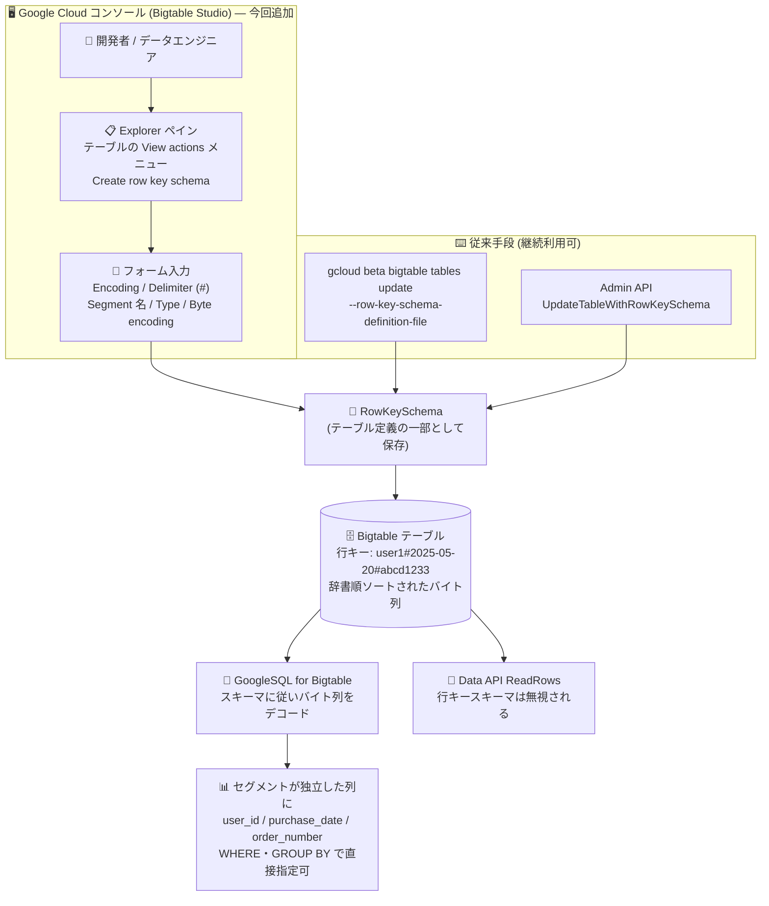

# Bigtable: Google Cloud コンソールから行キースキーマ (Row Key Schema) を管理可能に

**リリース日**: 2026-07-29

**サービス**: Bigtable

**機能**: Google Cloud コンソール (Bigtable Studio) での行キースキーマの作成・表示・削除

**ステータス**: Preview

📊 [このアップデートのインフォグラフィックを見る](https://takech9203.github.io/google-cloud-news-summary/20260729-bigtable-row-key-schema-console-management.html)

## 概要

Bigtable のテーブルに定義する **行キースキーマ (row key schema)** を、Google Cloud コンソールの Bigtable Studio から作成・表示・削除できるようになりました。この機能は Preview として提供されます。

行キースキーマは、Bigtable の **構造化行キー (structured row keys)** を実現するための定義です。Bigtable の行キーは本来「辞書順にソートされた 1 本のバイト列」でしかなく、`phone#india#pke5preri2eru#8923695` のように区切り文字で複数の値を連結した複合キーを使っていても、Bigtable 自身はそれを分割された意味のある値として認識しません。行キースキーマは、その行キーを構成する各セグメント (segment) について「フィールド名」「データ型」「バイトエンコーディング」と、セグメント間の区切り方を宣言するものです。これにより GoogleSQL for Bigtable が行キーのバイト列をどうデコード・解釈すべきかを理解でき、リレーショナルデータベースの複合キーと同様に、行キーの一部分を独立した列として SQL で参照できるようになります。

これまで行キースキーマの管理手段は gcloud CLI (`gcloud beta bigtable tables update` に YAML/JSON のスキーマ定義ファイルを渡す方式) と各クライアントライブラリの Admin API (Go の `UpdateTableWithRowKeySchema` など) に限られていました。今回のアップデートにより、Bigtable Studio の Explorer ペインからテーブルの操作メニューを開き、フォーム形式でセグメントを 1 つずつ追加してスキーマを定義できます。Base64 エンコード済みの区切り文字を YAML/JSON に書く必要がなくなり、SQL で Bigtable を扱うデータエンジニアやアナリストが、CLI を使わずに構造化行キーを設定できる点が主な価値です。

**アップデート前の課題**

- 行キースキーマを作成するには、gcloud CLI で YAML または JSON のスキーマ定義ファイルを別途用意し、`--row-key-schema-definition-file` フラグで渡す必要があった
- YAML/JSON ファイル内のバイナリフィールド (区切り文字 `encoding.delimitedBytes.delimiter` など) はデフォルトで Base64 エンコードが適用されるため、`#` を `Iw==` と書く、あるいは `--row-key-schema-pre-encoded-bytes` フラグの挙動を理解する必要があった
- あるいは Go などのクライアントライブラリで `UpdateTableWithRowKeySchema` を呼ぶコードを書く必要があり、`StructType` / `StructField` / `StructDelimitedBytesEncoding` といった型構造の理解が前提となっていた
- スキーマの内容を確認するには `gcloud bigtable tables describe` の出力 YAML を読む必要があり、区切り文字は Base64 (`delimiter: Iw==`) のまま表示されるため直感的に読み取りにくかった
- 削除も `--clear-row-key-schema` フラグを使った CLI 操作、またはライブラリの `UpdateTableRemoveRowKeySchema` 呼び出しが必要だった
- Bigtable Studio では SQL クエリ実行、認可済みビュー、継続的マテリアライズドビュー、論理ビューなどを扱えたにもかかわらず、行キースキーマだけは GUI から扱えず、SQL 分析のためのスキーマ準備で CLI に戻る必要があった

**アップデート後の改善**

- Bigtable Studio の Explorer ペインからテーブルの操作メニュー (View actions) を開き、**Create row key schema** を選ぶだけで行キースキーマ定義タブが開く
- エンコーディング種別、区切り文字、セグメント名、データ型、バイトエンコーディングをすべてフォームの入力欄とプルダウンで指定でき、YAML/JSON ファイルの作成が不要になった
- 区切り文字は入力欄に直接入力でき (デフォルトはハッシュ記号 `#`)、Base64 エンコードを自分で行う必要がなくなった
- **Add row key segment** をクリックしてセグメントを繰り返し追加でき、複合キーの構造を視覚的に組み立てられる
- 既存のスキーマは Explorer ペインでテーブル配下の行キースキーマをクリックすると詳細タブに表示され、CLI の YAML 出力を読まずに内容を確認できる
- 削除も Explorer ペインの操作メニューから **Delete** を選ぶだけで実行でき、フラグ名を覚える必要がなくなった

## アーキテクチャ図



行キースキーマはテーブル定義の一部として保存され、コンソール・gcloud CLI・Admin API のいずれの経路からでも同じ `RowKeySchema` フィールドを設定します。スキーマが存在すると GoogleSQL は行キーのバイト列を各セグメントに分解して独立した列として返しますが、Data API の `ReadRows` メソッドは行キースキーマを無視します。

## サービスアップデートの詳細

### 主要機能

1. **コンソールでの行キースキーマ作成**
   - Bigtable インスタンス一覧からインスタンスを選択し、ナビゲーションメニューで **Bigtable Studio** を開く
   - Explorer ペインの **Tables** リストで対象テーブルの **View actions** メニューから **Create row key schema** をクリックすると **Row key schema** タブが開く
   - **Encoding** リストでエンコーディング種別を選択する。`DelimitedBytes` を選んだ場合は **Delimiter** フィールドに既存の行キーで使っている区切り文字を入力する (デフォルト値はハッシュ記号 `#`)
   - **Segment** フィールドにセグメント名 (例: `device_type`) を入力し、**Type** リストでデータ型を選択、**Byte encoding** リストでバイトエンコーディングを既定値のまま使うか変更する
   - 行キーが複数のパートで構成される場合は **Add row key segment** をクリックしてフィールドを追加し、最後に **Save** をクリックする

2. **コンソールでの行キースキーマ表示**
   - Bigtable Studio の Explorer ペインでテーブルをクリックし、表示された行キースキーマをクリックすると詳細タブが開く
   - 従来の `gcloud bigtable tables describe` では、区切り文字が Base64 (`delimiter: Iw==`) を含む YAML 形式で返っていた

3. **コンソールでの行キースキーマ削除**
   - Explorer ペインでテーブルをクリックし、削除対象の行キースキーマの **View actions** メニューから **Delete** をクリックする
   - 公式ドキュメントには「行キースキーマを削除すると、それに依存する SQL クエリは期待どおりに動作しなくなる。直後に置き換える予定がある場合にのみ削除すること」という警告が明記されている

4. **スキーマの直接変更は不可 (今回のアップデートでも変わらず)**
   - 行キースキーマは直接変更できない。変更するには既存スキーマを削除し、変更を含む新しいスキーマを作成する必要がある

## 技術仕様

### 行キースキーマの構造 (公式ドキュメントの例)

行キー `phone#india#pke5preri2eru#8923695` に対して、`#` を区切り文字として次のようなセグメント定義が可能です。

| 行キーセグメント | 型 | エンコーディング |
|------|------|------|
| Device type (phone) | STRING | UTF-8 |
| Country (India) | STRING | UTF-8 |
| Manufacturer ID (pke5preri2eru) | STRING | UTF-8 |
| Serial number (8923695) | BYTES | Raw |

### 必要な権限

コンソールから操作する場合も、必要な IAM 権限はアクションごとに次のとおりです。

| アクション | 必要な権限 |
|------|------|
| 行キースキーマの表示 | `bigtable.tables.get` |
| 行キースキーマの作成 | `bigtable.tables.update` |
| 行キースキーマの削除 | `bigtable.tables.update` |

なお Bigtable Studio でテーブルをクエリするには、インスタンスに対する Bigtable reader (`roles/bigtable.reader`) ロールが必要です。

### CLI / API での定義形式 (参考)

コンソールのフォームが内部的に構成するのは、テーブル定義に保存される `RowKeySchema` フィールドです。gcloud CLI で同じ定義を渡す場合の JSON 例は次のとおりです。

```json
{
  "fields": [
    {
      "fieldName": "user_id",
      "type": { "stringType": { "encoding": { "utf8Bytes": {} } } }
    },
    {
      "fieldName": "purchase_date",
      "type": { "stringType": { "encoding": { "utf8Bytes": {} } } }
    },
    {
      "fieldName": "order_number",
      "type": { "stringType": { "encoding": { "utf8Bytes": {} } } }
    }
  ],
  "encoding": {
    "delimitedBytes": { "delimiter": "Iw==" }
  }
}
```

`delimiter` の `Iw==` は `#` の Base64 表現です。デフォルトでは YAML/JSON ファイル内のバイナリフィールドに Base64 エンコードが適用されるため、ファイル側で既にエンコード済みの場合は `--row-key-schema-pre-encoded-bytes` フラグで二重エンコードを防ぎます。コンソールのフォームでは区切り文字をそのまま入力できます。

## 設定方法

### 前提条件

1. Bigtable インスタンスと、構造化行キーを定義したいテーブルが存在すること
2. 対象テーブルに対して `bigtable.tables.update` (作成・削除) または `bigtable.tables.get` (表示) を含むロールが付与されていること
3. 既存の行キーがすべて定義するスキーマに準拠していること (準拠しない行キーが存在すると、構造化行キー列を選択するクエリはエラーで失敗する)

### 手順

#### ステップ 1: Bigtable Studio を開く

Google Cloud コンソールで Bigtable のインスタンス一覧を開き、対象インスタンスを選択します。ナビゲーションメニューで **Bigtable Studio** をクリックすると、Explorer ペインにインスタンス内のテーブル・ビュー・クエリの一覧が表示されます。

#### ステップ 2: 行キースキーマを作成する

**Tables** リストで対象テーブルの **View actions** メニューから **Create row key schema** をクリックし、**Row key schema** タブで以下を設定して **Save** をクリックします。

- **Encoding**: エンコーディング種別 (`DelimitedBytes` を選んだ場合は **Delimiter** に区切り文字を入力。デフォルトは `#`)
- **Segment**: セグメント名 (例: `device_type`)
- **Type**: そのセグメントのデータ型
- **Byte encoding**: バイトエンコーディング (型に応じた既定値のまま、または変更)
- セグメントが複数ある場合は **Add row key segment** で追加

#### ステップ 3: SQL で構造化行キーを参照する

スキーマ作成後は、GoogleSQL for Bigtable で行キーのセグメントを独立した列として扱えます。公式ドキュメントの `sales` テーブル (`user_id#purchase_date#order_number` の複合キー) の例では、次のようなクエリが可能です。

```sql
-- セグメントが個別の列として返る
SELECT * FROM sales;

-- 行キーのセグメントを WHERE 句で直接指定
SELECT product['product_type'] AS product_type,
       product['product_name'] AS product_name
FROM sales
WHERE user_id = b"user1";

-- 行キーのセグメントで集計
SELECT user_id, product['product_type'] AS product_type, count(*) AS count
FROM sales
GROUP BY 1, 2;

-- 元の行キー全体を取得 (擬似列 _key を明示指定)
SELECT _key, user_id FROM sales;
```

行キースキーマを追加すると `_key` 列は擬似列 (pseudocolumn) になるため、`SELECT *` の結果には現れず、明示的に `SELECT _key` で指定する必要があります。

## メリット

### ビジネス面

- **導入障壁の低下**: 構造化行キーは Preview 機能であり、SQL による Bigtable 分析を検討するチームが試しやすくなる。CLI や SDK のセットアップなしに、コンソール上でスキーマを試作・検証できる
- **役割分担の柔軟化**: YAML/JSON やコードを書かずに設定できるため、CLI 運用に慣れていないデータアナリストやレポート担当者でも行キースキーマの内容を確認・調整できる
- **運用ミスの低減**: Base64 エンコードの手作業やフラグ指定の誤りに起因する設定ミスを回避できる

### 技術面

- **単一画面での完結**: SQL クエリエディタ、クエリビルダー、認可済みビュー、継続的マテリアライズドビューなどを扱う Bigtable Studio 上で、行キースキーマの定義から SQL 実行・結果確認までを一貫して行える
- **スキーマ内容の可読性向上**: `gcloud describe` の YAML 出力 (区切り文字が Base64 表示) ではなく、詳細タブで構造として確認できる
- **フォームによる構造の明示**: セグメントごとに名前・型・バイトエンコーディングの入力欄が分かれているため、複合キーの構成要素を意識しながら定義できる

## デメリット・制約事項

### 制限事項

- この機能は **Preview** であり、「Pre-GA Offerings Terms」が適用される。Pre-GA の機能は「現状のまま (as is)」提供され、サポートが限定される場合がある (構造化行キー自体も Preview)
- 行キースキーマは直接変更できない。変更するには削除して新規作成する必要があり、コンソールでも同様
- テーブル内の行キーがスキーマに準拠していない場合、構造化行キー列を選択するクエリは失敗してエラーを返す
- 構造化行キーの列をクエリするには SQL が必須。Bigtable Data API の `ReadRows` メソッドは行キースキーマを無視する。同様に、Bigtable Studio の「クエリビルダー」は SQL 文を生成せず Data API を呼び出すため、構造化行キー列の参照にはクエリエディタでの SQL 記述が必要
- 行キースキーマを削除すると、それに依存する SQL クエリは期待どおりに動作しなくなる

### 考慮すべき点

- 行キースキーマを追加すると `_key` 列が擬似列になり `SELECT *` の結果から消えるため、`SELECT *` に依存する既存の SQL やダッシュボードは挙動が変わる可能性がある
- 継続的マテリアライズドビュー (非同期セカンダリインデックスを含む) では行キースキーマが自動作成されるため、手動作成が必要なのは通常のテーブルに対してのみ
- 構造化行キーを使う場合も、行キー設計のベストプラクティス (ホットスポットを避ける、低カーディナリティの値から始めて粒度の細かい値で終わる、タイムスタンプで始めない、可読な文字列を使う等) はそのまま適用される
- コンソール操作であっても IAM 権限は必要であり、`bigtable.tables.update` はテーブル定義の更新権限であるため、付与範囲は慎重に検討する

## ユースケース

### ユースケース 1: 既存の複合行キーテーブルを SQL 分析対象にする

**シナリオ**: IoT デバイスのテレメトリを `device_type#country#manufacturer_id#serial_number` 形式の行キーで保存している既存テーブルがある。これまでは Data API の行キー範囲読み取りとフィルタでアクセスしていたが、国別・デバイス種別ごとの集計を SQL で行いたい。

**実装例**:
```
Bigtable Studio > Explorer > 対象テーブルの View actions > Create row key schema
  Encoding: DelimitedBytes / Delimiter: #
  Segment: device_type    Type: STRING  Byte encoding: UTF-8
  Segment: country        Type: STRING  Byte encoding: UTF-8
  Segment: manufacturer_id Type: STRING Byte encoding: UTF-8
  Segment: serial_number  Type: BYTES   Byte encoding: Raw
  > Save
```

**効果**: 同じ Bigtable Studio 画面のクエリエディタで、`WHERE country = ...` や `GROUP BY device_type` のように行キーのセグメントを直接指定した SQL を実行できるようになり、CLI やアプリケーションコードを介さずに検証まで完了できます。

### ユースケース 2: 行キースキーマの内容確認とレビュー

**シナリオ**: 複数チームが利用する Bigtable インスタンスで、あるテーブルにどのような行キースキーマが定義されているかを確認したい。CLI を利用できない、あるいは `describe` の YAML 出力の Base64 表記を読み解きたくない。

**効果**: `bigtable.tables.get` 権限があれば、Bigtable Studio の Explorer ペインからテーブル配下の行キースキーマをクリックして詳細タブで内容を確認できます。スキーマ変更が必要な場合は「削除して再作成」が必要という制約を踏まえ、変更前にレビューできます。

### ユースケース 3: スキーマ試行と反復

**シナリオ**: どのセグメント分割・データ型が分析クエリに適しているかを試行錯誤したい。

**効果**: コンソールのフォームで定義し、同一画面の SQL エディタでクエリを試し、意図と異なれば **Delete** して作り直すという反復サイクルを、ファイル編集や CLI 実行を挟まずに回せます。ただし削除中は依存する SQL クエリが動作しなくなるため、本番テーブルでは影響範囲を確認したうえで実施します。

## 料金

行キースキーマの作成・表示・削除自体に対する追加料金は、公式ドキュメントには記載されていません。Bigtable の料金はコンピュート容量 (ノード)、データストレージ、バックアップストレージ、ネットワーク使用量に基づいて課金されます。

### Bigtable の主な料金体系 (公式料金情報より)

| 項目 | 料金 |
|--------|-----------------|
| コンピュート容量 (Enterprise edition) | $0.65 / ノード / 時間から |
| コンピュート容量 (Enterprise Plus edition) | $0.85 / ノード / 時間から |
| In-memory tier (Enterprise Plus のみ) | $0.20 / 40,000 行/秒 の容量から |
| Data Boost | $0.000845 / サーバーレス処理ユニット / 時間から |
| データストレージ (SSD) | $0.17 / GB / 月から |
| データストレージ (HDD) | $0.026 / GB / 月から |
| バックアップ (標準) | $0.026 / GB / 月から |
| バックアップ (ホット) | $0.12 / GB / 月から |
| ネットワーク (イングレス / 同一リージョン内エグレス) | 無料 |
| ネットワーク (リージョン間エグレス) | $0.10 / GB から |

1 年 / 3 年の確約利用割引 (CUD) はコンピュート容量 (ノード) の支出に適用され、ストレージ・バックアップストレージ・ネットワークデータ転送には適用されません。なお、Bigtable Studio のクエリエディタでは Data Boost アプリプロファイルを使用できません。実際の金額はリージョンにより異なるため、料金ページと料金計算ツールで確認してください。

## 利用可能リージョン

公式ドキュメントに、この機能に関するリージョン固有の制限は記載されていません。Bigtable が利用可能なロケーションについては [Bigtable のロケーション](https://cloud.google.com/bigtable/docs/locations) を参照してください。

## 関連サービス・機能

- **Bigtable Studio**: Google Cloud コンソール内の Bigtable データ管理環境。Explorer ペイン、クエリビルダー、SQL クエリエディタを備え、今回の行キースキーマ管理 UI が追加された場所
- **GoogleSQL for Bigtable**: 行キースキーマが定義されたテーブルのセグメントを列として参照できる SQL インターフェイス。構造化行キー列のクエリには SQL が必須
- **構造化行キークエリ (Structured row key queries)**: 行キースキーマを前提としたクエリ機能。`_key` が擬似列化する挙動やフィルタ・集計の例が定義されている (Preview)
- **継続的マテリアライズドビュー / 非同期セカンダリインデックス**: 作成時に行キースキーマが自動生成されるため、手動での作成が不要
- **Bigtable Data API (`ReadRows`)**: 行キースキーマを無視して読み取りを行う。既存の Data API ベースのアプリケーションは行キースキーマ追加の影響を受けない
- **スキーマ設計のベストプラクティス**: 構造化行キーを使う場合でも従来の行キー設計指針 (ホットスポット回避など) が適用される
- **Cloud IAM**: `bigtable.tables.get` / `bigtable.tables.update` による操作権限の制御

## 参考リンク

- 📊 [インフォグラフィック](https://takech9203.github.io/google-cloud-news-summary/20260729-bigtable-row-key-schema-console-management.html)
- [公式リリースノート (Bigtable)](https://docs.cloud.google.com/bigtable/docs/release-notes)
- [ドキュメント: Manage row key schemas](https://docs.cloud.google.com/bigtable/docs/manage-row-key-schemas)
- [ドキュメント: Structured row key queries](https://docs.cloud.google.com/bigtable/docs/structured-row-key-queries)
- [ドキュメント: Manage your data using Bigtable Studio](https://docs.cloud.google.com/bigtable/docs/manage-data-using-console)
- [ドキュメント: Schema design best practices](https://docs.cloud.google.com/bigtable/docs/schema-design)
- [ドキュメント: GoogleSQL for Bigtable overview](https://docs.cloud.google.com/bigtable/docs/googlesql-overview)
- [gcloud beta bigtable tables update](https://docs.cloud.google.com/sdk/gcloud/reference/beta/bigtable/tables/update)
- [料金ページ](https://cloud.google.com/bigtable/pricing)

## まとめ

今回のアップデートはコンソール UI の拡充ですが、単なる表示上の変更ではなく、これまで gcloud CLI の YAML/JSON ファイルや Admin API のコードでしか設定できなかった行キースキーマを GUI で管理できるようにする、実質的な管理機能の追加です。Bigtable を SQL で分析する構成を検討しているチームは、Bigtable Studio 上でスキーマ定義から SQL 実行・結果確認までを一貫して試せるようになります。ただし構造化行キーおよび本機能はともに Preview であり、スキーマの直接変更ができない (削除して再作成が必要)、スキーマに準拠しない行キーがあるとクエリが失敗する、`_key` が擬似列化するといった制約があるため、本番テーブルへ適用する前に既存の行キー形式とクエリへの影響を確認することを推奨します。

---

**タグ**: Bigtable, 行キースキーマ, Row Key Schema, 構造化行キー, Structured Row Keys, Bigtable Studio, GoogleSQL for Bigtable, Google Cloud コンソール, NoSQL, スキーマ設計, Preview
