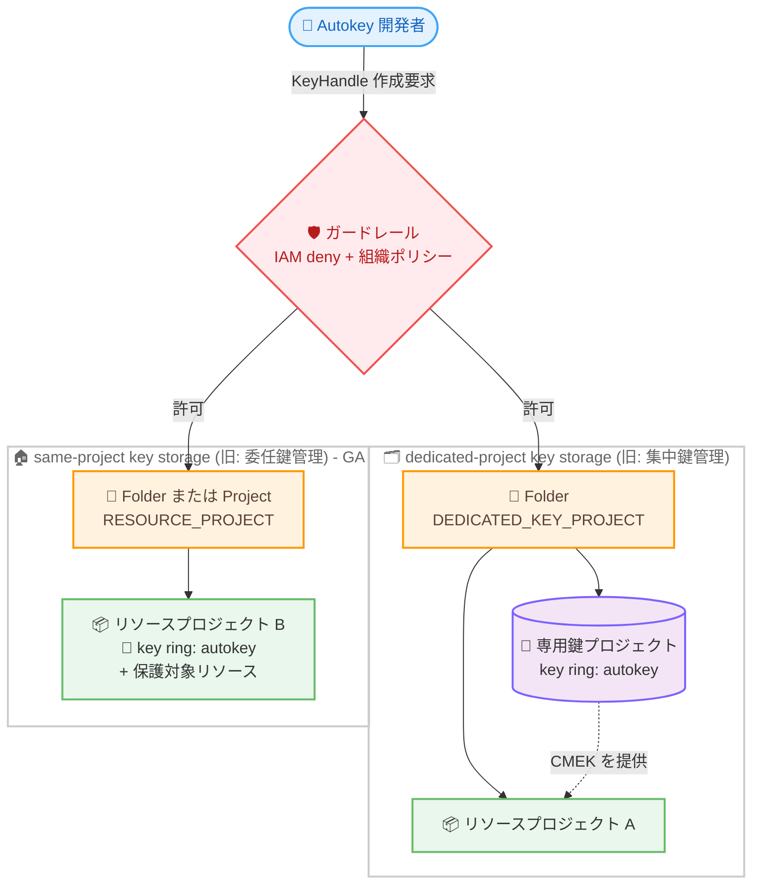

# Cloud KMS: Autokey with same-project key storage が GA (用語リネームを含む)

**リリース日**: 2026-07-29

**サービス**: Cloud Key Management Service (Cloud KMS)

**機能**: Cloud KMS Autokey with same-project key storage (同一プロジェクト鍵保管)

**ステータス**: GA (Generally Available)

📊 [このアップデートのインフォグラフィックを見る](https://takech9203.github.io/google-cloud-news-summary/20260729-cloud-kms-autokey-same-project-key-storage-ga.html)

## 概要

Cloud KMS Autokey の **same-project key storage (同一プロジェクト鍵保管)** が GA (一般提供) になった。この機能は 2026 年 2 月に「Autokey for delegated key management (委任鍵管理)」として Public Preview で提供が開始されたもので、今回の GA に合わせて名称が **「Autokey with same-project key storage」** に変更された。同時に、従来 GA だった「Autokey for centralized key management (集中鍵管理)」も **「Autokey with dedicated-project key storage (専用プロジェクト鍵保管)」** にリネームされている。

このアップデートの本質は 2 点ある。1 点目は、リソースと同じプロジェクト内に CMEK 用の鍵を自動生成するモデルが Pre-GA Offerings Terms の適用から外れ、本番環境で正式にサポートされるようになったこと。2 点目は、2 つのモデルを表す用語が「誰が鍵を管理するか (centralized / delegated)」という組織論的な表現から「鍵がどこに保管されるか (dedicated-project / same-project)」という技術的に明確な表現へ変更されたことである。後者は、公式ドキュメント、Google Cloud コンソールの UI ラベル、および社内の設計ドキュメントやランブックの記述に影響する。

さらに GA に伴い、Autokey の設定手段が大幅に拡充された。Preview 時点では REST API と Terraform (google-beta プロバイダ) のみだったが、GA では **Google Cloud コンソール** の「Key management controls」ページと **gcloud CLI** (`gcloud kms autokey-config` コマンドグループ) からも設定・参照できる。加えて、組織全体での Autokey 利用を統制するためのガードレール手法をまとめた新規ドキュメント「Control Autokey usage」が公開され、IAM deny ポリシーとカスタム組織ポリシー制約を組み合わせた設計パターンが明文化された。

**アップデート前の課題**

- same-project 鍵保管 (旧: 委任鍵管理) は Public Preview であり、「Pre-GA Offerings Terms」が適用されていた。「as is」提供でサポートが限定される可能性があるため、本番環境や規制対象ワークロードへの適用が躊躇されていた
- 「centralized key management」「delegated key management」という用語は、鍵の物理的な保管先 (専用鍵プロジェクトか、リソースと同じプロジェクトか) を直接表していないため、どちらのモデルを指しているのか誤解を招きやすかった
- Autokey の設定は REST API と Terraform (google-beta) のみで、gcloud CLI およびコンソールからは操作できなかった
- 有効な (継承結果としての) Autokey 設定を確認する手段が乏しく、あるプロジェクトが実際にどちらのモデルで動作しているかの把握が難しかった
- 組織全体で「Autokey の利用を強制する」「特定の鍵保管モードだけを許可する」「Autokey を完全に禁止する」といったガードレールの実装方法が、まとまったドキュメントとして整備されていなかった

**アップデート後の改善**

- same-project 鍵保管が GA になり、Pre-GA Offerings Terms が適用されなくなった。通常の Google Cloud サポート対象として本番利用できる
- 用語が鍵の保管場所を直接表す「dedicated-project key storage」「same-project key storage」に統一され、モデルの違いが自明になった
- Google Cloud コンソール (Key management controls ページ) と gcloud CLI (`gcloud kms autokey-config update` / `show-effective-config`) から Autokey を設定・参照できるようになった
- `showEffectiveAutokeyConfig` により、継承を解決した「実効 Autokey 設定」と、その設定がどのリソースで定義されているかを確認できる。Cloud Asset Inventory への SQL クエリで組織/フォルダ配下の全プロジェクトを一括評価することも可能
- 設定を `KEY_PROJECT_RESOLUTION_MODE_UNSPECIFIED` にクリアして親フォルダの設定を再継承させる操作が明示的にサポートされた
- 「Control Autokey usage」ドキュメントにより、IAM deny ポリシーとカスタム組織ポリシー制約を用いたガードレール設計が体系化された
- same-project 鍵保管と dedicated-project 鍵保管を併用でき、フォルダで dedicated-project を有効にしつつ、特定のプロジェクトだけ same-project でオーバーライドする構成が公式に認められた

## アーキテクチャ図



開発者の鍵要求は IAM deny ポリシーと組織ポリシー制約というガードレールを通過した後に処理される。dedicated-project モデルでは専用鍵プロジェクト内の `autokey` 鍵リングに鍵が作成され、GA になった same-project モデルではリソースと同一プロジェクト内の `autokey` 鍵リングに鍵が作成される。

## サービスアップデートの詳細

### 主要機能

1. **same-project key storage の GA 昇格**
   - リソースと同じプロジェクト内に `autokey` 鍵リングと鍵が作成されるモデルが正式提供となった
   - 有効化スコープは「個別プロジェクト」と「フォルダ (配下の全プロジェクトに適用)」の 2 種類
   - `keyProjectResolutionMode` に `RESOURCE_PROJECT` を指定し、`keyProject` は空にする
   - Cloud KMS サービスエージェントは必要になった時点で自動作成されるため、dedicated-project モデルで必要だった手動作成と `roles/cloudkms.admin` の付与が不要

2. **用語のリネーム**
   - 鍵の保管場所を主語にした名称へ変更され、公式ドキュメントとコンソール UI の表記が統一された
   - API の enum 値 (`RESOURCE_PROJECT` / `DEDICATED_KEY_PROJECT` / `DISABLED`) および Terraform の属性名は変更されていないため、既存の IaC コードは修正不要

3. **Google Cloud コンソールと gcloud CLI のサポート**
   - コンソール: 「Key management controls」ページ → Autokey セクション → **Manage** → **Configure**。Configuration source で `Configure for folder` / `Configure for project` / `Inherit` を選び、Configuration で `Enable dedicated-project key storage` / `Enable same-project key storage` を選択する
   - gcloud: `AutokeyConfig` を記述した YAML ファイルを `gcloud kms autokey-config update` に渡す方式

4. **Autokey 設定の継承モデルの明文化**
   - フォルダに設定した構成は子フォルダ・子プロジェクトに継承される。子リソースの設定は親フォルダの設定をオーバーライドする
   - 組織リソースに対しては Autokey を有効化できない。組織配下のリソースは空の `AutokeyConfig` を継承し、コンソールでは Autokey Status が `Not enabled` と表示される

5. **実効設定の可視化 (showEffectiveAutokeyConfig)**
   - Autokey が有効か、有効ならどちらの鍵保管モードか、dedicated-project の場合はどの鍵プロジェクトか、そしてその設定が継承か直接設定かを一度に確認できる
   - Cloud Asset Inventory への SQL クエリで、フォルダ/組織配下の全プロジェクトの実効設定を一括評価できる (ただし直近の設定変更が Cloud Asset Inventory に反映されていない可能性があるため、最新値が必要な場合はコンソール / gcloud / API を使用する)

6. **Control Autokey usage ドキュメントの新設**
   - IAM deny ポリシー (誰が何をできるかの top-down 制御) とカスタム組織ポリシー制約 (どこでどのように構成できるかの bottom-up 制御) を組み合わせたガードレール設計を提供
   - 両者は組織レベルのロールでしか変更できないため、フォルダ / プロジェクトレベルの Owner や Admin ロールを持つプリンシパルからはオーバーライドできない

## 技術仕様

### 鍵保管モデルの比較

| 項目 | dedicated-project key storage | same-project key storage |
|------|------------------------------|--------------------------|
| 旧称 | Autokey for centralized key management (集中鍵管理) | Autokey for delegated key management (委任鍵管理) |
| ステータス | GA | **GA (2026-07-29)** |
| `keyProjectResolutionMode` | `DEDICATED_KEY_PROJECT` | `RESOURCE_PROJECT` |
| 有効化できるスコープ | フォルダのみ | プロジェクト / フォルダ |
| `keyProject` フィールド | 必須 (専用鍵プロジェクトを指定) | 指定しない (空) |
| 鍵の保管場所 | フォルダごとに指定した専用鍵プロジェクト | 保護対象リソースと同じプロジェクト |
| 鍵リング名 | 専用鍵プロジェクト内の `autokey` | リソースプロジェクト内の `autokey` |
| 前提条件 | 組織リソース + フォルダリソース + 専用鍵プロジェクト + 課金アカウント | プロジェクト (または最低 1 プロジェクトを含むフォルダ) で `keyHandles.create` が IAM deny ポリシーでブロックされていないこと |
| Cloud KMS サービスエージェント | 手動作成 + `roles/cloudkms.admin` 付与が必要 | 必要時に自動作成 |
| 追加で必要なロール | `roles/resourcemanager.folderIamAdmin`, `roles/billing.user` | (Autokey 共通ロールのみ) |
| 鍵の一元管理性 | 高い (フォルダ内の鍵が 1 プロジェクトに集約) | 低い (鍵がプロジェクトごとに分散) |
| 適するケース | セキュリティチームが組織横断で鍵を集中管理 | プロジェクト管理者に鍵管理を委譲、フラットなプロジェクト構成 |

両モデルは併用可能で、フォルダで `DEDICATED_KEY_PROJECT` を設定しつつ、配下の特定プロジェクトで `RESOURCE_PROJECT` を設定してオーバーライドできる。

### 旧称 → 新称の対応表

ドキュメントおよびコンソール上の表記が以下のように変更された。API / Terraform の識別子は変更されていない。

| 旧称 (〜2026-07-28) | 新称 (2026-07-29〜) | 変更されない識別子 |
|--------------------|--------------------|------------------|
| Autokey for centralized key management | Autokey with dedicated-project key storage | `DEDICATED_KEY_PROJECT` |
| Autokey for delegated key management | Autokey with same-project key storage | `RESOURCE_PROJECT` |
| centralized key management model | dedicated-project key storage | - |
| delegated key management model | same-project key storage | - |
| key project / Autokey key project | dedicated key project (専用鍵プロジェクト) | `keyProject` |

### AutokeyConfig の設定値

`AutokeyConfig` はフォルダまたはプロジェクトに紐づくリソースで、以下の `keyProjectResolutionMode` を取る。

| リソース種別 | 設定可能な値 | 説明 |
|------------|------------|------|
| 組織 | (設定不可) | Autokey は組織リソースに対して有効化できない。配下は空の `AutokeyConfig` を継承する |
| フォルダ | `DEDICATED_KEY_PROJECT` | フォルダ内のリソースプロジェクトで dedicated-project 鍵保管が有効。`keyProject` の指定が必要 |
| フォルダ | `RESOURCE_PROJECT` | フォルダ内のリソースプロジェクトで same-project 鍵保管が有効 |
| フォルダ | `DISABLED` | フォルダ内で Autokey を無効化。子フォルダ / プロジェクトはオーバーライド可能 |
| フォルダ | `KEY_PROJECT_RESOLUTION_MODE_UNSPECIFIED` | 親フォルダまたは組織から設定を継承 |
| プロジェクト | `RESOURCE_PROJECT` | このプロジェクトで same-project 鍵保管が有効 |
| プロジェクト | `DISABLED` | このプロジェクトで Autokey を無効化。開発者は CMEK を手動作成する必要がある |
| プロジェクト | `KEY_PROJECT_RESOLUTION_MODE_UNSPECIFIED` | 親フォルダから設定を継承 |

プロジェクトスコープでは `DEDICATED_KEY_PROJECT` を設定できない点に注意する。

### Autokey が作成する鍵の属性

| 項目 | 詳細 |
|------|------|
| 保護レベル | HSM (Multi-tenant Cloud HSM) |
| アルゴリズム | AES-256 GCM |
| ローテーション期間 | 1 年 (作成後に Cloud KMS 管理者が変更可能) |
| ロケーション | 保護対象リソースと同じロケーション |
| 鍵リング名 | `autokey` (最初の鍵要求時にロケーションごとに作成される) |
| 鍵の命名規則 | `PROJECT_NUMBER-SERVICE_SHORT_NAME-RANDOM_HEX` |
| 初期状態 | primary key version として `enabled` 状態で作成 |
| 職務分離 | サービスのサービスアカウントに暗号化・復号権限を自動付与。Cloud KMS 管理者には暗号化・復号権限は付与されない |
| 鍵のエクスポート | 不可 (すべての Cloud KMS 鍵と同様) |
| 鍵のトラッキング | Cloud KMS ダッシュボードで追跡される |

### 必要な IAM ロール

| ロール | 用途 |
|--------|------|
| `roles/cloudkms.autokeyAdmin` | Autokey の有効化・構成 (共通) |
| `roles/serviceusage.serviceUsageAdmin` | Cloud KMS API の有効化 (共通) |
| `roles/resourcemanager.folderIamAdmin` | dedicated-project 鍵保管の有効化時のみ |
| `roles/billing.user` | dedicated-project 鍵保管の有効化時のみ |
| `roles/cloudkms.viewer` | Autokey 構成の参照 |
| `roles/cloudasset.viewer` (組織に付与) | 全実効 Autokey 構成の参照 |
| `roles/serviceusage.serviceUsageConsumer` | 全実効 Autokey 構成の参照 |
| `roles/cloudkms.autokeyUser` | Autokey を使って保護リソースを作成する開発者向け |
| `roles/orgpolicy.policyAdmin` (組織に付与) | 組織ポリシー制約の設定 |
| `roles/iam.denyAdmin` (組織に付与) | IAM deny ポリシーの設定 |

必要な権限は次の通り。Autokey の有効化には `cloudkms.autokeyConfigs.*` と `serviceusage.services.enable`、dedicated-project 鍵保管には追加で `resourcemanager.folders.get` / `getIamPolicy` / `setIamPolicy` と `billing.resourceAssociations.create`、実効構成の参照には `cloudkms.folders.showEffectiveAutokeyConfig` と `cloudkms.projects.showEffectiveAutokeyConfig` が必要。

## 設定方法

### 前提条件

1. Autokey を有効化したい Google Cloud プロジェクト (または最低 1 つのプロジェクトを含むフォルダ) が存在すること
2. そのプロジェクトで `keyHandles.create` 権限が IAM deny ポリシーによってブロックされていないこと
3. `roles/cloudkms.autokeyAdmin` および `roles/serviceusage.serviceUsageAdmin` が付与されていること

### 手順

#### ステップ 1: プロジェクトで same-project 鍵保管を有効化 (gcloud)

`AutokeyConfig` を記述した YAML ファイルを作成する。

```yaml
name: projects/PROJECT_ID/autokeyConfig
keyProjectResolutionMode: RESOURCE_PROJECT
keyProject:
```

YAML を適用する。

```bash
gcloud kms autokey-config update AUTOKEY_CONFIG_PATH
```

`keyProject` は空のままにする点が重要である。

#### ステップ 2: Cloud KMS API を有効化

```bash
gcloud services enable cloudkms.googleapis.com --project=PROJECT_ID
```

Cloud KMS API が有効化されるまで、開発者はそのプロジェクトで Autokey を使用できない。

#### ステップ 3: REST API で設定する場合

```bash
curl "https://cloudkms.googleapis.com/v1/projects/PROJECT_ID/autokeyConfig?updateMask=keyProjectResolutionMode,keyProject" \
    --request "PATCH" \
    --header "authorization: Bearer $(gcloud auth print-access-token)" \
    --header "content-type: application/json" \
    --data '{"keyProjectResolutionMode": "RESOURCE_PROJECT", "keyProject": ""}'
```

フォルダ配下の全プロジェクトに適用する場合は、URL の `projects/PROJECT_ID` を `folders/FOLDER_ID` に置き換える。

#### ステップ 4: Terraform で設定する場合

プロジェクト単位。

```hcl
resource "google_kms_autokey_config" "autokey_config_project" {
  provider = google-beta
  project  = "projects/${google_project.key_management_project.project_id}"
  key_project_resolution_mode = "RESOURCE_PROJECT"
  # プロジェクトスコープで有効な値は RESOURCE_PROJECT または DISABLED
}
```

フォルダ単位。

```hcl
resource "google_kms_autokey_config" "folder_config" {
  provider = google-beta
  folder   = google_folder.autokey_folder.name
  key_project_resolution_mode = "RESOURCE_PROJECT"
  # フォルダスコープで有効な値は DEDICATED_KEY_PROJECT, RESOURCE_PROJECT, DISABLED
  # DEDICATED_KEY_PROJECT の場合は key_project も指定する
}
```

#### ステップ 5: 実効設定を確認

```bash
gcloud kms autokey-config show-effective-config --project=PROJECT_ID
```

出力例。

```yaml
keyProject: KEY_PROJECT
keyProjectResolutionMode: KEY_PROJECT_RESOLUTION_MODE
source:
  name: RESOURCE_IDENTIFIER
```

`source.name` により、設定が親リソースからの継承か、指定したリソース自身での定義かを判別できる。same-project 鍵保管が有効なフォルダや Autokey が無効な場合、`keyProject` フィールドは省略される。

#### ステップ 6: 設定をクリアして継承に戻す (任意)

```yaml
name: projects/PROJECT_ID/autokeyConfig
keyProjectResolutionMode: KEY_PROJECT_RESOLUTION_MODE_UNSPECIFIED
keyProject:
```

```bash
gcloud kms autokey-config update AUTOKEY_CONFIG_PATH
```

## Autokey 利用のガードレール

Autokey の利用統制は、**Autokey 構成 (bottom-up)**、**IAM (top-down)**、**組織ポリシー (bottom-up)** の 3 層で行う。IAM deny ポリシーとカスタム組織ポリシー制約はいずれも組織レベルのロールでしか変更できないため、フォルダ / プロジェクトレベルの Owner や Admin ロールではオーバーライドできない。

### IAM deny ポリシーによる制御

| ユースケース | 拒否する権限 | 対象プリンシパル | 効果 |
|------------|------------|----------------|------|
| Autokey の有効化を禁止 | `cloudkms.autokeyConfigs.update` | すべて | 新規 `AutokeyConfig` の作成・更新ができない。既存の構成は有効なまま使用可能 |
| Autokey の利用を禁止 | `cloudkms.keyHandles.create` | すべて | 新規 `KeyHandle` を作成できないため、Autokey が有効でも保護リソースを作成できない |
| 手動での鍵作成を禁止 | `cloudkms.cryptoKeys.create` | Cloud KMS サービスエージェント以外のすべて | 鍵を手動作成できない。サービスエージェントのみを除外すると、鍵作成手段が Autokey に限定される |
| IaC のみ構成変更を許可 | `cloudkms.autokeyConfigs.update` | Terraform 実行エージェント以外のすべて | Autokey 構成が IaC パイプライン経由でのみ変更可能になる |

### カスタム組織ポリシー制約による制御

`cloudkms.googleapis.com/AutokeyConfig` をリソースタイプとするカスタム制約で、`AutokeyConfig` の作成・更新を条件付きでブロックする。

| 目的 | 制約名の例 | condition | actionType |
|------|----------|-----------|------------|
| 特定の鍵保管モードを禁止 | `custom.restrictAutokeyKeyStorage` | `resource.keyProjectResolutionMode == 'RESOURCE_PROJECT'` | `DENY` |
| 特定フォルダでの Autokey 有効化を禁止 | `custom.noNewAutokeyConfigFolder` | `resource.name == 'folders/FOLDER_ID/autokeyConfig'` | `DENY` (methodTypes: CREATE) |
| 組織全体で Autokey 有効化を禁止 | `custom.noNewAutokeyConfigOrg` | `resource.name.endsWith('/autokeyConfig')` | `DENY` (methodTypes: CREATE) |
| 特定フォルダでの構成変更を禁止 | `custom.noChangeAutokeyConfigFolder` | `resource.name == 'folders/FOLDER_ID/autokeyConfig'` | `DENY` (CREATE, UPDATE) |
| 組織全体で構成変更を禁止 | `custom.noChangeAutokeyConfigOrg` | `resource.name.endsWith('/autokeyConfig')` | `DENY` (CREATE, UPDATE) |
| `DISABLED` 以外の構成を禁止 | `custom.onlyDisabledAutokeyConfig` | `resource.keyProjectResolutionMode=='DISABLED'` | `ALLOW` |
| プロジェクトレベルの構成を禁止 | `custom.noAutokeyConfigProject` | `resource.name.startsWith('projects/')` | `DENY` (CREATE, UPDATE) |

同一プロジェクト鍵保管を組織全体で禁止する制約の定義例。

```yaml
name: organizations/ORGANIZATION_ID/customConstraints/custom.restrictAutokeyKeyStorage
resourceTypes:
  - cloudkms.googleapis.com/AutokeyConfig
methodTypes:
  - CREATE
  - UPDATE
condition: "resource.keyProjectResolutionMode == 'RESOURCE_PROJECT')"
actionType: DENY
displayName: Restrict Autokey key storage mode
description: >
  Prevent creation or update of AutokeyConfig resources with
  `RESOURCE_PROJECT` key resolution mode.
```

`custom.noAutokeyConfigProject` を適用すると、既存のプロジェクトレベル `AutokeyConfig` は有効なまま残るが、それ以外のプロジェクトは親フォルダからの継承を強制される。つまり、same-project 鍵保管を「フォルダ管理者が一括で決める」運用に寄せたい場合に有効な制約である。

### Autokey の利用を強制する (CMEK 必須化)

フォルダ内で CMEK を Autokey 経由に限定したい場合、以下を組み合わせる。

1. IAM deny ポリシーで `cloudkms.cryptoKeys.create` を Cloud KMS サービスエージェント以外に拒否する。フォルダが dedicated-project 鍵保管なら専用鍵プロジェクトに、**same-project 鍵保管ならリソースプロジェクト群に適用する**
2. `constraints/gcp.restrictNonCmekServices` 制約を適用し、新規リソースが CMEK で保護されることを要求する
3. `constraints/gcp.restrictCmekCryptoKeyProjects` 制約を適用し、CMEK に使う鍵が専用鍵プロジェクト、または same-project 鍵保管が有効なプロジェクトのものに限定されるようにする

なお、Autokey 非対応サービス向けに鍵を手動作成する必要がある場合は、`cloudkms.cryptoKeys.create` が拒否されていない別プロジェクトで鍵を作成する必要がある。

### Autokey を完全に禁止する

1. 組織またはフォルダ内で Autokey が有効になっている箇所があれば、まず無効化する
2. IAM deny ポリシーで `cloudkms.autokeyConfigs.update` をすべてのプリンシパルに拒否する
3. (任意 / 多層防御) `keyProjectResolutionMode` が `DISABLED` の場合のみ許可するカスタム組織ポリシー制約 (`custom.onlyDisabledAutokeyConfig`) を適用する

2 と 3 の両方を適用すると、どのプリンシパルも両方のガードレールを解除しない限り Autokey を有効化できない。

## メリット

### ビジネス面

- **本番適用が可能になった**: Pre-GA Offerings Terms が適用されなくなり、通常のサポート対象として規制対象ワークロードにも適用しやすくなった
- **導入障壁の低さが正式なものに**: フォルダ階層の再編成、専用鍵プロジェクトの作成、課金アカウントの紐付けなしに CMEK を導入できる構成が GA で使える
- **用語の明確化によるコミュニケーションコスト削減**: 「鍵がどこに保管されるか」が名称から即座に分かるため、セキュリティレビューや監査時の説明が容易になる
- **ガバナンスの標準化**: Control Autokey usage のパターンを組織標準として採用することで、鍵管理ポリシーを Landing Zone に組み込みやすくなる

### 技術面

- **運用ツールの選択肢が拡大**: コンソール、gcloud CLI、REST API、Terraform のすべてから構成できるため、既存の運用フローに合わせられる
- **実効設定の可視化**: `showEffectiveAutokeyConfig` と Cloud Asset Inventory の SQL クエリにより、組織全体の Autokey 適用状況をドリフト検出可能な形で棚卸しできる
- **サービスエージェント管理の簡素化**: same-project 鍵保管では Cloud KMS サービスエージェントが必要時に自動作成されるため、初期セットアップの手数が少ない
- **モデルの混在が公式サポート**: フォルダ単位で dedicated-project を基本としつつ、例外プロジェクトだけ same-project にする段階的移行が可能
- **職務分離の自動適用**: HSM 保護レベル、1 年ローテーション、リソースサービスアカウントへの暗号化・復号権限付与が自動で構成される

## デメリット・制約事項

### 制限事項

- gcloud CLI は Autokey リソース (KeyHandle) に対しては利用できない。GA で追加されたのは `AutokeyConfig` の管理コマンドであり、公式ドキュメントの Limitations には引き続き「The gcloud CLI is not available for Autokey resources.」と記載されている
- Key Handle は Cloud Asset Inventory に含まれない
- Cloud HSM が利用できないロケーションでは Autokey で CMEK 保護リソースを作成できず、CMEK を手動作成する必要がある
- 保護レベルは HSM に固定されており、ソフトウェア鍵やカスタムのアルゴリズム / ローテーション期間が必要な場合は手動 CMEK を使用する
- プロジェクトスコープでは `DEDICATED_KEY_PROJECT` を設定できない (`RESOURCE_PROJECT` または `DISABLED` のみ)
- 組織リソースに対して Autokey を有効化することはできない
- Autokey 連携が Terraform または REST API / SDK 経由のリソース作成に限定されるサービスがある (AlloyDB, Apigee, Apigee API hub, Bigtable, Cloud SQL, GKE, Managed Service for Apache Airflow, Memorystore for Redis, Secret Manager, Spanner)
- Cloud Asset Inventory 経由の実効構成クエリは、直近の設定変更が反映されていない可能性がある
- 一部の制約 (`noNewAutokeyConfigFolder` など) は CREATE のみを対象とするため、既存の `AutokeyConfig` は変更可能なまま残る

### 考慮すべき点

- **鍵の分散**: same-project 鍵保管では鍵がリソースプロジェクトごとに分散するため、組織全体での鍵の一覧性が dedicated-project モデルに比べて低下する。Cloud KMS ダッシュボードや Cloud Asset Inventory による横断的な棚卸しの仕組みを併せて設計する
- **ガードレールの適用先が変わる**: 「Autokey 経由の鍵のみを許可する」ために `cloudkms.cryptoKeys.create` を拒否する場合、dedicated-project モデルでは専用鍵プロジェクト 1 つで済むが、same-project モデルでは**すべてのリソースプロジェクト**に deny ポリシーを適用する必要がある。プロジェクトが増えるたびに漏れが生じないよう、組織 / フォルダレベルでの適用を検討する
- **オーバーライドの方向性**: プロジェクトレベルの設定がフォルダレベルの設定を上書きするため、集中管理を意図している組織では `custom.noAutokeyConfigProject` 制約でプロジェクトレベルの構成を封じることを検討する
- **ドキュメント / ランブックの更新**: API の enum 値は変わらないが、社内の設計書・手順書・監査証跡の記述は新用語に合わせて更新する必要がある
- **職務分離の意味合いの変化**: same-project モデルでは鍵とリソースが同一プロジェクトに存在するため、プロジェクトレベルの強い権限を持つプリンシパルの影響範囲が広がる。IAM の設計を見直すことが望ましい
- **Terraform プロバイダ**: `google_kms_autokey_config` は現時点でも `google-beta` プロバイダの利用が公式サンプルで示されている

## ユースケース

### ユースケース 1: フラットなプロジェクト構成での CMEK 本番導入

**シナリオ**: フォルダ階層を持たず組織直下に多数のプロジェクトを配置している企業が、コンプライアンス要件として CMEK を本番環境に導入する必要がある。Preview 段階では本番適用を見送っていた。

**実装例**:

```bash
# same-project 鍵保管を有効化
cat > autokey-config.yaml <<'EOF'
name: projects/my-prod-project/autokeyConfig
keyProjectResolutionMode: RESOURCE_PROJECT
keyProject:
EOF
gcloud kms autokey-config update autokey-config.yaml

# Cloud KMS API を有効化
gcloud services enable cloudkms.googleapis.com --project=my-prod-project

# 実効設定を確認
gcloud kms autokey-config show-effective-config --project=my-prod-project
```

**効果**: フォルダ構造の再編成や専用鍵プロジェクトの用意なしに、GA 機能として CMEK を本番導入できる。

### ユースケース 2: 組織標準として same-project 鍵保管のみを許可

**シナリオ**: 鍵管理を各プロジェクト管理者に委譲する方針を組織標準とし、専用鍵プロジェクトを使う構成を誤って作られないようにしたい。

**実装例**:

```yaml
name: organizations/ORGANIZATION_ID/customConstraints/custom.restrictDedicatedKeyStorage
resourceTypes:
  - cloudkms.googleapis.com/AutokeyConfig
methodTypes:
  - CREATE
  - UPDATE
condition: "resource.keyProjectResolutionMode == 'DEDICATED_KEY_PROJECT')"
actionType: DENY
displayName: Restrict Autokey key storage mode
description: >
  Prevent creation or update of AutokeyConfig resources with
  `DEDICATED_KEY_PROJECT` key resolution mode.
```

**効果**: 組織レベルの権限がないプリンシパルは dedicated-project 鍵保管を構成できなくなり、鍵保管モデルが組織全体で統一される。

### ユースケース 3: Autokey 経由の鍵のみを許可する強制構成

**シナリオ**: 監査要件として「すべての鍵は Autokey が作成したものであること」を証明する必要がある。フォルダでは same-project 鍵保管を使用している。

**効果**: リソースプロジェクトに `cloudkms.cryptoKeys.create` の deny ポリシー (Cloud KMS サービスエージェントのみ除外) を適用し、`constraints/gcp.restrictNonCmekServices` と `constraints/gcp.restrictCmekCryptoKeyProjects` を併せて適用することで、CMEK が必須かつ鍵の出自が Autokey に限定される。これらのガードレールは組織レベルのロールでしか変更できないため、プロジェクト Owner でも回避できない。

### ユースケース 4: 既存プロジェクトの Autokey 適用状況の棚卸し

**シナリオ**: 組織配下の全プロジェクトについて、Autokey が有効か、どちらの鍵保管モードか、設定が継承か直接設定かを一覧化して報告する必要がある。

**効果**: Cloud Asset Inventory への SQL クエリで実効 Autokey 構成を一括評価できる。ただし直近の変更が反映されていない可能性があるため、最新の値が必要な監査項目についてはコンソール / gcloud / Cloud KMS API で個別に確認する。

## 料金

Cloud KMS Autokey の利用自体に追加料金は発生しない。Autokey が作成した鍵は、他の Cloud HSM 鍵と同じ料金が適用される (現行の料金は 2025 年 3 月 17 日発効)。same-project 鍵保管か dedicated-project 鍵保管かによって料金体系が変わることはない。

ただし課金先プロジェクトは異なる。Cloud KMS のすべての課金項目は**鍵を所有するプロジェクト**に課金されるため、same-project 鍵保管ではリソースプロジェクトに、dedicated-project 鍵保管では専用鍵プロジェクトに鍵の料金が計上される。コストの可視化やチャージバックの設計に影響する点である。

### アクティブな鍵バージョンの料金

| 保護レベル | 時間単価 (対称 AES-256 / HMAC) | 月額 (概算・鍵バージョンあたり) |
|-----------|------------------------------|------------------------------|
| SOFTWARE | $0.000082192 / 時間 | 約 $0.06 |
| **HSM (Autokey が使用)** | $0.001369863 / 時間 | 約 $1.00 |
| EXTERNAL / EXTERNAL_VPC | $0.004109589 / 時間 | 約 $3.00 |

- 破棄済み (Destroyed) の鍵バージョンは無料
- 暗号化オペレーション (暗号化・復号・署名・ランダムバイト生成) は $0.03 / 10,000 回。EXTERNAL 系は $0.15 / 10,000 回
- 管理オペレーション (鍵のローテーションを含む) は無料。ただし新しい鍵バージョンでのデータ再暗号化は暗号化オペレーションとしてカウントされる
- 鍵バージョンの課金は実消費に基づく日割り (月内で 2 日だけアクティブだった鍵バージョンはその分だけ課金)

### Autokey 向けの無料枠

Google Cloud Free Tier の一部として、Cloud KMS Autokey で作成した鍵に対して以下の無料枠が用意されている。この無料枠は無料トライアル期間中も期間後も利用でき、課金アカウント単位でプロジェクト横断に集約され、毎月リセットされる。

| リソース | 月間無料枠 |
|---------|----------|
| Autokey で作成したアクティブな鍵バージョン | 100 鍵バージョン |
| 暗号化オペレーション (Autokey で作成した鍵に対するもの) | 10,000 オペレーション |
| ローテーション | 常に無料 |

### 料金例

| 使用量 | 月額料金 (概算) |
|--------|-----------------|
| Autokey で作成した HSM 鍵バージョン 100 個 | $0 (無料枠内) |
| Autokey で作成した HSM 鍵バージョン 300 個 | 約 $200 (200 個分が課金対象) |
| 上記 + 暗号化オペレーション 1,000,000 回 | 約 $200 + 約 $2.97 |

正確な料金は [Cloud KMS の料金ページ](https://cloud.google.com/kms/pricing) を参照。

## 利用可能リージョン

Cloud KMS Autokey は、Cloud HSM が利用可能なすべての Google Cloud ロケーションで使用できる。Autokey は保護対象リソースと同じロケーションに鍵を作成するため、Cloud HSM が提供されていないロケーションでは Autokey による CMEK 保護リソースの作成ができず、CMEK を手動で作成する必要がある。詳細は [Cloud KMS ロケーション](https://docs.cloud.google.com/kms/docs/locations) を参照。

## 対応サービス

Autokey に対応するサービスと鍵の粒度は以下の通り (2026-07-29 時点)。

| サービス | 保護対象リソース | 鍵の粒度 | 備考 |
|----------|-----------------|---------|------|
| AlloyDB for PostgreSQL | Cluster, Backup | リソースごとに 1 つ | Terraform / REST API 経由の作成のみ |
| Apigee | Organization, Instance | リソースごとに 1 つ | Terraform / REST API 経由の作成のみ |
| Apigee API hub | ApiHubInstance | リソースごとに 1 つ | Terraform / REST API 経由の作成のみ |
| Artifact Registry | Repository | リソースごとに 1 つ | 保存される全アーティファクトに使用 |
| BigQuery | Dataset | リソースごとに 1 つ | データセット内のテーブル / モデル / クエリはデータセットのデフォルト鍵を使用 |
| Bigtable | Cluster | クラスタごとに 1 つ | Terraform / Google Cloud SDK 経由の作成のみ |
| Cloud Run | Service, Job | プロジェクト内のロケーションごとに 1 つ | |
| Cloud SQL | Instance | リソースごとに 1 つ | BackupRun には鍵を作成しない。バックアップはプライマリの CMEK で暗号化。Terraform / REST API 経由の作成のみ |
| Cloud Storage | Bucket | バケットごとに 1 つ | バケット内のオブジェクトはバケットのデフォルト鍵を使用 |
| Compute Engine | Disk, Image, Instance, MachineImage | リソースごとに 1 つ | スナップショットは元ディスクの鍵を使用 |
| Google Kubernetes Engine | Cluster | クラスタごとに 1 つ | Terraform / REST API 経由の作成のみ |
| Dataflow | Job | リソースごとに 1 つ | |
| Managed Service for Apache Airflow | Environment | リソースごとに 1 つ | Terraform / REST API 経由の作成のみ |
| Managed Service for Apache Spark | Cluster, SessionTemplate, WorkflowTemplate, Batch, Session | Cluster / SessionTemplate / WorkflowTemplate はリソースごと、Batch / Session はプロジェクト内のロケーションごと | |
| Memorystore for Redis | Instance, Cluster | リソースごとに 1 つ | Terraform / REST API 経由の作成のみ |
| Pub/Sub | Topic | リソースごとに 1 つ | |
| Secret Manager | Secret | プロジェクト内のロケーションごとに 1 つ | Terraform / REST API 経由の作成のみ |
| Secure Source Manager | Instance | リソースごとに 1 つ | |
| Spanner | Database | リソースごとに 1 つ | Terraform / REST API 経由の作成のみ |
| Filestore | Instance, Backup | リソースごとに 1 つ | |

## 関連サービス・機能

- **Cloud HSM**: Autokey が作成する鍵の保護レベル。Multi-tenant Cloud HSM が鍵マテリアルを保護する
- **CMEK (手動作成)**: Autokey 非対応サービス、Cloud HSM 非対応ロケーション、ソフトウェア鍵やカスタムローテーション期間が必要な場合に使用する
- **IAM deny ポリシー**: `cloudkms.autokeyConfigs.update` / `cloudkms.keyHandles.create` / `cloudkms.cryptoKeys.create` を拒否して Autokey の利用を top-down に統制する
- **Organization Policy Service (カスタム制約)**: `cloudkms.googleapis.com/AutokeyConfig` を対象としたカスタム制約で、鍵保管モードや構成可能なスコープを制限する
- **CMEK 組織ポリシー**: `constraints/gcp.restrictNonCmekServices` (CMEK 必須化) と `constraints/gcp.restrictCmekCryptoKeyProjects` (CMEK に使える鍵プロジェクトの限定)
- **Cloud Asset Inventory**: 組織 / フォルダ配下の全プロジェクトの実効 Autokey 構成を SQL クエリで一括評価する。ただし Key Handle は Cloud Asset Inventory に含まれない
- **Project lien (Preview)**: dedicated-project 鍵保管で使う専用鍵プロジェクトを誤削除から保護する
- **Assured Workloads**: 将来的な移行を想定する場合、専用鍵プロジェクトを保護対象リソースと同じフォルダ内に作成することが推奨されている
- **Cloud KMS ダッシュボード**: Autokey が作成した鍵も鍵トラッキングの対象として可視化される

## 参考リンク

- 📊 [インフォグラフィック](https://takech9203.github.io/google-cloud-news-summary/20260729-cloud-kms-autokey-same-project-key-storage-ga.html)
- [公式リリースノート (Cloud KMS)](https://cloud.google.com/release-notes#July_29_2026)
- [Enable Cloud KMS Autokey](https://docs.cloud.google.com/kms/docs/enable-autokey)
- [Control Autokey usage](https://docs.cloud.google.com/kms/docs/control-autokey-usage)
- [Autokey overview](https://docs.cloud.google.com/kms/docs/autokey-overview)
- [Cloud KMS with Autokey](https://docs.cloud.google.com/kms/docs/kms-autokey)
- [CMEK organization policies](https://docs.cloud.google.com/kms/docs/cmek-org-policy)
- [Deny access to resources (IAM deny policies)](https://docs.cloud.google.com/iam/docs/deny-overview)
- [Cloud KMS locations](https://docs.cloud.google.com/kms/docs/locations)
- [Cloud Key Management Service pricing](https://cloud.google.com/kms/pricing)
- [関連レポート: Cloud KMS Autokey for Projects (Public Preview, 2026-02-11)](./2026-02-11-cloud-kms-autokey-for-projects.md)

## まとめ

Cloud KMS Autokey の same-project key storage が GA になったことで、フォルダ階層の再編成や専用鍵プロジェクトの準備なしに CMEK を自動プロビジョニングする構成を、本番環境で正式に採用できるようになった。同時に行われた用語のリネーム (delegated → same-project key storage、centralized → dedicated-project key storage) は API の enum 値には影響しないが、設計書・手順書・監査資料の記述更新が必要になる。GA では Google Cloud コンソールと gcloud CLI からの設定、および `showEffectiveAutokeyConfig` による実効構成の確認がサポートされ、運用性が大きく向上した。まずは `gcloud kms autokey-config show-effective-config` で自組織の適用状況を棚卸しし、新設された「Control Autokey usage」の指針に沿って IAM deny ポリシーとカスタム組織ポリシー制約によるガードレールを設計することを推奨する。特に same-project モデルでは鍵がリソースプロジェクトに分散するため、手動鍵作成を封じる deny ポリシーの適用範囲と鍵料金の課金先プロジェクトが dedicated-project モデルとは変わる点に注意が必要である。

---

**タグ**: Cloud KMS, Autokey, CMEK, same-project key storage, dedicated-project key storage, 暗号鍵管理, Cloud HSM, 組織ポリシー, IAM deny ポリシー, ガードレール, セキュリティ, GA
