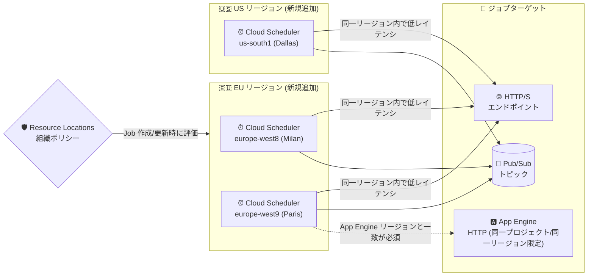

# Cloud Scheduler: 3 リージョンを追加 (Milan / Paris / Dallas)

**リリース日**: 2026-07-29

**サービス**: Cloud Scheduler

**機能**: 利用可能リージョンの追加 (europe-west8, europe-west9, us-south1)

**ステータス**: GA (一般提供)

📊 [このアップデートのインフォグラフィックを見る](https://takech9203.github.io/google-cloud-news-summary/20260729-cloud-scheduler-new-regions.html)

## 概要

2026 年 7 月 29 日、Google Cloud は Cloud Scheduler が新たに 3 つのリージョンで利用可能になったことを発表しました。追加されたのは **europe-west8 (Milan, Italy)**、**europe-west9 (Paris, France)**、**us-south1 (Dallas, Texas, United States)** の 3 リージョンです。

Cloud Scheduler は cron ジョブ (スケジュール実行される作業単位) をフルマネージドで実行するサービスで、HTTP/S エンドポイント、Pub/Sub トピック、App Engine HTTP/S アプリケーションをターゲットとして指定できます。重要な点として、**Cloud Scheduler のジョブはリージョナルリソース**であり、ジョブ作成時にリージョンを選択する必要があります。そのため「そのリージョンで Cloud Scheduler が使えるか」は、アーキテクチャ設計とコンプライアンス設計の両面で直接的な制約になります。

今回の追加は特にイタリア・フランスのユーザーにとって意味が大きいアップデートです。europe-west8 と europe-west9 はいずれも Assured Workloads の EU 限定リージョン (EU-only regions) に含まれており、Cloud Scheduler も Resource Locations 組織ポリシー制約および EU Data Boundary の対象サービスであるため、EU 内でスケジューリング処理を完結させたいワークロードで選択肢が広がります。us-south1 は米国中南部のカバレッジを強化し、Dallas 近郊にワークロードを持つ組織のリージョン整合性を高めます。

**アップデート前の課題**

- europe-west8 (Milan)、europe-west9 (Paris)、us-south1 (Dallas) では Cloud Scheduler ジョブを作成できなかった
- これらのリージョンにターゲット (Cloud Run、Cloud Run functions、Pub/Sub など) をデプロイしていても、スケジューラーだけは別リージョンに配置する必要があり、リージョン構成が非対称になっていた
- Resource Locations 組織ポリシーで europe-west8 / europe-west9 のみを許可している環境では、Cloud Scheduler の Job リソース作成がポリシーに合致せず、Cloud Scheduler を使えない (あるいはポリシー例外が必要になる) ケースがあった
- App Engine アプリを europe-west8 / europe-west9 相当のロケーションに持つプロジェクトで、App Engine HTTP ターゲットのジョブを作成できなかった

**アップデート後の改善**

- 上記 3 リージョンで Cloud Scheduler ジョブを直接作成できるようになった
- スケジューラーとターゲットを同一リージョンに揃えられるようになり、リージョン間ホップに伴うレイテンシと障害面 (failure domain) の分散を削減できる
- EU (イタリア・フランス) のデータレジデンシー要件下で、Cloud Scheduler を EU 内リージョンに閉じて運用しやすくなった
- Cloud Scheduler の提供リージョン数が合計 30 リージョン (Americas 10 / Europe 8 / Asia Pacific 9 / Middle East 3) に拡大した

## アーキテクチャ図



Cloud Scheduler のジョブはリージョナルリソースであり、HTTP/S・Pub/Sub ターゲットは任意のリージョンから呼び出せますが、同一プロジェクトの App Engine HTTP ターゲットのみ「プロジェクトの App Engine リージョンと一致するリージョンでしかジョブを作成できない」という制約があります。Resource Locations 組織ポリシーは Job リソースの作成・更新時に評価されます。

## サービスアップデートの詳細

### 追加されたリージョン

| リージョン名 | ロケーション | 地域 | 備考 |
|--------------|--------------|------|------|
| `europe-west8` | Milan, Italy (ミラノ、イタリア) | Europe | Assured Workloads の EU 限定リージョンに含まれる |
| `europe-west9` | Paris, France (パリ、フランス) | Europe | Low CO2 リージョン。Assured Workloads の EU 限定リージョンに含まれる |
| `us-south1` | Dallas, Texas, United States (ダラス、テキサス州、米国) | Americas | Low CO2 リージョン |

### 主要機能

1. **リージョナルなジョブ配置の選択肢拡大**
   - Cloud Scheduler の Job は特定リージョンに作成されるリソースであり、ジョブ作成時に `--location` (gcloud) / Region (コンソール) でリージョンを指定する
   - 今回の追加により、ミラノ・パリ・ダラスをジョブの配置先として選択できるようになった

2. **EU データ境界 / データレジデンシーへの適合性**
   - Cloud Scheduler は Resource Locations 組織ポリシー制約のサポート対象サービスであり、制約は **Job リソースの作成または更新時に適用** される (既存リソースには適用されない)
   - Cloud Scheduler (`cloudscheduler.googleapis.com`) は Assured Workloads の EU Data Boundary 系コントロールパッケージのサポート対象製品として掲載されている
   - europe-west8 / europe-west9 はいずれも Assured Workloads の EU 限定リージョン一覧に含まれる

3. **ターゲットとのリージョン整合**
   - HTTP/S エンドポイントまたは Pub/Sub トピックをターゲットとする場合、Cloud Scheduler がサポートするすべてのリージョンでジョブを作成できる
   - 同一プロジェクト内の App Engine アプリをターゲットにする場合は、**プロジェクトの App Engine リージョンでしかジョブを作成できない** という制約が引き続き適用される

## 技術仕様

### Cloud Scheduler の提供リージョン (2026-07-29 時点)

| 地域 | リージョン数 | リージョン |
|------|--------------|-----------|
| Americas | 10 | `northamerica-northeast1`, `southamerica-east1`, `us-central1`, `us-east1`, `us-east4`, **`us-south1`**, `us-west1`, `us-west2`, `us-west3`, `us-west4` |
| Europe | 8 | `europe-central2`, `europe-west1`, `europe-west2`, `europe-west3`, `europe-west4`, `europe-west6`, **`europe-west8`**, **`europe-west9`** |
| Asia Pacific | 9 | `asia-east1`, `asia-east2`, `asia-northeast1`, `asia-northeast2`, `asia-northeast3`, `asia-south1`, `asia-southeast1`, `asia-southeast2`, `australia-southeast1` |
| Middle East | 3 | `me-central1`, `me-central2` (アクセス制限あり), `me-west1` |

太字が今回追加されたリージョンです。`me-central2` (Dammam, Saudi Arabia) はリージョンアクセスの申請が必要です。

### リージョン選択に影響する仕様

| 項目 | 詳細 |
|------|------|
| ジョブのスコープ | リージョナルリソース (作成時にリージョンを指定) |
| ターゲット種別 | HTTP/S エンドポイント、Pub/Sub トピック、App Engine HTTP/S アプリケーション |
| App Engine ターゲットの制約 | 同一プロジェクトの App Engine をターゲットにする場合、ジョブはプロジェクトの App Engine リージョンにのみ作成可能。App Engine のリージョンは作成後に変更不可 |
| プロジェクト内の App Engine アプリ数 | 1 プロジェクトあたり 1 つのみ |
| App Engine 非使用時 | App Engine アプリのデプロイは不要で、既存アプリを無効化してもよい |
| 配信保証 | at-least-once (少なくとも 1 回)。ハンドラーは冪等 (idempotent) に実装する必要がある |
| ジョブ数クォータ | 5,000 ジョブ / リージョン (デフォルト、変更申請可能) |
| ジョブ最大実行時間 (HTTP ターゲット) | 30 分 (変更不可のシステム上限) |
| ジョブペイロード上限 | 合計 1 MB (約 1 KB のリクエストオーバーヘッドを含む) |
| API リクエストクォータ | 読み取り 1,250 req/min、書き込み 500 req/min (プロジェクトあたり) |
| 重複排除 | `X-CloudScheduler-ScheduleTime` ヘッダー (リトライ間で不変) とジョブ名で一意に識別可能 |
| リトライ | 失敗時はリトライポリシーに従い指数バックオフで再試行 |

### App Engine HTTP ターゲットの追加要件

App Engine HTTP ターゲットを使う場合、ターゲット側のファイアウォールルールで `0.1.0.2/32` の IP レンジからのリクエストを許可する必要があります。また、現在のプロジェクト外の App Engine アプリを呼び出したい場合は、`App Engine HTTP` ではなく `HTTP` ターゲットを選択します。

## 設定方法

### 前提条件

1. Cloud Scheduler API (`cloudscheduler.googleapis.com`) が有効化されていること
2. ジョブ作成に必要な IAM ロール (例: `roles/cloudscheduler.admin`) が付与されていること
3. Pub/Sub ターゲットを使う場合は対象トピックが事前に作成されていること (`roles/pubsub.editor` など)
4. Resource Locations 組織ポリシーを運用している場合、対象リージョンが許可されていること

### 手順

#### ステップ 1: 利用可能なロケーションを確認する

```bash
gcloud scheduler locations list
```

新しく追加された `europe-west8`、`europe-west9`、`us-south1` が一覧に含まれることを確認します。

#### ステップ 2: 新リージョンにジョブを作成する (HTTP ターゲット)

```bash
gcloud scheduler jobs create http nightly-batch-milan \
  --location=europe-west8 \
  --schedule="0 2 * * *" \
  --time-zone="Europe/Rome" \
  --uri="https://batch-api.example.com/run" \
  --http-method=POST \
  --message-body='{"mode":"nightly"}' \
  --headers="Content-Type=application/json"
```

`--location` に新リージョンを指定します。`--time-zone` は tz database のタイムゾーン名を指定します (夏時間の切り替えによりジョブが想定外のタイミングで実行される、または実行されない場合があるため注意)。

#### ステップ 3: Pub/Sub ターゲットのジョブを作成する (パリ)

```bash
gcloud scheduler jobs create pubsub hourly-refresh-paris \
  --location=europe-west9 \
  --schedule="0 * * * *" \
  --time-zone="Europe/Paris" \
  --topic=cache-refresh-topic \
  --message-body="refresh"
```

Pub/Sub ターゲットの場合、Cloud Scheduler は Google APIs サービスアカウントとしてトピックにメッセージをパブリッシュします。

#### ステップ 4: 作成結果を確認する

```bash
gcloud scheduler jobs list --location=europe-west9
gcloud scheduler jobs describe hourly-refresh-paris --location=europe-west9
```

## メリット

### ビジネス面

- **EU データレジデンシー要件への対応強化**: イタリア・フランス国内のリージョンでスケジューリング基盤を運用できるようになり、EU 内でのデータロケーション統制を取りやすくなった。europe-west8 / europe-west9 は Assured Workloads の EU 限定リージョン一覧に含まれる
- **組織ポリシー例外の削減**: Resource Locations 制約で EU 限定リージョンのみを許可している環境でも、Cloud Scheduler を例外扱いせずに導入しやすくなった
- **サステナビリティ**: 追加された `europe-west9` と `us-south1` はいずれも Low CO2 リージョンとしてドキュメントに記載されている

### 技術面

- **ターゲットとのレイテンシ削減**: Cloud Run / Cloud Run functions / 内部 HTTP エンドポイントなどのターゲットと同一リージョンにジョブを配置できるため、リージョン間ホップが不要になる
- **障害面の整合**: アプリケーションスタックとスケジューラーを同一リージョンに揃えることで、リージョン障害時の挙動を推論しやすくなる
- **App Engine 併用シナリオの解消**: App Engine のリージョンが該当ロケーションのプロジェクトで、App Engine HTTP ターゲットのジョブを作成できるようになった (App Engine のリージョンは作成後に変更不可であるため、この整合は重要)
- **リージョナルなジョブ分散**: HTTP/S・Pub/Sub ターゲットであれば複数リージョンにジョブを分散配置でき、リージョンごとに 5,000 ジョブのクォータを個別に利用できる

## デメリット・制約事項

### 制限事項

- Cloud Scheduler は依然として 30 リージョンでの提供であり、すべての Google Cloud リージョン (例: `europe-west10`、`europe-west12` など) では利用できない
- 同一プロジェクトの App Engine をターゲットにする場合、ジョブはプロジェクトの App Engine リージョンにのみ作成可能。App Engine のリージョンは作成後に変更できないため、既存プロジェクトを新リージョンへ移すことはできない
- Resource Locations 組織ポリシー制約は Job リソースの作成・更新時にのみ適用され、既存リソースには遡って適用されない
- HTTP ターゲットのジョブ実行時間上限は 30 分で、変更申請できないシステム上限
- ジョブペイロードは合計 1 MB まで (約 1 KB のリクエストオーバーヘッドを含む)
- at-least-once 配信のため、まれに同一スケジュールで複数回実行される可能性がある。ハンドラーは冪等でなければならない
- HTTP ターゲットは公開アクセス可能なエンドポイントである必要がある (Cloud Run / Cloud Run functions などの内部呼び出しや VPC Service Controls 対応は別途の機能として提供)

### 考慮すべき点

- **既存ジョブの移設はマイグレーション作業**: リージョン追加によって既存ジョブが自動的に移動することはない。新リージョンへ寄せる場合は、新リージョンでジョブを作成し、旧リージョンのジョブを削除する手順が必要 (重複実行を避けるため、切り替え時は旧ジョブの一時停止を検討する)
- **課金は一時的に二重になり得る**: 一時停止中のジョブも 1 ジョブとしてカウントされ課金対象になるため、移行期間中に新旧両方のジョブを保持すると両方が課金される
- **タイムゾーン設計**: リージョンを EU に移してもジョブのタイムゾーンは `--time-zone` の設定に依存する。リージョン変更とタイムゾーン設定は別物として扱う
- **クォータはリージョン単位**: ジョブ数クォータ (5,000) はリージョンごとに適用される一方、API リクエストクォータはプロジェクト単位で共有される
- **無料枠は請求先アカウント単位**: リージョンを分散させてジョブ数が増えると、無料枠 (3 ジョブ) を超過した分がそのまま課金される

## ユースケース

### ユースケース 1: EU データレジデンシー要件下でのバッチスケジューリング (イタリア)

**シナリオ**: イタリアの規制対象顧客データを扱うアプリケーションを europe-west8 (Milan) に構築しており、Resource Locations 組織ポリシーで EU 限定リージョンのみを許可している。夜間バッチのトリガーを Cloud Scheduler で行いたいが、これまでは europe-west8 で Cloud Scheduler ジョブを作成できなかった。

**実装例**:
```bash
# 組織ポリシーで許可された EU リージョンにジョブを作成
gcloud scheduler jobs create http eu-nightly-reconciliation \
  --location=europe-west8 \
  --schedule="30 1 * * *" \
  --time-zone="Europe/Rome" \
  --uri="https://reconciliation-svc-xxxxx.europe-west8.run.app/execute" \
  --http-method=POST \
  --oidc-service-account-email=scheduler-invoker@PROJECT_ID.iam.gserviceaccount.com
```

**効果**: スケジューラー・ターゲットの両方を EU 内 (イタリア) に閉じて配置でき、Resource Locations 組織ポリシーに対する例外設定が不要になる。リージョン間ホップも解消される。

### ユースケース 2: フランス国内サービスのキャッシュリフレッシュ (パリ)

**シナリオ**: フランス向け SaaS を europe-west9 (Paris) にデプロイしている。10 分ごとにキャッシュを更新する処理を Pub/Sub 経由でトリガーしたいが、これまでは近隣リージョン (europe-west1 など) にスケジューラーを置く必要があり、スケジューラーとターゲットのリージョンが分離していた。

**実装例**:
```bash
gcloud scheduler jobs create pubsub fr-cache-refresh \
  --location=europe-west9 \
  --schedule="*/10 * * * *" \
  --time-zone="Europe/Paris" \
  --topic=cache-refresh \
  --message-body="refresh-all"
```

**効果**: パリリージョン内でスケジューリングと Pub/Sub 配信を完結させ、レイテンシとリージョン依存関係を削減。europe-west9 は Low CO2 リージョンでもあるため、サステナビリティ目標にも合致する。

### ユースケース 3: 米国中南部ワークロードのリージョン整合 (ダラス)

**シナリオ**: テキサス州近郊のユーザー向けに us-south1 (Dallas) へワークロードを配置しているが、Cloud Scheduler だけは us-central1 に置いており、リージョン障害時の影響範囲が 2 リージョンにまたがっていた。

**効果**: us-south1 にジョブを移設することで、アプリケーションスタックとスケジューラーの障害面を単一リージョンに揃えられる。us-south1 も Low CO2 リージョンである。

## 料金

Cloud Scheduler の料金は **ジョブ (job) の数のみ** に基づきます。ジョブとは「定義された頻度で実行される 1 つのアクティビティ」を指す定義であり、実際の実行 (execution) 単位では課金されません。

- **料金**: **$0.10 / ジョブ / 31 日** (= 課金対象ジョブ 1 件あたり 1 日 $0.003)
- 課金対象使用量は **日単位** で計算される。例: ジョブを 1 件作成し 10 日後に削除した場合、$0.10 ÷ 31 × 10 = 約 **$0.03**
- **一時停止 (paused) 中のジョブも 1 ジョブとしてカウントされ課金対象** になる
- **無料枠**: 各 Google 請求先アカウントごとに **月 3 ジョブまで無料**。無料枠は **プロジェクト単位ではなく請求先アカウント単位** で測定される。例: 1 アカウント内の 5 プロジェクトにそれぞれ 2 ジョブ (計 10 ジョブ) がある場合、3 ジョブが無料、7 ジョブが課金対象となる
- リージョンによる料金差は料金ドキュメントに記載されていないため、今回追加された 3 リージョンでも同一のジョブ単価が適用される

### 料金例

| 使用量 (請求先アカウント全体) | 無料枠適用後の課金ジョブ数 | 月額料金 (概算) |
|--------|-----------------|-----------------|
| 3 ジョブ | 0 | $0.00 |
| 5 ジョブ | 2 | $0.20 |
| 10 ジョブ | 7 | $0.70 |
| 50 ジョブ | 47 | $4.70 |
| 100 ジョブ | 97 | $9.70 |

上記は Cloud Scheduler のジョブ課金のみの概算です。ターゲット側 (Cloud Run、Cloud Run functions、Pub/Sub など) の実行料金は別途発生します。

## 利用可能リージョン

今回の追加により、Cloud Scheduler は合計 **30 リージョン** (Americas 10 / Europe 8 / Asia Pacific 9 / Middle East 3) で利用可能になりました。詳細は [Cloud Scheduler locations](https://docs.cloud.google.com/scheduler/docs/locations) を参照してください。

なお、直近では 2026 年 4 月 17 日に `europe-west4` (Eemshaven, Netherlands)、`me-central1` (Doha, Qatar)、`me-central2` (Dammam, Saudi Arabia)、`me-west1` (Tel Aviv, Israel) が追加されており、Cloud Scheduler のリージョン拡張が継続的に進んでいます。

## 関連サービス・機能

- **Pub/Sub**: Cloud Scheduler のターゲット種別の 1 つ。Cloud Scheduler は Google APIs サービスアカウントとしてトピックにメッセージをパブリッシュする。リージョン分散したジョブから疎結合にワークロードを起動する構成に適する
- **App Engine**: App Engine HTTP ターゲットを使う場合、ジョブはプロジェクトの App Engine リージョンにのみ作成可能。App Engine のリージョンは変更不可であるため、リージョン設計上の重要な制約となる
- **Cloud Run / Cloud Run functions**: Cloud Scheduler から内部的に呼び出す機能が GA 済み (2023 年 8 月)。ターゲットと同一リージョンにジョブを配置することでレイテンシを削減できる
- **VPC Service Controls**: Cloud Scheduler ジョブの VPC Service Controls サポートは、2025 年 9 月 29 日に VPC Service Controls 準拠の Google Cloud API 全般へ拡張されている
- **Assured Workloads**: Cloud Scheduler (`cloudscheduler.googleapis.com`) は EU Data Boundary 系コントロールパッケージのサポート対象製品。europe-west8 / europe-west9 は EU 限定リージョン一覧に含まれる
- **Resource Manager (組織ポリシー)**: Resource Locations 制約は Cloud Scheduler の Job リソース作成・更新時に適用される (既存リソースには非適用)
- **Cloud Tasks**: 個別タスクの非同期実行・レート制御に用いる補完的サービス。定期スケジュール実行は Cloud Scheduler、動的なタスクキューイングは Cloud Tasks という使い分けになる

## 参考リンク

- 📊 [インフォグラフィック](https://takech9203.github.io/google-cloud-news-summary/20260729-cloud-scheduler-new-regions.html)
- [公式リリースノート (Cloud Scheduler)](https://docs.cloud.google.com/scheduler/docs/release-notes)
- [Cloud Scheduler locations](https://docs.cloud.google.com/scheduler/docs/locations)
- [Cloud Scheduler overview (ターゲット別のサポートリージョン)](https://docs.cloud.google.com/scheduler/docs/overview)
- [Create and configure cron jobs](https://docs.cloud.google.com/scheduler/docs/creating)
- [Cloud Scheduler quotas and limits](https://docs.cloud.google.com/scheduler/quotas)
- [料金ページ (Cloud Scheduler pricing)](https://docs.cloud.google.com/scheduler/pricing)
- [Resource Locations 制約のサポート対象サービス](https://docs.cloud.google.com/resource-manager/docs/organization-policy/defining-locations-supported-services)
- [Assured Workloads supported products by control package](https://docs.cloud.google.com/assured-workloads/docs/supported-products)
- [Assured Workloads locations](https://docs.cloud.google.com/assured-workloads/docs/locations)
- [Geography and regions](https://docs.cloud.google.com/docs/geography-and-regions)

## まとめ

Cloud Scheduler が europe-west8 (Milan)、europe-west9 (Paris)、us-south1 (Dallas) に対応し、提供リージョンは 30 に拡大しました。Cloud Scheduler のジョブはリージョナルリソースであるため、イタリア・フランスでデータレジデンシー要件を満たす必要がある組織や、Dallas リージョンにワークロードを持つ組織は、スケジューラーをターゲットと同一リージョンへ寄せる設計が可能になります。既存ジョブは自動移行されないため、新リージョンでジョブを作成し旧リージョンのジョブを削除するマイグレーションを計画してください。その際、一時停止中のジョブも課金対象 ($0.10/ジョブ/31 日、請求先アカウントあたり月 3 ジョブ無料) であることに注意が必要です。

---

**タグ**: Cloud Scheduler, リージョン拡張, europe-west8, europe-west9, us-south1, Milan, Paris, Dallas, cron, データレジデンシー, EU Data Boundary, Assured Workloads, Resource Locations, 組織ポリシー, Pub/Sub, App Engine, Low CO2, GA
