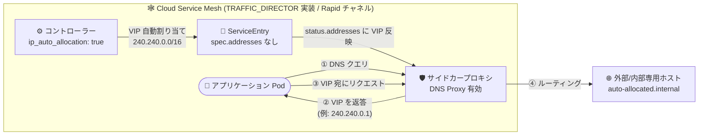

# Cloud Service Mesh: TRAFFIC_DIRECTOR 実装で DNS Proxy の IP 自動割り当てをサポート

**リリース日**: 2026-07-29

**サービス**: Cloud Service Mesh

**機能**: DNS Proxy における ServiceEntry の IP 自動割り当て (TRAFFIC_DIRECTOR 実装)

**ステータス**: Feature (Rapid リリースチャネル)

📊 [このアップデートのインフォグラフィックを見る](https://takech9203.github.io/google-cloud-news-summary/20260729-cloud-service-mesh-dns-proxy-ip-auto-allocation.html)

## 概要

Cloud Service Mesh の TRAFFIC_DIRECTOR コントロールプレーン実装を使用するクラスタで、DNS Proxy と組み合わせた IP 自動割り当て (IP auto-allocation) が Rapid リリースチャネルでサポートされました。この機能を有効化すると、`spec.addresses` に明示的な IP アドレスを指定していない ServiceEntry のホストに対して、内部 IP アドレス (240.240.0.0/16 レンジ) が自動的に割り当てられます。

DNS Proxy は、マルチクラスタ構成における Service の DNS エントリ伝播や、ServiceEntry の DNS エントリ解決を提供する機能です。Kubernetes はローカルクラスタ内の Service に対してのみ DNS 解決を提供するため、リモートクラスタの Service やメッシュ内部専用のホスト名を扱う場合、従来は追加の内部 DNS サーバーや明示的な IP 指定が必要でした。今回のアップデートにより、TRAFFIC_DIRECTOR 実装のユーザーも ServiceEntry の仮想 IP (VIP) 管理を自動化できるようになります。

対象ユーザーは、マネージド Cloud Service Mesh (TRAFFIC_DIRECTOR 実装) で外部サービスや内部専用ホスト名を ServiceEntry として登録しているプラットフォームチーム・ネットワーク管理者です。なお、TRAFFIC_DIRECTOR 実装は新規フリートがマネージド Cloud Service Mesh をオンボードした際のデフォルトのコントロールプレーン実装です。

**アップデート前の課題**

- TRAFFIC_DIRECTOR 実装では、DNS Proxy で ServiceEntry のホスト名を解決させるために `spec.addresses` に明示的な IP アドレスを手動で指定する必要があった
- ServiceEntry ごとの仮想 IP をユーザー自身が採番・管理する必要があり、エントリ数が増えると IP の重複や管理負荷が課題となっていた
- IP 自動割り当て (ISTIOD 実装では `ISTIO_META_DNS_AUTO_ALLOCATE` で利用可能) に相当する機能が TRAFFIC_DIRECTOR 実装では利用できなかった

**アップデート後の改善**

- `spec.addresses` を指定しない ServiceEntry に対して、240.240.0.0/16 レンジから内部 IP が自動的に割り当てられるようになった
- コントローラーが割り当てた VIP を ServiceEntry の `status.addresses` フィールドに反映するため、割り当て結果を宣言的に確認できるようになった (TRAFFIC_DIRECTOR 実装のみの機能)
- `asm-options` ConfigMap に `ip_auto_allocation: "true"` を設定するだけで有効化でき、手動での IP 採番・管理が不要になった

## アーキテクチャ図



IP 自動割り当てを有効化すると、コントローラーが ServiceEntry のホストに VIP を自動採番し、DNS Proxy がその VIP で名前解決を行い、サイドカープロキシが実際の宛先へトラフィックをルーティングします。

## サービスアップデートの詳細

### 主要機能

1. **ServiceEntry への IP 自動割り当て**
   - `spec.addresses` に明示的な IP を指定していない ServiceEntry のホストに対して、240.240.0.0/16 レンジから内部 IP アドレスを自動割り当て
   - DNS Proxy が有効な Pod からのホスト名解決が、割り当てられた VIP に解決される

2. **`status.addresses` への割り当て結果の反映 (TRAFFIC_DIRECTOR 実装のみ)**
   - コントローラーが割り当てた VIP を ServiceEntry の `status.addresses` フィールドに populate する
   - `kubectl get serviceentry` で割り当て済みアドレスを確認できる

3. **ConfigMap ベースのシンプルな有効化**
   - `istio-system` namespace の `asm-options` ConfigMap に `ip_auto_allocation: "true"` を設定するだけで有効化
   - `kubectl patch` でも適用可能

## 技術仕様

### 実装別の IP 自動割り当て設定方法

| 項目 | TRAFFIC_DIRECTOR 実装 | ISTIOD 実装 |
|------|----------------------|-------------|
| 設定場所 | `asm-options` ConfigMap (`istio-system`) | MeshConfig の `proxyMetadata` |
| 設定キー | `ip_auto_allocation: "true"` | `ISTIO_META_DNS_AUTO_ALLOCATE: "true"` |
| 割り当て IP レンジ | 240.240.0.0/16 | 240.240.0.0/16 |
| `status.addresses` への反映 | あり | なし |
| 対応チャネル | Rapid リリースチャネルのみ | - |

### DNS Proxy の前提

| 項目 | 詳細 |
|------|------|
| 対象 API | Istio API を使用する Cloud Service Mesh (Google Cloud API は非対応) |
| DNS Proxy の有効化 | `ISTIO_META_DNS_CAPTURE: "true"` (クラスタ全体または Pod 単位) |
| 必要データプレーン | 1.21.5-asm.39 以降 (DNS Proxy 機能の要件) |
| DNS Proxy の提供チャネル | Rapid リリースチャネル |

## 設定方法

### 前提条件

1. TRAFFIC_DIRECTOR コントロールプレーン実装のマネージド Cloud Service Mesh を使用していること
2. Rapid リリースチャネルを使用していること
3. DNS Proxy (`ISTIO_META_DNS_CAPTURE: "true"`) が有効化されていること

### 手順

#### ステップ 1: IP 自動割り当ての有効化

```bash
kubectl patch configmap/asm-options -n istio-system --type merge \
  -p '{"data":{"ip_auto_allocation":"true"}}'
```

`istio-system` namespace の `asm-options` ConfigMap に `ip_auto_allocation: "true"` を設定します。ConfigMap を直接編集する場合は以下の形式になります。

```yaml
apiVersion: v1
kind: ConfigMap
metadata:
  name: asm-options
  namespace: istio-system
data:
  # Enable IP auto-allocation for ServiceEntry (Rapid channel)
  ip_auto_allocation: "true"
```

#### ステップ 2: spec.addresses なしの ServiceEntry を作成

```bash
kubectl apply -f - <<EOF
apiVersion: networking.istio.io/v1beta1
kind: ServiceEntry
metadata:
  name: auto-allocated-service-entry
  namespace: ns1
spec:
  hosts:
  - auto-allocated.internal
  ports:
  - name: http
    number: 80
    protocol: HTTP
  resolution: DNS
EOF
```

`spec.addresses` を指定せずに ServiceEntry を作成します。

#### ステップ 3: 割り当て結果の確認

```bash
# status.addresses に割り当てられた VIP を確認 (TRAFFIC_DIRECTOR のみ)
kubectl get serviceentry auto-allocated-service-entry -n ns1 -o yaml
```

出力の `status.addresses` に割り当てられたアドレスが表示されます。

```yaml
status:
  addresses:
  - host: auto-allocated.internal
    value: 240.240.0.1
```

#### ステップ 4: DNS 解決の動作確認

```bash
kubectl exec deploy/curl -n ns1 -- curl -sS -v http://auto-allocated.internal
```

DNS Proxy が有効な Pod からリクエストを送ると、自動割り当てされた VIP (例: `240.240.0.1:80`) に名前解決されることを確認できます。

## メリット

### ビジネス面

- **運用負荷の削減**: ServiceEntry ごとの IP 採番・台帳管理が不要になり、外部サービス登録のリードタイムが短縮される
- **実装間の機能差の解消**: これまで ISTIOD 実装のみで可能だった IP 自動割り当てが TRAFFIC_DIRECTOR 実装でも利用でき、デフォルト実装 (TRAFFIC_DIRECTOR) への移行・新規採用がしやすくなる

### 技術面

- **IP 重複リスクの排除**: コントローラーが 240.240.0.0/16 レンジから一意に割り当てるため、手動採番による重複や設定ミスを防げる
- **宣言的な可視性**: TRAFFIC_DIRECTOR 実装では割り当て結果が `status.addresses` に反映され、GitOps や監査での確認が容易
- **内部 DNS サーバーが不要**: メッシュ内部専用のホスト名を、追加の DNS サーバーを立てずに DNS Proxy だけで解決できる

## デメリット・制約事項

### 制限事項

- TRAFFIC_DIRECTOR 実装での IP 自動割り当ては **Rapid リリースチャネルのみ** のサポート
- DNS Proxy 自体も Rapid リリースチャネルで提供されており、データプレーン 1.21.5-asm.39 以降が必要
- Istio API を使用する Cloud Service Mesh のみが対象で、Google Cloud API (サービスルーティング API) には対応していない

### 考慮すべき点

- 割り当てレンジは 240.240.0.0/16 (Class E アドレス空間) であり、この範囲をクラスタ内の他用途で使用していないことを確認する必要がある
- TRAFFIC_DIRECTOR 実装には、Rapid 以外のチャネルを使用している場合でも `istio-asm-managed-rapid` ConfigMap 側の変更が必要になる既知の問題があるため、ConfigMap の編集対象に注意する
- Regular / Stable チャネルの本番クラスタでは現時点で利用できないため、チャネル戦略とあわせて採用を検討する

## ユースケース

### ユースケース 1: 外部 API 群のメッシュ登録の自動化

**シナリオ**: 多数の外部 SaaS API や社内共通 API を ServiceEntry としてメッシュに登録し、mTLS ポリシーやトラフィック制御の対象にしたい。従来は ServiceEntry ごとに VIP を手動採番して `spec.addresses` に記載していた。

**実装例**:
```yaml
apiVersion: networking.istio.io/v1beta1
kind: ServiceEntry
metadata:
  name: partner-api
  namespace: integrations
spec:
  hosts:
  - partner-api.internal
  ports:
  - name: http
    number: 80
    protocol: HTTP
  resolution: DNS
  # spec.addresses は不要 (自動割り当て)
```

**効果**: IP 採番台帳の管理が不要になり、ServiceEntry の追加が hosts とポートの定義だけで完結する。

### ユースケース 2: 内部専用ホスト名の解決

**シナリオ**: 公開 DNS に登録されていないメッシュ内部専用のホスト名 (例: `auto-allocated.internal`) を、追加の内部 DNS サーバーを構築せずにメッシュ内から解決させたい。

**効果**: DNS Proxy と IP 自動割り当ての組み合わせにより、内部 DNS サーバーの構築・運用なしで内部専用ホスト名の解決とルーティングが実現できる。

## 料金

この機能自体に追加料金は発生しません。Cloud Service Mesh の料金体系については公式料金ページを参照してください。

- [Cloud Service Mesh の料金](https://cloud.google.com/service-mesh/pricing)

## 関連サービス・機能

- **GKE (Google Kubernetes Engine)**: マネージド Cloud Service Mesh の実行基盤。Rapid リリースチャネルのクラスタが対象
- **Cloud Service Mesh マルチクラスタ構成**: DNS Proxy はマルチクラスタ構成におけるクラスタ間の Service DNS エントリ伝播にも使用される
- **Istio ServiceEntry / MeshConfig**: 本機能は Istio API (ServiceEntry) を対象とし、ISTIOD 実装では MeshConfig の `ISTIO_META_DNS_AUTO_ALLOCATE` で同等の機能を設定する

## 参考リンク

- 📊 [インフォグラフィック](https://takech9203.github.io/google-cloud-news-summary/20260729-cloud-service-mesh-dns-proxy-ip-auto-allocation.html)
- [公式リリースノート](https://docs.cloud.google.com/release-notes#July_29_2026)
- [DNS Proxy の設定 - IP auto-allocation for ServiceEntry](https://docs.cloud.google.com/service-mesh/docs/operate-and-maintain/dns-proxy#ip_auto-allocation_for_serviceentry)
- [マネージド Cloud Service Mesh でサポートされる機能](https://docs.cloud.google.com/service-mesh/docs/supported-features-managed)
- [Cloud Service Mesh の料金](https://cloud.google.com/service-mesh/pricing)

## まとめ

TRAFFIC_DIRECTOR 実装 (新規フリートのデフォルト実装) でも ServiceEntry の IP 自動割り当てが利用可能になり、ISTIOD 実装との機能差が一つ解消されました。Rapid リリースチャネルの Cloud Service Mesh ユーザーで、外部サービスや内部専用ホスト名を ServiceEntry で管理している場合は、`asm-options` ConfigMap に `ip_auto_allocation: "true"` を設定して手動 IP 管理からの脱却を検討してください。Regular / Stable チャネルのクラスタでは今後の展開を待つ必要があります。

---

**タグ**: #CloudServiceMesh #DNSProxy #ServiceEntry #TrafficDirector #Istio #GKE #ServiceMesh #Networking
