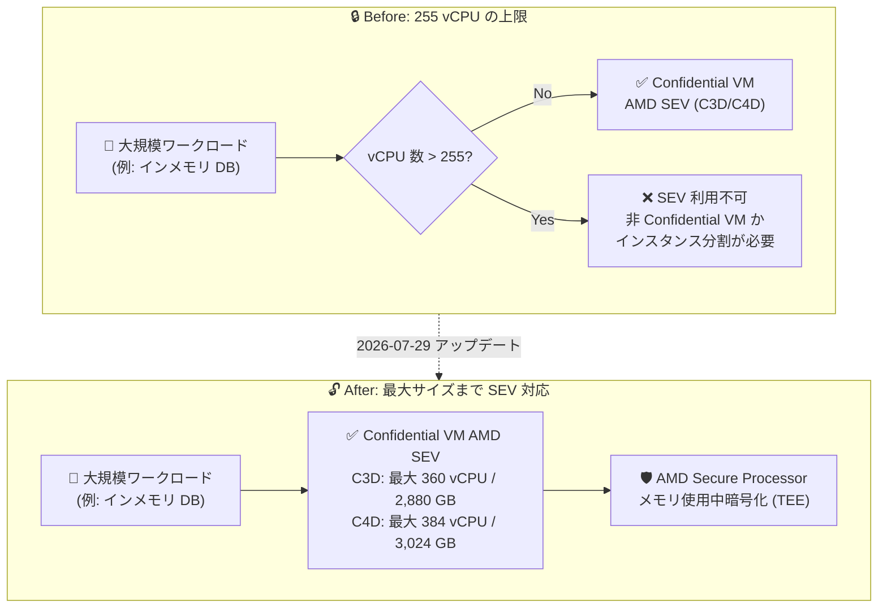

# Confidential VM: AMD SEV が C3D/C4D マシンタイプで 255 vCPU 超の構成をサポート

**リリース日**: 2026-07-29

**サービス**: Confidential VM

**機能**: AMD SEV on C3D/C4D マシンタイプにおける 255 vCPU 超構成のサポート

**ステータス**: Feature

📊 [このアップデートのインフォグラフィックを見る](https://takech9203.github.io/google-cloud-news-summary/20260729-confidential-vm-amd-sev-255-vcpus.html)

## 概要

Google Cloud は、AMD SEV (Secure Encrypted Virtualization) を使用する Confidential VM インスタンスについて、C3D および C4D マシンタイプで 255 vCPU を超える構成のサポートを発表しました。これにより、C3D シリーズの最大 360 vCPU 構成 (例: `c3d-standard-360`)、C4D シリーズの最大 384 vCPU 構成 (例: `c4d-highmem-384`) といった最大サイズのマシンタイプでも、ハードウェアベースのメモリ暗号化による機密コンピューティングを利用できるようになります。

Confidential VM は、AMD Secure Processor が生成・保持する暗号鍵によって VM のメモリを使用中 (in-use) に暗号化し、ハイパーバイザーからもデータを読み取れないようにする Trusted Execution Environment (TEE) を提供します。AMD SEV は Confidential Computing 技術の中でも高いパフォーマンスを特徴とし、ワークロードによっては標準の Compute Engine VM との性能差が最小限に抑えられます。

今回のアップデートの対象は、大規模なインメモリデータベース、分析基盤、SAP などのエンタープライズワークロードを機密コンピューティング環境で実行したい組織です。金融、医療、公共など、規制要件によりデータの使用中暗号化が求められる業界において、スケールアップの上限が引き上げられたことは大きな意味を持ちます。

**アップデート前の課題**

- AMD SEV を有効化した C3D/C4D の Confidential VM インスタンスは、255 vCPU を超える構成を利用できなかった
- C3D は最大 360 vCPU、C4D は最大 384 vCPU までスケールアップ可能だが、Confidential VM として使う場合は最大サイズのマシンタイプ (c3d-standard/highcpu/highmem-360、c4d-standard/highcpu/highmem-384 など) を選択できなかった
- 大規模なメモリ・CPU を必要とするワークロードで機密コンピューティングを利用するには、複数の小さいインスタンスへの分割などの設計上の妥協が必要だった

**アップデート後の改善**

- C3D/C4D マシンタイプの 255 vCPU 超の構成 (C3D は最大 360 vCPU / 2,880 GB メモリ、C4D は最大 384 vCPU / 3,024 GB メモリ) で AMD SEV を有効化できるようになった
- 非 Confidential VM とほぼ同等のマシンサイズ選択肢で、使用中データの暗号化を実現できるようになった
- 大規模インメモリデータベースや分析ワークロードを、分割せずに単一の Confidential VM インスタンスで実行できるようになった

## アーキテクチャ図



従来は AMD SEV の Confidential VM が 255 vCPU までに制限されていましたが、今回のアップデートで C3D (最大 360 vCPU)・C4D (最大 384 vCPU) のフルサイズ構成でもメモリ使用中暗号化を利用できるようになりました。

## サービスアップデートの詳細

### 主要機能

1. **C3D マシンタイプでの 255 vCPU 超サポート**
   - C3D は第 4 世代 AMD EPYC (Genoa) プロセッサと Titanium を搭載し、最大 360 vCPU / 2,880 GB DDR5 メモリをサポート
   - `c3d-standard-360` (360 vCPU / 1,440 GB)、`c3d-highcpu-360` (360 vCPU / 708 GB)、`c3d-highmem-360` (360 vCPU / 2,880 GB) などの最大構成で AMD SEV を有効化可能に
   - C3D + AMD SEV はライブマイグレーションを GA サポート (2026 年 4 月に GA)

2. **C4D マシンタイプでの 255 vCPU 超サポート**
   - C4D は第 5 世代 AMD EPYC (Turin) プロセッサと Titanium を搭載し、最大 384 vCPU / 3,024 GB DDR5 メモリをサポート
   - `c4d-highmem-384` (384 vCPU / 3,024 GB) などの最大構成で AMD SEV を有効化可能に
   - C4D は C3D 比で SPECrate®2017_int_base ベンチマーク推定値において 30% の性能向上を実現

3. **AMD SEV によるメモリ使用中暗号化**
   - AMD Secure Processor が生成・保持する暗号鍵で VM メモリを暗号化 (鍵はハイパーバイザーからアクセス不可)
   - Google の vTPM によるブート時アテステーション (構成検証) に対応
   - AMD SEV はワークロードによっては非 Confidential VM との性能差が最小限で、高い計算性能が求められるタスクに適する

## 技術仕様

### 対象マシンシリーズの比較

| 項目 | C3D | C4D |
|------|-----|-----|
| CPU プラットフォーム | AMD EPYC Genoa (第 4 世代) | AMD EPYC Turin (第 5 世代) |
| 最大 vCPU 数 | 360 | 384 |
| 最大メモリ | 2,880 GB DDR5 | 3,024 GB DDR5 |
| Confidential Computing 技術 | AMD SEV | AMD SEV |
| ライブマイグレーション | サポート (GA) | 非サポート |
| Tier_1 ネットワーキング | 最大 200 Gbps | 最大 200 Gbps |
| ベアメタルでの Confidential VM | 非サポート | 非サポート |

### 255 vCPU 超で利用可能になる主なマシンタイプの例

| マシンタイプ | vCPU | メモリ (GB) |
|------|------|------|
| c3d-standard-360 | 360 | 1,440 |
| c3d-highcpu-360 | 360 | 708 |
| c3d-highmem-360 | 360 | 2,880 |
| c4d-standard-384 | 384 | 1,488 |
| c4d-highcpu-384 | 384 | 768 |
| c4d-highmem-384 | 384 | 3,024 |

## 設定方法

### 前提条件

1. 既存インスタンスは Confidential VM に変換できないため、新規に Confidential VM インスタンスを作成する必要がある
2. C3D/C4D および AMD EPYC Genoa / AMD EPYC Turin がサポートされているゾーンを選択する
3. `SEV_CAPABLE` としてタグ付けされた OS イメージを使用する (`gcloud compute images list --filter="guestOsFeatures[].type:(SEV_CAPABLE)"` で確認可能)

### 手順

#### ステップ 1: 対象ゾーンの CPU プラットフォームを確認

```bash
gcloud compute zones describe ZONE_NAME \
    --format="value(availableCpuPlatforms)"
```

AMD Genoa (C3D) または AMD Turin (C4D) がサポートされているゾーンを確認します。

#### ステップ 2: 255 vCPU 超の Confidential VM インスタンスを作成 (C3D の例)

```bash
gcloud compute instances create my-large-cvm \
    --confidential-compute-type=SEV \
    --machine-type=c3d-standard-360 \
    --min-cpu-platform="AMD Genoa" \
    --maintenance-policy=MIGRATE \
    --zone=ZONE_NAME \
    --image-project=IMAGE_PROJECT \
    --image-family=IMAGE_FAMILY_NAME
```

C3D + AMD SEV はライブマイグレーションをサポートするため `--maintenance-policy=MIGRATE` を指定できます。C4D の場合は `--machine-type=c4d-standard-384`、`--min-cpu-platform="AMD Turin"`、`--maintenance-policy=TERMINATE` を指定します (C4D はライブマイグレーション非サポート)。

## メリット

### ビジネス面

- **規制対応ワークロードのスケールアップ**: 金融・医療・公共など、使用中データの暗号化が求められる業界で、大規模ワークロードをアーキテクチャの妥協なく機密コンピューティング環境に移行できる
- **コスト最適化の選択肢拡大**: C3D/C4D は資源ベース / コンピュートフレキシブル確約利用割引 (CUD) や Spot VM に対応しており、大規模 Confidential VM でも割引オプションを活用できる

### 技術面

- **単一インスタンスでの大規模処理**: 最大 384 vCPU / 3,024 GB メモリ (C4D highmem) の単一 TEE 内で、インメモリデータベースや分析ワークロードを分割せずに実行できる
- **高性能な機密コンピューティング**: AMD SEV はワークロードによっては非 Confidential VM との性能差が最小限であり、C4D は C3D 比 30% の性能向上 (SPECrate®2017_int_base 推定値) を提供する
- **可用性の維持 (C3D)**: C3D + AMD SEV はライブマイグレーションに対応しており、ホストメンテナンス時もインスタンスを停止せずに運用できる

## デメリット・制約事項

### 制限事項

- AMD SEV を使用する C4D/C3D の Confidential VM インスタンスは、Tier_1 ネットワーキングを有効にしても、同等の非 Confidential VM よりネットワーク帯域幅が低下する場合がある
- C3D/C4D のベアメタルインスタンスは Confidential VM をサポートしない
- C3D + AMD SEV の Confidential VM は Hyperdisk Balanced および Hyperdisk Throughput をサポートしない
- C4D はライブマイグレーション非サポート (ホストメンテナンス時は TERMINATE)
- `rhel-8-4-sap-ha` イメージ (SEV_CAPABLE タグ付き) は、8 vCPU 超の C4D/C3D + AMD SEV では動作しない (SWIOTLB バッファサイズを拡大するパッチが欠落)
- C3D/C4D 共通の制限として、255 vCPU 超のマシンタイプでは Windows Server 2016 OS イメージを使用できない

### 考慮すべき点

- 既存インスタンスを Confidential VM に変換することはできず、新規作成が必要
- Confidential VM のブート時間はメモリ量に比例するため、大容量メモリ構成 (highmem-384 など) ではブート時間が長くなる可能性がある
- Confidential VM はディスクに NVMe インターフェースが必須 (SCSI 非サポート)、アタッチ可能なディスクは最大 40 台
- Debian 12 は `/dev/sev-guest` パッケージがないため AMD SEV のアテステーションをサポートしない

## ユースケース

### ユースケース 1: 大規模インメモリデータベースの機密コンピューティング化

**シナリオ**: 金融機関が、機微な顧客データを扱うインメモリデータベースを Google Cloud で運用したい。データベースは 2 TB 超のメモリを必要とし、規制要件により使用中データの暗号化が必須。

**実装例**:
```bash
gcloud compute instances create finance-inmem-db \
    --confidential-compute-type=SEV \
    --machine-type=c4d-highmem-384 \
    --min-cpu-platform="AMD Turin" \
    --maintenance-policy=TERMINATE \
    --zone=ZONE_NAME \
    --image-project=IMAGE_PROJECT \
    --image-family=IMAGE_FAMILY_NAME
```

**効果**: 384 vCPU / 3,024 GB メモリの単一インスタンスで、メモリ上のデータをハードウェアレベルで暗号化しながらデータベースを実行できる。従来のようにインスタンスを分割する必要がなく、アーキテクチャがシンプルになる。

### ユースケース 2: 可用性を重視した大規模分析基盤 (C3D)

**シナリオ**: 医療データの分析基盤を、ホストメンテナンスによる停止なしに Confidential VM で運用したい。CPU 集約的な分析処理のため 300 vCPU 以上が必要。

**効果**: C3D + AMD SEV はライブマイグレーションに GA 対応しているため、`c3d-standard-360` (360 vCPU) でメンテナンス時も停止せずに、使用中データを暗号化した分析処理を継続できる。

## 料金

Confidential VM は、ベースとなるマシンタイプの料金に加えて Confidential Computing の利用料金が発生します。C3D/C4D は資源ベースおよびコンピュートフレキシブル確約利用割引 (CUD)、Spot VM に対応しています。最新の料金は以下の公式ページを参照してください。

- [Confidential VM の料金](https://cloud.google.com/confidential-computing/confidential-vm/pricing)
- [Compute Engine VM インスタンスの料金](https://cloud.google.com/compute/vm-instance-pricing)

## 利用可能リージョン

C3D/C4D + AMD SEV に対応するゾーンは、以下の方法で確認できます。

- [利用可能なリージョンとゾーン](https://docs.cloud.google.com/compute/docs/regions-zones#available) の表で、マシンタイプに C3D / C4D、CPU に AMD EPYC Genoa / AMD EPYC Turin を選択して絞り込む
- `gcloud compute zones describe ZONE_NAME --format="value(availableCpuPlatforms)"` で対象ゾーンの CPU プラットフォームを確認する

## 関連サービス・機能

- **Compute Engine (C3D/C4D マシンシリーズ)**: 本アップデートの対象となる汎用マシンファミリー。Titanium による高いネットワーク性能と、Hyperdisk / Titanium SSD などのストレージオプションを提供
- **Shielded VM / vTPM**: Confidential VM は Google の vTPM によるブート時アテステーションを利用し、VM の起動状態の完全性を検証できる
- **Cloud Monitoring**: Confidential VM インスタンスの整合性モニタリング (integrity monitoring) による検証に利用できる
- **Confidential GKE Nodes / その他の Confidential Computing 製品**: VM 単体だけでなく、GKE ノードなどでも機密コンピューティングを利用可能

## 参考リンク

- 📊 [インフォグラフィック](https://takech9203.github.io/google-cloud-news-summary/20260729-confidential-vm-amd-sev-255-vcpus.html)
- [公式リリースノート](https://docs.cloud.google.com/release-notes#July_29_2026)
- [Confidential VM リリースノート](https://docs.cloud.google.com/confidential-computing/confidential-vm/docs/release-notes)
- [Confidential VM の概要](https://docs.cloud.google.com/confidential-computing/confidential-vm/docs/confidential-vm-overview)
- [サポートされている構成 (マシンタイプ・CPU・ゾーン)](https://docs.cloud.google.com/confidential-computing/confidential-vm/docs/supported-configurations)
- [Confidential VM インスタンスの作成](https://docs.cloud.google.com/confidential-computing/confidential-vm/docs/create-a-confidential-vm-instance)
- [汎用マシンファミリー (C3D/C4D マシンシリーズ)](https://docs.cloud.google.com/compute/docs/general-purpose-machines)
- [料金ページ](https://cloud.google.com/confidential-computing/confidential-vm/pricing)

## まとめ

AMD SEV を使用する Confidential VM が C3D で最大 360 vCPU、C4D で最大 384 vCPU までスケールアップ可能になり、大規模なインメモリデータベースや分析ワークロードを単一の機密コンピューティング環境で実行できるようになりました。使用中データの暗号化が求められる規制業界のワークロードを大型インスタンスで運用しているチームは、C3D/C4D の最大構成への統合を検討する価値があります。導入時は、ネットワーク帯域幅の低下や C3D における Hyperdisk Balanced/Throughput 非サポートなどの制約を事前に確認してください。

---

**タグ**: Confidential VM, Confidential Computing, AMD SEV, C3D, C4D, Compute Engine, セキュリティ, TEE, メモリ暗号化
