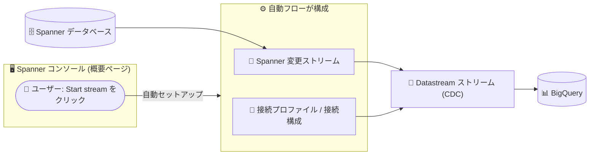

# Datastream: Spanner コンソールからの自動ストリーム作成フロー

**リリース日**: 2026-07-29

**サービス**: Datastream

**機能**: Spanner のインスタンス / データベース概要ページからの自動ストリーム作成

**ステータス**: Feature

📊 [このアップデートのインフォグラフィックを見る](https://takech9203.github.io/google-cloud-news-summary/20260729-datastream-spanner-automated-stream-creation.html)

## 概要

Spanner のインスタンス概要ページまたはデータベース概要ページから、自動化されたフロー (automated flow) を使用して Datastream のストリームを直接作成できるようになりました。この自動フローは、Spanner データベースから BigQuery などの宛先へデータを移動するプロセスを、必要な手順数を削減することで簡素化します。

自動フローでは、ストリームとソースデータベース間の接続のセキュリティ確保、データベース構成の作成、ストリーム接続リソース (接続プロファイル) の作成を Datastream が自動化します。ユーザーは Spanner コンソール上でデフォルト設定を確認し、「Start stream」をクリックするだけでストリームの作成と開始が完了します。

Spanner のデータを BigQuery でほぼリアルタイムに分析したいデータエンジニアやアプリケーション開発者にとって、CDC (変更データキャプチャ) パイプラインの構築ハードルを大きく下げるアップデートです。Datastream は 2026 年 4 月に AlloyDB for PostgreSQL 向けの自動フローを提供しており、今回それが Spanner ソースにも拡張された形です。

**アップデート前の課題**

Datastream の Spanner ソース対応 (2026 年 1 月提供開始) では、ストリーム作成に複数の手動ステップが必要でした。

- Spanner 側で NEW_ROW 値キャプチャタイプの変更ストリームを DDL で作成・構成する必要があった
- Datastream 側で Spanner 接続プロファイルを手動で作成し、`projects/PROJECT_ID/instances/INSTANCE/databases/DATABASE_ID` 形式のデータベース名を指定する必要があった
- Datastream コンソールに移動してストリームを構成・作成する必要があり、Spanner コンソールとの間を行き来する手間があった

**アップデート後の改善**

- Spanner のインスタンス概要ページ (「Data replication to BigQuery」の「Start stream」) またはデータベース概要ページ (「Integrations」タブの「Create stream」) から直接ストリームを作成・開始できるようになった
- ソースデータベースとの接続のセキュリティ確保、データベース構成、接続プロファイルなどのストリーム接続リソースの作成が自動化された
- 作成したストリームの基本情報は、Spanner データベース概要ページの「Change streams」タブからそのままモニタリングできる

## アーキテクチャ図

ユーザーが Spanner コンソールでストリーム作成を開始すると、Datastream が接続のセキュリティ確保や接続リソースの作成を自動化し、Spanner の変更データが BigQuery へレプリケートされます。

## サービスアップデートの詳細

### 主要機能

1. **Spanner コンソールからのワンストップ作成**
   - インスタンス概要ページ: 「Data replication to BigQuery」の下にある「Start stream」をクリック
   - データベース概要ページ: 「Integrations」タブの「Replicate data to BigQuery」の下にある「Create stream」をクリック
   - 「Start stream to replicate data」ペインが開き、デフォルト設定を確認して「Start stream」をクリックするとストリームが作成・開始される

2. **接続リソースの自動構成**
   - ストリームとソースデータベース間の接続のセキュリティ確保を Datastream が自動化
   - データベース構成とストリーム接続リソース (接続プロファイル) を自動作成
   - インスタンス概要ページから作成する場合はソースデータベースをドロップダウンで変更可能、使用する変更ストリームも「Change stream」ドロップダウンで選択可能

3. **コンソール上でのモニタリングと削除時のクリーンアップ**
   - Spanner データベース概要ページの「Change streams」タブから、対象ストリームの基本情報をモニタリング可能
   - 自動フローで作成したストリームを削除すると、Datastream はストリームオブジェクトと、そのストリーム用に作成された接続プロファイルを削除する (独立して作成された Spanner 変更ストリームや宛先リソースは手動削除が必要)

## 技術仕様

### 前提条件と要件

| 項目 | 詳細 |
|------|------|
| 必要な API | Datastream API (`datastream.googleapis.com`)、Cloud Spanner API (`spanner.googleapis.com`)、BigQuery API (`bigquery.googleapis.com`) |
| Datastream 側の IAM | Datastream 管理者 (`roles/datastream.admin`) または Datastream 編集者 (`roles/datastream.editor`) |
| Spanner 側の IAM | Spanner データベース読み取り (`roles/spanner.databaseReader`) または Spanner 管理者 (`roles/spanner.admin`) |
| BigQuery 側の IAM | 宛先データセットに対する BigQuery データ編集者 |
| 対応 Spanner エディション | Standard / Enterprise / Enterprise Plus |
| 変更ストリーム | NEW_ROW または NEW_ROW_AND_OLD_VALUES 値キャプチャタイプのみ対応。保持期間 (retention window) の適切な構成が必要 |

### Spanner ソースの主な制限事項

- PROTO および ENUM データ型のカラムは非対応
- DATE または TIMESTAMP 型の配列は非対応
- 変更ストリームの保持期間を超えて Datastream が遅延するとデータ損失やストリーム失敗の可能性がある
- 3 TiB を超えるデータベースのバックフィルは完了に 24 時間以上かかる場合がある
- 10,000 超のパーティション、秒間 60,000 超の更新、秒間 60 MiB 超のスループットを持つ変更ストリームでは遅延や失敗が発生する可能性がある
- ジオパーティショニングされたデータのレプリケーションは非対応

## 設定方法

### 前提条件

1. Datastream API、Cloud Spanner API、BigQuery API をプロジェクトで有効化する
2. ストリームを構成するユーザーまたはサービスアカウントに、上記「技術仕様」の IAM ロールを付与する
3. Spanner ソースの制限事項 (非対応データ型、変更ストリームの保持期間など) を確認する

### 手順

#### ステップ 1: Spanner コンソールでソースを選択

1. Google Cloud コンソールで Spanner の「インスタンス」ページに移動する
2. ストリーミング元の Spanner インスタンスとデータベースを選択する

#### ステップ 2: ストリームを作成・開始

以下のいずれかの方法でストリームを作成する。

- インスタンス概要ページで「Data replication to BigQuery」の下の「Start stream」をクリック
- データベース概要ページの「Integrations」タブで「Replicate data to BigQuery」の下の「Create stream」をクリック

「Start stream to replicate data」ペインが開いたら、「Stream settings」でデフォルト設定を確認する。必要に応じてソースデータベース (インスタンス概要ページから開始した場合) や使用する変更ストリームをドロップダウンで変更し、「Start stream」をクリックするとストリームが作成・開始される。

#### ステップ 3: ストリームをモニタリング

Spanner データベース概要ページの「Change streams」タブで、確認したいストリームをクリックすると基本情報を確認できる。

## メリット

### ビジネス面

- **分析基盤構築の高速化**: Spanner から BigQuery へのニアリアルタイムレプリケーションを数クリックで開始でき、データ分析基盤の立ち上げまでの時間を短縮できる
- **運用負荷の軽減**: 接続プロファイルやデータベース構成の手動管理が不要になり、設定ミスによるトラブルのリスクを低減できる

### 技術面

- **セットアップ手順の削減**: 接続のセキュリティ確保、データベース構成、接続リソース作成が自動化され、Datastream コンソールと Spanner コンソールを行き来する必要がない
- **ライフサイクル管理の簡素化**: ストリーム削除時に自動フローで作成された接続プロファイルも一緒に削除され、リソースの取り残しを防げる

## デメリット・制約事項

### 制限事項

- Spanner ソース共通の制限 (PROTO / ENUM 非対応、DATE / TIMESTAMP 配列非対応、大規模変更ストリームでの遅延リスクなど) は自動フローでも同様に適用される
- ストリーム削除時、独立して作成された Spanner 変更ストリームや宛先リソース (BigQuery データセットなど) は自動削除されず、不要な場合は手動で削除する必要がある

### 考慮すべき点

- 変更ストリームの保持期間 (デフォルト 7 日) を適切に構成しないと、Datastream が遅延した際にデータ損失やストリーム失敗が発生する可能性がある
- 細かいチューニング (バックフィル並列度、Data Boost の利用、きめ細かなアクセス制御ロールなど) が必要な場合は、従来の手動構成フローの利用も検討する

## ユースケース

### ユースケース 1: Spanner 上の OLTP データの BigQuery でのリアルタイム分析

**シナリオ**: EC サイトの注文データを Spanner で管理しており、売上ダッシュボードを BigQuery + BI ツールで構築したい。データエンジニアリングの専任チームがなく、CDC パイプラインの構築・運用コストを最小化したい。

**効果**: Spanner コンソールから数クリックでストリームを開始でき、注文データがニアリアルタイムで BigQuery にレプリケートされる。接続リソースの構成やセキュリティ設定は自動化されるため、専門知識がなくても安全にパイプラインを構築できる。

### ユースケース 2: 無料枠を活用した CDC レプリケーションの検証

**シナリオ**: Spanner から BigQuery への CDC レプリケーションの導入を検討しており、まず小規模なデータベースで動作や運用イメージを検証したい。

**効果**: Datastream の Free Tier により、Spanner から BigQuery へのストリーミングは毎月 100 GiB までの CDC データが無料で処理できる。自動フローと組み合わせることで、コストをかけずに短時間で検証環境を構築できる。

## 料金

Datastream の料金は、ソースから処理された CDC データ量に基づいて課金されます。Spanner などの Google Cloud ソースから BigQuery へのストリーミングには Free Tier が提供されており、請求先アカウントごとに毎月最初の 100 GiB の CDC データが無料です。

詳細は [Datastream の料金ページ](https://cloud.google.com/datastream/pricing) を参照してください。

## 関連サービス・機能

- **Spanner 変更ストリーム**: Datastream は Spanner の変更ストリーム (NEW_ROW / NEW_ROW_AND_OLD_VALUES) を使用して変更を追跡する。Datastream 自体は変更ストリームを変更しないため、追跡対象は変更ストリームの構成に依存する
- **BigQuery**: 自動フローの宛先。レプリケートされたデータをそのまま分析に利用できる
- **AlloyDB for PostgreSQL**: 2026 年 4 月に同様の自動ストリーム作成フローが提供済み。今回のアップデートで Spanner にも同じ体験が拡張された
- **Dataflow (Datastream to Spanner テンプレート)**: 逆方向 (Datastream ソースから Spanner への移行) のパイプラインを構築する場合に利用できる

## 参考リンク

- 📊 [インフォグラフィック](https://takech9203.github.io/google-cloud-news-summary/20260729-datastream-spanner-automated-stream-creation.html)
- [公式リリースノート](https://docs.cloud.google.com/release-notes#July_29_2026)
- [ドキュメント: 自動フローによる Spanner ストリームの作成](https://docs.cloud.google.com/datastream/docs/create-spanner-stream-automated)
- [ドキュメント: Spanner をソースとして使用する](https://docs.cloud.google.com/datastream/docs/sources-spanner)
- [ドキュメント: ソース Spanner データベースの構成](https://docs.cloud.google.com/datastream/docs/configure-spanner)
- [料金ページ](https://cloud.google.com/datastream/pricing)

## まとめ

Spanner コンソールから数クリックで Datastream のストリームを作成・開始できるようになり、Spanner から BigQuery への CDC レプリケーション導入のハードルが大幅に下がりました。Spanner のデータを BigQuery で分析したいチームは、毎月 100 GiB まで無料の Free Tier と組み合わせて、まず自動フローでの検証から始めることを推奨します。

---

**タグ**: #Datastream #Spanner #BigQuery #CDC #データレプリケーション #自動化
