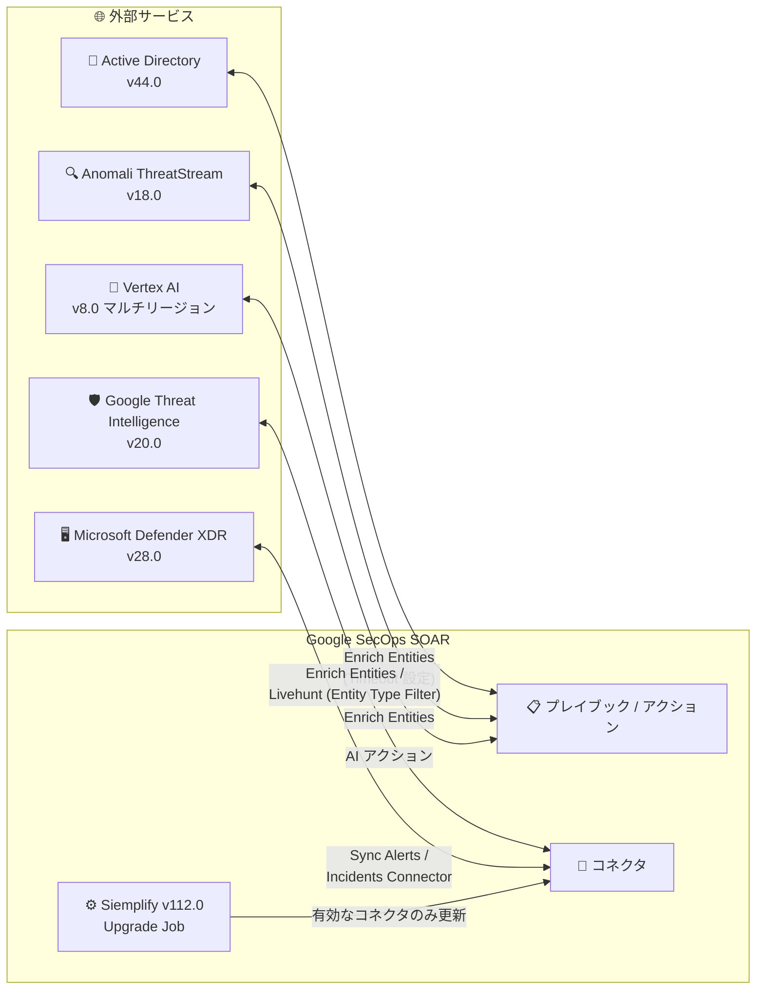

# Google SecOps Marketplace: インテグレーション更新 (2026 年 7 月 29 日)

**リリース日**: 2026-07-29

**サービス**: Google SecOps Marketplace

**機能**: インテグレーション更新 (Active Directory / Anomali ThreatStream / Google Threat Intelligence / Microsoft 365 Defender / Siemplify / Vertex AI)

**ステータス**: Change (6 件のインテグレーション更新)

📊 [このアップデートのインフォグラフィックを見る](https://takech9203.github.io/google-cloud-news-summary/20260729-google-secops-marketplace-updates-july-29.html)

## 概要

2026 年 7 月 29 日、Google SecOps Marketplace の 6 つの SOAR インテグレーションが更新されました。対象は Active Directory (Version 44.0)、Anomali ThreatStream (Version 18.0)、Google Threat Intelligence (Version 20.0)、Microsoft 365 Defender (Version 28.0)、Siemplify (Version 112.0)、Vertex AI (Version 8.0) です。

今回の更新は、エンティティエンリッチメント系アクションの機能強化 (接続タイムアウト設定、新しいエンティティタイプのサポート)、コネクタのフィルタリング機能追加、ケース同期・アラート処理ロジックの改善、マルチリージョンエンドポイント対応など、SOC 運用の安定性と柔軟性を高める改善が中心です。Google SecOps SOAR でプレイブックやコネクタを運用しているセキュリティチームは、各インテグレーションの変更内容を確認し、Content Hub からの更新を検討してください。

**アップデート前の課題**

- Active Directory の Enrich Entities アクションでは、ネットワーク接続のタイムアウト値をアクション側のパラメータとして構成できなかった
- Google Threat Intelligence の Enrich Entities アクションは CHILDHASH / PARENTHASH エンティティタイプに対応しておらず、Livehunt Connector には通知をエンティティタイプで絞り込むパラメータがなかった
- Siemplify の Response Integration & Connector Upgrade ジョブには、有効化されているコネクタのみを更新対象とする絞り込みオプションがなかった
- Vertex AI インテグレーションはマルチリージョンエンドポイントに対応していなかった

**アップデート後の改善**

- Active Directory: Enrich Entities アクションにオプションの Connection Timeout / Receive Timeout パラメータが追加され、ネットワーク接続の制限時間を構成できるようになった
- Anomali ThreatStream: Enrich Entities アクションの API 出力処理が更新された
- Google Threat Intelligence: Enrich Entities アクションが CHILDHASH / PARENTHASH エンティティタイプをサポートし、Livehunt Connector に通知用の Entity Type Filter パラメータが追加された
- Microsoft 365 Defender: Sync Alerts アクションのケース同期ロジックと Incidents Connector のアラート処理ロジックが更新された
- Siemplify: Response Integration & Connector Upgrade ジョブに Update Enabled Connectors Only フィルタリングオプションが追加された
- Vertex AI: インテグレーション構成全体でマルチリージョンエンドポイントがサポートされた

## アーキテクチャ図

Google SecOps SOAR は Marketplace インテグレーションを通じて各外部サービスと連携し、エンティティエンリッチメント、アラート取り込み、双方向同期を実行します。今回の更新で各連携ポイントの構成柔軟性と処理ロジックが改善されました。

## サービスアップデートの詳細

### Active Directory: Version 44.0

- **アクション: Enrich Entities** にオプションの **Connection Timeout** および **Receive Timeout** パラメータが追加され、ネットワーク接続の制限時間を構成できるようになりました
- Enrich Entities は User / Hostname エンティティを Active Directory の属性 (userPrincipalName、memberOf、lastLogon など) でエンリッチする非同期アクションです。大規模な AD 環境やネットワーク遅延が発生しやすい環境で、接続挙動を明示的に制御できます

### Anomali ThreatStream: Version 18.0

- **アクション: Enrich Entities** の API 出力処理 (API output handling) が更新されました
- Anomali ThreatStream の脅威インテリジェンスによるエンティティエンリッチメント結果の処理が改善されます

### Google Threat Intelligence: Version 20.0

- **アクション: Enrich Entities** が **CHILDHASH** および **PARENTHASH** エンティティタイプをサポートしました。親子関係にあるファイルハッシュのエンリッチメントが可能になります
- **コネクタ: Google Threat Intelligence - Livehunt Connector** に通知用の **Entity Type Filter** パラメータが追加されました。Livehunt Connector は Google Threat Intelligence から Livehunt 通知と関連ファイル情報を取得するコネクタで、取り込む通知をエンティティタイプで絞り込めるようになります

### Microsoft 365 Defender: Version 28.0

- **アクション: Sync Alerts** のケース同期ロジックが更新されました。Sync Alerts は Google SecOps と Microsoft Defender XDR の間でアラート、コメント、ステータスを双方向に同期する機能です
- **コネクタ: Microsoft 365 Defender - Incidents Connector** のアラート処理ロジックが更新されました。このコネクタは Microsoft Defender XDR からインシデントと関連アラートを取得します

### Siemplify: Version 112.0

- **ジョブ: Response Integration & Connector Upgrade Job** に **Update Enabled Connectors Only** フィルタリングオプションが追加されました
- このジョブは Content Hub をスキャンして最新バージョンでないインテグレーション・コネクタを検出し、通知 (Notification モード) または自動更新 (Upgrade モード) を行います。今回の追加により、有効化されているコネクタのみを更新対象に絞り込めます

### Vertex AI: Version 8.0

- インテグレーション構成全体で**マルチリージョンエンドポイント**がサポートされました
- Vertex AI インテグレーションは `https://LOCATION-aiplatform.googleapis.com` 形式の API Root を使用し、Execute Prompt、Describe Entity、Transform Data などの AI アクションを SOAR プレイブックから実行できます

## 技術仕様

### 更新対象インテグレーション一覧

| インテグレーション | バージョン | 更新対象コンポーネント | 変更内容 |
|------|------|------|------|
| Active Directory | 44.0 | アクション: Enrich Entities | Connection Timeout / Receive Timeout パラメータ追加 |
| Anomali ThreatStream | 18.0 | アクション: Enrich Entities | API 出力処理の更新 |
| Google Threat Intelligence | 20.0 | アクション: Enrich Entities、コネクタ: Livehunt Connector | CHILDHASH / PARENTHASH サポート、Entity Type Filter 追加 |
| Microsoft 365 Defender | 28.0 | アクション: Sync Alerts、コネクタ: Incidents Connector | ケース同期・アラート処理ロジックの更新 |
| Siemplify | 112.0 | ジョブ: Response Integration & Connector Upgrade Job | Update Enabled Connectors Only オプション追加 |
| Vertex AI | 8.0 | インテグレーション構成全体 | マルチリージョンエンドポイントのサポート |

## 設定方法

### 前提条件

1. Google SecOps SOAR プラットフォーム (または Google SecOps 統合プラットフォーム) を利用していること
2. 対象インテグレーションが Content Hub / Marketplace からインストール済みであること

### 手順

#### ステップ 1: Content Hub でインテグレーションを更新

Google SecOps の Content Hub (SOAR standalone の場合は Marketplace) で対象インテグレーションを検索し、最新バージョンに更新します。更新時にはオントロジーマッピングの Override (置換) / Retain (保持) を選択するダイアログが表示されるため、カスタムマッピングがある場合は Retain を選択するか、事前にエクスポートしてバックアップします。

#### ステップ 2: 新しいパラメータの構成

更新後、必要に応じて新しいパラメータを構成します。

- Active Directory: Enrich Entities アクションで Connection Timeout / Receive Timeout を設定 (オプション)
- Google Threat Intelligence: Livehunt Connector の Entity Type Filter を設定
- Siemplify: Response Integration & Connector Upgrade ジョブで Update Enabled Connectors Only オプションを設定

問題が発生した場合は、以前にインストールされていたバージョンへのロールバックが可能です。

## メリット

### ビジネス面

- **SOC 運用の安定化**: タイムアウト設定やアラート処理ロジックの改善により、プレイブック実行やアラート取り込みの信頼性が向上する
- **運用負荷の軽減**: Upgrade Job のフィルタリング強化により、実際に使用しているコネクタのみを対象とした効率的なバージョン管理が可能になる

### 技術面

- **エンリッチメントの拡張**: CHILDHASH / PARENTHASH エンティティタイプのサポートにより、ファイルの親子関係を含む脅威分析が SOAR プレイブック内で可能になる
- **取り込みデータの制御**: Livehunt Connector の Entity Type Filter により、必要な通知のみを取り込みノイズを削減できる
- **構成の柔軟性**: Vertex AI のマルチリージョンエンドポイント対応により、エンドポイント構成の選択肢が広がる

## デメリット・制約事項

### 考慮すべき点

- インテグレーション更新時にオントロジーマッピングを Override すると、カスタムマッピングが削除される。更新前にマッピングルールのエクスポートを推奨
- Siemplify の Response Integration & Connector Upgrade ジョブは Pre-GA (プレビュー) 機能として提供されている
- Microsoft 365 Defender - Incidents Connector は Microsoft Graph API の厳格なレート制限 (アラート取得は毎分 20 リクエスト) の影響を受けるため、Max Incidents To Fetch などのパラメータ調整が引き続き必要

## ユースケース

### ユースケース 1: 遅延の大きい AD 環境でのエンリッチメント安定化

**シナリオ**: 大規模な Active Directory 環境や WAN 越しの接続で、Enrich Entities アクションのネットワーク接続が不安定になりプレイブックが失敗する。

**効果**: Connection Timeout / Receive Timeout パラメータを環境に合わせて設定することで、接続の制限時間を明示的に制御し、プレイブック実行の安定性を高められる。

### ユースケース 2: 有効なコネクタに限定した自動アップグレード運用

**シナリオ**: 多数のインテグレーションを導入しているが、実際に稼働しているコネクタは一部のみ。すべてのコネクタを更新対象にすると管理が煩雑になる。

**効果**: Update Enabled Connectors Only オプションを有効にすることで、有効化されているコネクタのみを更新・通知の対象に絞り込み、バージョン管理の運用負荷を軽減できる。

### ユースケース 3: マルウェアの親子ファイル関係を含む脅威調査

**シナリオ**: ドロッパー型マルウェアの調査で、検出されたファイルの親ファイル・子ファイルのハッシュも Google Threat Intelligence でエンリッチしたい。

**効果**: Enrich Entities アクションが CHILDHASH / PARENTHASH エンティティタイプをサポートしたことで、ファイルの親子関係を含めた脅威コンテキストをプレイブック内で自動的に収集できる。

## 料金

Marketplace インテグレーション自体の更新に追加料金はありません。Google SecOps のライセンス体系および連携先サービス (Vertex AI、Google Threat Intelligence など) の料金が適用されます。

- [Google Security Operations の料金](https://cloud.google.com/security/products/security-operations)
- [Vertex AI の料金](https://cloud.google.com/vertex-ai/generative-ai/pricing)

## 関連サービス・機能

- **Google SecOps SOAR**: プレイブック、コネクタ、ジョブを通じてセキュリティ運用を自動化するプラットフォーム。今回の更新はすべて SOAR のレスポンスインテグレーションに対するもの
- **Content Hub**: インテグレーション、ユースケース、Power Ups を管理するツールボックス。インテグレーションの更新・ロールバックもここから実行する
- **Google Threat Intelligence**: Google の脅威インテリジェンスサービス。Livehunt 通知の取り込みやエンティティエンリッチメントに使用
- **Vertex AI**: SOAR プレイブックから Execute Prompt、Describe Entity、Transform Data などの生成 AI アクションを実行可能

## 参考リンク

- 📊 [インフォグラフィック](https://takech9203.github.io/google-cloud-news-summary/20260729-google-secops-marketplace-updates-july-29.html)
- [公式リリースノート](https://docs.cloud.google.com/release-notes#July_29_2026)
- [Google SecOps レスポンスインテグレーション一覧](https://docs.cloud.google.com/chronicle/docs/soar/marketplace-integrations)
- [Active Directory インテグレーション](https://docs.cloud.google.com/chronicle/docs/soar/marketplace-integrations/active-directory)
- [Google Threat Intelligence インテグレーション](https://docs.cloud.google.com/chronicle/docs/soar/marketplace-integrations/google-threat-intelligence)
- [Microsoft 365 Defender インテグレーション](https://docs.cloud.google.com/chronicle/docs/soar/marketplace-integrations/microsoft-365-defender)
- [Siemplify インテグレーション](https://docs.cloud.google.com/chronicle/docs/soar/marketplace-integrations/siemplify)
- [Vertex AI インテグレーション](https://docs.cloud.google.com/chronicle/docs/soar/marketplace-integrations/vertex-ai)

## まとめ

Google SecOps Marketplace の 6 つの SOAR インテグレーションが更新され、エンリッチメントの拡張、タイムアウト制御、コネクタのフィルタリング、マルチリージョン対応などが追加されました。対象インテグレーションを利用中の SOC チームは、Content Hub で最新バージョンを確認し、オントロジーマッピングのバックアップを取った上で更新を適用することを推奨します。

---

**タグ**: Google SecOps, SOAR, Marketplace, Active Directory, Anomali ThreatStream, Google Threat Intelligence, Microsoft 365 Defender, Siemplify, Vertex AI, セキュリティ運用
