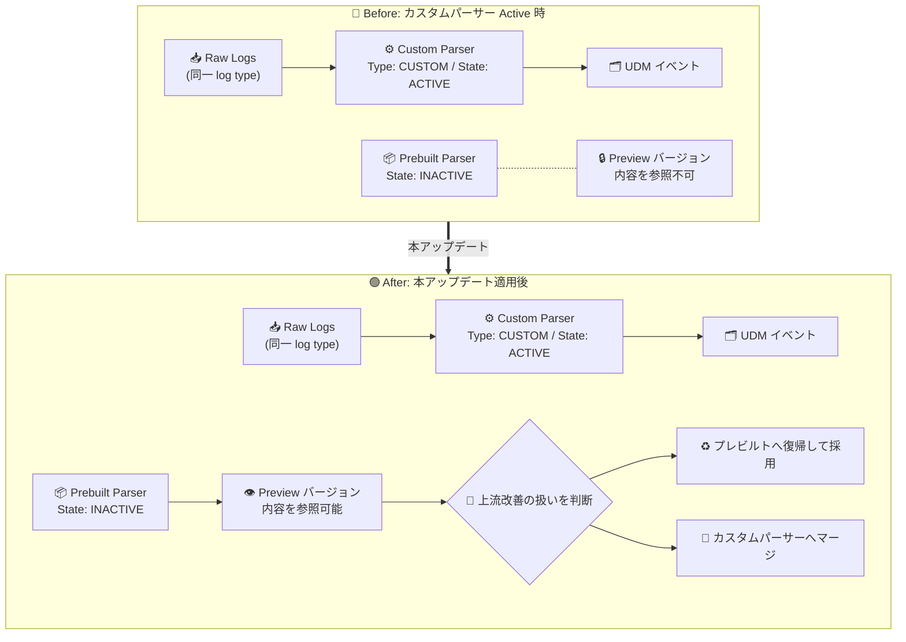

# Google SecOps / Google SecOps SIEM: プレビルトパーサーの Preview バージョン内容の参照 (View prebuilt parser version content)

**リリース日**: 2026-07-29

**サービス**: Google SecOps / Google SecOps SIEM

**機能**: View prebuilt parser version content (プレビルトパーサー Preview バージョンの内容参照)

**ステータス**: Feature (リリースノート上のラベルは Feature)

📊 [このアップデートのインフォグラフィックを見る](https://takech9203.github.io/google-cloud-news-summary/20260729-google-secops-view-prebuilt-parser-version-content.html)

> **本レポートは 2 件のリリースノートエントリを統合したものです。**
> 2026-07-29 の Google Cloud リリースノートでは、同一内容のエントリが「Google SecOps」と「Google SecOps SIEM」の 2 つのプロダクト名で公開されている。本文は完全に同一であり、Google SecOps プラットフォームの SIEM 側 (ログ取り込み・正規化) の機能追加として扱う。

## 概要

Google SecOps に、**同一ログタイプでカスタムパーサー (Custom parser) を使用している状態でも、プレビルトパーサー (Prebuilt parser) の Preview バージョンの内容を参照できる** 機能が追加された。リリースノートには「プレビルトパーサーのバージョンが inactive (非アクティブ) であっても、そのパーサーの新しい Preview バージョンの内容を確認できる」と明記されている。

Google SecOps における「パーサー」とは、各種ログソースから取り込んだ生ログ (Raw log) を **UDM (Unified Data Model)** 形式に変換する一連の指示 (data mapping instructions) である。UDM への正規化は、元のログ形式にかかわらず Google SecOps 全体でセキュリティイベントを検索・相関分析・検知ルール適用できるようにするために不可欠な処理であり、パーサーがなければ生ログは構造化されず、検知ルールからも利用できない。

Google はプレビルトパーサーを自ら提供・保守しており、通常 **毎月第 4 週** に更新をリリースする。組織が独自のマッピングを必要とする場合、プレビルトパーサーの更新をスキップしてカスタムパーサーを作成する運用が選択できるが、この場合カスタムパーサーが `Custom` / `Active` となり、それまでのプレビルトパーサーは `Prebuilt` / `Inactive` として一覧に残る。今回のアップデートは、この「カスタムパーサーが Active でプレビルトパーサーが Inactive」という状態にある運用者に対して、Google 側の最新 Preview バージョンの中身を可視化するものである。

対象ユーザーは、Google SecOps SIEM でログ取り込みとパーサー管理を担当するセキュリティエンジニア、SOC のデータエンジニア、および MSSP のプラットフォーム運用担当者である。

**アップデート前の課題**

公式ドキュメント (Manage prebuilt parsers) には、パーサーバージョン管理に関する制約として次の注記がある。

> You can preview Google prebuilt parsers to test new versions. However, you cannot use the preview tool to test an updated prebuilt parser while you have an active custom parser running. You must deactivate your custom parser and revert to using a prebuilt one.

またカスタムパーサー作成 (Skip prebuilt parser updates) の項には次の注記がある。

> All future prebuilt parser updates remain visible, but they're not applied unless you disable the custom parser and revert to the prebuilt version.

これらから、アップデート前の状況は以下のとおりであった。

- 同一ログタイプでカスタムパーサーが Active な状態では、プレビルト側の新しい Preview バージョンをプレビューツールでテストできなかった
- Preview バージョンを確認するには、カスタムパーサーを無効化 (deactivate) してプレビルトパーサーに戻す必要があり、本番の正規化処理に影響を与える操作を伴った
- 結果として、Google 側のパーサー改善 (上流の改善) を採用すべきか、それとも自組織のカスタムパーサーへ取り込む (マージする) べきかを、内容を見ずに判断しなければならなかった
- カスタムパーサーを維持している間、プレビルトパーサーは `Inactive` 状態であり、更新が一覧上には見えても中身の差分を評価する手段が限られていた

**アップデート後の改善**

- カスタムパーサーを Active のまま維持しながら、同一ログタイプのプレビルトパーサーの Preview バージョンの内容を参照できるようになった
- プレビルトパーサーが `Inactive` 状態であっても Preview バージョンの内容が参照可能になり、内容確認のためにカスタムパーサーを無効化する必要がなくなった
- 上流のプレビルトパーサー改善を「そのまま採用する」か「カスタムパーサーへマージする」かの判断を、実際のパーサーコード内容に基づいて行えるようになった

## アーキテクチャ図



カスタムパーサーが Active なまま生ログの UDM 正規化を継続しつつ、Inactive なプレビルトパーサーの Preview バージョンの内容だけを参照できるようになる点を示している。これにより、上流改善の採用可否をパーサーを切り替えずに評価できる。

## サービスアップデートの詳細

### 主要機能

1. **カスタムパーサー使用中でも Preview バージョン内容を参照可能**
   - 同一ログタイプでカスタムパーサーを使用している状態でも、プレビルトパーサーの Preview バージョンの内容が参照できる
   - リリースノート原文: "You can now view the prebuilt parser preview version content even if you are using a custom parser for the same log type."

2. **Inactive 状態のプレビルトパーサーに対する内容参照**
   - プレビルトパーサーのバージョンが inactive であっても、その新しい Preview バージョンの内容を確認できる
   - リリースノート原文: "Although the prebuilt parser version is inactive, you can still see the content of the new preview version for this parser."
   - カスタムパーサーを作成してプレビルト更新をスキップした場合、パーサー一覧ではカスタムパーサーが `Custom` / `Active`、以前のプレビルトバージョンが `Prebuilt` / `Inactive` と表示される

3. **上流パーサー改善の採用判断への活用**
   - Google はプレビルトパーサーを保守し、通常毎月第 4 週に更新をリリースする
   - 参照した Preview バージョンの内容をもとに、プレビルトパーサーへ復帰して上流改善を採用するか、必要な変更点を自組織のカスタムパーサーへ取り込むかを判断できる

## 技術仕様

### パーサーの種類 (Parser types)

| パーサー種別 | 説明 |
|------|------|
| Prebuilt | Google SecOps が作成したパーサー。生ログを UDM フィールドへ変換する組み込みマッピングを含む |
| Prebuilt extended | 顧客が作成した、プレビルトパーサーに追加のマッピング指示を付与したもの。生ログから追加データを抽出して UDM レコードへ挿入する |
| Custom | プレビルトではなく、独自のデータマッピング指示で生ログを UDM フィールドへ変換するパーサー |
| Custom extended | パーサー拡張 (parser extension) を用いて追加フィールドを抽出するカスタムパーサー |

### パーサーの状態・ステージ (Chronicle API `logTypes.parsers` リソース)

Chronicle API のパーサーリソースでは、パーサーの種別・状態・リリース段階が個別の enum として定義されている。

| enum | 値 | 説明 |
|------|------|------|
| `Type` | `PREBUILT` | Google Cloud が Chronicle 内で作成・管理するパーサー |
| `Type` | `CUSTOM` | 顧客またはパートナー固有のパーサー |
| `State` | `ACTIVE` | パーサーがアクティブ (正規化処理に使用されている) |
| `State` | `INACTIVE` | パーサーが非アクティブ |
| `ReleaseStage` | `RELEASE` | リリース済みで本番利用可能なパーサー |
| `ReleaseStage` | `RELEASE_CANDIDATE` | プレビルトパーサーのリリース候補 |
| `ReleaseStage` | `ROLLBACK_CANDIDATE` | プレビルトパーサーのロールバック候補 |
| `ReleaseStage` | `ARCHIVED` | アーカイブ済みのパーサー |
| `ReleaseStage` | `ARCHIVED_IN_USE` | アーカイブ済みだが使用中 (後からアーカイブされたパーサーを pin している場合) |
| `ReleaseStage` | `FAULTY` | 不具合ありとマークされ、自動削除対象となったパーサー |

ドキュメントによると、プレビルトパーサーは内部検証後にまず Release Candidate として登場し、リリースサイクルごとに Release Candidate → Release、既存の Release → Rollback、既存の Rollback → Archived と遷移する。カスタムパーサーの場合、検証を通過したパーサーを顧客が submit すると Release 状態から始まり、既存のものが Rollback、さらに既存の Rollback が Archived へ移動する。

カスタムパーサーの検証段階は `ValidationStage` enum (`NEW` → `VALIDATING` → `PASSED` / `FAILED`、および `DELETE_CANDIDATE`、`INTERNAL_ERROR`、`VALIDATION_SKIPPED`) で管理される。

なお、コンソール UI では「preview parser」「Opt-in to a Release Candidate」という表現が使われており、リリースノートの「preview version」は UI 上の Preview 系バージョンを指す。API 側の enum 名との対応関係はドキュメント上で明示されていないため、本レポートでは両方を出典どおりに記載する。

### パーサー関連の API メソッド

`projects.locations.instances.logTypes.parsers` リソースで提供される主なメソッド。

| メソッド | 説明 |
|------|------|
| `activate` | 指定したパーサーへ切り替え、State を `ACTIVE` に設定する |
| `activateReleaseCandidateParser` | Release Candidate パーサーをその顧客向けに稼働させる |
| `deactivate` | 指定パーサーを非アクティブ化し、プレビルトの release パーサーをアクティブ化する |
| `copy` | プレビルトパーサーのコピーを作成する (`CopyPrebuiltParser`) |
| `fetchParserCandidates` | 指定ログタイプのパーサー候補を取得する |
| `create` / `patch` / `get` / `list` / `delete` | パーサーの作成・更新・取得・一覧・削除 |

### `ParserVersionInfo` の主なフィールド

```json
{
  "version": "string",
  "autoUpgradeDisabled": false,
  "rollbackAvailable": true,
  "latestParser": "projects/{project}/locations/{region}/instances/{instance}/logTypes/{logType}/parsers/{parser}/{id}",
  "latestParserVersion": "string"
}
```

- `autoUpgradeDisabled`: `true` の場合、自動アップグレード処理でパーサーが更新されない
- `rollbackAvailable`: 当該バージョンでロールバックが可能かどうか
- `latestParserVersion`: そのパーサーで利用可能な最新の安定版バージョン

## 設定方法

### 前提条件

1. 対象ログタイプのログが Google SecOps に取り込まれていること (Parsers ページには、すでにデータを取り込んだログタイプのプレビルトパーサーのみが表示される)
2. パーサー管理を行う権限があること (既定では Administrator および Editor ロールのユーザーがパーサー更新を管理できる。参照・管理を分離するための権限付与も可能)
3. Preview パーサーへのオプトインを行う場合は、自動更新が有効かつパーサーが最新バージョンであること (自動更新を無効化すると Preview オプションは利用できなくなり、そのログタイプで最後に使用した安定版に戻る)

### 手順

#### ステップ 1: Parsers ページを開く

Google SecOps コンソールで **Settings > SIEM Settings > Parsers** を選択する。フィルタから `Prebuilt`、`Active`、`Prebuilt Extended` などを指定して一覧を絞り込める。カスタムパーサーを作成してプレビルト更新をスキップしている場合、カスタムパーサーは `Custom` / `Active`、以前のプレビルトバージョンは `Prebuilt` / `Inactive` として表示される。

#### ステップ 2: プレビルトパーサーの内容・差分を確認する

対象パーサーのメニューから **View** を選択すると View prebuilt parser ページが表示される。保留中の更新がある場合は **View pending update** を選択すると Compare parsers ページが表示され、以下を確認できる。

- 現行バージョンと次バージョンのコード差分
- Change logs タブの変更ログ
- サンプル生ログに対して生成される UDM イベント (Edit でサンプルログを差し替え、Refresh で再生成可能)
- パーサーの作成日時、パーサーコードの最終更新日時

本アップデートにより、同一ログタイプでカスタムパーサーを使用している場合でも、プレビルトパーサーの Preview バージョンの内容を参照できる。

#### ステップ 3: 上流改善の採用方針を決める

参照した内容をもとに、次のいずれかを選択する。

- **プレビルトへ復帰して採用**: カスタムパーサーを無効化してプレビルトバージョンへ戻す (API では `deactivate` により指定パーサーを非アクティブ化し、プレビルトの release パーサーがアクティブ化される)
- **カスタムパーサーへマージ**: 差分の必要部分を自組織のカスタムパーサーへ取り込む
- **現状維持**: カスタムパーサーを継続利用する。この場合、以降のプレビルトパーサー更新は一覧上に見えるが適用されない

#### ステップ 4 (任意): 検知ルールへの影響を確認する

Parsers ページで対象ログタイプを選択し、`Update to latest version` / `Rollback to last used version` / `Opt-in to a Release Candidate` のいずれかを選択したうえで、**Impact** タブの **Check impact on rules** を実行すると、新バージョンが検知ルールに与える影響を評価できる。影響が想定されるルールは `Failing` (現行では検知が発生したが新バージョンでは発生しない) または `Potentially failing` (ルールロジックで使用している UDM フィールドが変更されている) に分類される。

なお、この影響分析機能は Pre-GA Offerings Terms の対象であり、すべての顧客・すべてのリージョンで利用できるわけではない。

## メリット

### ビジネス面

- **本番影響なしでの評価**: カスタムパーサーを無効化せずに上流改善の内容を確認できるため、内容確認のためだけに本番の正規化処理を切り替えるリスクを回避できる
- **変更管理プロセスとの親和性**: 上流改善の採用可否を、実際のパーサーコードと変更ログに基づいて社内レビューにかけられる
- **カスタムパーサー維持コストの可視化**: Google 側の改善内容を継続的に把握できるため、カスタムパーサーを維持し続けるべきかどうかを定期的に見直しやすくなる

### 技術面

- **差分ベースのマージ判断**: プレビルトの Preview バージョンの内容を参照できるため、必要なマッピング変更のみをカスタムパーサーへ選択的に取り込める
- **UDM 正規化品質の維持**: 上流のパーサー改善 (新規フィールドのマッピング追加やログ形式変更への追随) を取り込みやすくなり、検索・相関分析・検知ルールが依拠する UDM フィールドの網羅性を維持しやすい
- **operational な切り替え回数の削減**: パーサー切り替えには反映待ち時間が伴う (パーサーのアクティブ化は約 20 分、パーサー更新の反映には約 30 分を要し、その間はイベントパースに一時的な不整合が生じ得る) ため、内容確認目的の切り替えを避けられることは実運用上の利点となる

## デメリット・制約事項

### 制限事項

- 本アップデートで可能になるのは Preview バージョンの **内容の参照** であり、リリースノートには、カスタムパーサーが Active な状態で Preview バージョンを本番適用できるとは記載されていない
- プレビルトパーサーの更新は、カスタムパーサーを無効化してプレビルトバージョンへ戻さない限り適用されない
- Preview パーサーへのオプトインには、自動更新が有効かつパーサーが最新バージョンである必要がある。自動更新を無効化すると Preview オプションは失われ、そのログタイプで最後に使用した安定版に戻る
- 1 つのログソースに対して作成できるカスタムパーサーは 1 つのみ (既存のカスタムパーサーがある場合、"A custom parser already exists for this log source" と表示される)
- パーサーバージョンの手動更新では、途中のバージョンではなく最新バージョンへのアップグレードのみが可能
- 連続したロールバックは 1 回のみ実行でき、ロールバック実行後は Roll back オプションが利用できなくなる
- プレビルトパーサーの安定版で最新バージョンのみがバグ修正・機能改善の対象となる。自動更新を無効化して旧バージョンに留まる場合、そのバージョンにはパッチや更新が提供されない
- Parsers ページには、すでにデータを取り込んだログタイプのプレビルトパーサーのみが表示される
- UDM フィールドマッピングでは UTF-8 文字のみがサポートされ、他のエンコーディングを使用するとパース失敗によりログが検索できなくなる可能性がある
- パーサーの変更は新規に取り込まれるログに適用され、過去に取り込まれたログには遡及適用されない

### 考慮すべき点

- 上流の Preview バージョンを採用する場合、検知ルールが参照している UDM フィールドのマッピングが変わる可能性があるため、影響分析 (Check impact on rules) や UDM 出力比較による事前検証が重要
- 影響分析機能は Pre-GA であり、すべての顧客・リージョンで利用できるわけではないため、利用可否を事前に確認する必要がある
- カスタムパーサーではなく **パーサー拡張 (parser extension)** で足りるケースもある。パーサー拡張はプレビルトパーサーを置き換えず、追加フィールドを UDM レコードへ抽出する仕組みであり、上流改善を自動的に受け取りながら独自フィールドを追加できる
- プレビルトパーサーの更新は通常毎月第 4 週にリリースされるため、Preview バージョンの内容確認をこの月次サイクルに合わせた定期タスクとして組み込むとよい

## ユースケース

### ユースケース 1: カスタムパーサー維持中の上流改善レビュー

**シナリオ**: 特定のログタイプについて、独自フィールドのマッピングが必要だったためプレビルト更新をスキップしてカスタムパーサーを作成し、`Custom` / `Active` で運用している。数か月後、Google 側が同ログタイプのプレビルトパーサーを改善し、新しい Preview バージョンが提供された。

**実装例**:
```
Google SecOps コンソール
  Settings > SIEM Settings > Parsers
    → 対象 log type を選択
    → プレビルトパーサー (Prebuilt / Inactive) のメニュー > View
    → Preview バージョンの内容を参照
    → Change logs タブで変更内容を確認
```

**効果**: カスタムパーサーを無効化せずに上流改善の内容を確認でき、必要なマッピング変更のみをカスタムパーサーへ取り込む判断ができる。

### ユースケース 2: カスタムパーサーからプレビルトパーサーへの回帰検討

**シナリオ**: 過去にプレビルトパーサーが自組織の要件を満たしていなかったためカスタムパーサーを作成したが、上流の改善によって当初の不足が解消された可能性がある。カスタムパーサーの保守負荷を下げるため、プレビルトパーサーへ戻せるかを検討したい。

**効果**: Preview バージョンの内容を事前に確認することで、プレビルトパーサーが要件を満たすかを判断できる。満たす場合はカスタムパーサーを無効化してプレビルトへ復帰し (API では `deactivate`)、以降は Google の月次更新で改善を自動的に受け取れるようになるため、パーサー保守の運用負荷を削減できる。

### ユースケース 3: MSSP / マルチテナント環境での更新方針の標準化

**シナリオ**: MSSP が複数テナントに対して、ログタイプごとにカスタムパーサーとプレビルトパーサーを併用して運用している。

**効果**: 各テナントでカスタムパーサーを Active に保ったまま上流 Preview バージョンの内容を確認できるため、テナント横断で「採用する / マージする / 現状維持」の方針を統一的に評価し、パーサー更新の標準手順として整備しやすくなる。

## 料金

本アップデートに関する個別の課金についてはリリースノートおよびパーサー管理ドキュメントに記載がない。Google SecOps は SIEM / SOAR を含むプラットフォームとして提供されており、料金体系については製品ページを参照する必要がある。

- [Google Security Operations 製品ページ](https://cloud.google.com/security/products/security-operations)

## 利用可能リージョン

本機能自体のリージョン制約はリリースノートおよびドキュメントに記載がない。ただし、関連する検知ルール影響分析 (Analyze the impact of the upcoming parser version) については、ドキュメント上「すべての顧客・すべてのリージョンで利用できるわけではない」と明記されている。

## 関連サービス・機能

- **Google SecOps SIEM (パーサー / UDM 正規化)**: パーサーは生ログを UDM 形式へ変換する中核コンポーネントであり、UDM 正規化によって元のログ形式にかかわらずイベントの検索・相関分析が可能になる
- **プレビルトパーサー更新管理 (Manage prebuilt parser updates)**: 毎月第 4 週の更新サイクル、Pending update の確認、更新の早期アクティブ化、更新スキップとカスタムパーサー作成といった一連の運用を提供
- **パーサーバージョン管理 (Manage prebuilt parser versions)**: 自動更新のオプトイン / オプトアウト、バージョン間比較、手動更新、ロールバックを提供 (本レポートの前提となる機能。関連レポート: 2026-03-04 GA 昇格、2026-03-12 Public Preview 全顧客提供)
- **パーサー拡張 (Parser extensions)**: プレビルトパーサーを置き換えずに追加フィールドを UDM レコードへ抽出する仕組み。ライフサイクル状態は `DRAFT` / `VALIDATING` / `LIVE` / `FAILED`
- **自動抽出 (Auto-extraction)**: JSON / XML 形式ログ (JSON メッセージを含む Syslog も対象) からキーバリューペアを自動抽出し、UDM の `extracted` map 型フィールドへ格納する機能。パーサーが存在しない場合や失敗した場合でもデータを利用可能にする
- **検知ルール (YARA-L)**: パーサーが生成する UDM フィールドに依存するため、パーサーバージョン変更時は影響分析の対象となる
- **Chronicle API (`logTypes.parsers`)**: パーサーの一覧・取得・作成・更新・アクティブ化 / 非アクティブ化、Release Candidate のアクティブ化、パーサー候補取得を API 経由で実行できる

## 参考リンク

- 📊 [インフォグラフィック](https://takech9203.github.io/google-cloud-news-summary/20260729-google-secops-view-prebuilt-parser-version-content.html)
- [Google SecOps リリースノート](https://cloud.google.com/chronicle/docs/release-notes)
- [Manage prebuilt parsers (パーサー管理)](https://cloud.google.com/chronicle/docs/event-processing/manage-parser-updates)
- [Configure custom parsers (カスタムパーサーの構成)](https://cloud.google.com/chronicle/docs/event-processing/configure-custom-parsers)
- [Overview of log parsing (ログパースの概要)](https://cloud.google.com/chronicle/docs/event-processing/parsing-overview)
- [Using parser extensions (パーサー拡張)](https://cloud.google.com/chronicle/docs/event-processing/using-parser-extensions)
- [Auto-extraction overview (自動抽出の概要)](https://cloud.google.com/chronicle/docs/event-processing/auto-extraction)
- [Chronicle API: logTypes.parsers リファレンス](https://cloud.google.com/chronicle/docs/reference/rest/v1/projects.locations.instances.logTypes.parsers)
- [Role-based access control ユーザーガイド](https://cloud.google.com/chronicle/docs/administration/rbac)
- [Google Security Operations 製品ページ (料金情報)](https://cloud.google.com/security/products/security-operations)

## まとめ

本アップデートは、カスタムパーサーを Active に保ったままプレビルトパーサーの Preview バージョンの内容を参照できるようにする、パーサー運用の可視性改善である。従来はカスタムパーサーを無効化してプレビルトへ戻さなければ Preview の内容をテストできず、上流改善を採用すべきかカスタムパーサーへマージすべきかを内容を見ずに判断する必要があった。

カスタムパーサーを長期運用している組織は、Google のプレビルトパーサー更新サイクル (通常毎月第 4 週) に合わせて Preview バージョンの内容を定期的にレビューし、カスタムパーサーの保守を継続するか、プレビルトパーサーもしくはパーサー拡張への移行を検討するプロセスを整備することが推奨される。採用時には、検知ルールが参照する UDM フィールドへの影響を Compare parsers の UDM 出力比較や影響分析機能で事前に検証すること。

---

**タグ**: #GoogleSecOps #GoogleSecOpsSIEM #Chronicle #Parser #PrebuiltParser #CustomParser #UDM #LogParsing #SecurityOperations #SIEM
