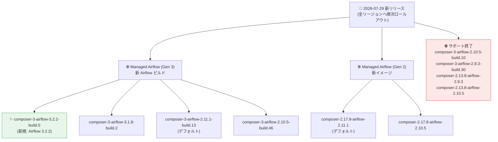

# Managed Service for Apache Airflow: Airflow 3.2.2 提供開始と新リリース (2026-07-29)

**リリース日**: 2026-07-29

**サービス**: Managed Service for Apache Airflow (旧 Cloud Composer)

**機能**: Airflow 3.2.2 の提供開始、triggerer デフォルトリソース変更、各種修正、新ビルド/イメージ追加、旧バージョンのサポート終了

**ステータス**: Announcement / Feature / Change / Fixed / Deprecated (全リージョンへ順次ロールアウト中)

📊 [このアップデートのインフォグラフィックを見る](https://takech9203.github.io/google-cloud-news-summary/20260729-managed-airflow-release-airflow-3-2-2.html)

## 概要

2026 年 7 月 29 日、Managed Service for Apache Airflow (旧 Cloud Composer) の新しいリリースが開始されました。このリリースは全リージョンへ順次ロールアウト中であり、記載された変更や機能が一部のリージョンではまだ利用できない場合があります。

最大のトピックは、**Airflow 3.2.2 が Managed Airflow (Gen 3) で利用可能になった**ことです。新ビルド `composer-3-airflow-3.2.2-build.0` として提供され、Airflow 3.1 系 (3.1.8) や Airflow 2 系 (2.11.1 / 2.10.5) の新ビルドも同時にリリースされました。あわせて、Gen 3 + Airflow 2 環境のデフォルト triggerer リソースの変更 (1 vCPU / 2 GB メモリ)、環境作成失敗時のエラーメッセージ改善、コンソールでのタスク優先度ウェイト表示の修正、および 4 つの旧バージョン/ビルドのサポート終了が発表されています。

Managed Airflow を利用してデータパイプラインをオーケストレーションしているデータエンジニアや、環境のバージョン管理を担当するプラットフォーム管理者が対象のアップデートです。特にサポート終了となるバージョンを利用中の環境は、アップグレード計画の策定が必要です。

**アップデート前の課題**

- Airflow 3.2 系は Managed Airflow (Gen 3) で利用できなかった
- Airflow 3.2.2 では、`[email]email_backend` で構成するプラガブルメールバックエンド経由の失敗/リトライアラート送信に問題があった (今回バックポート修正)
- Gen 3 + Airflow 2 環境のデフォルト triggerer リソースが Airflow 3 環境のデフォルトと異なっていた
- ネットワーク/サブネットワーク識別子の形式不正で環境作成が失敗した際、正しいエラーメッセージが表示されず原因特定が困難だった
- Google Cloud コンソールでタスクのデフォルト優先度ウェイトが正しく表示されなかった

**アップデート後の改善**

- Airflow 3.2.2 が Managed Airflow (Gen 3) で選択可能になり、最新の Airflow 3 系機能を利用できるようになった
- Airflow コミュニティの修正 [#69877](https://github.com/apache/airflow/pull/69877) のバックポートにより、プラガブルメールバックエンド (`[email]email_backend`) 経由の失敗/リトライアラート送信が復旧した
- Gen 3 + Airflow 2 のデフォルト triggerer リソースが 1 vCPU / 2 GB メモリとなり、Airflow 3 のデフォルトと統一された
- 環境作成失敗時に、ネットワーク/サブネットワーク識別子の形式不正が原因であることを示す正しいエラーメッセージが生成されるようになった
- コンソールでタスクのデフォルト優先度ウェイト `1` が正しく表示されるようになった (環境のアップグレード不要で適用)

## アーキテクチャ図



2026-07-29 リリースで追加された Gen 3 の Airflow ビルドと Gen 2 のイメージ、およびサポート終了となったバージョンの全体像です。Airflow 3.2.2 は Gen 3 の新ビルドとして初めて提供されます。

## サービスアップデートの詳細

### 主要機能

1. **Airflow 3.2.2 の提供開始 (Feature)**
   - Airflow 3.2.2 が Managed Airflow (Gen 3) で利用可能になった
   - 新ビルド `composer-3-airflow-3.2.2-build.0` として提供される

2. **(Airflow 3.2.2) Multi-Team 機能は利用不可 (Change)**
   - Airflow 3.2 で導入された Multi-Team Airflow 機能は Managed Airflow では利用できない
   - Airflow 構成オプション `[core]multi_team` は `False` に設定されており、オーバーライドは不可

3. **(Airflow 3.2.2) メールバックエンド経由のアラート送信を復旧 (Fixed)**
   - Airflow コミュニティの修正 [#69877](https://github.com/apache/airflow/pull/69877) をバックポート
   - `[email]email_backend` Airflow 構成オプションで設定するプラガブルメールバックエンド経由での失敗 (failure) / リトライ (retry) アラート送信機能が復旧した

4. **(Gen 3 + Airflow 2) デフォルト triggerer リソースの変更 (Change)**
   - デフォルトの triggerer リソースが 1 vCPU / 2 GB メモリに変更され、Airflow 3 のデフォルトと統一された
   - この変更は Google Cloud CLI、Terraform、Cloud Composer API で利用可能
   - Google Cloud コンソールへは順次ロールアウト中

5. **環境作成失敗時のエラーメッセージ改善 (Fixed)**
   - ネットワークおよびサブネットワーク識別子の形式不正が原因で環境作成リクエストが失敗した場合に、正しいエラーメッセージが生成されるようになった

6. **コンソールのタスク優先度ウェイト表示修正 (Fixed)**
   - Google Cloud コンソールで、タスクの正しいデフォルト優先度ウェイト `1` が表示されるようになった
   - この修正は環境のアップグレードなしで適用される

7. **新しい Airflow ビルド / イメージの追加 (Change)**
   - Gen 3 と Gen 2 に新しいビルド/イメージが追加された (詳細は「技術仕様」を参照)

8. **旧バージョン/ビルドのサポート終了 (Deprecated)**
   - 4 つのバージョン/ビルドがサポート終了期間に到達した (詳細は「技術仕様」を参照)

## 技術仕様

### 新しい Airflow ビルド (Managed Airflow Gen 3)

| ビルド | Airflow バージョン | 備考 |
|------|------|------|
| `composer-3-airflow-3.2.2-build.0` | 3.2.2 | 新規提供 |
| `composer-3-airflow-3.1.8-build.2` | 3.1.8 | |
| `composer-3-airflow-2.11.1-build.13` | 2.11.1 | デフォルト |
| `composer-3-airflow-2.10.5-build.46` | 2.10.5 | |

### 新しいイメージ (Managed Airflow Gen 2)

| イメージ | Airflow バージョン | 備考 |
|------|------|------|
| `composer-2.17.8-airflow-2.11.1` | 2.11.1 | デフォルト |
| `composer-2.17.8-airflow-2.10.5` | 2.10.5 | |

### サポート終了となったバージョン/ビルド

| バージョン/ビルド | 世代 |
|------|------|
| `composer-3-airflow-2.10.5-build.10` | Gen 3 |
| `composer-3-airflow-2.9.3-build.30` | Gen 3 |
| `composer-2.13.8-airflow-2.9.3` | Gen 2 |
| `composer-2.13.8-airflow-2.10.5` | Gen 2 |

### Airflow 3.2.2 に関する構成上の制約

| 項目 | 詳細 |
|------|------|
| `[core]multi_team` | `False` 固定。オーバーライド不可 (Multi-Team Airflow 機能は利用不可) |
| `[email]email_backend` | プラガブルメールバックエンドによる失敗/リトライアラート送信が復旧 (#69877 のバックポート) |

### triggerer デフォルトリソースの変更 (Gen 3 + Airflow 2)

| 項目 | 詳細 |
|------|------|
| 変更後のデフォルト | 1 vCPU / 2 GB メモリ |
| 変更理由 | Airflow 3 環境のデフォルトに合わせるため |
| 利用可能な操作方法 | Google Cloud CLI、Terraform、Cloud Composer API (コンソールは順次ロールアウト中) |

triggerer は deferrable operator を利用する際に、遅延されたタスクを非同期に監視する環境コンポーネントです。ワーカー スロットを占有せずに長時間ジョブを監視できるため、リソース効率の高いパイプライン実行に寄与します。

## 設定方法

### 前提条件

1. Managed Airflow (Gen 3) 環境を利用していること (Airflow 3.2.2 を使う場合)
2. 新リリースが利用中のリージョンにロールアウト済みであること (順次ロールアウト中のため、リージョンによっては未提供の場合がある)

### 手順

#### ステップ 1: 利用可能なビルドの確認

```bash
gcloud composer environments list-upgrades ENVIRONMENT_NAME \
    --location LOCATION
```

環境がアップグレード可能なバージョン/ビルドの一覧を確認します。

#### ステップ 2: Airflow 3.2.2 ビルドへのアップグレード

```bash
gcloud composer environments update ENVIRONMENT_NAME \
    --location LOCATION \
    --airflow-version 3.2.2
```

既存の Gen 3 環境を Airflow 3.2.2 にアップグレードします。アップグレード前にスナップショットの取得と DAG の互換性確認を推奨します。

#### ステップ 3: triggerer リソースの確認・調整 (Gen 3 + Airflow 2)

```bash
gcloud composer environments update ENVIRONMENT_NAME \
    --location LOCATION \
    --triggerer-count 1 \
    --triggerer-cpu 1 \
    --triggerer-memory 2
```

デフォルト値の変更 (1 vCPU / 2 GB) を踏まえ、deferrable operator の利用状況に応じて triggerer のリソースを明示的に設定できます。

## メリット

### ビジネス面

- **最新 OSS への追随**: Airflow 3.2.2 をマネージド環境でいち早く利用でき、OSS コミュニティの新機能・修正を迅速に取り込める
- **運用トラブルの削減**: エラーメッセージの改善やコンソール表示の修正により、トラブルシューティングにかかる時間を短縮できる

### 技術面

- **アラート機能の復旧**: プラガブルメールバックエンド経由の失敗/リトライアラートが Airflow 3.2.2 で正しく動作し、障害検知フローを維持できる
- **デフォルト設定の統一**: Gen 3 における Airflow 2 と Airflow 3 の triggerer デフォルトリソースが統一され、バージョン間で一貫した環境設計ができる
- **アップグレードパスの明確化**: Gen 3 の新ビルド、Gen 2 の新イメージが同時に提供され、各世代で最新ビルドへのアップグレードが可能

## デメリット・制約事項

### 制限事項

- Airflow 3.2.2 の Multi-Team Airflow 機能は利用できない (`[core]multi_team` は `False` 固定でオーバーライド不可)
- リリースは順次ロールアウト中のため、リージョンによっては記載の変更・機能がまだ利用できない
- triggerer デフォルトリソース変更のコンソール対応は順次ロールアウト中 (CLI / Terraform / API では利用可能)

### 考慮すべき点

- `composer-3-airflow-2.10.5-build.10`、`composer-3-airflow-2.9.3-build.30`、`composer-2.13.8-airflow-2.9.3`、`composer-2.13.8-airflow-2.10.5` はサポート終了に到達しており、該当環境は新しいビルド/イメージへのアップグレードを計画すべき
- Gen 3 + Airflow 2 環境で triggerer リソースをデフォルト値のまま利用している場合、新デフォルト (1 vCPU / 2 GB) が適用される点を確認する

## ユースケース

### ユースケース 1: Airflow 3.2.2 への計画的アップグレード

**シナリオ**: Gen 3 で Airflow 3.1 系を運用中のチームが、最新の Airflow 3.2 系の機能・修正を取り込みたい。

**実装例**:
```bash
# 現在の環境のスナップショットを保存してからアップグレード
gcloud composer environments snapshots save ENVIRONMENT_NAME \
    --location LOCATION

gcloud composer environments update ENVIRONMENT_NAME \
    --location LOCATION \
    --airflow-version 3.2.2
```

**効果**: スナップショットによるロールバック手段を確保しつつ、`composer-3-airflow-3.2.2-build.0` へ安全に移行できる。

### ユースケース 2: サポート終了バージョンからの移行

**シナリオ**: `composer-2.13.8-airflow-2.9.3` など、今回サポート終了に到達したバージョンを利用中の環境がある。

**効果**: 新しいイメージ (`composer-2.17.8-airflow-2.11.1` など) へアップグレードすることで、サポート対象の構成を維持し、セキュリティ修正やバグ修正を受け続けられる。

## 料金

今回のリリースによる料金体系の変更は Release Notes に記載されていません。Managed Service for Apache Airflow の料金は、環境のコンピュート リソース (vCPU、メモリ、ストレージ) の使用量に基づいて課金されます。Gen 3 + Airflow 2 環境ではデフォルトの triggerer リソースが 1 vCPU / 2 GB メモリに変更されるため、デフォルト設定で新規作成する環境の triggerer 分のリソース使用量が従来と変わる可能性があります。

詳細は [Cloud Composer の料金ページ](https://cloud.google.com/composer/pricing) を参照してください。

## 利用可能リージョン

本リリースは 2026 年 7 月 29 日から全リージョンへ順次ロールアウト中です。記載された変更・機能は一部のリージョンではまだ利用できない場合があります。

## 関連サービス・機能

- **Cloud Composer API / Google Cloud CLI / Terraform**: 環境の作成・更新・アップグレードに使用。triggerer デフォルトリソース変更はこれらのインターフェースで先行して利用可能
- **Deferrable Operators (triggerer)**: triggerer は deferrable operator による長時間ジョブの非同期監視を担うコンポーネントで、今回デフォルトリソースが変更された
- **Cloud Monitoring / Cloud Logging**: triggerer を含む環境コンポーネントのメトリクスとログの監視に使用
- **Secret Manager / メールバックエンド (SendGrid など)**: `[email]email_backend` で構成するアラート通知の連携先として利用

## 参考リンク

- 📊 [インフォグラフィック](https://takech9203.github.io/google-cloud-news-summary/20260729-managed-airflow-release-airflow-3-2-2.html)
- [公式リリースノート](https://docs.cloud.google.com/release-notes#July_29_2026)
- [Managed Airflow リリースノート (サービス別)](https://docs.cloud.google.com/composer/docs/release-notes)
- [Managed Airflow のバージョン一覧](https://docs.cloud.google.com/composer/docs/composer-versions)
- [バージョンの非推奨化とサポート](https://docs.cloud.google.com/composer/docs/composer-versioning-overview#version-deprecation-and-support)
- [Deferrable Operators の使用 (Gen 3)](https://docs.cloud.google.com/composer/docs/composer-3/use-deferrable-operators)
- [Airflow 修正 #69877](https://github.com/apache/airflow/pull/69877)
- [料金ページ](https://cloud.google.com/composer/pricing)

## まとめ

Managed Service for Apache Airflow の 2026-07-29 リリースでは、Airflow 3.2.2 が Gen 3 で利用可能になり、triggerer デフォルトリソースの統一やアラート送信・エラーメッセージ・コンソール表示の修正など運用品質の改善が含まれます。Airflow 3.2.2 の Multi-Team 機能が利用不可である点に留意しつつ、サポート終了となった 4 つのバージョン/ビルドを利用中の環境は、新しいビルド/イメージへのアップグレードを早めに計画することを推奨します。

---

**タグ**: Managed Service for Apache Airflow, Cloud Composer, Apache Airflow, Airflow 3.2.2, Gen 3, Gen 2, triggerer, Deferrable Operators, バージョンアップグレード, サポート終了
