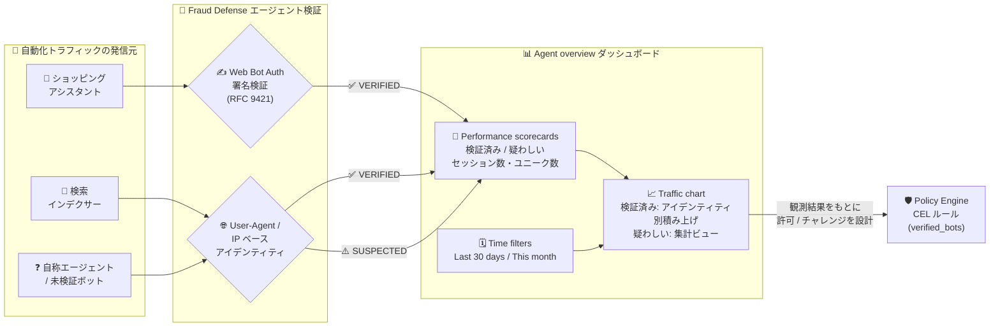

# reCAPTCHA (Google Cloud Fraud Defense): Agent overview ダッシュボードによるエージェントトラフィック監視

**リリース日**: 2026-07-29

**サービス**: reCAPTCHA / Google Cloud Fraud Defense

**機能**: Agent overview ダッシュボード (エージェントトラフィックのモニタリング)

**ステータス**: 一般提供 (公式リリースノートでは `Feature` として告知。Preview 表記なし)

📊 [このアップデートのインフォグラフィックを見る](https://takech9203.github.io/google-cloud-news-summary/20260729-recaptcha-agent-overview-dashboard.html)

## 概要

Google Cloud Fraud Defense (reCAPTCHA の進化形) のホームページに **Agent overview ダッシュボード** が追加された。このダッシュボードは、自サイトに到達する AI エージェントや自動化ツールのトラフィック (エージェンティックトラフィック) を可視化し、**検証済みエージェント (verified agents)** と **疑わしいエージェント (suspected agents)** を区別して表示する。

公式ドキュメントによると、このダッシュボードの狙いは「ショッピングアシスタントや検索インデクサーのような価値のある自動化トラフィックを妨げることなく、セキュリティポリシーを洗練させる」ことにある。従来のボット対策は「自動化トラフィックはすべてブロック対象」という前提に立っていたが、AI エージェントがユーザーの代理として商品を検索・比較・購入する時代においては、この前提自体が事業機会の損失につながる。Agent overview ダッシュボードは、ブロック/許可の判断を下す前に「そもそも誰が来ているのか」を測定するための可観測性レイヤーを提供する。

対象ユーザーは、Web サイトのセキュリティ担当者、不正対策チーム、および EC サイトやメディアサイトの運用担当者である。2026-07-24 に Preview となった Policy Engine の CEL ルール (`verified_bots` 変数) と組み合わせることで、「まず観測し、次にポリシー化する」という運用サイクルが成立する。

**アップデート前の課題**

- Fraud Defense の既存モニタリング機能はキー単位の **Bots タブ** (スコア推移 `Score overview` とチャレンジ結果 `Challenges`) が中心で、エージェントの「身元」に着目したビューが存在しなかった
- 「正当な AI エージェント」と「悪意ある自動化」がどちらもスコア分布上の低スコア側に混在し、集計値からは切り分けられなかった
- どの AI エージェントが実際に自サイトを訪問しているのか、その識別名 (エージェントアイデンティティ) の一覧を把握する手段がなかった
- 検証済みエージェントを許可するポリシーを設計しようとしても、許可対象の候補と流量を事前に見積もれなかった

**アップデート後の改善**

- Fraud Defense ホームページに Agent overview ダッシュボードが追加され、エージェンティックトラフィックの全体像を単一画面で確認できるようになった
- **検証済みエージェントセッション / 疑わしいエージェントセッション / ユニーク検証済みエージェント数** の 3 指標がスコアカードとして提示される
- 時系列チャートを「検証済みエージェント (個別アイデンティティ別の積み上げ棒グラフ)」と「疑わしいエージェント (集計ビュー)」で切り替えられ、上位エージェントを個別に識別できるようになった
- Web Bot Auth (WBA) による暗号学的な身元検証と、User-Agent / IP ベースの検証という 2 方式の分類結果が可視化される
- Fraud Defense 側の識別インフラ拡張に追随して、認識されるエージェントリストの拡大に伴いダッシュボードのデータ粒度が自動的に向上する

## アーキテクチャ図



エージェントからのリクエストは Web Bot Auth の署名検証、または User-Agent / IP ベースのアイデンティティ照合によって「検証済み」「疑わしい」に分類され、Agent overview ダッシュボードで集計・可視化される。観測結果は Policy Engine の CEL ルール設計へフィードバックできる。

## サービスアップデートの詳細

### 主要機能

1. **Performance scorecards (パフォーマンススコアカード)**
   - 検証済みエージェントセッションと疑わしいエージェントセッションの総量をハイレベルな指標として表示
   - 検出された「個別の検証済みエージェントの数」(ユニーク数) も併せて提示
   - 選択した期間におけるエージェンティック活動のサマリーとして機能する

2. **Traffic chart (トラフィックチャート)**
   - セッション量を表示する時系列チャート
   - チャートトグルで 2 つのビューを切り替え可能
     - **Verified agents**: 特定の確認済みエージェントアイデンティティごとに内訳を示す積み上げ棒グラフ。上位の個別エージェントを表示し、残りは `Other verified agents` カテゴリに集約される
     - **Suspected agents**: エージェンティックな挙動を示すが公式な検証がされていない自動化トラフィックの集計ビュー

3. **Time filters (期間フィルタ)**
   - `Last 30 days` (過去 30 日間) または `This month` (今月) のいずれかを選択してデータを表示

4. **エージェント検証方式の二階層構成**
   - **Web Bot Auth (WBA)**: 従来の IP ベース検証を補強または置き換える暗号学的標準。自動化エージェントがリクエストに暗号署名を付与することで、送信元 IP アドレスに依存せずに身元を証明できる
   - **User-Agent および IP ベースのエージェントアイデンティティ**: HTTP リクエスト内の User-Agent 文字列と送信元 IP アドレスという 2 つの主要情報を検査して自動化エージェント (ボット、クローラー、スクリプト) を識別・検証する、Web セキュリティおよび不正対策における従来手法

5. **識別インフラの継続的拡張**
   - Fraud Defense は識別インフラを継続的に拡張しており、認識されるエージェントのリストが拡大するにつれてダッシュボードが自動的により多くのデータを取得する
   - ダッシュボードに `No verified agent traffic detected yet` と表示される場合は、トラフィックが追跡対象の検証済みアイデンティティのリストに由来していないことを意味する

## 技術仕様

### エージェント指標の定義

| 指標 | 定義 |
|------|------|
| **Verified agent sessions** (検証済みエージェントセッション) | 公式に検証された AI エージェントによって開始されたセッションの総数。Fraud Defense がこれらのエージェントの身元と送信元を (たとえば暗号学的手法を用いて) 確認し、説明責任を担保していることを意味する。ユーザーやサービスの代理として動作する信頼できる自動化の量を把握するための指標 |
| **Suspected agent sessions** (疑わしいエージェントセッション) | 疑わしい AI エージェントによって開始されたセッションの総数。HTTP ヘッダーなどで自らエージェントであると **自己申告** している、またはエージェンティックな挙動を示すが、Fraud Defense によって身元を公式に検証できないセッション |
| **Unique verified agents** (ユニーク検証済みエージェント) | Fraud Defense によって検証された個別のエージェントアイデンティティの数。身元検証によりエージェントの説明責任が担保され、特定の正当なツールと一般的な自動化された悪用とを区別できる |
| **セッション** | 1 回の Fraud Defense 保護対象インタラクション (a single Fraud Defense-protected interaction) |

### 「検証済み」と「疑わしい」の本質的な違い

| 観点 | Verified agents | Suspected agents |
|------|-----------------|------------------|
| 身元の根拠 | 暗号署名 (WBA) または照合済みの User-Agent / IP | 自己申告ヘッダー、または挙動からの推定 |
| なりすまし耐性 | WBA の場合は署名検証により高い (IP から独立) | 低い (ヘッダーは容易に偽装可能) |
| 説明責任 (accountability) | 担保される | 担保されない |
| ダッシュボード表示 | アイデンティティ別に個別表示 (+ `Other verified agents`) | 集計値のみ |

### Web Bot Auth の仕組み (Google の公開実装仕様)

Google のクローラー/フェッチャードキュメントによると、Google の Web Bot Auth 実装は現時点で **実験的 (experimental)** な位置づけであり、以下の仕様に基づく。

| 項目 | 内容 |
|------|------|
| ベース仕様 | IETF ドラフト `draft-meunier-web-bot-auth-architecture` (HTTP Message Signatures for automated traffic) |
| 署名標準 | RFC 9421 (HTTP Message Signatures) |
| 公開鍵ディレクトリ | `https://agent.bot.goog/.well-known/http-message-signatures-directory` |
| 署名主体の識別 | リクエストの `Signature-Agent` ヘッダーに `g="https://agent.bot.goog"` が設定される (ラベル `g=` に注意) |
| 検証対象ヘッダー | ラベル `g` が付いた `Signature` および `Signature-Input` ヘッダー |
| 対象 User-Agent | `Google-Agent` (一部のリクエストのみ署名対象) |
| 標準化状況 | IETF WBA Working Group で策定中のドラフト仕様であり、今後変更される可能性がある |

**重要な注意点** (Google 公式ドキュメントの記述):

- すべての Google User-Agent が Web Bot Auth を使用しているわけではない
- Google はプロトコルを使用するエージェントの **すべてのリクエストに署名しているわけではない**
- 署名済みトラフィックが段階的にロールアウトされる間、IP アドレス、逆引き DNS、User-Agent 文字列による従来の検証を併用することが推奨される
- 公開鍵セットは `Cache-Control` ヘッダーに従ってキャッシュし、ファイルから消えた古いキー (期限切れまたは失効の可能性) は削除する必要がある
- 署名の有効期限ウィンドウと公開鍵セットの `Cache-Control` は別物であり、個別に検証する必要がある

## 設定方法

### 前提条件

1. Google Cloud Fraud Defense (reCAPTCHA) が Google Cloud プロジェクトで有効化されていること
2. Fraud Defense によって保護されたトラフィックが実際に発生していること (セッションデータが集計対象)
3. Google Cloud コンソールで Fraud Defense のメトリクスを閲覧できる IAM 権限を持つこと

> Agent overview ダッシュボードの必要ロールは監視対象ドキュメントに明記されていない。参考として、関連機能である「reCAPTCHA キーのモニタリング」では **reCAPTCHA Enterprise Viewer** (`roles/recaptchaenterprise.viewer`) が必要とされており、同ロールにはメトリクス閲覧権限 `recaptchaenterprise.metrics.get` が含まれる。

### 手順

#### ステップ 1: Fraud Defense ホームページを開く

Google Cloud コンソールで **reCAPTCHA / Google Cloud Fraud Defense** のページに移動する。ホームページ上に **Agent overview** ダッシュボードが表示される。

#### ステップ 2: 期間を選択する

Time filters で `Last 30 days` または `This month` を選択し、分析対象期間を決める。

#### ステップ 3: スコアカードで全体量を把握する

Performance scorecards から以下を確認する。

- 検証済みエージェントセッション数
- 疑わしいエージェントセッション数
- ユニーク検証済みエージェント数

`No verified agent traffic detected yet` と表示される場合、自サイトのトラフィックが Fraud Defense の追跡対象アイデンティティリストに由来していないことを意味する。

#### ステップ 4: トラフィックチャートでアイデンティティ別に分析する

チャートトグルを `Verified agents` に切り替えて、どの個別エージェントが上位を占めているかを確認する。次に `Suspected agents` に切り替えて、未検証の自動化トラフィックの推移を確認する。

#### ステップ 5: 観測結果を Policy Engine のルールへ反映する (任意)

2026-07-24 に Preview となった Policy Engine では、CEL 条件式で `verified_bots` 変数を利用できる。ダッシュボードで確認した検証済みエージェントを、チャレンジ免除ルールとして明示的に許可できる。

```yaml
challenge_rule_groups:
  - actions: ['*']
    challenge_rules:
      # ダッシュボードで確認した検証済みエージェントはチャレンジ免除
      - condition: 'verified_bots.exists(e, e.name == "google-agent")'
        no_challenge: {}
      # それ以外の低スコアトラフィックにはチャレンジを適用
      - condition: 'score < 0.5'
        challenge:
          difficulty: BALANCE
```

なお、Policy Engine 側の設定手順とルール仕様は [2026-07-24 のレポート](./2026-07-24-recaptcha-policy-engine-preview.md) を参照。

## メリット

### ビジネス面

- **価値ある自動化トラフィックの保護**: ショッピングアシスタントや検索インデクサーといった収益・流入に貢献するエージェントを誤ってブロックするリスクを、事前の観測により低減できる
- **エージェンティックコマース対応の意思決定材料**: AI エージェント経由の流入量を定量的に把握でき、エージェント向け UX や API 提供の投資判断に使える
- **セキュリティポリシーの段階的洗練**: 「まず観測 → 次にポリシー化」という順序を踏めるため、ブロックポリシーの一斉適用による機会損失を避けられる
- **追加実装なしで可視化**: ダッシュボードは Fraud Defense ホームページに提供されるため、既存の Fraud Defense 統合をそのまま活用できる

### 技術面

- **なりすまし耐性のあるアイデンティティ**: Web Bot Auth により、エージェントの身元が送信元 IP アドレスから切り離され、暗号学的に検証される。IP レンジ管理に依存した許可リスト運用の脆弱性を回避できる
- **自己申告と検証済みの明確な分離**: `Suspected agent sessions` が「自己申告のみ」のトラフィックを明示的に切り出すため、User-Agent 偽装による通過を検知の観点で扱える
- **アイデンティティ別の粒度**: 積み上げ棒グラフによるエージェント別内訳により、特定エージェントの急増などの異常検知に使える
- **識別リストの自動追随**: Fraud Defense 側の識別インフラ拡張に伴い、ユーザー側の追加作業なしにカバレッジが向上する

## デメリット・制約事項

### 制限事項

- 期間フィルタは `Last 30 days` と `This month` の 2 択のみで、任意の期間指定はドキュメントに記載がない
- 検証済みエージェントの内訳表示は「上位エージェント + `Other verified agents`」形式であり、全アイデンティティが個別に列挙されるわけではない
- Fraud Defense が追跡するアイデンティティリストに含まれないエージェントは「検証済み」として計上されない (`No verified agent traffic detected yet` となる)
- Web Bot Auth は IETF のドラフト仕様であり、Google の実装も実験的段階のため、仕様変更の可能性がある
- Google 自身がすべてのエージェントリクエストに署名しているわけではないため、WBA のみに依存した検証は取りこぼしを生む

### 考慮すべき点

- **「疑わしい」は「悪意がある」と同義ではない**: `Suspected agents` は「身元を公式に検証できない」トラフィックであり、正当だが WBA 未対応のエージェントも含まれる。この区分をそのままブロック根拠にすると正当なトラフィックを損なう可能性がある
- **観測とエンフォースメントは別機能**: Agent overview はモニタリング機能であり、それ自体がトラフィックを許可/ブロックするわけではない。実際の制御には Policy Engine (Preview) や firewall policies、Cloud Armor 等を組み合わせる必要がある
- **自前検証時のフォールバック設計**: WBA を自組織で検証する場合、IP ベース検証へのフォールバックを必ず用意する必要がある (Google 公式の推奨)
- セッションの定義が「1 回の Fraud Defense 保護対象インタラクション」であるため、保護対象としてインストルメントされていないエンドポイントのエージェントトラフィックは計上されない

## ユースケース

### ユースケース 1: EC サイトでの AI ショッピングアシスタント流入の把握

**シナリオ**: EC サイト運営者が、AI ショッピングアシスタント経由の商品閲覧・カート追加が増加しているという仮説を持っているが、実際の流量が不明。既存のボット対策ルールで意図せずブロックしている可能性を検証したい。

**手順**:
1. Agent overview で `Last 30 days` を選択し、`Verified agent sessions` の推移を確認
2. Traffic chart を `Verified agents` に切り替え、上位の個別エージェントアイデンティティを特定
3. 該当エージェントの流入が増加傾向であれば、Policy Engine の `verified_bots` ルールでチャレンジを免除

**効果**: 正当な AI エージェント経由の購買機会を保全しつつ、検証されていない自動化トラフィックへの防御は維持できる。

### ユースケース 2: メディアサイトにおける未検証スクレイパーの識別

**シナリオ**: コンテンツメディアが、AI 学習用途と思われる大量のクロールを受けている。正当な検索インデクサーは許可したいが、身元不明のスクレイパーはレート制限したい。

**手順**:
1. Traffic chart を `Suspected agents` に切り替え、未検証の自動化トラフィック量の推移を把握
2. `Verified agents` ビューで許可すべき検索インデクサー等のアイデンティティを確定
3. 検証済みエージェントを許可し、それ以外の低スコアトラフィックへ段階的にチャレンジを適用するルールを設計

**効果**: 検索流入に必要なクローラーのアクセスを維持したまま、身元不明の自動化アクセスに対する制御を導入できる。

### ユースケース 3: エージェント許可ポリシー導入前の影響評価

**シナリオ**: セキュリティチームが自動化トラフィックへの一律チャレンジ適用を検討しているが、事業側から「AI エージェント経由の売上に影響しないか」と懸念が示されている。

**効果**: 検証済み / 疑わしいの内訳とセッション量を提示することで、ポリシー適用による影響範囲を数値で示し、事業部門との合意形成を進められる。

## 料金

Agent overview ダッシュボード自体の個別課金についてはドキュメントに記載がない。Google Cloud Fraud Defense (旧 reCAPTCHA Enterprise) はアセスメント数に基づくティア制の料金体系を採用しており、最新の料金は公式料金ページを参照すること。

- 料金ページ: https://cloud.google.com/security/products/fraud-defense#pricing
- ティア比較: https://docs.cloud.google.com/recaptcha/docs/compare-tiers

## 利用可能リージョン

Google Cloud Fraud Defense はグローバルサービスとして提供されており、Agent overview ダッシュボードについてリージョン制限の記載はない。

## 関連サービス・機能

- **Policy Engine / Challenge Policies (Preview)**: CEL 条件式の `verified_bots` 変数により、ダッシュボードで観測した検証済みエージェントをチャレンジ免除対象として明示的に許可できる。観測 (Agent overview) と制御 (Policy Engine) が対になる関係
- **reCAPTCHA キーのモニタリング (Bots タブ)**: キー単位でスコア推移 (`Score overview`) とチャレンジ結果 (`Challenges`) を確認する既存機能。Agent overview がエージェントアイデンティティ軸、Bots タブがスコア/チャレンジ軸という補完関係
- **Google Cloud Armor (bot management)**: `token.recaptcha_action.*` / `token.recaptcha_session.*` 属性を用いた WAF レイヤーでの制御。ネットワークエッジでのエンフォースメントを担う
- **reCAPTCHA firewall policies**: `gcloud recaptcha firewall-policies create` で CEL 条件とアクション (allow / block / substitute / set_header) を定義し、パス単位でエンフォースメントを行う
- **Google クローラー / フェッチャーの Web Bot Auth**: Google 側のエージェント署名実装。サイト側で自前検証する場合の仕様提供元
- **Cloud Monitoring**: `monitoring.timeSeries.list` 権限が reCAPTCHA 系ロールに含まれており、メトリクスの参照基盤として関連する

## 参考リンク

- 📊 [インフォグラフィック](https://takech9203.github.io/google-cloud-news-summary/20260729-recaptcha-agent-overview-dashboard.html)
- [公式リリースノート (Fraud Defense)](https://docs.cloud.google.com/recaptcha/docs/release-notes)
- [Monitor agent traffic (本アップデートのドキュメント)](https://docs.cloud.google.com/recaptcha/docs/monitor-agents)
- [Monitor reCAPTCHA keys](https://docs.cloud.google.com/recaptcha/docs/monitor-keys)
- [Interpret assessments for websites](https://docs.cloud.google.com/recaptcha/docs/interpret-assessment-website)
- [Authenticate requests with Web Bot Auth (experimental)](https://developers.google.com/crawling/docs/crawlers-fetchers/web-bot-auth)
- [Verify Google requests (IP / 逆引き DNS ベース検証)](https://developers.google.com/crawling/docs/crawlers-fetchers/verify-google-requests)
- [RFC 9421: HTTP Message Signatures](https://datatracker.ietf.org/doc/html/rfc9421)
- [IETF Web Bot Auth Working Group](https://datatracker.ietf.org/wg/webbotauth/about/)
- [reCAPTCHA アクセス制御 (IAM)](https://docs.cloud.google.com/recaptcha/docs/access-control)
- [Google Cloud Fraud Defense 製品ページ](https://cloud.google.com/security/products/fraud-defense)
- [料金ページ](https://cloud.google.com/security/products/fraud-defense#pricing)
- [関連レポート: Policy Engine, Universal keys, Challenge Policies (Preview)](./2026-07-24-recaptcha-policy-engine-preview.md)

## まとめ

Agent overview ダッシュボードは、AI エージェントがユーザーの代理として Web を操作する時代において、サイト運営者が最初に必要とする「可観測性」を提供するアップデートである。特に、暗号署名 (Web Bot Auth) によって身元が検証されたエージェントと、自己申告のみで身元を検証できないエージェントを明確に分離して計測できる点が重要であり、「自動化トラフィックを一律ブロックする」という従来の発想から「検証済みエージェントには信頼のレーンを用意する」という発想への転換を実務レベルで支える。まずは Fraud Defense ホームページで過去 30 日間の検証済み / 疑わしいセッションの内訳を確認し、自サイトへのエージェント流入の実態を把握したうえで、2026-07-24 に Preview となった Policy Engine の `verified_bots` ルールによる許可ポリシー設計へ進むことを推奨する。

---

**タグ**: #GoogleCloud #FraudDefense #reCAPTCHA #AgentOverview #WebBotAuth #AIAgent #AgenticWeb #BotManagement #Monitoring #Observability #RFC9421 #Security
