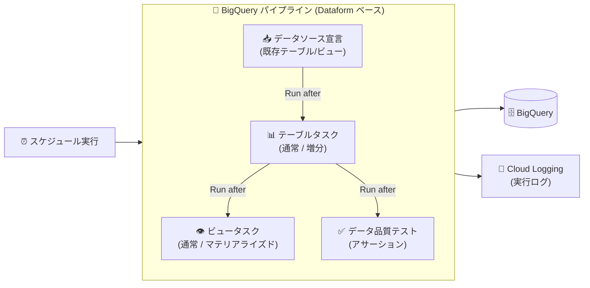

# BigQuery: パイプラインへのテーブル・ビュー・データソース・データ品質テストのタスク追加が GA

**リリース日**: 2026-07-30

**サービス**: BigQuery

**機能**: BigQuery パイプラインの SQLX タスク (テーブル、ビュー、データソース、データ品質テスト)

**ステータス**: GA (一般提供)

📊 [このアップデートのインフォグラフィックを見る](https://takech9203.github.io/google-cloud-news-summary/20260730-bigquery-pipeline-tasks-ga.html)

## 概要

BigQuery パイプラインに、テーブル、ビュー、データソース、データ品質テストをタスクとして追加する機能が一般提供 (GA) となりました。BigQuery パイプラインは Dataform を基盤とするオーケストレーション機能で、コードアセットを順序付けて実行することでデータ処理の自動化と効率化を実現します。

今回の GA により、パイプラインを構成するコードアセットとして、従来のノートブック、SQL クエリ、データプレパレーションに加えて、SQLX タスク (テーブル、ビュー、ソース宣言、データ品質テスト) を BigQuery コンソールから直接追加できるようになりました。テーブルタスクでは通常のテーブルと増分テーブル、ビュータスクではビューとマテリアライズドビューを選択でき、データ品質テストでは Dataform のアサーション機能を使ってデータの検証をパイプラインのシーケンスに組み込めます。

データエンジニアやアナリティクスエンジニアが、ELT パイプラインの構築からデータ品質の検証までを BigQuery コンソール上のパイプラインで完結できるようになる、実務上重要なアップデートです。

**アップデート前の課題**

- Dataform 流のテーブル定義 (SQLX) やアサーションによるデータ品質テストを利用するには、Dataform のリポジトリと開発ワークスペースを直接操作する必要があった
- BigQuery パイプラインで利用できるコードアセットはノートブック、SQL クエリ、データプレパレーションが中心で、テーブル・ビュー・データソース・データ品質テストをタスクとして組み込む方法は GA ではなかった

**アップデート後の改善**

- BigQuery コンソールのパイプライン編集画面から「Add task」でテーブル (通常/増分)、ビュー (通常/マテリアライズド)、データソース宣言、データ品質テストを追加できるようになった
- 「Run after」メニューでタスクの実行順序を定義し、テーブル作成 → データ品質テストといった依存関係のあるシーケンスを GUI で構成できるようになった
- config ブロックの編集を Configuration タブから行えるため、SQLX の構文エラーを避けながらメタデータを設定できるようになった
- GA となったことで、本番ワークロードでの利用が正式にサポートされた

## アーキテクチャ図



データソース宣言を起点に、テーブル作成、ビュー作成、データ品質テストを「Run after」で順序付けて実行するパイプラインの構成例です。パイプラインは Dataform を基盤とし、実行結果は BigQuery に反映され、実行ログは Cloud Logging に自動記録されます。

## サービスアップデートの詳細

### 主要機能

1. **テーブルタスク (Table)**
   - 「Add task」から「Table」を選択し、通常のテーブル (Table) または増分テーブル (Incremental table) を作成できる
   - プロジェクト・データセット・テーブル名を指定し、Configuration タブまたはコードエディタの config ブロックでタスクを構成する
   - 「Details > Compiled queries」で SQLX コードからコンパイルされた SQL を確認し、「Run」で実行してデータプレビューを検証できる

2. **ビュータスク (View)**
   - ビュー (View) またはマテリアライズドビュー (Materialized view) を選択して作成できる
   - config ブロックでメタデータを定義でき、エディタがコードを検証して検証ステータスを表示する

3. **データソース宣言タスク (Declare source)**
   - パイプラインのデータソースとして使用する既存のテーブルまたはビューを宣言できる
   - 宣言したソースは後続のテーブルタスクなどから参照できる

4. **データ品質テストタスク (Data quality test)**
   - Dataform のアサーション機能を使ってデータ品質の検証条件を構成できる
   - 「Run after」メニューで先行タスクを指定し、テーブル更新後にデータ品質テストを実行するシーケンスを構築できる

5. **タスクの編集・削除**
   - パイプライン内のタスクを選択して「Run after」による先行タスクの変更や、タスク内容の編集・削除が可能

## 技術仕様

### パイプラインの構成要素

| 項目 | 詳細 |
|------|------|
| 基盤サービス | Dataform (パイプラインは Dataform により実行される) |
| 対応コードアセット | ノートブック、SQL クエリ、データプレパレーション、SQLX タスク (テーブル、ビュー、ソース、データ品質テスト) |
| テーブルの種類 | 通常テーブル、増分テーブル |
| ビューの種類 | ビュー、マテリアライズドビュー |
| データ品質テスト | Dataform アサーションによる検証 |
| 実行順序の定義 | 「Run after」メニューで先行タスクを指定 |
| クォータ | Dataform のクォータと上限が適用される |

### 必要な IAM ロール

| 操作 | 必要なロール |
|------|-------------|
| パイプラインの作成 | Code Creator (`roles/dataform.codeCreator`) |
| パイプラインの編集・実行 | Dataform Editor (`roles/dataform.editor`) |

パイプラインを作成すると、作成者にはそのパイプラインに対する Dataform Admin ロール (`roles/dataform.admin`) が付与されます。また、スケジュール実行にはサービスアカウントへの Service Account User、BigQuery Job User、BigQuery Data Viewer / Data Editor などのロール付与が別途必要です。

## 設定方法

### 前提条件

1. BigQuery API が有効化されていること
2. パイプラインの作成には `roles/dataform.codeCreator`、編集・実行には `roles/dataform.editor` が付与されていること
3. VPC Service Controls を使用する場合は、Dataform と BigQuery を同一のサービス境界で保護し、`dataform.restrictGitRemotes` 組織ポリシーを設定すること

### 手順

#### ステップ 1: パイプラインを開く

Google Cloud コンソールの BigQuery ページで、Explorer ペインからプロジェクトを展開し、「Pipelines」からパイプラインを選択します (パイプラインは Google Cloud コンソールでのみ利用可能)。

#### ステップ 2: タスクを追加する (例: テーブル)

1. 「Add task」をクリックし、「Table」を選択
2. 「Create new」ペインで「Table」または「Incremental table」を選択
3. プロジェクト、データセットを確認し、テーブル名を入力
4. タスク詳細ペインで「Open」をクリックしてタスクを開く
5. 「Details > Configuration」または config ブロックでタスクを構成

#### ステップ 3: 実行順序を定義して実行する

1. 「Run after」メニューで先行タスクを選択 (例: データソース宣言 → テーブル → データ品質テスト)
2. エディタの検証ステータスを確認
3. 「Run」をクリックしてパイプラインシーケンスの一部として実行し、「Query results」でデータプレビューを確認

## メリット

### ビジネス面

- **開発効率の向上**: Dataform リポジトリを直接操作せずに、BigQuery コンソールのパイプライン UI だけで ELT パイプラインとデータ品質テストを構築できる
- **データ品質の担保**: データ品質テストをパイプラインのシーケンスに組み込むことで、テーブル更新のたびに検証を自動実行できる
- **本番利用の安心感**: GA となったことで、本番ワークロードでの利用が正式にサポートされる

### 技術面

- **SQLX / Dataform の機能を活用**: 増分テーブル、マテリアライズドビュー、アサーションなど Dataform core の機能をパイプラインタスクとして利用できる
- **構文エラーの防止**: Configuration タブから config ブロックの値を編集でき、コンパイル済み SQL も確認できる
- **依存関係の明示**: 「Run after」による実行順序の定義で、タスク間の依存関係を GUI で管理できる

## デメリット・制約事項

### 制限事項

- パイプラインは Google Cloud コンソールでのみ利用可能
- パイプライン作成後にリージョン (格納先) を変更できない
- アクセス権はパイプライン単位で付与され、パイプライン内の個々のタスク単位では付与できない
- スケジュール実行が次回の開始時刻までに完了しない場合、次回の実行はスキップされエラーとしてマークされる
- Dataform のクォータと上限が適用される

### 考慮すべき点

- コードアセットはプロジェクトのデフォルトリージョンに作成され、作成後にリージョンを変更できないため、事前にコードリージョンの設定を確認する
- config ブロックで JavaScript 関数を値として使用した場合、Configuration タブからは編集できない
- スケジュール実行にはサービスアカウントへの複数のロール付与 (Service Account User、BigQuery Job User など) が必要

## ユースケース

### ユースケース 1: ELT パイプラインとデータ品質検証の一体化

**シナリオ**: 日次でソーステーブルから集計テーブルを更新し、更新後にデータの整合性 (NULL や重複の有無) を自動検証したい。

**実装例**:
```
1. 「Declare source」でソーステーブルを宣言
2. 「Table」タスク (Incremental table) で増分集計テーブルを定義
3. 「Data quality test」タスクでアサーションを構成し、Run after にテーブルタスクを指定
4. パイプラインをスケジュール設定して日次実行
```

**効果**: テーブル更新とデータ品質検証が単一パイプラインで完結し、品質問題の早期検知と手動検証の削減が期待できる。

### ユースケース 2: ダッシュボード向けマテリアライズドビューの自動更新

**シナリオ**: BI ダッシュボードが参照するビュー層を、基盤テーブルの更新に続けて再作成したい。

**効果**: テーブルタスクの後続に「View」タスク (Materialized view) を配置することで、基盤テーブルからビュー層までの更新順序が保証され、ダッシュボードのデータ鮮度を維持できる。

## 料金

BigQuery パイプラインタスクの実行には、BigQuery のコンピューティング料金とストレージ料金が発生します。詳細は [BigQuery の料金](https://cloud.google.com/bigquery/pricing)を参照してください。

- ノートブックを含むパイプラインは、Colab Enterprise ランタイム料金が発生する
- パイプラインの実行ログは Cloud Logging に自動記録され、Cloud Logging の課金が発生する場合がある

| 項目 | 料金 (USD) |
|------|-----------|
| オンデマンドクエリ | $6.25/TiB スキャンから (毎月最初の 1 TiB は無料) |
| Editions (容量ベース) | $0.04/スロット時から |
| 論理ストレージ | $0.01/GiB から (毎月最初の 10 GiB は無料) |

## 利用可能リージョン

コードアセットはプロジェクトのデフォルトコードリージョンに保存されます。サポートされるリージョンの一覧は [BigQuery Studio のロケーション](https://docs.cloud.google.com/bigquery/docs/locations#bqstudio-loc)を参照してください。

## 関連サービス・機能

- **Dataform**: BigQuery パイプラインの実行基盤。SQLX タスク (テーブル、アサーションなど) は Dataform core の機能に基づく
- **Cloud Logging**: パイプライン実行のログが自動的に記録される
- **Colab Enterprise**: パイプラインにノートブックタスクを含める場合のランタイム
- **VPC Service Controls**: パイプラインを保護する場合、Dataform と BigQuery を同一サービス境界に含める必要がある

## 参考リンク

- 📊 [インフォグラフィック](https://takech9203.github.io/google-cloud-news-summary/20260730-bigquery-pipeline-tasks-ga.html)
- [公式リリースノート](https://docs.cloud.google.com/release-notes#July_30_2026)
- [パイプラインタスクの追加 (Add a pipeline task)](https://docs.cloud.google.com/bigquery/docs/create-pipelines#add_a_pipeline_task)
- [BigQuery パイプラインの概要](https://docs.cloud.google.com/bigquery/docs/pipelines-introduction)
- [Dataform でのデータ品質テスト (アサーション)](https://docs.cloud.google.com/dataform/docs/assertions)
- [料金ページ](https://cloud.google.com/bigquery/pricing)

## まとめ

BigQuery パイプラインでテーブル、ビュー、データソース、データ品質テストを直接タスクとして扱えるようになり、Dataform の強力な SQLX 機能を BigQuery コンソールだけで活用できるようになりました。ELT パイプラインとデータ品質検証を一体化したい場合は、既存のスケジュールドクエリや個別の Dataform リポジトリ運用からパイプラインへの移行を検討する価値があります。まずは開発環境でテーブルタスクとアサーションの組み合わせを試すことをおすすめします。

---

**タグ**: BigQuery, パイプライン, Dataform, データ品質, SQLX, ELT, GA
