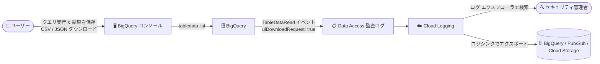

# BigQuery: クエリ結果ダウンロードの監査機能 (uiDownloadRequest フィールド) が GA

**リリース日**: 2026-07-30

**サービス**: BigQuery

**機能**: コンソールからのクエリ結果ダウンロードの監査 (Data Access 監査ログの uiDownloadRequest フィールド)

**ステータス**: GA (一般提供)

📊 [このアップデートのインフォグラフィックを見る](https://takech9203.github.io/google-cloud-news-summary/20260730-bigquery-query-results-download-audit.html)

## 概要

BigQuery コンソール (Google Cloud コンソール) からユーザーがクエリ結果をダウンロードした操作を監査できる機能が一般提供 (GA) になりました。`tabledata.list` メソッドの Data Access 監査ログに `uiDownloadRequest` フィールドが追加され、そのリクエストが UI からのダウンロード操作によってトリガーされたものかどうかを判別できます。

`uiDownloadRequest` は `BigQueryAuditMetadata.TableDataRead` イベントのブール型フィールドで、`tabledata.list` リクエストが UI ダウンロードによるものである場合に `true` になります。このフィールドは `reason` が `TABLEDATA_LIST_REQUEST` の場合にのみ設定されます。

BigQuery コンソールの「結果を保存」機能では、クエリ結果を CSV や改行区切り JSON としてローカルファイルにダウンロードできますが、これはデータがユーザーの端末 (Google Cloud の管理境界外) に持ち出されることを意味します。本アップデートにより、セキュリティ管理者やコンプライアンス担当者は「誰が・いつ・どのテーブルのデータを UI からダウンロードしたか」を監査ログで追跡できるようになり、データ持ち出し (データ流出) の検知・調査が容易になります。

**アップデート前の課題**

- コンソールからのクエリ結果ダウンロードも `tabledata.list` の Data Access 監査ログ (`TableDataRead` イベント) として記録はされていたものの、API 経由の通常のデータ読み取りと UI からのダウンロード操作をログ上で区別できなかった
- そのため「ユーザーがブラウザ経由でデータをローカルにダウンロードした」ことに絞った監査・検知が困難だった

**アップデート後の改善**

- `tabledata.list` の Data Access 監査ログに `uiDownloadRequest` フィールドが追加され、UI ダウンロード起因のリクエストを識別できるようになった
- Cloud Logging のログ エクスプローラやログシンク経由の BigQuery 分析で、UI ダウンロード操作のみをフィルタリングして監査・アラート設定が可能になった
- GA としての提供のため、本番環境のコンプライアンス要件 (データ持ち出しの追跡) に組み込める

## アーキテクチャ図



ユーザーが BigQuery コンソールからクエリ結果をダウンロードすると、`tabledata.list` の Data Access 監査ログ (`TableDataRead` イベント) に `uiDownloadRequest: true` が記録され、Cloud Logging での検索やログシンク経由の分析で UI ダウンロード操作を追跡できます。

## サービスアップデートの詳細

### 主要機能

1. **`uiDownloadRequest` フィールドの追加 (GA)**
   - `BigQueryAuditMetadata.TableDataRead` メッセージに追加されたブール型フィールド
   - `tabledata.list` リクエストが UI ダウンロードによるものである場合に `true` になる
   - `reason` が `TABLEDATA_LIST_REQUEST` の場合にのみ設定される

2. **UI ダウンロード操作の監査**
   - BigQuery コンソールの「結果を保存」によるローカルファイルへのダウンロード (CSV / 改行区切り JSON) を監査ログで識別可能
   - Data Access 監査ログは Cloud Logging に自動送信されるため、ログ エクスプローラでの検索や、ログシンクによる BigQuery / Pub/Sub / Cloud Storage へのルーティングが可能

3. **BigQuery Data Access 監査ログとの統合**
   - BigQuery のコア サービスの Data Access 監査ログはデフォルトで有効であり、無効化できないため、追加の有効化作業なしで本フィールドを利用できる
   - `TableDataRead` イベントには読み取られたフィールドのリスト、行数、ジョブ名などの既存フィールドも含まれ、組み合わせて分析できる

## 技術仕様

### uiDownloadRequest フィールド

| 項目 | 詳細 |
|------|------|
| 対象メソッド | `tabledata.list` (`google.cloud.bigquery.v2.TableDataService.List`) |
| 監査ログ種別 | Data Access 監査ログ (DATA_READ) |
| イベント | `BigQueryAuditMetadata.TableDataRead` |
| フィールド型 | boolean |
| 設定条件 | `reason` が `TABLEDATA_LIST_REQUEST` の場合にのみ設定 |
| 必要な IAM 権限 (操作側) | `bigquery.tables.getData` (DATA_READ) |
| ログ閲覧に必要なロール | Private Logs Viewer (`roles/logging.privateLogViewer`) |

### ログ エントリの例 (metadata 抜粋)

```json
{
  "@type": "type.googleapis.com/google.cloud.audit.BigQueryAuditMetadata",
  "tableDataRead": {
    "reason": "TABLEDATA_LIST_REQUEST",
    "uiDownloadRequest": true
  }
}
```

## 設定方法

### 前提条件

1. BigQuery のコア サービスの Data Access 監査ログはデフォルトで有効 (無効化不可) のため、追加の有効化作業は不要
2. Data Access 監査ログの閲覧には Private Logs Viewer (`roles/logging.privateLogViewer`) ロールが必要

### 手順

#### ステップ 1: ログ エクスプローラで UI ダウンロードを検索

```
protoPayload.serviceName="bigquery.googleapis.com"
protoPayload.metadata.tableDataRead.uiDownloadRequest=true
```

Cloud Logging のログ エクスプローラで上記フィルタを実行すると、BigQuery コンソールからの UI ダウンロードに起因する `TableDataRead` イベントを抽出できます。

#### ステップ 2: (任意) ログシンクを作成して BigQuery で分析

```bash
gcloud logging sinks create bq-audit-sink \
  bigquery.googleapis.com/projects/my-project-id/datasets/auditlog_dataset \
  --log-filter='protoPayload.metadata."@type"="type.googleapis.com/google.cloud.audit.BigQueryAuditMetadata"'
```

BigQueryAuditMetadata 形式のログを BigQuery データセットにエクスポートすると、SQL (JSON 関数) を使って `metadataJson` 内の `tableDataRead.uiDownloadRequest` を集計・分析できます。

## メリット

### ビジネス面

- **データ持ち出しの可視化**: ユーザーがブラウザ経由でクエリ結果をローカルにダウンロードした操作を特定でき、内部統制・コンプライアンス監査 (データ流出の追跡) に対応しやすくなる
- **追加コストなしで即利用可能**: BigQuery の Data Access 監査ログはデフォルトで有効なため、新たな設定なしで本フィールドを監査に活用できる

### 技術面

- **ログ上での明確な識別**: 従来は区別できなかった「API 経由の読み取り」と「UI ダウンロード」をブール値 1 つでフィルタリングできる
- **既存のログ基盤との統合**: Cloud Logging のフィルタ、ログシンク、ログベースのアラートなど既存の仕組みにそのまま組み込める

## デメリット・制約事項

### 制限事項

- `uiDownloadRequest` は `reason` が `TABLEDATA_LIST_REQUEST` の場合にのみ設定される
- 本機能は「検知・監査」のための機能であり、ダウンロード自体を防止するものではない。ダウンロードを制限するには VPC Service Controls の境界設定、または Cloud カスタマーケアへの制限リスト追加依頼が必要
- コンソールからのローカル CSV ダウンロードは最大 10 MB という既存の制限がある (本アップデートによる変更ではない)

### 考慮すべき点

- Data Access 監査ログはボリュームが大きくなる可能性があり、`_Default` バケットへの保存やログシンクでのエクスポートには Cloud Logging / エクスポート先の料金が発生し得る
- 監査ログには SQL テキストやテーブル識別子など機密になり得る情報が含まれるため、Cloud Logging のアクセス制御 (Private Logs Viewer ロールの付与範囲) を適切に管理する必要がある

## ユースケース

### ユースケース 1: 機密データのダウンロード監視アラート

**シナリオ**: 個人情報を含むデータセットに対して、コンソールからのダウンロード操作が行われた場合にセキュリティチームへ通知したい。

**実装例**:
```
protoPayload.serviceName="bigquery.googleapis.com"
protoPayload.metadata.tableDataRead.uiDownloadRequest=true
protoPayload.resourceName:"datasets/pii_dataset"
```

**効果**: 上記フィルタでログベースのアラートを構成することで、対象データセットの UI ダウンロードをほぼリアルタイムに検知できる。

### ユースケース 2: 定期的なダウンロード操作の棚卸し

**シナリオ**: コンプライアンス監査のため、四半期ごとに「誰がどのテーブルをコンソールからダウンロードしたか」の一覧を作成したい。

**効果**: ログシンクで監査ログを BigQuery にエクスポートし、`metadataJson` の `tableDataRead.uiDownloadRequest` を条件に集計することで、ダウンロード操作の履歴を SQL で棚卸しできる。

## 料金

本フィールドの追加自体に個別の料金は設定されていません。Data Access 監査ログの保存・ルーティングには Cloud Logging の料金が適用される場合があります。詳細は [Google Cloud Observability の料金ページ](https://cloud.google.com/products/observability/pricing) を参照してください。

## 関連サービス・機能

- **Cloud Audit Logs / Cloud Logging**: 監査ログの記録・検索・ルーティング基盤。`uiDownloadRequest` フィールドはログ エクスプローラのフィルタやログシンクで活用する
- **VPC Service Controls**: コンソールからのダウンロード・エクスポートを境界で防止するデータ流出対策。本機能 (検知) と組み合わせて防御を多層化できる
- **BigQuery (Save results 機能)**: 監査対象となるコンソールのクエリ結果保存機能。ローカルファイルのほか Google スプレッドシート、Google ドライブ、Cloud Storage への保存に対応

## 参考リンク

- 📊 [インフォグラフィック](https://takech9203.github.io/google-cloud-news-summary/20260730-bigquery-query-results-download-audit.html)
- [公式リリースノート](https://docs.cloud.google.com/release-notes#July_30_2026)
- [BigQueryAuditMetadata.TableDataRead リファレンス (uiDownloadRequest)](https://docs.cloud.google.com/bigquery/docs/reference/auditlogs/rest/Shared.Types/BigQueryAuditMetadata#BigQueryAuditMetadata.TableDataRead.FIELDS.ui_download_request)
- [BigQuery 監査ログの概要](https://docs.cloud.google.com/bigquery/docs/reference/auditlogs)
- [クエリ結果をファイルにエクスポートする](https://docs.cloud.google.com/bigquery/docs/export-file)
- [Data Access 監査ログの構成](https://docs.cloud.google.com/logging/docs/audit/configure-data-access)
- [Cloud Logging 料金 (Google Cloud Observability)](https://cloud.google.com/products/observability/pricing)

## まとめ

BigQuery コンソールからのクエリ結果ダウンロードを監査ログ上で明確に識別できる `uiDownloadRequest` フィールドが GA となり、データ持ち出しの検知・監査が大幅に容易になりました。BigQuery の Data Access 監査ログはデフォルトで有効なため、まずはログ エクスプローラで自組織のダウンロード操作の実態を確認し、機密データセットに対するログベースのアラート設定や、VPC Service Controls による予防的な制御との組み合わせを検討することをおすすめします。

---

**タグ**: #BigQuery #CloudAuditLogs #CloudLogging #セキュリティ #監査 #データガバナンス #GA
