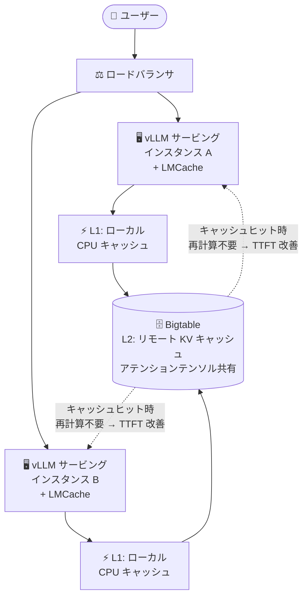

# Bigtable: LMCache のリモートストレージバックエンドとして利用可能に (Preview)

**リリース日**: 2026-07-30

**サービス**: Bigtable

**機能**: LMCache リモートストレージバックエンド

**ステータス**: Preview

📊 [このアップデートのインフォグラフィックを見る](https://takech9203.github.io/google-cloud-news-summary/20260730-bigtable-lmcache-remote-storage.html)

## 概要

Bigtable を [LMCache](https://docs.lmcache.ai/kv_cache/storage_backends/bigtable.html) のリモートストレージバックエンドとして利用できるようになりました。LMCache は vLLM などの LLM サービングエンジン向けのオープンソース KV キャッシュレイヤーで、今回の統合により、大規模言語モデル (LLM) の Key-Value (KV) キャッシュ (事前計算されたアテンションテンソル) を Bigtable に外部保存できます。本機能は Preview として提供されます。

KV キャッシュを Bigtable に外部化することで、複数の AI サービングインスタンスが事前計算済みのアテンションテンソルを共有・再利用できるようになります。これにより計算オーバーヘッドが削減され、繰り返し利用されるプロンプトや共有ドキュメントに対する Time-to-First-Token (TTFT) が大幅に改善されます。

Bigtable はペタバイト規模の容量と一貫した 1 桁ミリ秒台のレイテンシ、マネージドなレプリケーション、IAM によるアクセス制御を備えており、大規模 LLM サービングにおける L2 (リモート) キャッシュ層として適しています。RAG やドキュメント Q&A のように長い共通コンテキストを繰り返し処理する AI サービングワークロードを運用するチームが主な対象です。

**アップデート前の課題**

- vLLM の KV キャッシュ (プレフィックスキャッシュ) は基本的に各サービングインスタンスの GPU メモリやホストメモリに閉じており、インスタンス間で事前計算結果を共有できなかった
- 同じプロンプトプレフィックスや共有ドキュメントであっても、リクエストが別のインスタンスに到達するとアテンションテンソルを再計算する必要があり、計算リソースを浪費していた
- GPU / ホストメモリの容量には上限があり、キャッシュできる KV データのサイズが制約されていた

**アップデート後の改善**

- LMCache のリモートバックエンドとして Bigtable を指定することで、複数の AI サービングインスタンスが KV キャッシュを共有・再利用できるようになった
- 繰り返しプロンプトや共有ドキュメントに対する再計算が不要になり、TTFT が大幅に改善された
- ペタバイト規模にスケールする Bigtable に KV キャッシュを保存できるため、メモリ容量の制約を超えたキャッシュ運用が可能になった

## アーキテクチャ図



複数の vLLM + LMCache サービングインスタンスが、Bigtable をリモート (L2) KV キャッシュ層として共有する構成です。あるインスタンスが計算・保存したアテンションテンソルを別のインスタンスが再利用できるため、繰り返しプロンプトの再計算が不要になります。

## サービスアップデートの詳細

### 主要機能

1. **Bigtable リモートストレージバックエンド**
   - LMCache の設定で `remote_url: "bigtable://<project-id>/<instance-id>"` を指定するだけで、KV キャッシュチャンクを Bigtable に保存可能
   - ローカル CPU キャッシュ (L1) の背後のリモート (L2) 階層として動作し、複数インスタンス間でキャッシュを共有

2. **レイヤーグループシャーディング (Layer-Group Sharding)**
   - KV チャンクをモデルレイヤーのグループ単位で複数カラムに分割して保存し、Bigtable のセルサイズ制限内に収める (最大 240 MB の書き込みに対応)
   - 読み取り時は複数カラムを 1 回のネットワークラウンドトリップにバッチ化
   - `bigtable_layer_group_size` パラメータで制御 (デフォルト: 10、`0` で無効化)

3. **CacheGen 圧縮のサポート**
   - `remote_serde: "cachegen"` を指定すると KV ペイロードを量子化圧縮し、およそ 10〜20 分の 1 のサイズ (例: 128 MB → 約 8 MB) に削減
   - 大規模モデルでの転送量・保存量の削減に有効

4. **多階層キャッシュ構成**
   - `remote_storage_plugins: ["redis", "bigtable"]` のように Redis を Bigtable の前段に配置する 3 階層ハイブリッド構成も可能

## 技術仕様

### 主な設定パラメータ (`extra_config`)

| パラメータ | デフォルト | 説明 |
|------|------|------|
| `bigtable_project_id` / `bigtable_instance_id` / `bigtable_table_name` | なし | Google Cloud プロジェクト・インスタンス・テーブルの識別子 |
| `bigtable_family_name` | `cf` | 使用するカラムファミリー名 |
| `bigtable_layer_group_size` | `10` | カラムグループあたりのレイヤー数。`0` でシャーディング無効 |
| `bigtable_max_chunk_size_mb` | `90.0` | シャーディング無効時の書き込み上限。超過分はスキップ |
| `credentials_path` | なし | サービスアカウント JSON キーのパス (未指定時は ADC) |
| `exists_cache_ttl_seconds` | `10.0` | 存在確認ルックアップのキャッシュ TTL |
| `bigtable_write_timeout_ms` / `bigtable_read_timeout_ms` | `10000.0` / `5000.0` | RPC タイムアウト |

### 設定例 (lmcache_config.yaml)

```yaml
chunk_size: 256
local_cpu: true
max_local_cpu_size: 10.0
remote_url: "bigtable://your-gcp-project-id/lmcache-bt-instance"
remote_serde: "naive"
extra_config:
  bigtable_project_id: "your-gcp-project-id"
  bigtable_instance_id: "lmcache-bt-instance"
  bigtable_table_name: "lmcache-kv-table"
  bigtable_family_name: "cf"
  bigtable_layer_group_size: 10
```

## 設定方法

### 前提条件

1. Bigtable API の有効化 (`bigtable.googleapis.com`、`bigtableadmin.googleapis.com`)
2. Bigtable インスタンスとテーブルの作成 (レイテンシ重視の KV キャッシュ用途には SSD ストレージタイプを推奨。カラムファミリー `cf` を作成)
3. 認証設定 (サービスアカウント JSON キー、または `gcloud auth application-default login` / GKE Workload Identity Federation による Application Default Credentials)

### 手順

#### ステップ 1: Bigtable インスタンスとテーブルの作成

```bash
gcloud services enable bigtable.googleapis.com bigtableadmin.googleapis.com

gcloud beta bigtable instances create lmcache-bt-instance \
  --display-name="LMCache Instance" \
  --cluster-config=id=lmcache-cluster,zone=us-central1-a,nodes=1 \
  --cluster-storage-type=ssd
```

インスタンス作成後、カラムファミリー `cf` を持つテーブル (例: `lmcache-kv-table`) を作成します。

#### ステップ 2: LMCache と Bigtable クライアントのインストール

```bash
export NO_NATIVE_EXT=1
pip install --no-cache-dir lmcache google-cloud-bigtable cachetools
```

#### ステップ 3: 設定ファイルを指定して vLLM を起動

```bash
LMCACHE_CONFIG_FILE=lmcache_config.yaml vllm serve facebook/opt-6.7b
```

上記の YAML 設定ファイルを環境変数で指定して vLLM を起動すると、KV キャッシュが Bigtable にオフロードされます。

## メリット

### ビジネス面

- **推論コストの削減**: 事前計算済みアテンションテンソルの再利用により GPU の計算オーバーヘッドが削減され、同じサービング能力をより少ないリソースで実現できる
- **ユーザー体験の向上**: 繰り返しプロンプトや共有ドキュメントに対する TTFT が大幅に改善され、チャットボットや RAG アプリケーションの応答性が向上する

### 技術面

- **インスタンス間のキャッシュ共有**: 単一インスタンスのメモリに閉じていた KV キャッシュを、複数のサービングインスタンスで共有・再利用できる
- **スケーラビリティ**: ペタバイト規模・1 桁ミリ秒レイテンシの Bigtable を活用し、メモリ容量を超える大規模なキャッシュを保持できる
- **マネージドな運用**: レプリケーション、IAM によるアクセス制御、暗号化など Bigtable のマネージド機能をキャッシュ層でそのまま利用できる

## デメリット・制約事項

### 制限事項

- 本機能は Preview であり、Pre-GA Offerings Terms が適用される
- LMCache 側のドキュメントによると、この統合は LMCache の in-process モード (非推奨化が進んでいるモード) の上に構築されており、LMCache は MP モードの Secondary KV Storage の利用を推奨している
- シャーディング無効時、`bigtable_max_chunk_size_mb` (デフォルト 90 MB) を超える書き込みはスキップされる
- 240 MB を超える生チャンクには CacheGen 圧縮 (`remote_serde: "cachegen"` + `bigtable_layer_group_size: 0`) が必要

### 考慮すべき点

- シャーディング利用時に `use_layerwise: true` を設定すると 32 回以上の逐次 RPC が発生し性能が劣化するため、`use_layerwise: false` を設定する
- CacheGen 圧縮は量子化を伴うため、精度要件に応じてロスレス (`naive`) との使い分けを検討する
- Bigtable インスタンスのノード数・ストレージタイプ (SSD/HDD) はキャッシュのレイテンシ要件に合わせてサイジングする必要がある

## ユースケース

### ユースケース 1: 共有ドキュメントに対する RAG / ドキュメント Q&A

**シナリオ**: 社内ナレッジベースの同一ドキュメント群を長いコンテキストとしてプロンプトに含め、多数のユーザーが複数の vLLM インスタンス越しに質問する。

**効果**: ドキュメント部分の KV キャッシュを Bigtable 経由で全インスタンスが共有するため、どのインスタンスにリクエストが到達しても再計算が不要になり、TTFT が改善される。

### ユースケース 2: システムプロンプト共通のマルチインスタンスチャットサービス

**シナリオ**: 長大なシステムプロンプトを持つチャットサービスを、オートスケールする複数のサービングインスタンスで運用する。

**効果**: 新しくスケールアウトしたインスタンスも Bigtable 上の既存 KV キャッシュを即座に再利用でき、ウォームアップなしで低レイテンシの応答を提供できる。

## 料金

この統合機能自体は LMCache (オープンソース) の機能であり、Google Cloud 側では利用した Bigtable リソース (ノード、ストレージ、ネットワーク) に対して通常の Bigtable 料金が発生します。レイテンシ重視の KV キャッシュには SSD ストレージ、コスト重視のアーカイブ用途には HDD ストレージが選択できます。

詳細は [Bigtable 料金ページ](https://cloud.google.com/bigtable/pricing) を参照してください。

## 関連サービス・機能

- **vLLM**: LMCache が統合される LLM サービングエンジン。GKE や Vertex AI Model Garden 上でのサービングで広く利用される
- **GKE (Google Kubernetes Engine)**: vLLM + LMCache サービングインスタンスの実行基盤。Workload Identity Federation により Bigtable への認証を安全に構成できる
- **Bigtable LangChain 統合**: Bigtable はベクトルストア / Key-Value ストア / チャット履歴ストアとして LangChain とも統合されており、生成 AI アプリのデータ層として活用できる
- **Memorystore (Redis)**: LMCache の `remote_storage_plugins` で Redis を前段に置く 3 階層ハイブリッドキャッシュ構成が可能

## 参考リンク

- 📊 [インフォグラフィック](https://takech9203.github.io/google-cloud-news-summary/20260730-bigtable-lmcache-remote-storage.html)
- [公式リリースノート](https://docs.cloud.google.com/release-notes#July_30_2026)
- [LMCache: Google Cloud Bigtable Remote Cache ドキュメント](https://docs.lmcache.ai/kv_cache/storage_backends/bigtable.html)
- [Bigtable ドキュメント](https://docs.cloud.google.com/bigtable/docs)
- [料金ページ](https://cloud.google.com/bigtable/pricing)

## まとめ

Bigtable が LMCache のリモートストレージバックエンドとして利用可能になり、複数の AI サービングインスタンス間で LLM の KV キャッシュを共有して TTFT を大幅に改善できるようになりました。RAG や長いシステムプロンプトを扱う vLLM ベースのサービング基盤を運用しているチームは、Preview 段階の制約 (LMCache in-process モード依存など) を確認したうえで、キャッシュヒット率の高いワークロードでの検証を始めることを推奨します。

---

**タグ**: Bigtable, LMCache, vLLM, LLM, KV キャッシュ, AI インフラ, Preview
