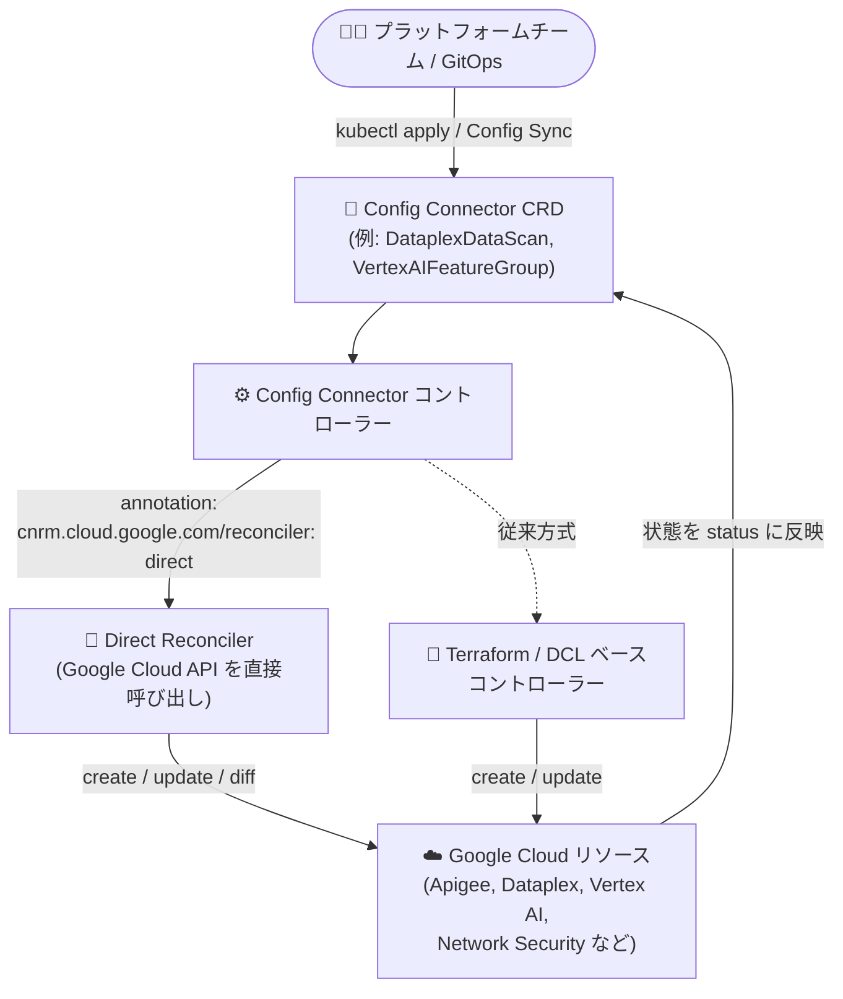

# Config Connector: バージョン 1.154.1 リリース - 約 70 の新規 Alpha リソースと Direct Reconciler の大幅拡充

**リリース日**: 2026-07-30

**サービス**: Config Connector

**機能**: バージョン 1.154.1 (新規 Alpha リソース追加、新規フィールド追加、Direct Reconciler 対象拡大、バグ修正)

**ステータス**: Announcement / Feature / Change / Fixed

📊 [このアップデートのインフォグラフィックを見る](https://takech9203.github.io/google-cloud-news-summary/20260730-config-connector-v1-154-1.html)

## 概要

Config Connector バージョン 1.154.1 がリリースされました。Config Connector は Kubernetes のカスタムリソース (CRD) を通じて Google Cloud リソースを宣言的に管理できるオープンソースの Kubernetes アドオンです。今回のリリースは近年でも特に大規模なアップデートで、Direct Reconciler ベースの新規 Alpha リソースが約 70 種類追加され、Kubernetes マニフェストで管理できる Google Cloud サービスの範囲が大きく広がりました。

追加されたリソースは Apigee、Dataplex、Vertex AI、Network Security、Dialogflow、Discovery Engine、Eventarc、Cloud Run、Cloud SQL など幅広いサービス領域をカバーしています。また、ComputeSubnetwork、ComputeNetwork、RedisCluster、StorageBucket、PubSubTopic などの既存リソースにも多数の新規フィールドが追加され、ネットワーク・ストレージ・監視分野の最新機能を Config Connector から利用できるようになりました。

さらに、従来 Terraform ベース / DCL ベースのコントローラーで調整 (reconcile) されていた約 45 のリソースで、`cnrm.cloud.google.com/reconciler: direct` アノテーションによる Direct Reconciler へのオプトインが可能になりました。GitOps で Google Cloud インフラを管理するプラットフォームチームや SRE にとって重要なアップデートです。

**アップデート前の課題**

- Apigee API Product、Dataplex DataScan、Vertex AI FeatureGroup / PipelineJob、Network Security の AddressGroup / AuthzPolicy など多くのリソースが Config Connector に対応しておらず、gcloud や Terraform など別ツールとの併用が必要だった
- ComputeInstance、ComputeNetwork、DataflowJob、KMSCryptoKey、PubSubSubscription、RedisInstance などは旧来の Terraform / DCL ベースコントローラーで調整されており、Direct Reconciler の改善 (安定した調整、構造化 diff レポートなど) を利用できなかった
- ComposerEnvironment の `storageConfig.bucketRef` のマッピング不具合、MemorystoreInstance のドリフトループ、データセットの暗号化設定を継承する BigQuery テーブルでの恒久的な差分 (perpetual diff) などの既知の問題が存在した

**アップデート後の改善**

- 約 70 の新規 Alpha リソース (Direct Reconciler) が追加され、Apigee から Vertex AI、Network Security まで幅広いサービスを Kubernetes マニフェストで宣言的に管理できるようになった
- 既存リソースに新規フィールドが追加され、Private NAT (ComputeRouterNAT)、クロスクラスタレプリケーション (RedisCluster)、IP フィルタ (StorageBucket)、SQL 条件のアラート (MonitoringAlertPolicy conditionSql) など最新機能に対応した
- 約 45 の既存リソースで `cnrm.cloud.google.com/reconciler: direct` アノテーションによる Direct Reconciler へのオプトインが可能になり、API 互換のまま調整動作を改善できるようになった
- ComposerEnvironment、MemorystoreInstance、KMSAutokeyConfig、BigQuery テーブル、NotebooksInstance などのバグが修正された

## アーキテクチャ図



Kubernetes に適用された Config Connector の CRD をコントローラーが監視し、Direct Reconciler が Google Cloud API を直接呼び出してリソースを調整します。バージョン 1.154.1 では新規 Alpha リソースの追加に加え、約 45 の既存リソースでアノテーションによる Direct Reconciler へのオプトインが可能になりました。

## サービスアップデートの詳細

### 主要機能

1. **約 70 の新規 Alpha リソース (Direct Reconciler)**

   サービス領域ごとに整理すると以下の通りです (代表的なものを抜粋)。

   | サービス領域 | 追加されたリソースの例 |
   |------|------|
   | API 管理 | Apigee (ApigeeApiProduct、ApigeeRegistryApi / Artifact)、API Hub |
   | データ分析・ガバナンス | Dataplex (AspectType、DataScan、DataTaxonomy、Glossary、MetadataJob など)、BigQuery Migration、Dataform、DLP、Data Labeling |
   | AI / ML | Vertex AI (FeatureGroup、FeatureOnlineStore、PipelineJob、TuningJob、VectorSearchCollection など)、Dialogflow、Discovery Engine、Translation、Vision、Document AI Warehouse、Contact Center Insights |
   | ネットワーク・セキュリティ | Network Security (AddressGroup、AuthzPolicy、FirewallEndpoint、TLSInspectionPolicy、パートナー SSE など)、Artifact Registry VPCSC |
   | コンピュート・運用 | Cloud Run ワーカープール、Cloud SQL バックアップ、Cloud Build 第 2 世代接続、GKE Backup チャネル、Eventarc、Developer Connect、Migration Center、Storage Insights |
   | メディア・その他 | Live Stream、Video Stitcher、Managed Kafka Connect、Blockchain Node Engine、Integration Connectors、DMS プライベート接続、VMware Engine プライベート接続、Firebase Test Lab |

2. **既存リソースへの新規フィールド追加**

   - ネットワーク系: ComputeSubnetwork `spec.reservedInternalRange`、NetworkConnectivityInternalRange `spec.allocationOptions`、ComputeNetwork `spec.networkProfile`、ComputeAddress `spec.ipCollection`、ComputeRouterNAT の Private NAT サポート
   - ロードバランシング / DNS: ComputeURLMap `defaultCustomErrorResponsePolicy` とテスト用フィールド、DNSRecordSet ルーティングポリシーの `healthCheckRef` / `rrdatasRefs`、ComputeSecurityPolicy `spec.region`
   - データ / ストレージ: RedisCluster `crossClusterReplicationConfig`、StorageBucket `spec.ipFilter`、PubSubTopic `messageStoragePolicy.enforceInTransit`
   - 監視: MonitoringAlertPolicy `conditionSql` (SQL ベースのアラート条件)

3. **Direct Reconciler オプトインの拡大 (約 45 リソース)**

   - `cnrm.cloud.google.com/reconciler: direct` アノテーションを対象オブジェクトに付与することで、Direct Reconciler へオプトインできる
   - 対象例: ComputeInstance、ComputeNetwork、DataflowJob、KMSCryptoKey、PubSubSubscription、RedisInstance など
   - API は変更なし (後方互換) のため、既存マニフェストをそのまま利用可能

4. **バグ修正**

   - ComposerEnvironment: `storageConfig.bucketRef` のマッピング不具合を修正
   - MemorystoreInstance: ドリフトループを修正
   - ComputeBackendService: エクスポートツールの backend フィールドの問題を修正
   - KMSAutokeyConfig: identity / 削除に関する問題を修正
   - BigQuery: データセットの暗号化設定を継承するテーブルでの恒久的な差分 (perpetual diff) を修正
   - NotebooksInstance: 参照解決の問題を修正

## 技術仕様

### Direct Reconciler オプトインの方法

対象リソースのマニフェストにアノテーションを追加します。

```yaml
apiVersion: pubsub.cnrm.cloud.google.com/v1beta1
kind: PubSubSubscription
metadata:
  name: my-subscription
  annotations:
    cnrm.cloud.google.com/reconciler: direct
spec:
  topicRef:
    name: my-topic
```

### リソースステータスの整理

| 項目 | 詳細 |
|------|------|
| バージョン | Config Connector 1.154.1 |
| 新規 Alpha リソース | 約 70 種類 (Direct Reconciler ベース) |
| Direct Reconciler オプトイン拡大 | 約 45 の既存リソース (ComputeInstance、DataflowJob、KMSCryptoKey など) |
| オプトイン方法 | `cnrm.cloud.google.com/reconciler: direct` アノテーション |
| API 互換性 | 変更なし (後方互換) |

## 設定方法

### 前提条件

1. GKE クラスタなど Kubernetes クラスタに Config Connector がインストールされていること
2. Config Connector の IAM サービスアカウントに対象リソースを管理する権限が付与されていること

### 手順

#### ステップ 1: Config Connector を 1.154.1 にアップグレード

```bash
# 最新の Config Connector Operator をダウンロードして適用 (手動インストールの場合)
gcloud storage cp gs://configconnector-operator/latest/release-bundle.tar.gz release-bundle.tar.gz
tar zxvf release-bundle.tar.gz
kubectl apply -f operator-system/configconnector-operator.yaml
```

Operator 経由で Config Connector 本体が更新されます。

#### ステップ 2: 利用可能な CRD を確認

```bash
# Config Connector が管理する CRD の一覧を確認
kubectl get crds --selector cnrm.cloud.google.com/managed-by-kcc=true
```

新しく追加された Alpha リソースの CRD が利用可能か確認します。

#### ステップ 3: Direct Reconciler へのオプトイン (任意)

```bash
# 既存リソースにアノテーションを付与して Direct Reconciler にオプトイン
kubectl annotate pubsubsubscription my-subscription \
  cnrm.cloud.google.com/reconciler=direct
```

API は変更されないため、既存のマニフェストはそのまま動作します。

## メリット

### ビジネス面

- **管理範囲の統一**: これまで gcloud や Terraform で個別管理していた Apigee、Dataplex、Vertex AI、Network Security などのリソースを Kubernetes / GitOps の単一ワークフローに統合でき、運用コストと認知負荷を削減できる
- **ガバナンスの強化**: RBAC・リポジトリベースの承認フローを通じてクラウドリソース変更を統制でき、監査性が向上する

### 技術面

- **調整動作の改善**: Direct Reconciler は Google Cloud API を直接呼び出すため、Terraform / DCL ベースコントローラーで発生していた更新の停滞やドリフトなどの問題が改善される
- **後方互換のオプトイン**: アノテーション 1 つで Direct Reconciler に切り替えられ、API 変更がないため段階的な移行が可能
- **最新機能への追従**: Private NAT、クロスクラスタレプリケーション、SQL ベースのアラート条件など、各サービスの新機能を宣言的に利用できる

## デメリット・制約事項

### 制限事項

- 新規追加された約 70 リソースは **Alpha** ステータスであり、API が変更される可能性がある。本番環境での利用は慎重に判断する必要がある
- Direct Reconciler へのオプトインは対象リソースごとにアノテーションの付与が必要 (一部リソースはバージョンによりデフォルト化される場合がある)

### 考慮すべき点

- Alpha リソースの CRD を利用するには、Config Connector の設定で Alpha CRD の有効化が必要な場合がある
- 過去のリリースでは Direct Reconciler 移行に伴い、サービス生成 ID の扱い (spec.resourceID から status.externalRef へ) などの動作変更があったリソースも存在するため、オプトイン前にリリースノートで対象リソースの挙動を確認することを推奨
- バージョンアップ前に、利用中のリソースに関連するバグ修正・動作変更の有無をリリースノートで確認する

## ユースケース

### ユースケース 1: Dataplex によるデータガバナンスの GitOps 管理

**シナリオ**: データプラットフォームチームが Dataplex の DataScan、DataTaxonomy、Glossary を環境ごとに一貫して構成したい。

**実装例**:
```yaml
# Dataplex DataScan などの新規 Alpha リソースを
# Kubernetes マニフェストとして Git リポジトリで管理し、
# Config Sync / Argo CD で各環境クラスタに適用する
```

**効果**: データ品質スキャンやガバナンス設定をコードとしてレビュー・監査でき、環境間の設定ドリフトを防止できる。

### ユースケース 2: 既存 Compute / PubSub リソースの Direct Reconciler 移行

**シナリオ**: ComputeInstance や PubSubSubscription を Config Connector で管理しているが、調整の安定性を高めたい。

**効果**: `cnrm.cloud.google.com/reconciler: direct` アノテーションを付与するだけで、API 互換のまま Direct Reconciler の改善された調整動作 (直接 API 呼び出し、diff の可視化など) を利用できる。

## 料金

Config Connector 自体はオープンソースの Kubernetes アドオンであり、追加料金なしで利用できます。Config Connector で作成・管理する各 Google Cloud リソース (Compute Engine、Cloud SQL、Vertex AI など) には、それぞれのサービスの通常料金が適用されます。また、Config Connector を稼働させる GKE クラスタの料金が発生します。

- [GKE の料金](https://cloud.google.com/kubernetes-engine/pricing)

## 関連サービス・機能

- **GKE (Google Kubernetes Engine)**: Config Connector の主要な実行基盤。GKE アドオンまたは手動インストールで利用
- **Config Sync / Config Controller**: Git リポジトリを信頼できる情報源とした GitOps 運用で Config Connector と組み合わせて利用される
- **Terraform**: 同様に宣言的な IaC ツール。Direct Reconciler は従来の Terraform ベースコントローラーを置き換える新しい調整方式
- **Cloud Asset Inventory / IAM**: Config Connector の権限管理・リソース監査と組み合わせて利用

## 参考リンク

- 📊 [インフォグラフィック](https://takech9203.github.io/google-cloud-news-summary/20260730-config-connector-v1-154-1.html)
- [公式リリースノート](https://docs.cloud.google.com/release-notes#July_30_2026)
- [Config Connector リリースノート](https://docs.cloud.google.com/config-connector/docs/release-notes)
- [Config Connector 概要](https://docs.cloud.google.com/config-connector/docs/overview)
- [Config Connector リソースリファレンス](https://docs.cloud.google.com/config-connector/docs/reference/resources)
- [GitHub: k8s-config-connector](https://github.com/GoogleCloudPlatform/k8s-config-connector)

## まとめ

Config Connector 1.154.1 は、約 70 の新規 Alpha リソース追加と約 45 リソースへの Direct Reconciler オプトイン拡大により、Kubernetes ネイティブな Google Cloud リソース管理の適用範囲を大きく広げるリリースです。GitOps でインフラを管理しているチームは、新規リソースの対応状況を確認し、非本番環境で Alpha リソースと Direct Reconciler の動作を検証することを推奨します。既知のバグ修正 (ComposerEnvironment、MemorystoreInstance、BigQuery の perpetual diff など) が含まれるため、該当リソースを利用中の場合は早めのアップグレードを検討してください。

---

**タグ**: Config Connector, Kubernetes, GitOps, IaC, Direct Reconciler, GKE, Dataplex, Vertex AI, Network Security
