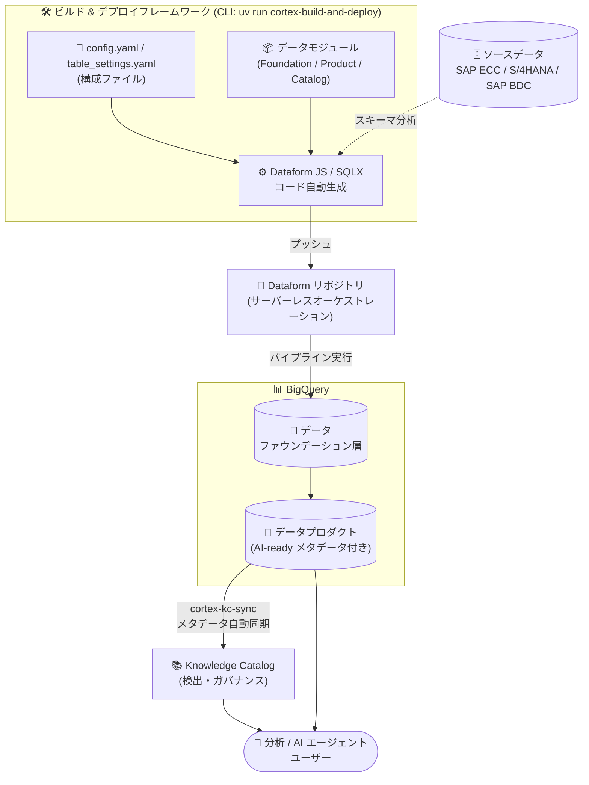

# Cortex Framework: バージョン 7.0.0 一般提供 (GA) 開始

**リリース日**: 2026-07-30

**サービス**: Google Cloud Cortex Framework

**機能**: バージョン 7.0.0 GA (モジュラーデプロイアーキテクチャ、Dataform オーケストレーション、Knowledge Catalog 統合) + テレメトリの導入

**ステータス**: GA (General Availability) + Change

📊 [このアップデートのインフォグラフィックを見る](https://takech9203.github.io/google-cloud-news-summary/20260730-cortex-framework-v7-ga.html)

## 概要

Google Cloud Cortex Framework バージョン 7 が一般提供 (GA) となりました。Cortex Framework は BigQuery を中心とした Data & AI Cloud の導入を加速するソリューションアクセラレータであり、バージョン 7 ではモジュラーデプロイアーキテクチャ、Dataform によるシンプルなデータオーケストレーション、BigQuery と Knowledge Catalog 統合による AI-ready なデータプロダクトが導入されました。これにより、企業は高度な分析やエージェント (Agentic) ユースケース向けのデータアセットとパイプラインを、より少ないリスク・複雑さ・コストで構築・拡張・デプロイできます。

バージョン 7 は 2026 年 4 月 30 日の 7.0.0-preview.1 (Public Preview) を経て GA に到達しました。GA では Preview の機能に加えて、自然言語でデータプロダクトの作成・カスタマイズを自動化する Agentic データプロダクトビルダースキル、Knowledge Catalog へのメタデータ自動同期、SAP ERP 向けデータプロダクトの拡充、SAP Business Data Cloud (BDC) データプロダクトのサポート、v6 互換の SAP レポーティングコンテンツ、可観測性の強化が追加されています。

あわせて Change として、バージョン 7 には匿名化されたデプロイ統計を収集するテレメトリが含まれることが発表されました。テレメトリはデフォルトで有効ですが、いつでもオプトアウトできます。

**アップデート前の課題**

- v6 のオーケストレーションは Cloud Composer (Apache Airflow) や Dataflow などのコンポーネントに依存しており、常時稼働するコンピュートクラスタや Airflow VM のインフラ管理が必要だった
- 必要なデータプロダクトだけを選択的にデプロイすることが難しく、不要なテーブルの処理が発生し得た
- 複雑なデータモデルの依存関係 (前提テーブルの準備順序) を利用者側で意識する必要があった
- デプロイ済みデータプロダクトのカタログ登録・ガバナンスのためのメタデータ整備は手作業が必要だった
- 複数の SAP ERP システム (ECC と S/4HANA の混在など) からのデータ取り込みに対する組み込みの仕組みが限定的だった

**アップデート後の改善**

- モジュラーデプロイとスマートな依存関係解決により、必要なデータプロダクトを選択するだけで、フレームワークが必要なテーブルを自動的に特定・取得・変換するようになった
- オーケストレーションが完全に Dataform ベースのサーバーレス BigQuery ネイティブ実行となり、常時稼働のコンピュートクラスタや Airflow VM が不要になった
- ネイティブな依存関係グラフ生成により、複雑なデータモデルの実行順序が自動処理されるようになった
- `cortex-kc-sync` ツールにより、デプロイ済みデータプロダクトとメタデータが Knowledge Catalog に自動同期され、検出とガバナンスが容易になった
- ネイティブな増分ロード構成により、前回実行以降の新規・変更データのみを処理し、BigQuery の処理時間とコストを大幅に削減できるようになった
- SAP ECC と SAP S/4HANA の両方に対するマルチシステム対応が組み込まれ、複数の SAP ERP システムからのデータ取り込みが容易になった

## アーキテクチャ図



Cortex Framework v7 のモジュラーデプロイ構成。CLI が構成ファイルとデータモジュールから Dataform コードを動的生成して Dataform リポジトリにプッシュし、サーバーレスに BigQuery 上のデータファウンデーション層とデータプロダクトを構築します。デプロイされたデータプロダクトは `cortex-kc-sync` により Knowledge Catalog に自動登録され、分析者や AI エージェントから検出可能になります。

## サービスアップデートの詳細

### 主要機能

1. **モジュラーデプロイとスマートな依存関係解決**
   - 必要なデータプロダクトを選択するだけで、フレームワークが必要なテーブルを自動的に特定・取得し、データファウンデーション層へ変換。不要なデータは処理されない
   - 標準モデルを壊すことなくカスタムフィールドやロジックを追加可能
   - ネイティブな依存関係グラフ生成により、前提テーブルの準備を含む実行順序を自動処理

2. **Dataform によるサーバーレス BigQuery ネイティブ実行**
   - オーケストレーションは完全に Dataform に依存し、バージョン管理された SQL でデータ変換を実行
   - 常時稼働のコンピュートクラスタや Airflow VM が不要で、インフラオーバーヘッドを最小化
   - ネイティブな増分ロード構成により、新規・変更データのみを処理して BigQuery の処理時間とコストを削減

3. **AI・検出・ガバナンス機能 (GA 新機能)**
   - **Agentic データプロダクトビルダースキル**: 自然言語によるデータプロダクトの作成・カスタマイズの自動化
   - **Knowledge Catalog 統合**: デプロイ済みデータプロダクトとエンリッチ化されたメタデータを Knowledge Catalog に自動同期し、検出とガバナンスを実現

4. **データプロダクトコンテンツと統合の拡充 (GA 新機能)**
   - **SAP ERP 向け新データプロダクト**: SAP ECC / SAP S/4HANA 向けの Cortex Framework 提供データプロダクトが拡充。全データモデル・フィールドレベルの説明にエージェントフレンドリーなメタデータを同梱
   - **SAP Business Data Cloud (BDC) データプロダクトのサポート**: SAP BDC データプロダクトを Cortex Framework に登録し、その上でユースケースを拡張可能
   - **ソリューションサンプル**: SAP ERP / SAP BDC 向けの消費用データプロダクトサンプル (Sales Performance Insights、Supplier Spend Analysis) を Cortex Framework 管理のデータプロダクト上に容易にデプロイ可能
   - **v6 互換の SAP レポーティング**: v6 の SAP BigQuery データモデルを v7 アーキテクチャ内で利用でき、v6 の Looker レポートを使い続けながらの移行を支援

5. **柔軟なアーキテクチャと拡張性**
   - **Bring your own CDC (外部データファウンデーション)**: 組み込みの CDC 処理をバイパスし、既存の CDC パイプラインをファウンデーション層に直接接続可能
   - **高いデータ忠実度とセマンティクス**: カスタムフィールドの動的検出、テーブル名のビジネス用語への意味的マッピング、SAP TCURX テーブルによる通貨小数点シフトなどの高度なロジック処理
   - **拡張性フレームワーク**: 名前空間 (namespace) によりカスタムデータプロダクトと Cortex データプロダクトを分離し、カスタム作業に影響なく最新の Cortex アップデートを享受可能
   - **可観測性の強化 (GA 新機能)**: エラーレポーティングとパイプラインモニタリングの強化

6. **テレメトリの導入 (Change)**
   - バージョン 7 には匿名化されたデプロイ統計を収集するテレメトリが含まれる。採用率の高いモジュールの改善にフォーカスするために利用される
   - デフォルトで有効だが、いつでもオプトアウト可能 (詳細は後述)

## 技術仕様

### 主要コンポーネント

| コンポーネント | 詳細 |
|------|------|
| ビルド & デプロイフレームワーク | CLI スクリプト (`cortex-build`、`cortex-deploy`、`cortex-build-and-deploy`) を Python ツール `uv` で実行。ローカル、Cloud Shell、CI/CD (Cloud Build / GitHub Actions) で実行可能 |
| データモジュール | Data foundation modules (Raw テーブルの標準化・ビジネス用語へのリネーム・タイムゾーン調整)、Data product modules (KPI・集計・クロスファンクショナル結合)、Data catalog modules (外部レイクハウスカタログ参照)。オープンソースでカスタマイズ可能 |
| Dataform オーケストレーション | ビルド時に構成を反映した Dataform コードを動的生成し、Dataform リポジトリにステージング。BigQuery 内でサーバーレスに SQL パイプラインを実行 |
| BigQuery データモデル | 標準テーブル / ビュー (パーティショニング・クラスタリング最適化)、フェデレーテッドデータソース、Lakehouse ランタイムカタログ (Delta Sharing 等のゼロコピー参照) をサポート |
| 外部データカタログ | SAP BDC Connect for BigQuery などの外部データレイク / Delta Share をコピーなしでクエリ可能 |
| Knowledge Catalog 統合 | `cortex-kc-sync` ツールが manifest.yaml のメタデータ (displayName、description、documentation) を抽出し、BigQuery アセットを自動検出して Knowledge Catalog のデータプロダクトとして登録・更新・リンク管理 |

### アップグレードに関する重要な考慮事項

| 移行元 | 考慮事項 |
|------|------|
| v6 からのアップグレード | v7 は新しいメジャーバージョンであり、破壊的変更を含む。自動移行パスはなし。v6 ユーザー向けに SAP レポーティングの v6 互換コンテンツが提供される |
| v7 Preview からのアップグレード | 構成モデルの改善に伴い、構成ファイルの再作成と再デプロイが必要 |

### テレメトリで収集されるデータ

ユーザー ID 属性 (氏名、メールアドレス、IP アドレス) は収集されません。収集されるのは構成識別子です。

| 項目 | 内容 |
|------|------|
| Google Cloud プロジェクト番号 | 利用状況の集計のためデプロイ実行プロジェクトを識別 |
| デプロイリージョン | ターゲットリソースのデプロイ先リージョン |
| フレームワークバージョン | 使用中の Cortex Framework バージョン (例: `7.0.0`) |
| コンポーネント名 / ツールタイプ | 操作対象コンポーネント (`platform`、`data-product`、`foundation`) と CLI コマンド (`deployer`、`knowledge-catalog` など) |
| ターゲットバリアント / 有効モジュール | デプロイ対象のソースシステム区分 (`sap`、`marketing` など) と有効化されたモジュールパス |
| リポジトリ / データセット ID | Dataform リポジトリ ID、BigQuery データセット ID、データプロダクトインスタンス ID |
| 実行ステータス | デプロイステップの成否 (`deployed`、`error`、`registered` など) |

テレメトリはゼロペイロードのメタデータロギング機構を採用しており、外部エンドポイントへ明示的なログペイロードを送信しません。BigQuery や Dataform への標準的な API リクエストの HTTP User-Agent ヘッダーにパラメータを埋め込み、Google Cloud 側の API トラフィックロギングで捕捉されます。

## 設定方法

### 前提条件

1. Google Cloud プロジェクト (課金アカウント接続済み) と、BigQuery API・Dataform API・Cloud Resource Manager API の有効化
2. [Cortex Framework GitHub リポジトリ](https://github.com/GoogleCloudPlatform/cortex-framework) のクローンと、Python パッケージマネージャー `uv` のインストール (Cloud Shell にはインストール済み)
3. Knowledge Catalog 同期を利用する場合: Dataplex API (`dataplex.googleapis.com`) の有効化と、ターゲットプロジェクトへの IAM ロール付与 (`roles/dataplex.editor`、`roles/dataplex.dataProductsEditor`、`roles/dataplex.entryOwner`、`roles/bigquery.metadataViewer`、`roles/bigquery.dataViewer`)

### 手順

#### ステップ 1: リポジトリの準備と依存関係の同期

```bash
git clone https://github.com/GoogleCloudPlatform/cortex-framework
cd cortex-framework
uv sync

gcloud config set project PROJECT_ID
gcloud services enable cloudresourcemanager.googleapis.com \
  bigquery.googleapis.com \
  dataform.googleapis.com \
  --project=PROJECT_ID
```

リポジトリをクローンし、`uv sync` で Python 仮想環境と依存関係を準備します。

#### ステップ 2: デプロイ構成

`config/config.yaml.example` をコピーして `config/config.yaml` を作成し、必須プロジェクト値を設定します。

```yaml
# 必須: ビルド / ソース / ターゲット / リポジトリの各プロジェクト ID
# YOUR_BUILD_PROJECT_ID, YOUR_SOURCE_PROJECT_ID,
# YOUR_TARGET_PROJECT_ID, YOUR_REPO_PROJECT_ID
deployment:
  targets:
    - type: dataform
      enabled: true
      targetSettings:
        repositoryProjectId: YOUR_REPO_PROJECT_ID
        repositoryRegion: us-central1
        repositoryName: cortex-repository
        workspaceName: dev
```

#### ステップ 3: ビルドとデプロイの実行

```bash
uv run cortex-build-and-deploy --config config/config.yaml
```

前提条件の検証、Raw データセットのスキーマ分析に基づく `.sqlx` スクリプトのビルド・コンパイル、Dataform リポジトリ / ワークスペースの作成とコンパイル済みアーティファクトの同期が実行されます。リモートの Dataform ワークスペースに直接カスタムコードを追加する場合は `definitions/custom/` 配下に配置する必要があります (それ以外の場所は次回デプロイで上書き・削除されます)。

#### ステップ 4: Knowledge Catalog への同期 (任意)

```bash
uv run cortex-kc-sync --config config/config.yaml
```

Dataform パイプラインの実行で BigQuery テーブル / ビューをマテリアライズした後に実行します。デプロイ時に付与されたトラッキングラベルを持つテーブルを自動検出し、Knowledge Catalog のデータプロダクトとして登録・更新します。Cortex Framework が作成したリソースには `cortex-framework-created` / `cortex-framework-version` システムラベルが付与され、ユーザー作成の既存カタログアセットは保護されます。

#### テレメトリのオプトアウト

```bash
# グローバルに無効化 (~/.cortex/cortex-framework-consent.properties に永続化)
uv run cortex-config telemetry disable

# 現在の状態を確認
uv run cortex-config telemetry status

# 単一実行のみ無効化 (実行後は永続設定ファイルも作成される)
uv run cortex-build-and-deploy --config config/config.yaml --disable-telemetry
```

## メリット

### ビジネス面

- **導入リスク・コスト・複雑さの低減**: 必要なデータプロダクトのみを選択的にデプロイでき、Data & AI Cloud 導入の初期障壁が下がる
- **AI / エージェントユースケースへの即応性**: 全データモデル・フィールドにエージェントフレンドリーなメタデータが同梱され、Agentic ビルダースキルで自然言語からデータプロダクトを作成・カスタマイズできる
- **ガバナンスと検出性の向上**: Knowledge Catalog への自動同期により、ビジネスアナリスト・データスチュワード・AI エージェントがデータプロダクトを発見しやすくなる
- **段階的な移行**: v6 互換の SAP レポーティングコンテンツにより、v6 の Looker レポートを維持しながら v7 へ移行できる

### 技術面

- **インフラ管理の排除**: サーバーレスな Dataform オーケストレーションにより、Airflow VM や常時稼働クラスタの運用が不要
- **処理コストの最適化**: ネイティブな増分ロードにより、前回実行以降の差分のみを処理して BigQuery の処理時間とコストを削減
- **依存関係の自動解決**: 依存関係グラフの自動生成により、複雑なデータモデルの実行順序管理から解放される
- **クリーンな拡張性**: 名前空間によるカスタムコンテンツの分離で、フレームワーク更新とカスタマイズを両立
- **柔軟なデータ取り込み**: Bring your own CDC、マルチ SAP システム対応、Lakehouse ランタイムカタログによるゼロコピー参照

## デメリット・制約事項

### 制限事項

- v6 からのアップグレードには自動移行パスがなく、破壊的変更を伴う (v6 互換コンテンツは SAP レポーティング向けに提供)
- v7 Preview からの移行でも、構成モデル改善のため構成ファイルの再作成と再デプロイが必要
- Knowledge Catalog (Dataplex) は 1 データプロダクトあたり最大 100 アセット (テーブル) をサポート。ドキュメントによると、データプロダクトに 50 を超えるテーブルが含まれる場合 `cortex-kc-sync` はエラーで失敗する
- リモート Dataform ワークスペースへのカスタムコードは `definitions/custom/` 配下に配置しないと、次回デプロイで削除・上書きされる

### 考慮すべき点

- テレメトリはデフォルトで有効。組織のポリシー上問題がある場合は `uv run cortex-config telemetry disable` または `--disable-telemetry` フラグで明示的にオプトアウトする必要がある
- Knowledge Catalog 同期には Dataplex API の有効化と複数の IAM ロールが必要
- デプロイにはビルド / ソース / ターゲット / リポジトリの 4 種類のプロジェクト ID の設計が必要

## ユースケース

### ユースケース 1: SAP ERP データの選択的なデータプロダクトデプロイ

**シナリオ**: SAP ECC と S/4HANA が混在する企業が、販売実績分析のためのデータ基盤を BigQuery 上に構築したい。必要なのは販売関連のデータプロダクトのみで、全テーブルの取り込みは避けたい。

**実装例**:
```bash
# config.yaml で必要なデータプロダクトモジュールのみ有効化して実行
uv run cortex-build-and-deploy --config config/config.yaml
```

**効果**: スマートな依存関係解決により、選択したデータプロダクトに必要なテーブルのみがファウンデーション層に変換される。マルチシステム SAP 対応により ECC と S/4HANA の両方から並行してデプロイでき、Sales Performance Insights ソリューションサンプルで販売実績の分析を迅速に開始できる。

### ユースケース 2: Knowledge Catalog による全社データプロダクトのガバナンス

**シナリオ**: データメッシュ的な運用を目指す企業が、デプロイしたデータプロダクトをビジネスユーザーや AI エージェントから発見可能にし、リネージやオーナーシップを一元管理したい。

**効果**: `cortex-kc-sync` により、manifest.yaml のビジネス向け説明・ドキュメントリンクを含むメタデータが Knowledge Catalog に自動登録され、物理 BigQuery テーブルが論理ビジネスドメインにリンクされる。モデルの進化に応じた再同期で、新規テーブルの登録・変更の反映・不要リンクの削除が自動化される。

### ユースケース 3: 既存 CDC パイプラインを活かした移行

**シナリオ**: すでに独自の CDC パイプライン (サードパーティ製レプリケーションツールなど) で SAP データを BigQuery にレプリケートしている企業が、Cortex のデータモデルを活用したい。

**効果**: Bring your own CDC (外部データファウンデーション) により、組み込みの CDC 処理をバイパスして既存パイプラインをファウンデーション層に直接接続でき、既存投資を無駄にせずに Cortex のデータプロダクトを利用できる。

## 料金

Cortex Framework 自体はオープンソースのソリューションアクセラレータ (GitHub リポジトリで提供) であり、コストは利用する Google Cloud サービス (BigQuery、Dataform、Knowledge Catalog など) の使用量に基づきます。

- v7 ではサーバーレスの Dataform オーケストレーションにより常時稼働クラスタが不要となり、増分ロードにより BigQuery の処理コストを削減できます
- Knowledge Catalog 統合を利用する場合は Knowledge Catalog の料金 (DCU 時間ベースの処理料金、メタデータストレージ、API 呼び出し。無料枠あり) が適用されます

詳細は各サービスの料金ページを参照してください。

- [BigQuery の料金](https://cloud.google.com/bigquery/pricing)
- [Knowledge Catalog の料金](https://cloud.google.com/products/knowledge-catalog)

## 関連サービス・機能

- **BigQuery**: すべてのデータはパーティショニング / クラスタリング最適化されたテーブル・ビューとして BigQuery に格納。フェデレーテッドソースや Lakehouse ランタイムカタログもサポート
- **Dataform**: v7 のオーケストレーション基盤。バージョン管理された SQL パイプラインをサーバーレスにビルド・テスト・スケジュール実行
- **Knowledge Catalog (Dataplex)**: データプロダクトの検出・ガバナンスレイヤー。`cortex-kc-sync` で自動同期
- **SAP Business Data Cloud Connect for BigQuery**: SAP BDC データプロダクトをゼロコピーで BigQuery から参照し、Cortex Framework に登録可能
- **Cloud Build / GitHub Actions**: CLI をパイプラインに組み込み、ビルド・デプロイの CI/CD 自動化が可能

## 参考リンク

- 📊 [インフォグラフィック](https://takech9203.github.io/google-cloud-news-summary/20260730-cortex-framework-v7-ga.html)
- [公式リリースノート (2026-07-30)](https://docs.cloud.google.com/release-notes#July_30_2026)
- [Cortex Framework リリースノート](https://docs.cloud.google.com/cortex/docs/release-notes)
- [Cortex Framework 概要 (v7)](https://docs.cloud.google.com/cortex/docs/overview)
- [デプロイガイド](https://docs.cloud.google.com/cortex/docs/deployment)
- [前提条件](https://docs.cloud.google.com/cortex/docs/prerequisites)
- [Knowledge Catalog 統合](https://docs.cloud.google.com/cortex/docs/knowledge-catalog)
- [テレメトリ](https://docs.cloud.google.com/cortex/docs/telemetry)
- [可観測性 (Observability)](https://docs.cloud.google.com/cortex/docs/observability)
- [v6 互換 (SAP レポーティング)](https://docs.cloud.google.com/cortex/docs/v6-compatibility)
- [GitHub リポジトリ](https://github.com/GoogleCloudPlatform/cortex-framework)

## まとめ

Cortex Framework v7 の GA は、SAP を中心としたエンタープライズデータ基盤の構築を Dataform ベースのサーバーレスアーキテクチャで再設計し、AI / エージェント時代に向けたデータプロダクト提供へと進化させたメジャーリリースです。v6 ユーザーは破壊的変更と自動移行パスがない点を踏まえ、v6 互換の SAP レポーティングコンテンツを活用した段階的移行を計画することを推奨します。あわせて、デフォルトで有効なテレメトリについて組織ポリシーに応じたオプトアウト要否を確認してください。

---

**タグ**: `Cortex Framework`, `BigQuery`, `Dataform`, `Knowledge Catalog`, `SAP`, `データプロダクト`, `GA`, `データ分析`, `AIエージェント`
