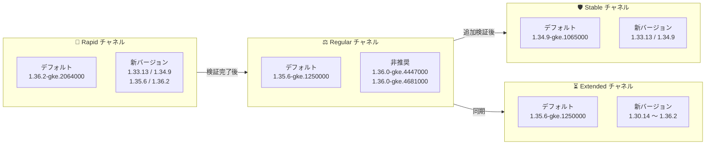

# Google Kubernetes Engine (GKE): バージョンアップデート 2026-R32

**リリース日**: 2026-07-30

**サービス**: Google Kubernetes Engine (GKE)

**機能**: クラスタバージョンの更新 (2026-R32)

**ステータス**: Change (Version Update)

📊 [このアップデートのインフォグラフィックを見る](https://takech9203.github.io/google-cloud-news-summary/20260730-gke-version-updates-july-30.html)

## 概要

Google Kubernetes Engine (GKE) の全リリースチャネル (Rapid, Regular, Stable, Extended, No channel) において、クラスタバージョンが更新された。今回の 2026-R32 アップデートでは、Rapid チャネルのデフォルトバージョンが 1.36.2-gke.2064000 に、Regular / Extended / No channel のデフォルトバージョンが 1.35.6-gke.1250000 に、Stable チャネルのデフォルトバージョンが 1.34.9-gke.1065000 にそれぞれ更新された。

各チャネルには新しいパッチバージョンが追加され、新規クラスタの作成、および既存クラスタのコントロールプレーン・ノードの手動アップグレードに利用できる。あわせて複数の旧バージョンが非推奨または提供終了となり、自動アップグレードターゲットも新バージョンに更新されている。

このアップデートは、GKE クラスタを運用するすべてのプラットフォーム管理者およびインフラエンジニアに影響する。特に自動アップグレードを有効にしているクラスタでは、新しい自動アップグレードターゲットへの昇格が順次実施される。

**アップデート前の課題**

- 前回 (2026-R31) の各チャネルのデフォルトバージョン (Rapid: 1.36.2-gke.1498000、Regular / Extended: 1.35.6-gke.1127000) には最新のパッチが含まれていなかった
- Regular / Extended チャネルの 1.36.0 系パッチ (1.36.0-gke.4447000, 1.36.0-gke.4681000) に未適用の修正が残っていた
- Stable チャネルでは 1.33.12-gke.1165000 などの旧パッチが引き続き利用可能な状態だった

**アップデート後の改善**

- Rapid チャネルのデフォルトが 1.36.2-gke.2064000 に更新され、新規クラスタに Kubernetes 1.36.2 系の新パッチが標準適用されるようになった
- Regular / Extended / No channel のデフォルトが 1.35.6-gke.1250000 に統一され、安定チャネルのベースラインが揃った
- Stable チャネルのデフォルトが 1.34.9-gke.1065000 に更新され、1.33.13 / 1.34.9 系の新パッチが追加された
- 旧パッチバージョンが非推奨・提供終了となり、自動アップグレードにより修正適用済みバージョンへの移行が促進される

## アーキテクチャ図



GKE のリリースチャネルは、Rapid で導入されたバージョンが検証を経て Regular、Stable へと段階的に展開されるパイプラインとして機能する。今回は全チャネルでデフォルトバージョンが更新された。

## サービスアップデートの詳細

### チャネル別バージョン一覧

| チャネル | デフォルトバージョン | 新規追加バージョン | 非推奨/提供終了バージョン |
|---------|---------------------|-------------------|-----------------|
| Rapid | 1.36.2-gke.2064000 (新デフォルト) | 1.33.13-gke.1329000, 1.34.9-gke.1655000, 1.35.6-gke.1710000, 1.36.2-gke.2281000 | 1.33.13-gke.1109000, 1.34.9-gke.1322000, 1.35.6-gke.1258000, 1.36.2-gke.1498000 (提供終了)、1.35.6-gke.1638000 (非推奨、90 日以内に削除) |
| Regular | 1.35.6-gke.1250000 (新デフォルト) | 1.33.13-gke.1109000, 1.34.9-gke.1322000, 1.35.6-gke.1258000, 1.36.2-gke.1498000 | 1.33.13-gke.1011000, 1.34.9-gke.1131000, 1.35.6-gke.1127000 (提供終了)、1.36.0-gke.4447000, 1.36.0-gke.4681000 (非推奨、90 日以内に削除) |
| Stable | 1.34.9-gke.1065000 (新デフォルト) | 1.33.13-gke.1011000, 1.34.9-gke.1131000 | 1.34.8-gke.1278000 (提供終了)、1.33.12-gke.1165000 (非推奨、90 日以内に削除) |
| Extended | 1.35.6-gke.1250000 (新デフォルト) | 1.30.14-gke.2866000, 1.31.14-gke.2456000, 1.32.13-gke.2175000, 1.33.13-gke.1109000, 1.34.9-gke.1322000, 1.35.6-gke.1258000, 1.36.2-gke.1498000 | 1.33.13-gke.1011000, 1.34.9-gke.1131000, 1.35.6-gke.1127000 (提供終了)、1.30.14-gke.2846000, 1.31.14-gke.2437000, 1.32.13-gke.2137000, 1.36.0-gke.4447000, 1.36.0-gke.4681000 (非推奨、90 日以内に削除) |
| No channel (非推奨) | 1.35.6-gke.1250000 (新デフォルト) | 1.33.13-gke.1329000, 1.34.9-gke.1655000, 1.35.6-gke.1710000, 1.36.2-gke.2281000 (ノード版は 1.30.14-gke.2866000 〜 も追加) | 1.33.12-gke.1165000, 1.34.8-gke.1126000, 1.35.6-gke.1049000, 1.35.6-gke.1638000, 1.36.0-gke.4447000, 1.36.0-gke.4681000 (非推奨、90 日以内に削除) |

### 自動アップグレードターゲット (マイナーバージョンアップグレード)

| チャネル | 現在のマイナーバージョン | アップグレード先 |
|---------|------------------------|------------------|
| Rapid | 1.32 | 1.33.13-gke.1269000 |
| Rapid | 1.33 | 1.34.9-gke.1610000 |
| Rapid | 1.34 | 1.35.6-gke.1641000 |
| Rapid | 1.35 | 1.36.2-gke.2064000 |
| Regular | 1.32 | 1.33.13-gke.1101000 |
| Regular | 1.33 | 1.34.9-gke.1287000 |
| Regular | 1.34 | 1.35.6-gke.1250000 |
| Stable | 1.32 | 1.33.12-gke.1270000 |
| Stable | 1.33 | 1.34.9-gke.1065000 |
| No channel | 1.32 | 1.33.13-gke.1101000 |
| No channel | 1.33 | 1.34.9-gke.1065000 |

メンテナンス除外や非推奨 API の使用などマイナーアップグレードを妨げる要因がある場合は、同一マイナーバージョン内の新パッチへ自動アップグレードされる。

### 自動アップグレードターゲット (パッチバージョンアップグレード)

| チャネル | 1.33 | 1.34 | 1.35 | 1.36 |
|---------|------|------|------|------|
| Rapid | 1.33.13-gke.1269000 | 1.34.9-gke.1610000 | 1.35.6-gke.1641000 | 1.36.2-gke.2064000 |
| Regular | 1.33.13-gke.1101000 | 1.34.9-gke.1287000 | 1.35.6-gke.1250000 | 1.36.2-gke.1346000 |
| Stable | 1.33.12-gke.1270000 | 1.34.9-gke.1065000 | - | - |
| Extended | 1.33.13-gke.1101000 | 1.34.9-gke.1287000 | 1.35.6-gke.1250000 | 1.36.2-gke.1346000 |
| No channel | 1.33.13-gke.1101000 | 1.34.9-gke.1065000 | 1.35.6-gke.1250000 | 1.36.2-gke.1346000 |

### 主要な変更点

1. **全チャネルでデフォルトバージョンが更新**
   - Rapid: 1.36.2-gke.1498000 → 1.36.2-gke.2064000
   - Regular / Extended / No channel: 1.35.6-gke.1127000 → 1.35.6-gke.1250000
   - Stable: 1.34.9-gke.1065000 が新規クラスタ作成時のデフォルトに

2. **1.36.0 系パッチが Regular / Extended チャネルで非推奨に**
   - 1.36.0-gke.4447000 および 1.36.0-gke.4681000 が非推奨 (90 日以内に削除)
   - 1.36 系を利用するクラスタは 1.36.2 系パッチへの移行が必要

3. **Extended チャネルで旧マイナーバージョンの新パッチを提供**
   - 1.30.14-gke.2866000 / 1.31.14-gke.2456000 / 1.32.13-gke.2175000 が追加
   - 長期サポート対象の旧バージョン利用者にも最新パッチを提供

## 技術仕様

### リリースチャネルの特性

| チャネル | 提供マイナーバージョン範囲 | 安定性 | 今回の主な変更 |
|---------|---------------------|--------|------------------|
| Rapid | 1.33 - 1.36 | 最新機能優先 (SLA 対象外) | デフォルトが 1.36.2-gke.2064000 に |
| Regular | 1.33 - 1.36 | バランス重視 | デフォルトが 1.35.6-gke.1250000 に、1.36.0 系が非推奨 |
| Stable | 1.33 - 1.34 | 安定性優先 | デフォルトが 1.34.9-gke.1065000 に |
| Extended | 1.30 - 1.36 | 長期サポート (最大 24 ヶ月) | デフォルト更新 + 1.30〜1.32 系の新パッチ追加 |

### バージョンロールアウトの注意点

- リリースノート公開時点でロールアウトは進行中であり、全ゾーンへの展開完了まで数日を要する場合がある
- 非推奨バージョンは 90 日後、またはサポート終了時のいずれか早い時点で削除される

## 設定方法

### 前提条件

1. Google Cloud プロジェクトで GKE API が有効であること
2. `gcloud` CLI がインストール・認証済みであること
3. クラスタに対する適切な IAM 権限 (`container.admin` ロールなど) を保持していること

### 手順

#### ステップ 1: 現在のクラスタバージョンとチャネルを確認

```bash
gcloud container clusters list \
  --format="table(name,location,currentMasterVersion,releaseChannel.channel)"
```

#### ステップ 2: 利用可能なバージョンを確認

```bash
# Regular チャネルのデフォルトバージョンと利用可能バージョンを確認
gcloud container get-server-config \
  --flatten="channels" \
  --filter="channels.channel=REGULAR" \
  --format="yaml(channels.channel,channels.defaultVersion,channels.validVersions)" \
  --location=asia-northeast1
```

#### ステップ 3: 手動アップグレード (必要な場合)

```bash
# コントロールプレーンのアップグレード
gcloud container clusters upgrade CLUSTER_NAME \
  --master \
  --cluster-version=1.35.6-gke.1250000 \
  --location=LOCATION

# ノードプールのアップグレード
gcloud container clusters upgrade CLUSTER_NAME \
  --node-pool=NODE_POOL_NAME \
  --cluster-version=1.35.6-gke.1250000 \
  --location=LOCATION
```

#### ステップ 4: メンテナンスウィンドウの設定 (推奨)

```bash
# 業務時間外に自動アップグレードを制限
gcloud container clusters update CLUSTER_NAME \
  --maintenance-window-start="2026-08-01T18:00:00+09:00" \
  --maintenance-window-end="2026-08-01T22:00:00+09:00" \
  --maintenance-window-recurrence="FREQ=WEEKLY;BYDAY=SA,SU" \
  --location=LOCATION
```

## メリット

### ビジネス面

- **運用コストの削減**: 自動アップグレードにより、手動でのバージョン管理・パッチ適用作業が不要
- **コンプライアンス対応**: サポート対象バージョンの維持により SLA 適用範囲内を維持
- **長期運用の柔軟性**: Extended チャネルの旧マイナーバージョン (1.30〜1.32) にも新パッチが提供され、移行猶予期間中も最新の修正を適用可能

### 技術面

- **最新パッチの標準適用**: 全チャネルのデフォルトバージョンが更新され、新規クラスタに最新パッチが標準適用
- **ベースラインの統一**: Regular / Extended / No channel のデフォルトが同一バージョン (1.35.6-gke.1250000) に揃い、環境間のバージョン差異を低減
- **自動アップグレードターゲットの更新**: マイナー / パッチの両方で新しいターゲットが設定され、修正適用済みバージョンへの移行が自動化

## デメリット・制約事項

### 制限事項

- ロールアウトは段階的に行われるため、一部のゾーンでは新バージョンがまだ利用できない場合がある
- コントロールプレーンのマイナーバージョンのスキップアップグレードは不可 (1 バージョンずつ順次アップグレードが必要)
- Rapid チャネルのバージョンは GKE SLA の対象外
- Extended チャネルの拡張サポート期間中はセキュリティパッチのみ提供 (新機能追加なし)

### 考慮すべき点

- Regular / Extended チャネルで非推奨となった 1.36.0-gke.4447000 / 1.36.0-gke.4681000 を使用中の場合、90 日以内に削除されるため移行計画を早期に策定すること
- Rapid チャネルの 1.35 系クラスタは 1.36.2-gke.2064000 への自動アップグレード対象となるため、Kubernetes 1.36 の非推奨 API への対応状況を事前に確認すること
- ノードのバージョンスキューポリシー (コントロールプレーンとノードの差は最大 2 マイナーバージョン) に注意
- メンテナンス除外を設定している場合でも、パッチバージョンの自動アップグレードは適用される場合がある

## ユースケース

### ユースケース 1: 非推奨バージョンからの計画的移行

**シナリオ**: Regular チャネルで 1.36.0-gke.4681000 を使用しており、90 日以内の削除に備えて移行が必要。

**実装例**:
```bash
# 新しい 1.36.2 系パッチへアップグレード
gcloud container clusters upgrade my-cluster \
  --master \
  --cluster-version=1.36.2-gke.1498000 \
  --location=us-central1
```

**効果**: 削除期限前に計画的にアップグレードすることで、強制アップグレードによる予期しない業務影響を回避できる。

### ユースケース 2: Extended チャネルでの旧バージョン維持と最新パッチ適用

**シナリオ**: アプリケーションの互換性検証が完了していないため Kubernetes 1.31 系を維持しつつ、最新パッチは適用したい。

**実装例**:
```bash
# Extended チャネルの 1.31 系新パッチへアップグレード
gcloud container clusters upgrade my-legacy-cluster \
  --master \
  --cluster-version=1.31.14-gke.2456000 \
  --location=asia-northeast1
```

**効果**: マイナーバージョンを維持したまま 1.31.14-gke.2456000 の最新パッチを適用でき、互換性リスクを抑えながら修正を取り込める。

### ユースケース 3: 自動アップグレードによる運用レス管理

**シナリオ**: 開発環境クラスタを Rapid チャネルで運用し、常に最新バージョンで検証したい。

**効果**: 1.35 系クラスタは自動的に 1.36.2-gke.2064000 へアップグレードされるため、手動介入なしで最新の Kubernetes 環境を維持でき、本番環境 (Regular / Stable) への展開前検証が効率化される。

## 料金

GKE のバージョンアップデート自体には追加料金は発生しない。

### 料金例

| 項目 | 料金 |
|------|------|
| GKE クラスタ管理費 (Standard) | $0.10 / クラスタ / 時間 |
| GKE クラスタ管理費 (Autopilot) | 管理費無料 (Pod リソース課金) |
| Extended サポート追加料金 | 拡張サポート期間に入ったクラスタに追加費用が発生 |
| ノードのコンピューティング費用 | 通常の Compute Engine 料金 |

詳細は [GKE 料金ページ](https://cloud.google.com/kubernetes-engine/pricing) を参照。

## 利用可能リージョン

GKE バージョンアップデートは全リージョンで利用可能。ただし、新バージョンのロールアウトはゾーンごとに段階的に行われ、完了まで数日を要する場合がある。

利用可能なバージョンはロケーションごとに確認可能:

```bash
gcloud container get-server-config --location=LOCATION
```

## 関連サービス・機能

- **GKE リリースチャネル**: Rapid / Regular / Stable / Extended の 4 チャネルでバージョンの安定性と新しさのバランスを選択
- **Cloud Monitoring**: クラスタのアップグレード状態やバージョン情報を監視し、アップグレードイベントをアラート通知
- **Cloud Logging**: アップグレードイベントのログを記録し、トラブルシューティングに活用
- **GKE Rollout Sequencing**: 複数クラスタ間でのバージョンロールアウトの順序制御

## 参考リンク

- 📊 [このアップデートのインフォグラフィック](https://takech9203.github.io/google-cloud-news-summary/20260730-gke-version-updates-july-30.html)
- [公式リリースノート](https://docs.cloud.google.com/release-notes#July_30_2026)
- [GKE リリースノート](https://docs.cloud.google.com/kubernetes-engine/docs/release-notes)
- [GKE バージョニングとサポート](https://docs.cloud.google.com/kubernetes-engine/versioning)
- [リリースチャネルの概要](https://docs.cloud.google.com/kubernetes-engine/docs/concepts/release-channels)
- [クラスタアップグレードのベストプラクティス](https://docs.cloud.google.com/kubernetes-engine/docs/best-practices/upgrading-clusters)
- [料金ページ](https://cloud.google.com/kubernetes-engine/pricing)

## まとめ

GKE 2026-R32 アップデートにより、全リリースチャネルのデフォルトバージョンが更新され、Rapid は 1.36.2-gke.2064000、Regular / Extended / No channel は 1.35.6-gke.1250000、Stable は 1.34.9-gke.1065000 となった。Regular / Extended チャネルでは 1.36.0 系パッチが非推奨となり 90 日以内に削除されるため、該当バージョンを使用中のクラスタ管理者は 1.36.2 系への移行計画を早期に策定することを推奨する。あわせてメンテナンスウィンドウの設定を確認し、自動アップグレードの影響を事前に把握しておくとよい。

---

**タグ**: #GKE #Kubernetes #VersionUpdate #ReleaseChannel #2026-R32
