# Google Cloud Contact Center as a Service: バージョン 5.2 リリース (留守番電話検出、メール API、メール転送、スマートディスポジション)

**リリース日**: 2026-07-30

**サービス**: Google Cloud Contact Center as a Service (CCaaS / CCAI Platform)

**機能**: CCaaS 5.2 リリース - 留守番電話検出 (AMD)、メール解析データ API、添付ファイル付きメール転送、スマートディスポジション、多数のバグ修正

**ステータス**: 正式リリース (Announcement + Feature + Fixed)

📊 [このアップデートのインフォグラフィックを見る](https://takech9203.github.io/google-cloud-news-summary/20260730-google-cloud-ccaas-5-2.html)

## 概要

Google Cloud Contact Center as a Service (CCaaS、旧称 CCAI Platform) のバージョン 5.2 が正式にリリースされました。各インスタンスへの適用タイミングは、選択しているデプロイスケジュールに依存します。本バージョンでは、プログレッシブ アウトバウンド キャンペーン向けの留守番電話検出 (AMD: Answering Machine Detection)、メールの解析済みコンテンツを取得する 2 つの新しい読み取り専用 API エンドポイント、添付ファイル付きメール転送、AI がディスポジション コードを自動提案するスマートディスポジションという 4 つの新機能が追加されました。

あわせて、通話スタック、転送、レポート、チャット関連をはじめとする多数のバグ修正が含まれています。異常終了後に通話が仮想エージェント状態で固まる問題、オーバーキャパシティのキューへのウォーム転送キャンセルで発信者が自動メニューのループに取り残される問題、Kustomer / ServiceNow / Salesforce 連携の不具合など、運用の安定性に関わる広範な修正が行われています。

なお、これらの新機能は 2026-07-27 に公開されたプレリリースノートで事前告知されていた内容の正式リリースです。正式リリースにともない各機能の公式ドキュメントが公開され、スマートディスポジションの前提条件 (Agent Assist の生成 AI セッション要約の構成が必要) や、AMD のレポーティング (キャンペーン メトリクスへの「Voicemail Detected」ラベル付与) と制限事項などの詳細が明らかになっています。

**アップデート前の課題**

- プログレッシブ キャンペーンでは、留守番電話やボイスメールが応答した場合も通話がエージェントに接続されるため、エージェントが手動で切断して次の連絡先に進む必要があり、時間が浪費されていた
- Apps API にはメールの解析済みコンテンツ (送信者、宛先、件名、本文、添付ファイル メタデータ) を取得するエンドポイントがなく、外部システムからメールセッションの詳細データにプログラムでアクセスすることが困難だった
- エージェントがメールアダプタから外部の宛先にメールを転送する手段がなかった
- セッション終了後のラップアップでは、エージェントがディスポジション リストから手動でコードを検索・選択する必要があり、後処理時間の増加やコード選択のばらつきの原因となっていた

**アップデート後の改善**

- AMD がバックグラウンドで通話音声を解析して人間か留守番電話かを判定し、留守番電話を検出すると通話を自動終了してダイヤラーが次の連絡先に進むため、エージェントは実際の人間との会話に集中できるようになった
- 2 つの新しい読み取り専用 API エンドポイントにより、メールセッションのサマリーとメッセージ一覧、および個々のメールの解析済み全文コンテンツを外部システムから取得できるようになった
- メールアダプタに新しい「Forward」ボタンが追加され、添付ファイルを自動的に含めた外部宛先へのメール転送が可能になった (送信前に添付ファイルの削除も可能)
- AI が会話内容・キュー・インタラクション種別に基づいてディスポジション コードを提案するスマートディスポジションにより、エージェントの手作業が減り、ディスポジション データの一貫性が向上した

## アーキテクチャ図

```mermaid
flowchart TD
    A([📞 プログレッシブ キャンペーン開始]) --> B[🤖 ダイヤラーが次の連絡先に発信]
    B --> C[🎧 AMD がバックグラウンドで<br>通話音声を解析]
    C --> D{👤 人間が応答?}
    D -->|はい| E[🧑‍💼 エージェントが対応<br>通話を継続]
    D -->|いいえ: 留守番電話 /<br>ボイスメールを検出| F[🟢 コールアダプタに緑バナー表示<br>❌ 通話を自動終了]
    F --> G[📊 キャンペーン メトリクスに<br>Voicemail Detected ラベルを記録]
    G --> B
    E --> H[📝 ラップアップ:<br>スマートディスポジションが<br>コードを AI 提案]
    H --> I[✅ エージェントが提案を確認<br>承認または変更して送信]
```



CCaaS 5.2 で追加された AMD とスマートディスポジションを組み合わせたプログレッシブ キャンペーンの通話フローです。留守番電話を検出すると通話を自動終了して「Voicemail Detected」ラベルをメトリクスに記録し、人間が応答した通話ではラップアップ時に AI がディスポジション コードを提案します。

## サービスアップデートの詳細

### 主要機能

1. **CCaaS 5.2 リリース (Announcement)**
   - Google Cloud CCaaS のバージョン 5.2 が正式リリースされた
   - 各インスタンスへのアップデート適用タイミングは、選択しているデプロイスケジュールに依存する
   - 詳細は [Deployment schedules](https://cloud.google.com/contact-center/ccai-platform/docs/deployment-schedules) を参照

2. **留守番電話検出 (AMD: Answering Machine Detection) for プログレッシブ キャンペーン**
   - プログレッシブ アウトバウンド キャンペーンで、CCAI Platform がバックグラウンドで通話音声を解析し、応答したのが人間か留守番電話 (ボイスメール) かを判定する
   - 留守番電話を検出した場合、通話は終了し、ダイヤラーはキャンペーンリストの次の連絡先の発信に進む
   - 管理者向け: **Settings > Campaigns > Dialer Modes** ペインの Progressive セクションに新しい「Enable Answering Machine Detection」トグルが追加された
   - UX の変更: 留守番電話が検出されると、コールアダプタに緑色のバナーが表示される
   - レポーティング: 留守番電話が検出されたアウトバウンド キャンペーン通話は、キャンペーン メトリクスに「Voicemail Detected」ラベル付きで記録される

3. **メールセッション・メッセージ取得エンドポイント (Apps API)**
   - 外部システムからメール インタラクションの解析済みコンテンツ (送信者、宛先、件名、本文、添付ファイル メタデータ) を取得できる 2 つの読み取り専用エンドポイントが追加された
   - `/apps/api/v1/email/sessions/EMAIL_SUPPORT_ID`: メールセッションのサマリー情報と、メタデータ付きメッセージ ID の一覧を返す (下書きメッセージの ID は含まれない)
   - `/apps/api/v1/email/messages/EMAIL_THREAD_ID`: 単一メッセージの全文コンテンツを返す
   - 既存の Apps API と同様に Basic 認証を使用し、API クレデンシャルの発行元インスタンスのメール情報を返す

4. **添付ファイル付きメール転送**
   - エージェントがメールアダプタから外部の宛先にメールを直接転送できるようになった
   - 転送時、元のメールのすべての添付ファイルが自動的に含まれる。必要に応じて送信前に添付ファイルを削除できる
   - 元のメールは割り当てられたキューにステータス未変更のまま残るため、既存の対応フローに影響しない
   - UX の変更: メールアダプタに新しい「Forward」ボタンが追加された

5. **スマートディスポジション (Smart Disposition)**
   - セッション終了時に AI がディスポジション コードを自動提案する新機能。エージェントの手作業を減らし、データの一貫性を向上させる
   - 会話の内容、インタラクションがルーティングされたキュー、インタラクション種別 (通話/チャット、インバウンド/アウトバウンド) に基づいて提案を生成する
   - 管理者向け: **Settings > Operation Management > Wrap-up** 配下の以下 3 箇所に新しい「Smart Disposition」トグルが追加された
     - Automatic wrap-up for inbound calls > Disposition Codes & Notes for calls > Disposition Codes セクション
     - Automatic wrap-up for outbound calls > Disposition Codes & Notes for calls > Disposition Codes セクション
     - Automatic wrap-up for chats > Disposition Codes & Notes for chats > Disposition Codes セクション
   - UX の変更: 有効化すると、エージェント アダプタのラップアップ画面の Disposition フィールドに提案されたディスポジションが表示される。エージェントは提案を確認し、承認するか、より適切なコードに変更して送信する
   - グローバル設定に加えてキューレベルでも設定でき、キューレベル設定はグローバル設定より優先される

6. **多数のバグ修正 (Fixed)**
   - **通話関連**: セッションの異常終了やエスカレーション ハンドオフ未完了後に通話が仮想エージェント状態で固まる問題、オーバーキャパシティのキューへのウォーム転送キャンセルで発信者が自動メニューのループに取り残される問題、OCD (オーバーキャパシティ デフレクション) 有効キューへの転送がリダイレクトされず無限に呼び出し音が鳴る問題、ハングアップ処理中の早期切断や音声消失、Telnyx VoIP 通話の無通知切断などを修正
   - **API・パフォーマンス関連**: エージェント アクティビティ ログ API の無制限の時間範囲指定によるパフォーマンス劣化とゲートウェイ タイムアウト、team / menu エンドポイントの性能遅延、Manager API での大規模データセット取得時の接続タイムアウトなどを修正
   - **レポート関連**: All Call History / Individual Call History レポートの転送通話・チャットのカスケード グループ番号誤表示、Agent Activity ダッシュボードのタイムゾーン不整合、AgentSystemData レポートでの通話対応中エージェントのログイン時間ゼロ表示、手動ラップアップのセッション データが複数セッションに誤記録され duration が水増しされる問題などを修正
   - **チャット・SMS 関連**: deltacast ルーティング プロジェクション失効後にチャットがキューで固まる問題、利用不可エージェント宛の SMS チャットが再ルーティングされず失敗する問題、転送キュー待機中チャットの無期限オープン、Web SDK でのページ遷移による重複セッション作成などを修正
   - **メール関連**: メール リクエストの CC / BCC フィールドの機密情報がシステム ログに露出する問題、キュー間メール転送時にメールアダプタが空白のグレー画面になる問題を修正
   - **外部連携関連**: Kustomer 連携で放棄・失敗した通話が finalize されず Call In Progress 状態で残る問題、ServiceNow 連携で 1 つのチャット ID から重複ケースが作成される問題、Salesforce 連携で通話へのサードパーティ追加時に顧客フィールドに誤った連絡先名が表示される問題を修正
   - **その他**: Nexmo 経由の IVR 通話で仮想エージェントが冒頭数秒の音声を聞き逃す問題、事前録音音声のみで応答する Dialogflow エージェントの誤エスカレーション・切断、セッション要約セクションの表示順不正、外部ストレージへの `.N` サフィックス付き重複録音ファイル作成なども修正。通話品質スコアの診断と通話信頼性向上のための内部計測も改善された

## 技術仕様

### 新機能の設定場所と対象チャネル

| 機能 | 設定場所 | 対象チャネル |
|------|---------|-------------|
| 留守番電話検出 (AMD) | Settings > Campaigns > Dialer Modes > Progressive の「Enable Answering Machine Detection」トグル | プログレッシブ アウトバウンド キャンペーン |
| スマートディスポジション | Settings > Operation Management > Wrap-up 配下の「Smart Disposition」トグル (グローバル / キューレベル) | インバウンド コール / アウトバウンド コール / チャット |
| メール転送 | メールアダプタの「Forward」ボタン (エージェント操作) | メール |
| メールセッション・メッセージ取得 API | Apps API (読み取り専用) | メール |

### 新しい Apps API エンドポイント

| エンドポイント | メソッド | 取得できる情報 |
|---------------|---------|---------------|
| `/apps/api/v1/email/sessions/EMAIL_SUPPORT_ID` | GET | メールセッションのサマリー情報 (ステータス、作成・更新日時、メールアカウント ID、メッセージ数) と、メタデータ付きメッセージ ID の一覧 |
| `/apps/api/v1/email/messages/EMAIL_THREAD_ID` | GET | 単一メッセージの全文 (送信者、宛先、CC / BCC、件名、本文、Content-Type、添付ファイルのメタデータ) |

**セッション取得レスポンスの主なフィールド**: `email_support_id`、`status` (unopened / active / paused / resolved / closed / reopened)、`email_account_id`、`total_thread_numbers` (下書きを除くメッセージ数)、`email_threads` 配列 (各要素に `email_thread_id`、RFC 5322 ヘッダー由来の `message_id`、`received_at`、`direction`)

**メッセージ取得レスポンスの主なフィールド**: `from` / `from_name` / `to` / `cc` / `bcc` / `subject` / `body` / `content_type` / `attachment_count`、および `email_attachments` 配列 (各要素に `file_name`、`file_type`、`size_bytes`、`url`。`url` フィールドは null を返す)

Apps API のベース URL は `https://{subdomain}.{domain}/apps/api/v1` で、Basic 認証 (サブドメインを username、API トークンを password として使用) が必要です。API クレデンシャルは CCaaS ポータルの **Settings > Developer Settings > API Credentials** で作成します。リクエストレートは顧客あたり 10 リクエスト/秒に制限されています。また、API レスポンスには将来新しい JSON キーが追加される可能性があるため、未知のキーを無視する防御的な実装が推奨されています。

### スマートディスポジションの提案ロジック

スマートディスポジションは以下の情報を使用してディスポジションを提案します。

| 入力情報 | 内容 |
|---------|------|
| 会話の内容 | セッション中の会話コンテンツ |
| キュー | インタラクションがルーティングされたキュー |
| インタラクション種別 | 通話かチャットか、インバウンドかアウトバウンドか |

## 設定方法

### 前提条件

1. インスタンスに CCaaS 5.2 が適用されていること (適用タイミングは選択しているデプロイスケジュールに依存)
2. AMD を利用する場合: プログレッシブ キャンペーンが構成済みであること
3. スマートディスポジションを利用する場合: **Agent Assist の生成 AI セッション要約 (generative AI session summarization) が構成済みであること**
4. メール API を利用する場合: Apps API の API クレデンシャルが作成済みであること

### 手順

#### ステップ 1: 留守番電話検出 (AMD) の有効化

1. CCAI Platform ポータルで **Settings > Campaigns** をクリック
2. **Dialer Modes > Progressive** セクションで「Enable Answering Machine Detection」トグルをオンにする
3. **Save Dialer Modes** をクリック

以降、プログレッシブ キャンペーンで留守番電話が検出されると、通話は終了してコールアダプタに緑色のバナーが表示され、ダイヤラーは次の連絡先に発信します。

#### ステップ 2: スマートディスポジションの有効化 (グローバル)

1. CCAI Platform ポータルで **Settings > Operation Management** をクリック
2. **Wrap-up** ペインで、対象セッション種別のトグル (Automatic wrap-up for inbound calls / outbound calls / chats) をオンにする
3. **Disposition Codes** トグルをオンにする
4. **Smart Disposition** トグルをオンにして **Save Wrap-Up** をクリック

キューレベルで設定する場合は **Settings > Queue** から対象キューの Wrap-up settings を構成します (キューレベル設定はグローバル設定より優先)。なお、提案精度向上のため、ディスポジション コード作成時に Description を記入することが推奨されています。

#### ステップ 3: メールセッション・メッセージの取得

```bash
# メールセッションのサマリーとメッセージ ID 一覧を取得
curl -u "SUBDOMAIN:API_TOKEN" \
  -H "Accept: application/json" \
  "https://YOUR_CCAAS_HOST/apps/api/v1/email/sessions/EMAIL_SUPPORT_ID"

# レスポンスの email_threads[].email_thread_id を使用して
# 個々のメールの解析済み全文コンテンツを取得
curl -u "SUBDOMAIN:API_TOKEN" \
  -H "Accept: application/json" \
  "https://YOUR_CCAAS_HOST/apps/api/v1/email/messages/EMAIL_THREAD_ID"
```

セッション取得エンドポイントで `email_thread_id` の一覧を列挙し、メッセージ取得エンドポイントで各メッセージの全文を取得する 2 段階のフローです。

## メリット

### ビジネス面

- **アウトバウンド キャンペーンの生産性向上**: AMD により、エージェントが留守番電話の対応・切断に時間を取られなくなり、実際の顧客との会話時間の比率が向上する。「Voicemail Detected」ラベルによりキャンペーンの到達状況も定量的に把握できる
- **後処理時間 (ACW) の短縮とデータ品質向上**: スマートディスポジションの AI 提案により、ラップアップにかかる時間を削減しつつ、コード選択の一貫性が向上してレポーティングや品質分析の精度が高まる
- **メール対応の柔軟性向上**: 社外の担当部門や委託先へのメール転送が添付ファイル込みでアダプタ内から直接行えるようになり、コピー&ペーストや別システムでの再送といった手間が減る

### 技術面

- **外部システム統合の強化**: メールセッション・メッセージ取得エンドポイントにより、メールの全文や添付ファイル メタデータを外部のオーケストレーション ワークフロー、コンテンツベースのルーティング判断、ダウンストリームの分析基盤に取り込める
- **既存フローへの影響が小さい設計**: メール転送後も元のメールは元のキューにステータス未変更のまま残るため、既存のキュー運用やレポーティングへの影響を抑えられる
- **プラットフォーム安定性の向上**: 通話スタック、転送ループ、API タイムアウト、CRM 連携の重複レコードなど、運用に直結する広範な不具合修正が含まれる

## デメリット・制約事項

### 制限事項

- AMD の検出性能はキャリアの状況や通話音声の影響を受ける。特にノイズの多い環境では、留守番電話・ボイスメールの検出は保証されない (公式ドキュメントに明記)
- AMD の対象はプログレッシブ アウトバウンド キャンペーンである
- メールセッション・メッセージ取得エンドポイントは読み取り専用であり、メールの作成・更新には使用できない。また、下書きメッセージは取得対象に含まれず、添付ファイルの `url` フィールドは null を返す (添付ファイル本体はダウンロードできない)
- スマートディスポジションの利用には、Agent Assist の生成 AI セッション要約の構成が前提条件となる
- Apps API のリクエストレートは顧客あたり 10 リクエスト/秒に制限される

### 考慮すべき点

- 5.2 の適用タイミングはインスタンスのデプロイスケジュールに依存するため、自組織のインスタンスへの適用時期を確認してから機能の有効化・利用計画を立てる必要がある
- スマートディスポジションは AI による「提案」であり、エージェントは提案の妥当性を必ず評価し、不適切な場合はより適切なコードを選択する運用が公式に推奨されている。不適切な提案のパターン (同種の通話で誤った提案が続くなど) は管理者にフィードバックする体制を整えるとよい
- ディスポジション コードに Description を追加しておくとスマートディスポジションの利用時に有効なため、既存のコード定義の見直しを検討する
- アウトバウンド キャンペーンの運用では、従来どおり Do Not Call (DNC) リストとの照合や各国の放棄呼率規制などのコンプライアンス要件に注意が必要
- メール転送機能により社外へ添付ファイルが送信できるようになるため、情報漏えい防止の観点から運用ルールの整備を検討する

## ユースケース

### ユースケース 1: 督促・フォローアップ架電キャンペーンの効率化

**シナリオ**: 金融機関が支払いリマインドのプログレッシブ キャンペーンを実施しているが、架電の相当数が留守番電話につながり、エージェントが手動で切断する時間が積み重なって生産性を圧迫している。

**実装例**: Settings > Campaigns > Dialer Modes > Progressive で「Enable Answering Machine Detection」を有効化し、既存のプログレッシブ キャンペーンをそのまま実行する。

**効果**: 留守番電話への接続が自動で終了・スキップされ、エージェントは人間が応答した通話のみに対応する。キャンペーン メトリクスの「Voicemail Detected」ラベルにより、リストの到達品質 (留守番電話率) も可視化され、架電時間帯やリストの改善に活用できる。

### ユースケース 2: メール対応データの外部ワークフロー・分析基盤への取り込み

**シナリオ**: サポート部門が、受信メールの内容に基づくルーティング判断を外部のオーケストレーション システムで行いたい。また、メールチャネルの問い合わせ内容を分析基盤に取り込み、問い合わせ傾向の分析に活用したい。

**実装例**:
```bash
# セッション ID からメッセージ一覧を取得し、各メッセージの全文を取得して外部システムに連携
curl -u "SUBDOMAIN:API_TOKEN" \
  "https://YOUR_CCAAS_HOST/apps/api/v1/email/sessions/EMAIL_SUPPORT_ID"
```

**効果**: 従来取得が難しかったメールの解析済みコンテンツ (件名、本文、送信者、添付ファイル メタデータ) をプログラムで取得でき、コンテンツアウェアなルーティングの自動化や、ETL パイプラインによる分析基盤への自動収集が可能になる。

### ユースケース 3: ラップアップ作業の標準化と短縮

**シナリオ**: 多数のディスポジション コードを階層化して運用しているコンタクトセンターで、エージェントによるコード選択のばらつきと後処理時間の長さが課題になっている。Agent Assist の生成 AI セッション要約はすでに導入済み。

**実装例**: Settings > Operation Management > Wrap-up で対象セッション種別 (インバウンド / アウトバウンド / チャット) の Smart Disposition トグルを有効化する。あわせて各ディスポジション コードに Description を追加して提案精度を高める。

**効果**: AI が会話内容・キュー・インタラクション種別に基づいてコードを提案し、エージェントは提案を確認・確定するだけでよくなる。コード選択の一貫性が向上し、レポーティング精度と後処理時間の両方が改善する。

## 料金

リリースノートには本機能群に関する追加料金の情報は記載されていません。CCaaS の料金詳細は料金ページを参照してください。

- [Google Cloud CCaaS 料金](https://cloud.google.com/solutions/contact-center-ai-platform/pricing)

## 利用可能リージョン

リリースノートにリージョン固有の記載はありません。5.2 の各インスタンスへの適用タイミングは、選択しているデプロイスケジュールに依存します。詳細は [Deployment schedules](https://cloud.google.com/contact-center/ccai-platform/docs/deployment-schedules) を確認してください。

## 関連サービス・機能

- **アウトバウンド キャンペーン (Preview / Predictive / Progressive)**: AMD が追加されたのはプログレッシブ モード。エージェントが手動発信する Preview、ダイヤル数を予測制御する Predictive を含む 3 つのダイヤルモードがある
- **Agent Assist (生成 AI セッション要約)**: スマートディスポジションの前提条件。通話・チャットの要約などのエージェント支援機能とあわせて、ラップアップ作業全体の効率化に寄与する
- **Apps API / Manager API**: CCaaS の外部統合用 API 群。今回のメールセッション・メッセージ取得エンドポイントは Apps API に追加された。本リリースでは Manager API の大規模データセット取得時のタイムアウトも修正されている
- **ディスポジション コードとリスト**: ラップアップでセッション結果を分類する既存の仕組み。スマートディスポジションはこれを AI で拡張する。コードの Description 追加が提案品質の観点で推奨される
- **CRM / WFM 連携 (Salesforce、Kustomer、ServiceNow など)**: 今回のバグ修正には Salesforce、Kustomer、ServiceNow 連携に関する修正が含まれる

## 参考リンク

- 📊 [インフォグラフィック](https://takech9203.github.io/google-cloud-news-summary/20260730-google-cloud-ccaas-5-2.html)
- [公式リリースノート](https://docs.cloud.google.com/release-notes#July_30_2026)
- [プレリリース時のレポート (2026-07-27)](./2026-07-27-ccaas-prerelease-amd-email-smart-disposition.md)
- [Answering machine detection for progressive campaigns のドキュメント](https://docs.cloud.google.com/contact-center/ccai-platform/docs/campaign-progressive-amd)
- [Get email sessions and messages のドキュメント](https://docs.cloud.google.com/contact-center/ccai-platform/docs/get-email-sessions-and-messages)
- [Forward an email のドキュメント](https://docs.cloud.google.com/contact-center/ccai-platform/docs/email-adapter#forward-an-email)
- [Smart disposition のドキュメント](https://docs.cloud.google.com/contact-center/ccai-platform/docs/smart-disposition)
- [Apps API のドキュメント](https://docs.cloud.google.com/contact-center/ccai-platform/docs/apps-api)
- [Deployment schedules のドキュメント](https://cloud.google.com/contact-center/ccai-platform/docs/deployment-schedules)
- [料金ページ](https://cloud.google.com/solutions/contact-center-ai-platform/pricing)

## まとめ

CCaaS 5.2 の正式リリースにより、プレリリースノートで告知されていた留守番電話検出、メールセッション・メッセージ取得 API、添付ファイル付きメール転送、スマートディスポジションが利用可能になり、各機能の公式ドキュメントも公開されました。特にスマートディスポジションには Agent Assist の生成 AI セッション要約の構成が前提条件となる点、AMD にはノイズ環境での検出保証がない点など、正式ドキュメントで明らかになった要件・制限を踏まえた導入計画が重要です。まずは自インスタンスのデプロイスケジュールで 5.2 の適用時期を確認し、AMD やスマートディスポジションの有効化、メール API を活用した外部連携の設計を進めることを推奨します。

---

**タグ**: #CCaaS #CCAIPlatform #ContactCenter #AnsweringMachineDetection #OutboundCampaign #AppsAPI #Email #SmartDisposition #AgentAssist #AI
