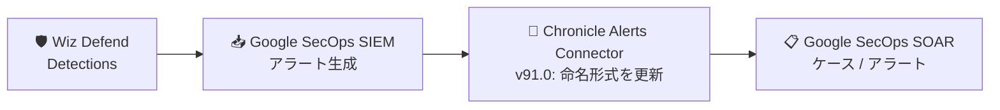

# Google SecOps Marketplace: Google Chronicle 統合 Version 91.0 - Wiz Defend アラート命名形式の更新

**リリース日**: 2026-07-30

**サービス**: Google SecOps Marketplace

**機能**: Google Chronicle 統合 Version 91.0 (Chronicle Alerts Connector)

**ステータス**: Change

📊 [このアップデートのインフォグラフィックを見る](https://takech9203.github.io/google-cloud-news-summary/20260730-google-secops-marketplace-chronicle-91.html)

## 概要

Google SecOps Marketplace の Google Chronicle 統合が Version 91.0 に更新され、Google Chronicle - Chronicle Alerts Connector における Wiz Defend アラートの命名形式 (naming format) が更新されました。

Chronicle Alerts Connector は、Google SecOps のルールベースアラートを取り込み、SOAR のケースとして扱えるようにするコネクタです。Wiz はエージェントレスで Google Cloud、AWS、Azure、OCI、Kubernetes 環境の可視化とリスク優先度付けを行うクラウドセキュリティプラットフォームで、Wiz Defend の検出結果 (Detections) を Google SecOps に取り込む連携が提供されています。今回の変更により、コネクタが取り込む Wiz Defend 由来のアラートの命名形式が更新されます。

なお、直前の 2026 年 7 月 22 日リリースの Version 90.0 では、同じ Chronicle Alerts Connector において Wiz Defend detections のハンドリングとオントロジーマッピングが更新されており、今回の Version 91.0 はその継続的な改善にあたります。

**アップデート前の課題**

- Version 90.0 で更新された Wiz Defend detections のハンドリングに対し、アラートの命名形式が最適化されていなかった

**アップデート後の改善**

- Chronicle Alerts Connector が取り込む Wiz Defend アラートの命名形式が更新され、SOAR 側でのアラート識別の一貫性が向上した

## アーキテクチャ図

Wiz Defend の検出結果は Google SecOps に取り込まれ、Chronicle Alerts Connector 経由で SOAR のアラートとして処理されます。Version 91.0 ではこのコネクタでの Wiz Defend アラートの命名形式が更新されました。

## サービスアップデートの詳細

### 主要機能

1. **Wiz Defend アラート命名形式の更新**
   - Google Chronicle - Chronicle Alerts Connector が取り込む Wiz Defend 由来のアラートについて、命名形式が更新された
   - Version 90.0 (2026-07-22) での Wiz Defend detections ハンドリング・オントロジーマッピング更新に続く変更

### Chronicle Alerts Connector の概要

公式ドキュメントによると、Chronicle Alerts Connector には以下の特徴があります。

| 項目 | 詳細 |
|------|------|
| 役割 | Google SecOps のルールベースアラートを SOAR に取り込む |
| クエリ範囲 | 1 週間以内のデータをクエリ (パディング期間とタイムアウトの調整が可能) |
| フィルタリング | ダイナミックリストによるアラートのフィルタリングに対応 (`Rule.severity`、`Rule.ruleName` など) |
| Fallback Severity | 重大度の値を持たないアラートに対するフォールバック重大度を設定可能 |

## 考慮すべき点

- アラート名に依存する SOAR のプレイブックトリガー、ダイナミックリストのフィルタ (例: ルール名・アラート名ベースの条件)、ケースの重複排除ロジックを運用している場合は、新しい命名形式で意図どおり動作するか確認することを推奨します
- 具体的な新旧の命名形式はリリースノートには記載されていないため、アップデート後の実際のアラート名を確認してください

## 関連サービス・機能

- **Google SecOps SOAR**: Chronicle Alerts Connector が取り込んだアラートをケースとして管理し、プレイブックで自動対応を行う
- **Wiz 統合 (SOAR Marketplace)**: Wiz の Issue 取得などのアクションを提供する Marketplace 統合 (2026-07-22 に Version 14.0 で Get Blue Agent Analysis アクションを追加)
- **Wiz ログインジェスト**: Wiz のログを `WIZ_IO` ログタイプとして Google SecOps SIEM に取り込むパーサー・連携が提供されている

## 参考リンク

- 📊 [インフォグラフィック](https://takech9203.github.io/google-cloud-news-summary/20260730-google-secops-marketplace-chronicle-91.html)
- [公式リリースノート](https://docs.cloud.google.com/release-notes#July_30_2026)
- [Google SecOps Marketplace リリースノート](https://docs.cloud.google.com/chronicle/docs/soar/marketplace-integrations/release-notes)
- [Google Chronicle 統合ドキュメント (Chronicle Alerts Connector)](https://docs.cloud.google.com/chronicle/docs/soar/marketplace-integrations/google-chronicle)
- [Wiz 統合ドキュメント](https://docs.cloud.google.com/chronicle/docs/soar/marketplace-integrations/wiz)
- [Wiz ログの取り込み](https://docs.cloud.google.com/chronicle/docs/ingestion/default-parsers/wiz-io)

## まとめ

Google Chronicle 統合 Version 91.0 は、Chronicle Alerts Connector における Wiz Defend アラートの命名形式を更新する小規模な変更です。Wiz Defend 連携を利用している場合は、アラート名に依存するプレイブックトリガーやフィルタ条件が新しい命名形式でも正しく動作するかを確認してください。

---

**タグ**: #GoogleSecOps #SOAR #Marketplace #Chronicle #Wiz #セキュリティ
