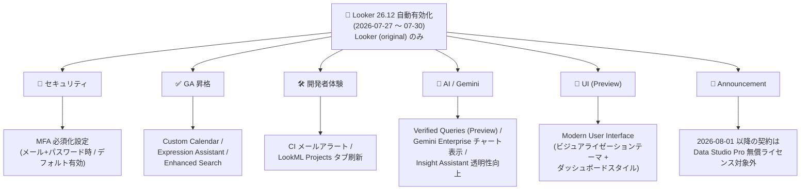
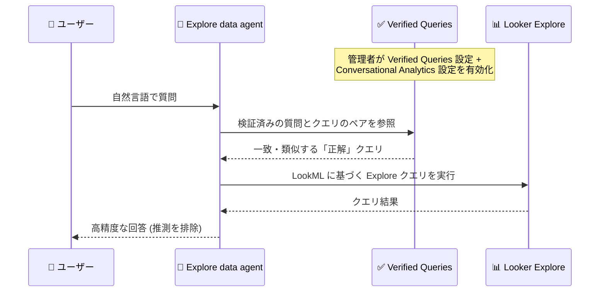

# Looker: Looker 26.12 自動有効化機能群 (MFA 必須化、Custom Calendar GA、Verified Queries Preview ほか)

**リリース日**: 2026-07-30

**サービス**: Looker

**機能**: Looker 26.12 を実行する Looker (original) インスタンスで自動有効化される機能群

**ステータス**: GA / Preview / デフォルト有効 (混在)、Announcement 1 件を含む

📊 [このアップデートのインフォグラフィックを見る](https://takech9203.github.io/google-cloud-news-summary/20260730-looker-26-12-auto-enabled-features.html)

## 概要

2026 年 7 月 27 日から 7 月 30 日にかけて、Looker 26.12 を実行する Looker (original) インスタンスに対して複数の機能が自動的に有効化されました。今回のアップデートは、セキュリティ強化 (メール + パスワードログインへの MFA 必須化設定)、機能の GA 昇格 (Custom Calendar、Expression Assistant、Enhanced Search)、開発者体験の改善 (Looker CI のメールアラート、LookML Projects ページのタブレイアウト刷新)、AI/Gemini 関連の強化 (Verified Queries Preview、Gemini Enterprise でのチャート表示、Insight Assistant の透明性向上)、UI モダナイゼーション (Modern User Interface Preview) と、幅広い領域をカバーしています。

また、ライセンスに関する重要なアナウンスとして、2026 年 8 月 1 日以降に締結された Looker 契約では Data Studio Pro の無償ライセンスが提供されなくなることが発表されました。

これらの機能はインスタンスの管理者による個別のアップグレード作業なしに自動で有効化されるため、Looker (original) を運用する管理者は、各機能の内容と影響 (特にセキュリティ設定と Preview 機能の扱い) を把握しておく必要があります。

**アップデート前の課題**

- メール + パスワード認証を使用するユーザーに対して、Looker の 2 要素認証 (2FA) を強制する管理者向けの必須化設定が今回の形では提供されておらず、認証強度の統制が難しかった
- 会計年度や小売業の 4-5-4 カレンダーなどの独自カレンダーを扱う Custom Calendar 機能、Gemini によるテーブル計算・カスタムフィールド式の作成を支援する Expression Assistant、コンテンツ検索を強化する Enhanced Search はいずれも Preview 段階であり、本番利用の判断が難しかった
- Looker CI の実行結果を知るには CI の実行状況を直接確認する必要があり、失敗やエラーをメールで受け取る仕組みがなかった
- Explore data agent (Conversational Analytics) は LookML スキーマとエージェント指示のみを手がかりに自然言語をクエリへ変換しており、複雑な業務質問に対する回答精度を「検証済みの正解ペア」で高める手段がなかった
- Gemini Enterprise に公開した Looker data agent との会話では、応答にチャートやビジュアライゼーションが含まれなかった
- Insight Assistant の応答がどのデータやフィールドに基づいて生成されたかが表示されず、結果の検証がしにくかった

**アップデート後の改善**

- 管理者はメール + パスワードでのログイン時に多要素認証 (MFA) を必須にできるようになった (この設定はデフォルトで有効)
- Custom Calendar、Expression Assistant、Enhanced Search が GA となり、本番環境で正式サポートのもと利用できるようになった
- Looker CI スイートの作成・編集時にメールアラートを有効化し、Failed / Error / Passed / Cancelled のステータスごとに通知先を指定できるようになった
- Verified Queries (golden queries、Preview) により、自然言語の質問と対応する Explore クエリの検証済みペアで Explore data agent を訓練し、回答精度を高められるようになった
- Gemini Enterprise 上の Looker data agent の応答にチャート・ビジュアライゼーションが含まれるようになった
- Insight Assistant が応答生成に使用したデータの詳細と Explore のフィールドを表示するようになり、結果の検証性が向上した
- LookML Projects ページが Models and Projects / Pending Projects / Marketplace Projects の 3 タブ構成に刷新され、パフォーマンスが向上した
- Modern User Interface (Preview) により、モダンなビジュアライゼーションテーマと高密度なダッシュボードスタイルを利用できるようになった

## アーキテクチャ図



Looker 26.12 で自動有効化される機能群を、セキュリティ・GA 昇格・開発者体験・AI/Gemini・UI・アナウンスの 6 グループに整理した図です。



Verified Queries (Preview) を使用した Explore data agent の応答フローです。検証済みの質問とクエリのペアが「正解の基準」として機能し、複雑な業務質問への回答精度を高めます。

## サービスアップデートの詳細

### 主要機能

1. **MFA (多要素認証) の必須化設定 (デフォルト有効)**
   - 管理者は、ユーザーがメールアドレスとパスワードでログインする際に多要素認証を必須にするようインスタンスを構成できる
   - Looker の 2FA は Google Authenticator などの Authenticator アプリで生成されるワンタイムコードを使用する
   - 2FA は Looker API の利用や、LDAP / SAML / Google OAuth / OpenID Connect などの外部認証システム経由の認証には影響しない (外部認証と併用する代替ログイン認証情報には影響する)

2. **Custom Calendar が GA**
   - 会計年度カレンダーや小売カレンダーなどの独自カレンダーをデータベース内のカレンダーテーブルとして定義し、LookML の `calendar_definition` ブロックと `type: custom_calendar` の dimension_group でモデル化できる
   - ユーザーは `custom_week` や `custom_period` などのカスタムタイムフレームを標準タイムフレームと同様に Explore クエリで利用できる
   - 前提条件: 対応するデータベース方言への接続、データベース内のカレンダーテーブル、新しい LookML ランタイムの使用

3. **Expression Assistant が GA**
   - Gemini in Looker が、テーブル計算 (table calculations) とカスタムフィールド (custom fields) の Looker 式の記述を支援する
   - Admin パネルの Platform セクションにある Gemini in Looker ページの Expression Assistant 設定で有効化する

4. **Enhanced Search が GA**
   - 保存済みコンテンツの検索機能が強化され、コンテンツの発見性が向上する

5. **Looker CI のメールアラート対応**
   - CI スイートの作成・編集時に「Enable email alerts」トグルを有効にすると、メール受信者と通知をトリガーする実行ステータス (Failed / Error / Passed / Cancelled) を指定できる
   - CI の失敗を能動的に監視しなくても、LookML の品質問題を早期に検知できる

6. **LookML Projects ページのタブレイアウト刷新**
   - よりパフォーマンスの高いタブ形式のレイアウトに更新され、Models and Projects / Pending Projects / Marketplace Projects の 3 タブで構成される

7. **Modern User Interface (Preview)**
   - モダンなレイアウトとデザイン、ビジュアライゼーションとダッシュボードの新しい構成設定を有効化する
   - Modern ビジュアライゼーションテーマ: 更新されたタイポグラフィと、視認性・アクセシビリティに配慮したモダンなカラーパレットを提供
   - Modern ダッシュボードスタイル: データ表示を最適化し Google の最新デザイン標準に沿った、高密度で洗練されたデザインを提供
   - Admin パネルの Preview ページで有効化する (デフォルトでは無効)

8. **Verified Queries / Golden Queries (Preview)**
   - 自然言語の質問と、それに対応する正確な Looker Explore クエリの事前定義ペア
   - 検証済みの「正解の基準」として機能し、Explore data agent が複雑な業務要求を推測なしで処理できるように訓練する
   - 有効化には、Gemini in Looker 管理ページで Verified Queries 設定をオンにし、あわせて Conversational Analytics 設定も有効にする必要がある

9. **Gemini Enterprise でのチャート・ビジュアライゼーション表示 (Change)**
   - Looker で作成した data agent と Gemini Enterprise でチャットする際、エージェントの応答にチャートとビジュアライゼーションが含まれるようになった

10. **Insight Assistant の応答生成プロセス表示 (Change)**
    - Insight Assistant が応答の生成に使用したプロセスを表示し、応答生成に使用したデータの主要な詳細と、使用した Explore のフィールドを一覧表示する

11. **Data Studio Pro 無償ライセンスの提供終了 (Announcement)**
    - 2026 年 8 月 1 日以降に締結された Looker 契約に紐づく Looker インスタンスでは、Data Studio Pro の無償ライセンス (Complimentary Data Studio Pro licenses) が提供されない

## 技術仕様

### 機能ごとのステータスと有効化条件

| 機能 | ステータス | 有効化 |
|------|-----------|--------|
| MFA 必須化設定 | 提供開始 | デフォルト有効 (管理者が構成) |
| Custom Calendar | GA | LookML でのモデル化が必要 |
| Expression Assistant | GA | Gemini in Looker ページで設定 |
| Enhanced Search | GA | 自動有効化 |
| CI メールアラート | 提供開始 | CI スイートごとにトグルで有効化 |
| LookML Projects ページ刷新 | 提供開始 | 自動適用 |
| Modern User Interface | Preview | Admin パネルの Preview ページで有効化 (デフォルト無効) |
| Verified Queries | Preview | Gemini in Looker ページの Verified Queries 設定 + Conversational Analytics 設定 |
| Gemini Enterprise チャート表示 | Change | 自動適用 |
| Insight Assistant プロセス表示 | Change | 自動適用 |

### Verified Queries の制限事項

| 項目 | 詳細 |
|------|------|
| 対象エージェント | Explore data agent のみ (スタンドアロン会話、dashboard data agent は非対応) |
| Explore の条件 | エージェントに定義済みの Explore を使用する必要がある |
| 非対応クエリ | カスタムフィールドまたはピボットを含む Explore クエリは非対応 |
| 推奨数 | 数に上限はないが、エージェントあたり 30〜50 ペアを推奨 |
| 対象インスタンス | Looker (original) インスタンスのみ |

### Modern visualization テーマの対応チャートタイプ (Preview 時点)

| カテゴリ | チャートタイプ |
|----------|----------------|
| Cartesian | column、bar、line、area |
| Pie | pie、donut multiples |
| その他 | single value、table |
| 非対応 | boxplot、funnel、maps、scatter、table (legacy)、timeline、waterfall など |

### Custom Calendar の LookML 例

```lookml
view: fiscal_calendar {
  sql_table_name: fiscal_calendar_table ;;
  calendar_definition: {
    reference_date: reference_date
    timeframe_mapping: {
      custom_year: fiscal_year
      custom_quarter: fiscal_quarter_of_year
      custom_week: fiscal_week_of_year
      custom_period: fiscal_period_of_year
    }
    timeframe_ordinal_mapping: {
      custom_year: fiscal_year_num
      custom_quarter: fiscal_quarter_of_year_num
      custom_week: fiscal_week_of_year_num
      custom_period: fiscal_period_of_year_num
    }
  }
  # dimension 定義 ...
}

view: orders {
  sql_table_name: public.orders ;;
  dimension_group: created {
    type: custom_calendar
    custom_timeframes: [custom_date, custom_week, custom_year]
    sql: ${TABLE}.created_at ;;
    based_on_calendar: fiscal_calendar
  }
}
```

## 設定方法

### 前提条件

1. Looker (original) インスタンスが Looker 26.12 を実行していること (2026 年 7 月 12 日〜26 日にロールアウト済み)
2. 各設定の変更には Admin パネルへのアクセス権限 (Admin ロールなど) が必要

### 手順

#### ステップ 1: MFA / 2FA の構成を確認する

Admin メニューの Authentication セクションにある Two-Factor Authentication ページで 2FA の有効化・構成を行います。メール + パスワードログインに対する MFA 必須化設定はデフォルトで有効です。2FA を有効化すると、ログイン中のユーザーはログアウトされ、2FA を使用した再ログインが必要になる点に注意してください。

#### ステップ 2: Verified Queries を有効化する (Preview)

1. Admin パネルの Gemini in Looker ページで Verified Queries 設定をオンにする
2. Conversational Analytics 設定が有効であることを確認する
3. Explore data agent の作成・編集ページで「+ Add verified query」を選択し、自然言語の質問 (Question) と対応する Explore クエリの URL (Answer) を登録して Preview で検証後、保存する

#### ステップ 3: CI メールアラートを設定する

CI スイートの作成・編集画面で「Enable email alerts」トグルを有効にし、通知先メールアドレスと、通知対象のステータス (Failed / Error / Passed / Cancelled) を選択します。

#### ステップ 4: Modern User Interface を試す (Preview)

Admin パネルの Preview ページで Modern User Interface プレビュー機能を有効化します。有効化後に新規作成されるダッシュボードは Modern スタイルがデフォルトになりますが、既存ダッシュボードは Classic スタイルを維持します (Dashboard style 設定で個別に変更可能)。既存チャートに Modern テーマを適用するにはタイルの編集が必要です。

## メリット

### ビジネス面

- **セキュリティガバナンスの強化**: メール + パスワード認証への MFA 必須化により、不正アクセスリスクを低減し、組織のセキュリティポリシーへの準拠を促進できる
- **AI 回答の信頼性向上**: Verified Queries により Explore data agent の回答が検証済みクエリに基づくものとなり、Insight Assistant のプロセス表示とあわせて AI 活用の説明責任 (トレーサビリティ) を果たしやすくなる
- **業務カレンダーに沿った分析の正式サポート**: Custom Calendar の GA により、会計年度や独自の営業期間に基づくレポーティングを正式サポートのもとで運用できる

### 技術面

- **CI/CD 運用の効率化**: Looker CI のメールアラートにより、LookML の品質問題をステータスベースで即座に検知できる
- **開発 UI の性能向上**: LookML Projects ページのタブレイアウト刷新により、プロジェクト管理画面のパフォーマンスと視認性が向上する
- **アクセシビリティに配慮したビジュアル**: Modern カラーコレクションは、コントラストの確保や色覚多様性への配慮を目標に開発されており、より読みやすいチャートを実現する

## デメリット・制約事項

### 制限事項

- 今回の自動有効化の対象は **Looker (original) インスタンスのみ** (Looker (Google Cloud core) は対象外。ただし Modern User Interface プレビュー機能自体は両デプロイメントタイプでサポートされる)
- Verified Queries は Preview であり、Explore data agent のみ対応。カスタムフィールドやピボットを含むクエリは登録できない
- Modern visualization テーマは Preview 時点で主要チャートタイプのみ対応 (boxplot、funnel、maps などは非対応)
- Custom Calendar には制約がある: フィルター付きメジャー・高度なフィルター・OR フィルターでの利用不可、dimension fill 非対応、対応データベース方言が限定される
- Looker の 2FA は全ユーザーに適用され、一部のユーザーのみに有効化するオプションはない

### 考慮すべき点

- 2FA を有効化した時点でログイン中の全ユーザーがログアウトされるため、有効化のタイミングは業務影響を考慮して計画する
- 2FA は時刻ベースのトークンを使用するため、Looker サーバーとモバイルデバイスの時刻同期が必要 (許容ドリフトのデフォルトは 90 秒)
- Modern User Interface は Preview 機能であり、Pre-GA Offerings Terms が適用される。本番ダッシュボードへの適用は影響を確認してから行う
- 2026 年 8 月 1 日以降に Looker 契約を締結する場合、Data Studio Pro の無償ライセンスが付属しないため、Data Studio Pro (Looker Studio Pro) が必要な場合はライセンスコストを別途見積もる必要がある

## ユースケース

### ユースケース 1: 会計年度ベースの経営レポーティング

**シナリオ**: 4 月始まりの会計年度を採用する企業が、会計四半期・会計週単位で売上を分析したい。

**実装例**:
```lookml
dimension_group: order_created {
  type: custom_calendar
  custom_timeframes: [custom_year, custom_quarter, custom_week]
  sql: ${TABLE}.created_at ;;
  based_on_calendar: fiscal_calendar
}
```

**効果**: GA となった Custom Calendar により、会計年度・会計四半期のタイムフレームを標準タイムフレームと同様に Explore で利用でき、期間比較 (period-over-period) 分析にも対応できる。

### ユースケース 2: 経営層向け data agent の回答精度向上

**シナリオ**: 「前四半期の新規売上は?」のような定型的だが重要な質問に対して、Explore data agent が常に正しいフィールドとフィルターでクエリを実行するようにしたい。

**効果**: Verified Queries に質問と正解クエリのペア (推奨 30〜50 件) を登録することで、エージェントが推測に頼らず検証済みのクエリパターンに基づいて回答するようになり、経営指標に関する誤回答のリスクを低減できる。

### ユースケース 3: LookML 品質ゲートの自動監視

**シナリオ**: 複数チームが LookML を開発しており、CI の失敗を見逃してブロークンなコンテンツが本番に混入することを防ぎたい。

**効果**: CI スイートのメールアラートで Failed / Error ステータスを開発リードに通知することで、CI 結果の能動的な確認が不要になり、問題の検知から修正までのリードタイムを短縮できる。

## 料金

今回のアップデートによる Looker (original) の料金体系への変更は Release Notes には記載されていません。Looker の料金は契約ベースです。詳細は料金ページを参照してください。

- [Looker 料金ページ](https://cloud.google.com/looker/pricing)

なお、2026 年 8 月 1 日以降に締結される Looker 契約では Data Studio Pro の無償ライセンスが提供されなくなるため、該当する場合はライセンス費用への影響を確認してください。

## 関連サービス・機能

- **Gemini in Looker**: Expression Assistant、Insight Assistant、Verified Queries はいずれも Gemini in Looker の機能群であり、Admin パネルの Gemini in Looker ページで有効化を管理する
- **Conversational Analytics**: Verified Queries は Explore data agent の文脈 (authored context) の一部として機能し、Conversational Analytics 設定の有効化が前提となる
- **Gemini Enterprise**: Looker で作成した data agent を Gemini Enterprise に公開でき、今回のアップデートで応答にチャート・ビジュアライゼーションが含まれるようになった
- **Looker Studio (Data Studio) Pro**: 従来 Looker 契約に付属していた無償ライセンスが、2026 年 8 月 1 日以降の新規契約では提供されなくなる
- **Looker Continuous Integration (CI)**: LookML の品質検証を自動化する機能で、今回メールアラートに対応した

## 参考リンク

- 📊 [インフォグラフィック](https://takech9203.github.io/google-cloud-news-summary/20260730-looker-26-12-auto-enabled-features.html)
- [公式リリースノート](https://docs.cloud.google.com/release-notes#July_30_2026)
- [Looker リリースノート](https://docs.cloud.google.com/looker/docs/release-notes)
- [二要素認証 (2FA) の管理](https://docs.cloud.google.com/looker/docs/admin-panel-authentication-two-factor)
- [Custom Calendars](https://docs.cloud.google.com/looker/docs/custom-calendars)
- [Expression Assistant](https://docs.cloud.google.com/looker/docs/gemini-expression-asst)
- [Enhanced Search (コンテンツの検索)](https://docs.cloud.google.com/looker/docs/finding-content#searching_for_saved_content)
- [Looker CI のアラート設定](https://docs.cloud.google.com/looker/docs/ci-create-suite#alerting)
- [LookML Projects ページ](https://docs.cloud.google.com/looker/docs/manage-projects)
- [Modern User Interface](https://docs.cloud.google.com/looker/docs/modern-ui)
- [Verified Queries の定義](https://docs.cloud.google.com/looker/docs/conversational-analytics-looker-data-agents#define-verified-queries)
- [Insight Assistant](https://docs.cloud.google.com/looker/docs/gemini-insight-asst)
- [Complimentary Data Studio Pro licenses](https://docs.cloud.google.com/looker/docs/admin-panel-platform-dsp)
- [料金ページ](https://cloud.google.com/looker/pricing)

## まとめ

Looker 26.12 の自動有効化機能群は、MFA 必須化によるセキュリティ強化から、Custom Calendar・Expression Assistant・Enhanced Search の GA 昇格、Verified Queries による AI 回答精度の向上まで、Looker (original) の運用に幅広く影響するアップデートです。管理者はまず MFA 設定と自動適用された UI 変更の影響を確認し、Verified Queries や Modern User Interface などの Preview 機能は検証環境で評価したうえで、2026 年 8 月 1 日以降の契約における Data Studio Pro ライセンス変更もあわせて確認することを推奨します。

---

**タグ**: Looker, Looker 26.12, MFA, 多要素認証, Custom Calendar, Expression Assistant, Enhanced Search, Looker CI, Modern UI, Verified Queries, Golden Queries, Gemini in Looker, Conversational Analytics, Gemini Enterprise, Insight Assistant, Data Studio Pro
