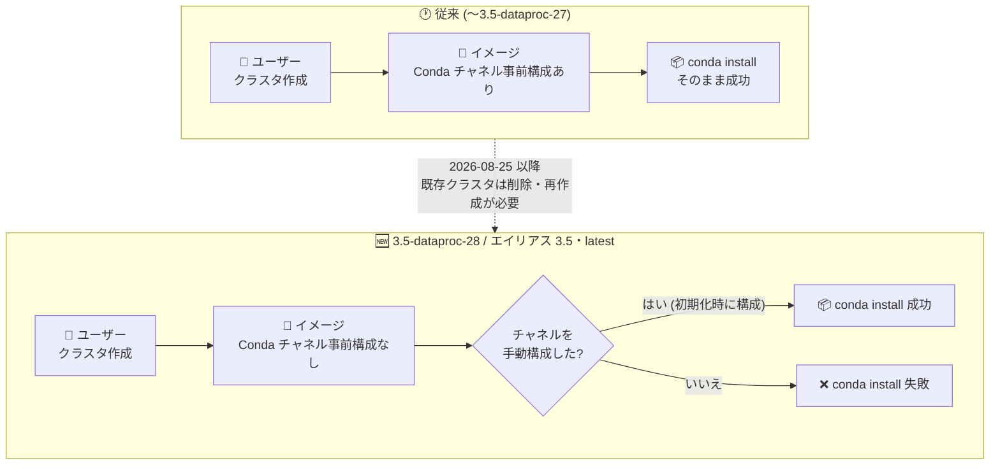
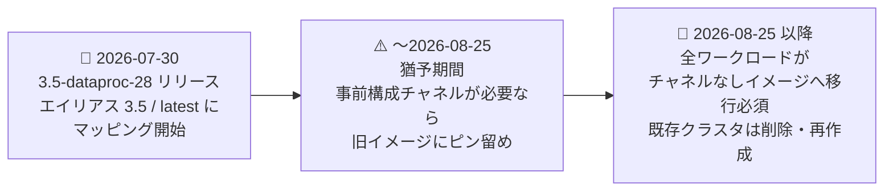

# Managed Service for Apache Spark (on GKE): 新サブマイナーイメージ 3.5-dataproc-28 で Conda チャネルの事前構成を廃止 (Breaking Change)

**リリース日**: 2026-07-30

**サービス**: Managed Service for Apache Spark (on GKE, 旧 Dataproc on GKE)

**機能**: サブマイナーイメージバージョン 3.5-dataproc-28 (Conda チャネル事前構成なし)

**ステータス**: Announcement (Breaking 要素あり)

📊 [このアップデートのインフォグラフィックを見る](https://takech9203.github.io/google-cloud-news-summary/20260730-managed-spark-gke-conda-channels-change.html)

## 概要

Managed Service for Apache Spark on GKE (旧 Dataproc on GKE) に、新しいサブマイナーイメージバージョン **3.5-dataproc-28** がリリースされました。このイメージの最大の変更点は、**Conda チャネルが事前構成されていない**ことです。さらに、この新イメージは `3.5` や `latest` といった**デフォルトエイリアスに即座にマッピングされる**ため、エイリアス指定でクラスタを作成しているユーザーは意識せずに新イメージを利用することになります。

影響として、3.5-dataproc-28 またはデフォルトエイリアスを使用してクラスタを作成した場合、クラスタ初期化時にチャネルを手動で構成しない限り、**Conda を使用したパッケージのインストールができなくなります**。PySpark ワークロードで Conda によるパッケージ管理に依存しているユーザーは注意が必要です。

移行スケジュールも明確に示されています。**2026 年 8 月 25 日**以降、すべてのワークロードは Conda チャネルが事前構成されていないイメージバージョンへ移行する必要があり、事前構成済み Conda チャネルを持つイメージで作成された既存クラスタは、同日以降に**削除して再作成 (置き換え)** する必要があります。なお、同様の変更は Managed Service for Apache Spark (旧 Dataproc on Compute Engine) でも 2026 年 6 月 22 日に発表されており、Dataproc 系サービス全体で進行している変更です。

**アップデート前の課題 (従来の動作)**

- 従来のイメージ (3.5-dataproc-22 など) では Conda チャネルが事前構成されており、`dataproc:conda.packages` などのプロパティや Conda コマンドで追加設定なしにパッケージをインストールできた
- Conda チャネルの構成はイメージに組み込まれており、ユーザーが明示的に管理する必要がなかった

**アップデート後の変更**

- 3.5-dataproc-28 では Conda チャネルが事前構成されず、チャネルを手動構成しない限り Conda でのパッケージインストールが不可になった
- 新イメージが `3.5` や `latest` などのデフォルトエイリアスに即マッピングされるため、エイリアス指定のクラスタ作成は自動的に新イメージの影響を受ける
- 事前構成済みチャネルが必要なワークロードは、2026 年 8 月 25 日までに従来イメージバージョンへのピン留めが必要になった
- 2026 年 8 月 25 日以降は、事前構成済みチャネルを持つイメージで作成された既存クラスタの削除・再作成が必要になった

## アーキテクチャ図



従来イメージでは Conda チャネルが事前構成されていましたが、3.5-dataproc-28 (およびデフォルトエイリアス経由の作成) ではクラスタ初期化時にチャネルを手動構成しない限り Conda でのパッケージインストールが失敗します。

### 移行タイムライン



## サービスアップデートの詳細

### 主要な変更点

1. **Conda チャネルの事前構成廃止**
   - 新サブマイナーイメージ 3.5-dataproc-28 には Conda チャネルが事前構成されていない
   - クラスタ初期化時にチャネルを手動で構成しない限り、Conda を使用したパッケージインストールは不可

2. **デフォルトエイリアスへの即時マッピング**
   - 3.5-dataproc-28 は `3.5` や `latest` などのデフォルトエイリアスにマッピングされる
   - エイリアスはクラスタ作成時に解決されるため、`--spark-engine-version=latest` や `3.5` を指定して作成するクラスタは自動的に新イメージになる
   - 同時期の Compute Engine 版の変更 (新サブマイナーはエイリアスに 8/25 までマッピングされない) とは異なり、GKE 版は**エイリアスへの反映が即時**である点に注意

3. **移行期限とクラスタ再作成の要件**
   - 事前構成済み Conda チャネルが必要なワークロードは、**2026 年 8 月 25 日より前に**従来イメージバージョンへクラスタをピン留めする
   - 2026 年 8 月 25 日以降、すべてのワークロードは Conda チャネルが事前構成されていないイメージへ移行する必要がある
   - 事前構成済みチャネルを持つイメージで作成された既存クラスタは、2026 年 8 月 25 日以降に削除して置き換える必要がある

## 技術仕様

### 影響を受けるバージョン指定方法

| 指定方法 | 例 | 影響 |
|------|------|------|
| 新サブマイナーの明示指定 | `3.5-dataproc-28` | Conda チャネルなし (影響あり) |
| メジャー.マイナーエイリアス | `3.5` | 新イメージに解決されるため影響あり |
| 最新エイリアス | `latest` | 新イメージに解決されるため影響あり |
| 旧サブマイナーの明示指定 (ピン留め) | 従来のサブミナーバージョン | 事前構成チャネルあり (2026-08-25 まで利用可) |

### Spark エンジンバージョンのエイリアス解決

Managed Service for Apache Spark on GKE では、`--spark-engine-version` に完全修飾バージョン (`3.5-dataproc-[NUMBER]`) のほか、`3`、`3.5`、`latest` などのエイリアスを指定できます。エイリアスは**クラスタ作成時に解決 (dereference)** されるため、同じエイリアスで作成した複数クラスタが同一の具体バージョンになる保証はありません。バージョンの一貫性が必要な場合はエイリアスではなく完全修飾バージョンを指定することが公式に推奨されています。

## 設定方法

### 前提条件

1. 既存の Managed Service for Apache Spark on GKE 仮想クラスタのイメージバージョンと、Conda によるパッケージインストールへの依存有無を確認していること
2. gcloud CLI が利用可能であること

### 手順

#### ステップ 1: 影響の確認 (使用中のバージョン確認)

```bash
gcloud dataproc clusters describe ${DP_CLUSTER} \
    --region=${REGION}
```

クラスタの Spark エンジンバージョン (componentVersion) を確認し、事前構成済み Conda チャネルを持つイメージか、エイリアス指定で作成されたかを把握します。

#### ステップ 2 (暫定対応): 旧イメージバージョンへのピン留め

事前構成済み Conda チャネルが必要なワークロードは、2026 年 8 月 25 日より前に、エイリアスではなく従来のサブマイナーバージョンを明示指定してクラスタを作成します。

```bash
gcloud dataproc clusters gke create ${DP_CLUSTER} \
    --region=${REGION} \
    --gke-cluster=${GKE_CLUSTER} \
    --spark-engine-version=3.5-dataproc-22 \
    --pools="name=${DP_POOLNAME},roles=default" \
    --setup-workload-identity
```

`latest` や `3.5` のエイリアスは新イメージに解決されるため、ピン留めには完全修飾バージョン (例: `3.5-dataproc-22`) を指定します。

#### ステップ 3 (恒久対応): クラスタの再作成

2026 年 8 月 25 日以降は、事前構成済みチャネルを持つイメージで作成された既存クラスタを削除し、新イメージで再作成する必要があります。公式ドキュメントの再作成手順は以下のとおりです。

```bash
# 環境変数を設定
CLUSTER=既存クラスタ名
REGION=リージョン

# 1. 既存クラスタの構成を YAML にエクスポート
gcloud dataproc clusters export $CLUSTER \
    --region=$REGION > "${CLUSTER}-config.yaml"

# 2. kubernetesNamespace フィールドを削除 (名前空間の競合回避のため必須)
sed -E "s/kubernetesNamespace: .+$//g" ${CLUSTER}-config.yaml
# 必要に応じて componentVersion (Spark エンジンバージョン) も更新

# 3. 既存クラスタを削除 (同名で置き換える場合)
gcloud dataproc clusters delete $CLUSTER --region=$REGION

# 4. 削除完了後、更新した構成でクラスタを再作成
gcloud dataproc clusters import $CLUSTER \
    --region=$REGION \
    --source="${CLUSTER}-config.yaml"
```

Conda パッケージが必要なワークロードは、再作成時にクラスタ初期化の中で Conda チャネルを手動構成する必要があります。

## デメリット・制約事項

### 制限事項

- 3.5-dataproc-28 およびデフォルトエイリアス (`3.5`、`latest`) で作成したクラスタでは、チャネルを手動構成しない限り Conda でパッケージをインストールできない
- 旧イメージへのピン留めは 2026 年 8 月 25 日までの暫定対応であり、それ以降はすべてのワークロードがチャネルなしイメージへ移行する必要がある
- 2026 年 8 月 25 日以降、事前構成済みチャネルを持つイメージで作成された既存クラスタは削除・再作成が必要 (in-place での変更は不可)
- Google Cloud コンソールは構成インポートによるクラスタ再作成をサポートしていない (gcloud CLI または REST API を使用)

### 考慮すべき点

- **エイリアス利用者は即時に影響を受ける**: `--spark-engine-version=latest` や `3.5` を使う自動化 (IaC、CI/CD、スケジュールジョブなど) は、次回のクラスタ作成から新イメージになる。Conda 依存があるパイプラインは早急な確認が必要
- **Conda を使っていなくても再作成は必要**: リリースノートでは「クラスタのジョブが Conda を使用していなくても」事前構成済みチャネルのイメージで作成された既存クラスタは削除・置き換えが必要と明記されている
- **バージョン一貫性**: エイリアスは作成時に解決されるため、本番環境では完全修飾バージョンの指定が推奨される
- Compute Engine 版 (旧 Dataproc on Compute Engine) でも同様の変更が進行中 (2026 年 6 月 22 日発表、期限は同じく 2026 年 8 月 25 日) のため、両方式を利用している場合は合わせて移行計画を立てるとよい

## ユースケース

### ユースケース 1: Conda 依存の PySpark パイプラインの移行

**シナリオ**: `latest` エイリアスでクラスタを作成し、Conda でデータサイエンス系パッケージをインストールしている日次バッチパイプラインを運用している。

**実装例**:
```bash
# 暫定: 2026-08-25 より前に完全修飾バージョンへピン留め
gcloud dataproc clusters gke create my-cluster \
    --region=us-central1 \
    --gke-cluster=my-gke-cluster \
    --spark-engine-version=3.5-dataproc-22 \
    --pools='name=dp,roles=default'
```

**効果**: 新イメージへの意図しない切り替わりによるパッケージインストール失敗を回避しつつ、期限までにチャネル手動構成またはコンテナ側での依存関係管理へ移行する時間を確保できる。

### ユースケース 2: 2026 年 8 月 25 日以降の既存クラスタ置き換え

**シナリオ**: 事前構成済み Conda チャネルのイメージで作成した長期稼働クラスタがあり、期限以降も運用を続けたい。

**効果**: 構成エクスポート → `kubernetesNamespace` 削除 → クラスタ削除 → インポートの手順で、既存構成を引き継ぎながらチャネルなしの新イメージへ移行できる。Conda が必要な場合は初期化時のチャネル手動構成を組み込む。

## 関連サービス・機能

- **Google Kubernetes Engine (GKE)**: Managed Service for Apache Spark on GKE の仮想クラスタは既存の GKE クラスタ上のノードプールで動作する
- **Managed Service for Apache Spark (旧 Dataproc on Compute Engine)**: 同様の Conda チャネル廃止の変更が 2026 年 6 月 22 日に発表済み (新サブマイナー 1.3.96 / 1.4.81 / 1.5.92 / 2.0.161 / 2.3.32 など、期限は同じく 2026 年 8 月 25 日)
- **Persistent History Server (PHS)**: クラスタ再作成 (削除・置き換え) 後も、PHS を構成していれば削除済みクラスタの Spark ジョブ履歴を参照できる
- **Cloud Storage**: ステージングバケットとして利用されるほか、Conda 環境定義ファイル (environment.yaml) の配置先としても利用される

## 参考リンク

- 📊 [インフォグラフィック](https://takech9203.github.io/google-cloud-news-summary/20260730-managed-spark-gke-conda-channels-change.html)
- [公式リリースノート](https://docs.cloud.google.com/release-notes#July_30_2026)
- [Managed Service for Apache Spark on GKE のサポート対象バージョン](https://docs.cloud.google.com/managed-spark/docs/guides/dpgke/gke-versions)
- [Managed Service for Apache Spark on GKE クラスタの作成](https://docs.cloud.google.com/managed-spark/docs/guides/dpgke/quickstarts/gke-quickstart-create-cluster#create-dpgke-cluster)
- [Managed Service for Apache Spark on GKE クラスタの再作成と更新](https://docs.cloud.google.com/managed-spark/docs/guides/dpgke/gke-recreate-cluster#recreate-gke-cluster)

## まとめ

このアップデートは、Managed Service for Apache Spark on GKE のイメージから事前構成済み Conda チャネルを廃止する Breaking Change であり、新イメージ 3.5-dataproc-28 がデフォルトエイリアス (`3.5`、`latest`) に即時マッピングされる点が特に重要です。エイリアス指定でクラスタを作成している環境や Conda 依存のワークロードは、まず影響有無を確認し、必要に応じて 2026 年 8 月 25 日より前に旧イメージへのピン留めを行ってください。期限以降はすべてのワークロードがチャネルなしイメージへの移行を求められ、事前構成済みチャネルのイメージで作成された既存クラスタは削除・再作成が必要になるため、計画的な移行を推奨します。

---

**タグ**: #ManagedServiceForApacheSpark #DataprocOnGKE #GKE #Conda #BreakingChange #ApacheSpark #PySpark
