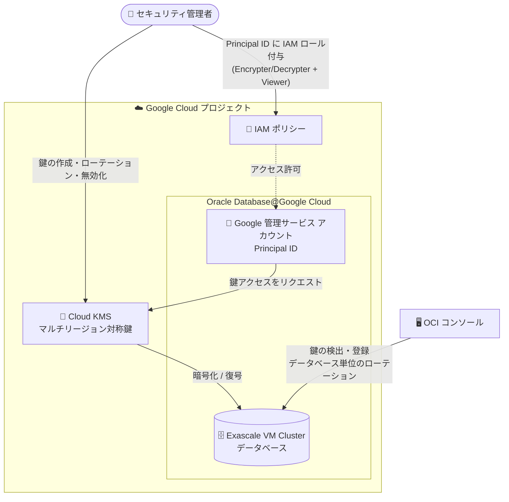

# Oracle Database@Google Cloud: Exascale VM Cluster の顧客管理暗号鍵 (CMEK) サポート (GA)

**リリース日**: 2026-07-30

**サービス**: Oracle Database@Google Cloud

**機能**: Exascale VM Cluster に対する顧客管理暗号鍵 (CMEK) のサポート

**ステータス**: 一般提供 (GA)

📊 [このアップデートのインフォグラフィックを見る](https://takech9203.github.io/google-cloud-news-summary/20260730-oracle-database-google-cloud-exascale-cmek.html)

## 概要

Oracle Database@Google Cloud において、Exascale VM Cluster に対する顧客管理暗号鍵 (CMEK: Customer-Managed Encryption Keys) のサポートが一般提供 (GA) になりました。Cloud Key Management Service (Cloud KMS) で管理する暗号鍵を使用して、Exascale VM Cluster 上のデータベースを暗号化できます。

Oracle Database@Google Cloud は、Oracle 管理の暗号化 (Oracle Vault や Oracle Wallet など) に加えて、Google Cloud CMEK による暗号化オプションを提供しています。CMEK を使用すると、鍵の保護レベル、ロケーション、ローテーション スケジュール、使用・アクセス権限、暗号境界を利用者自身で制御でき、組織固有のコンプライアンス基準に合わせた鍵のライフサイクル管理 (付与、取り消し、ローテーション) が可能になります。

CMEK は従来、Exadata VM Cluster と Autonomous AI Database でサポートされていましたが、今回のアップデートにより Exascale VM Cluster が対象リソースに加わりました。金融や公共など、暗号鍵の自己管理が求められる規制産業で Exadata Database Service on Exascale Infrastructure を利用する組織にとって重要なアップデートです。

**アップデート前の課題**

- Exascale VM Cluster では Google Cloud CMEK による暗号化を有効化できず、鍵のライフサイクルを自組織で管理する要件 (鍵の付与・取り消し・ローテーションの自己管理) を Exascale 環境で満たせなかった
- Oracle Database@Google Cloud の CMEK 対応リソースは Exadata VM Cluster と Autonomous AI Database に限られていた

**アップデート後の改善**

- Exascale VM Cluster で Cloud KMS の鍵を使用した CMEK を有効化できるようになった
- クラスタのプロビジョニング時に自動作成される Google 管理のサービス アカウント (Principal ID) に Cloud KMS の IAM ロールを付与するだけで、鍵へのアクセスを精密に制御できるようになった
- 鍵の無効化によるリソースの保護的なオフライン化 (アクセス遮断) など、Cloud KMS を起点としたデータアクセス制御を Exascale 環境でも利用可能になった

## アーキテクチャ図



Exascale VM Cluster のプロビジョニング時に自動作成される Google 管理のサービス アカウントに Cloud KMS の IAM ロールを付与することで、クラスタ上のデータベースが顧客管理鍵で暗号化されます。鍵の登録やデータベース単位のローテーションは OCI コンソールから行います。

## サービスアップデートの詳細

### 主要機能

1. **Exascale VM Cluster での CMEK 有効化**
   - Cloud KMS で管理する鍵 (KEK: Key Encryption Key) を使用して Exascale VM Cluster 上のデータを暗号化
   - 鍵の保護レベル、ロケーション、ローテーション スケジュール、使用・アクセス権限を利用者が制御
   - Google Cloud コンソールの Exascale infrastructure ページから設定

2. **Google 管理サービス アカウントによる鍵アクセス制御**
   - Exascale VM Cluster のプロビジョニング時に、CMEK 有効化専用のサービス アカウントが自動作成される (Exadata / Exascale VM Cluster では Google 管理、Autonomous AI Database では Oracle 管理)
   - サービス アカウントにはデフォルトで権限が付与されておらず、利用者が明示的に Cloud KMS の IAM ロールを付与する必要がある
   - リソース単位で精密な IAM 権限管理が可能

3. **暗号化詳細の確認と鍵のローテーション**
   - Google Cloud コンソールのクラスタ詳細ページで Principal ID と鍵を確認可能
   - Exascale VM Cluster 上のデータベースの鍵ローテーションは OCI コンソールから実行
   - データベースの暗号化詳細は OCI コンソールで確認

## 技術仕様

### CMEK の仕様

| 項目 | 詳細 |
|------|------|
| 鍵管理サービス | Cloud Key Management Service (Cloud KMS) |
| サポートされる鍵 | マルチリージョンの対称鍵のみ |
| CMEK 対応リソース | Exadata VM Cluster、Exascale VM Cluster、Autonomous AI Database |
| サービス アカウント | プロビジョニング時に自動作成 (Exascale VM Cluster では Google 管理) |
| 必要な IAM ロール (Principal ID へ付与) | Cloud KMS CryptoKey Encrypter/Decrypter、Cloud KMS Viewer |
| 鍵のローテーション | OCI コンソールから実行 (データベース単位) |
| 既存クラスタへの適用 | 2026 年 7 月 30 日より前に作成された Exascale VM Cluster は Cloud Customer Care への連絡が必要 |

### 鍵が利用できない場合の動作

| 状態 | 動作 |
|------|------|
| 鍵の削除 | その鍵で暗号化されたリソースは**永久にアクセス不能**になる |
| 鍵の無効化 | 30 分以内にリソースがダウンタイムに入る。鍵を再有効化するとリソースが復旧する |
| Cloud KMS との接続断 | 30 分経過しても再接続できない場合、保護措置としてリソースをオフライン化。再接続して鍵がアクティブと確認されるまでデータにアクセス不能 |
| 権限不足 | リソースにアクセスできなくなる場合がある |

## 設定方法

### 前提条件

1. 暗号鍵を保存するプロジェクトで Cloud Key Management Service API を有効化する
2. Cloud KMS の鍵を操作するための IAM 権限を持っている (Cloud KMS 管理者ロールに必要な権限が含まれる)
   - 鍵リング・鍵の作成: `cloudkms.keyRings.create`、`cloudkms.cryptoKeys.create` など
   - サービス アカウントへの鍵アクセス付与: `cloudkms.cryptoKeys.setIamPolicy`
3. Cloud KMS の鍵リングと鍵を作成する (マルチリージョンの対称鍵のみサポート)
4. Oracle Database@Google Cloud リソースを操作する権限を持っている

### 手順

#### ステップ 1: Exascale VM Cluster のサービス アカウントを確認する

1. Google Cloud コンソールで **Exascale infrastructure** ページに移動する
2. **VM Clusters** タブを選択し、CMEK を有効化するクラスタ名をクリックする
3. **Google-managed service account** セクションで **Status** を確認する
   - **Disconnected** の場合は Cloud カスタマーケアに連絡する
   - **Connected** で Principal ID が表示されている場合は次に進む
4. **Principal ID** をコピーする (プロビジョニング時に生成される Principal ID はクラスタ固有で、デフォルトでは権限なし)

#### ステップ 2: Cloud KMS の鍵にアクセス権を付与する

1. **Cloud KMS の鍵管理**ページに移動し、対象の鍵リング → 鍵を選択する
2. **プリンシパルを追加**をクリックし、コピーした Principal ID を貼り付ける
3. 以下のロールを割り当てて保存する
   - **Cloud KMS CryptoKey Encrypter/Decrypter**
   - **Cloud KMS Viewer**

#### ステップ 3: OCI コンソールで鍵を検出・登録する

上記の手順が完了したら、OCI コンソールに移動し、データベース用の鍵を検出 (discover) して登録する。手順の詳細は Oracle のドキュメント (GCP KMS Integration for Oracle Database@Google Cloud) を参照。

## メリット

### ビジネス面

- **コンプライアンス対応**: 暗号鍵の自己管理が求められる組織標準や規制要件を、Exascale インフラストラクチャ上の Oracle データベースでも満たせる
- **データ主権の強化**: 鍵の付与・取り消し・ローテーションを自組織のスケジュールで実施でき、Google や Oracle に依存しない鍵のライフサイクル管理が可能

### 技術面

- **一元的な鍵管理**: Cloud KMS で他の Google Cloud サービスと同じ基盤・運用フローで Oracle データベースの鍵を管理できる
- **精密なアクセス制御**: リソース単位で自動作成されるサービス アカウントに対し、鍵単位で IAM ロールを付与する最小権限モデル
- **緊急時のアクセス遮断**: 鍵を無効化することで、30 分以内にリソースへのアクセスを遮断できる (再有効化で復旧)

## デメリット・制約事項

### 制限事項

- サポートされる鍵はマルチリージョンの対称鍵のみ
- 2026 年 7 月 30 日より前に作成された Exascale VM Cluster で CMEK を有効化するには、Cloud Customer Care への連絡が必要
- Exascale VM Cluster 上のデータベースの鍵ローテーションは OCI コンソールから行う必要がある (Google Cloud コンソールだけでは完結しない)

### 考慮すべき点

- Cloud KMS の鍵を**削除**すると、その鍵で暗号化されたリソースは永久にアクセス不能になるため、鍵の削除は慎重に運用する必要がある
- 鍵を無効化するとリソースは 30 分以内にダウンタイムに入るため、鍵の状態変更は影響範囲を確認してから実施する
- Cloud KMS が利用できない期間が 30 分を超えると、保護措置としてリソースがオフライン化される
- CMEK の有効化には Google Cloud コンソール (IAM 付与) と OCI コンソール (鍵の登録) の両方での操作が必要

## ユースケース

### ユースケース 1: 規制産業における鍵の自己管理要件への対応

**シナリオ**: 金融機関が Oracle Exadata Database Service on Exascale Infrastructure に基幹データベースを移行するにあたり、社内セキュリティ基準として「暗号鍵は自社管理とし、ローテーションと失効を自社の統制下で実施すること」が求められている。

**実装例**:
```text
1. Cloud KMS でマルチリージョン対称鍵を作成 (ローテーション スケジュールを設定)
2. Exascale VM Cluster をプロビジョニングし、Principal ID を確認
3. Principal ID に Cloud KMS CryptoKey Encrypter/Decrypter と
   Cloud KMS Viewer を付与
4. OCI コンソールで鍵を検出・登録し、データベースを CMEK で暗号化
```

**効果**: 暗号鍵のライフサイクル (作成・ローテーション・失効) を自社の統制下に置いたまま、Exascale インフラストラクチャ上で Oracle データベースを運用できる。

### ユースケース 2: インシデント発生時の緊急データアクセス遮断

**シナリオ**: セキュリティ インシデントの疑いが検知された際に、Exascale VM Cluster 上のデータベースへのアクセスを迅速に遮断したい。

**効果**: Cloud KMS で鍵を無効化することで、30 分以内にリソースがオフラインになりデータへのアクセスが遮断される。調査完了後に鍵を再有効化すればリソースが復旧するため、データを破壊することなく緊急遮断と復旧を実現できる。

## 料金

CMEK 機能自体の追加料金に関する記載はありませんが、Cloud KMS の使用には使用パターンに応じた料金が発生する場合があります。詳細は [Cloud KMS の料金ページ](https://cloud.google.com/kms/pricing)を参照してください。

## 利用可能リージョン

Oracle Database@Google Cloud の利用可能なリージョンとゾーンについては、[利用可能な構成のドキュメント](https://docs.cloud.google.com/oracle/database/docs/available-configurations)を参照してください。

## 関連サービス・機能

- **Cloud Key Management Service (Cloud KMS)**: CMEK の鍵管理基盤。鍵の作成、ローテーション、無効化、IAM によるアクセス制御を提供
- **Identity and Access Management (IAM)**: Exascale VM Cluster のサービス アカウント (Principal ID) への鍵アクセス権限付与に使用
- **Oracle Cloud Infrastructure (OCI) コンソール**: 鍵の検出・登録、データベース単位の鍵ローテーション、暗号化詳細の確認に使用
- **Exadata VM Cluster / Autonomous AI Database**: Exascale VM Cluster と並ぶ Google Cloud CMEK 対応の Oracle Database@Google Cloud リソース

## 参考リンク

- 📊 [インフォグラフィック](https://takech9203.github.io/google-cloud-news-summary/20260730-oracle-database-google-cloud-exascale-cmek.html)
- [公式リリースノート](https://docs.cloud.google.com/release-notes#July_30_2026)
- [CMEK の概要 (Oracle Database@Google Cloud)](https://docs.cloud.google.com/oracle/database/docs/cmek)
- [CMEK の使用方法 (Oracle Database@Google Cloud)](https://docs.cloud.google.com/oracle/database/docs/use-cmek)
- [Exascale VM Cluster の作成](https://docs.cloud.google.com/oracle/database/docs/create-exascale-clusters)
- [Cloud KMS ドキュメント](https://docs.cloud.google.com/kms/docs)
- [Cloud KMS 料金ページ](https://cloud.google.com/kms/pricing)

## まとめ

Exascale VM Cluster への CMEK サポートの GA により、Oracle Database@Google Cloud の主要リソース (Exadata VM Cluster、Exascale VM Cluster、Autonomous AI Database) すべてで Cloud KMS による顧客管理鍵の暗号化が利用可能になりました。鍵の自己管理が求められる規制要件を持つ組織は、Exascale インフラストラクチャの採用を検討しやすくなります。導入時は、マルチリージョン対称鍵のみのサポートや、鍵削除時にデータが永久にアクセス不能になる点を踏まえた鍵の運用設計を行うことを推奨します。

---

**タグ**: #OracleDatabase #GoogleCloud #CMEK #CloudKMS #Exascale #セキュリティ #暗号化 #GA
