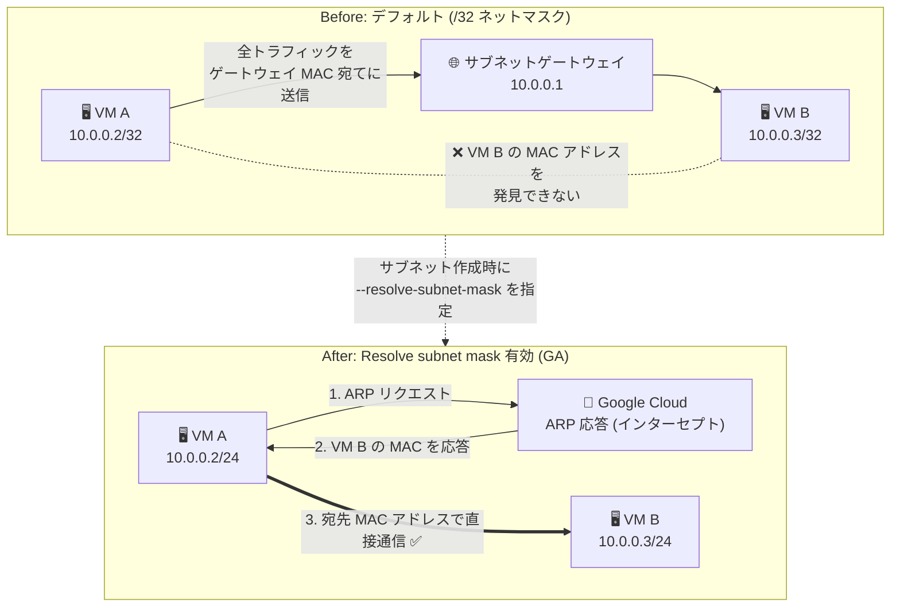

# Virtual Private Cloud (VPC): Resolve subnet mask 設定 (インスタンスネットマスクの拡大) が GA

**リリース日**: 2026-07-30

**サービス**: Virtual Private Cloud (VPC)

**機能**: Resolve subnet mask 設定によるインスタンスネットマスクの構成

**ステータス**: 一般提供 (GA)

📊 [このアップデートのインフォグラフィックを見る](https://takech9203.github.io/google-cloud-news-summary/20260730-vpc-resolve-subnet-mask-ga.html)

## 概要

VPC サブネットの **Resolve subnet mask** 設定が一般提供 (GA) になりました。この設定を有効にしたサブネットでは、接続されるすべての Compute Engine インスタンスに対して、従来の `/32` ではなくサブネットと同じネットマスクが DHCP 経由で構成されます。

ネットマスクが大きくなることで、インスタンスは同一サブネット内の他のマシンの MAC アドレスを ARP で解決 (発見) できるようになり、宛先 MAC アドレスを使って相互に直接通信できます。従来の Google Cloud では、Linux インスタンスはすべての通信をサブネットゲートウェイの MAC アドレス宛てに送信しており、L2 レベルで隣接ノードを認識する必要があるアプリケーション (物理ネットワークと同様の挙動を前提とするソフトウェア) の移行が課題でした。

対象ユーザーは、クラスタリングソフトウェアやネットワークアプライアンスなど、同一サブネット内での MAC アドレスベースの直接通信を必要とするワークロードを Google Cloud 上で運用するユーザーです。なお、公式ドキュメントでは、これは高度な構成であり、ほとんどのワークロードではデフォルト (/32) のままの利用が推奨されています。

**アップデート前の課題**

- Linux インスタンスにはデフォルトで `/32` のネットマスクが構成され、同一サブネット宛ての通信でもすべてゲートウェイの MAC アドレスに送信されるため、他のインスタンスの MAC アドレスを発見できなかった
- 同一サブネット内の L2 (MAC アドレス) レベルの直接通信を前提とするアプリケーションが動作しなかった
- 回避策として `MULTI_IP_SUBNET` ゲスト OS 機能を有効にしたカスタムイメージをインスタンスごとに用意する必要があり、イメージのメンテナンス負荷が発生していた (Windows の Google 提供イメージのみ自動で有効)

**アップデート後の改善**

- サブネット作成時に Resolve subnet mask 設定を指定するだけで、接続されるすべてのインスタンスにサブネットと同じネットマスクが DHCP で構成されるようになった
- インスタンスが同一サブネット内の他のマシンの MAC アドレスを ARP で解決し、宛先 MAC アドレスを使って直接通信できるようになった
- カスタムイメージの作成・維持が不要になり、サブネット単位で一括構成できるようになった

## アーキテクチャ図



従来 (Before) は全インスタンスが /32 で構成され通信はすべてゲートウェイ経由でしたが、Resolve subnet mask を有効化 (After) するとサブネットと同じネットマスクが構成され、ARP による MAC アドレス解決と宛先 MAC アドレスによる直接通信が可能になります。

## サービスアップデートの詳細

### 主要機能

1. **サブネット単位のネットマスク構成**
   - サブネット作成時に Resolve subnet mask 設定を指定すると、接続されるすべてのインスタンスに DHCP でサブネットと同じネットマスク (例: /24) が構成される
   - インスタンスごとのカスタムイメージ (`MULTI_IP_SUBNET`) が不要になる

2. **2 つの ARP 応答モード**
   - `ARP_PRIMARY_RANGE`: サブネットのプライマリ IPv4 範囲内の IP アドレスに対する ARP 応答を返す
   - `ARP_ALL_RANGES`: プライマリ IPv4 範囲に加え、インスタンスが接続するセカンダリ IPv4 範囲 (エイリアス IP) に対する ARP 応答も返す

3. **Google Cloud による ARP 応答の仕組み**
   - ARP リクエストは Google Cloud がインターセプトして応答し、他のインスタンスには配信されない
   - プライマリ内部 IPv4 アドレス、プライマリ範囲のエイリアス IP、内部パススルー Network Load Balancer / 内部プロトコル転送の転送ルールアドレスに対して応答する
   - ARP リクエストの送信元と宛先 IPv4 アドレスが一致する場合は応答しない
   - リクエスト対象の IP アドレスを使用しているインスタンスが存在しない場合でも MAC アドレスを応答する点に注意

## 技術仕様

### 設定の要件と仕様

| 項目 | 詳細 |
|------|------|
| 設定タイミング | サブネット **作成時のみ** (既存サブネットへの追加は不可) |
| サブネットの purpose | `PRIVATE` (通常のサブネット) のみ |
| スタックタイプ | `IPV4_ONLY` (IPv4 シングルスタック) のみ |
| 対応インスタンス | VM インスタンスおよびベアメタルインスタンス |
| NIC の要件 | 通常の VPC ネットワークの NIC (RDMA などネットワークプロファイル付き VPC は非対応) |
| ARP モード | `ARP_PRIMARY_RANGE` / `ARP_ALL_RANGES` |
| MAC アドレス | インスタンスの MAC アドレスは自動生成され、変更不可 |

### 代替手段: インスタンス単位の構成 (MULTI_IP_SUBNET)

サブネット単位ではなく個別インスタンスで構成したい場合は、`MULTI_IP_SUBNET` ゲスト OS 機能を有効にしたカスタムイメージを使用できます (ARP 応答はプライマリ IPv4 範囲のみ)。ただしカスタムイメージの維持が必要になるため、公式ドキュメントではサブネット単位の構成が推奨されています。

## 設定方法

### 前提条件

1. カスタムモード VPC ネットワークの利用 (サブネット作成時に指定するため)
2. サブネットの purpose が `PRIVATE`、スタックタイプが `IPV4_ONLY` であること
3. 設定はサブネット作成時のみ可能なため、既存ワークロードに適用する場合は新しいサブネットの作成と移行計画が必要

### 手順

#### ステップ 1: Resolve subnet mask を指定してサブネットを作成

```bash
gcloud compute networks subnets create SUBNET_NAME \
    --network=NETWORK_NAME \
    --region=REGION \
    --range=10.10.0.0/24 \
    --resolve-subnet-mask=ARP_PRIMARY_RANGE
```

`--resolve-subnet-mask` には `ARP_PRIMARY_RANGE` または `ARP_ALL_RANGES` を指定します。エイリアス IP (セカンダリ範囲) に対する ARP 応答も必要な場合は `ARP_ALL_RANGES` を指定します。

#### ステップ 2: サブネットにインスタンスを作成

```bash
gcloud compute instances create INSTANCE_NAME \
    --zone=ZONE \
    --network-interface=subnet=SUBNET_NAME
```

作成されたインスタンスには DHCP によりサブネットと同じネットマスクが構成され、同一サブネット内の他のインスタンスと MAC アドレスベースで直接通信できます。

## メリット

### ビジネス面

- **移行の容易化**: 物理ネットワークと同様の L2 挙動を前提とするアプリケーションを、改修なしで Google Cloud に移行しやすくなる
- **運用負荷の削減**: カスタムイメージ (`MULTI_IP_SUBNET`) の作成・維持が不要になり、サブネット単位の一括設定で運用できる

### 技術面

- **MAC アドレス発見**: 同一サブネット内のインスタンスの MAC アドレスを ARP で解決可能
- **直接通信**: ゲートウェイを介さず宛先 MAC アドレスで直接通信できる
- **エイリアス IP 対応**: `ARP_ALL_RANGES` モードでセカンダリ範囲のエイリアス IP にも ARP 応答が可能

## デメリット・制約事項

### 制限事項

- 設定はサブネット作成時のみ可能で、既存サブネットには追加できない
- purpose が `PRIVATE` かつスタックタイプが `IPV4_ONLY` のサブネットに限定される (IPv6 デュアルスタック / IPv6 のみのサブネットは非対応)
- RDMA NIC やネットワークプロファイル付き VPC ネットワークは非対応
- 追加されるのは ARP のみで、他の L2 プロトコル (ブロードキャストなど) はサポートされない

### 考慮すべき点

- ARP の挙動は物理ネットワークとは異なる (Google Cloud がインターセプトして応答し、対象 IP を使用するインスタンスが存在しなくても MAC アドレスを応答する)
- ほとんどのワークロードには不要な高度な構成であり、OS やアプリケーションが必要とする場合を除きデフォルト (/32) の利用が推奨される
- Windows の Google 提供イメージでは従来から `MULTI_IP_SUBNET` が自動有効化されており、挙動が Linux と異なる点に注意

## ユースケース

### ユースケース 1: L2 隣接を前提とするアプリケーションのリフト & シフト

**シナリオ**: オンプレミスで稼働していたクラスタリングソフトウェアやネットワークアプライアンスが、同一セグメント内のノードを ARP / MAC アドレスで直接認識する設計になっており、/32 ネットマスク環境では動作しない。

**実装例**:
```bash
gcloud compute networks subnets create cluster-subnet \
    --network=my-vpc \
    --region=asia-northeast1 \
    --range=10.20.0.0/24 \
    --resolve-subnet-mask=ARP_PRIMARY_RANGE
```

**効果**: アプリケーションを改修せず、物理ネットワークに近い L2 挙動のまま Google Cloud に移行できる。

### ユースケース 2: カスタムイメージ運用からの脱却

**シナリオ**: これまで `MULTI_IP_SUBNET` ゲスト OS 機能を有効にしたカスタムイメージを維持して個別インスタンスに大きなネットマスクを構成していたが、イメージ更新のたびに再ビルドが必要で運用負荷が高い。

**効果**: サブネット作成時の設定 1 つで全インスタンスに適用されるため、カスタムイメージの維持が不要になり、標準イメージをそのまま利用できる。

## 料金

Resolve subnet mask 設定自体に固有の料金に関する記載は Release Notes およびドキュメントで確認できませんでした。VPC 全般の料金については公式の料金ページを参照してください。

- [VPC の料金](https://cloud.google.com/vpc/pricing)

## 関連サービス・機能

- **Compute Engine**: 本設定の適用対象。サブネットに接続する VM / ベアメタルインスタンスのネットマスクが変更される
- **エイリアス IP 範囲**: `ARP_ALL_RANGES` モードでは、セカンダリ範囲のエイリアス IP に対する ARP 応答も可能
- **内部パススルー Network Load Balancer / 内部プロトコル転送**: 転送ルールの内部 IP アドレスに対しても ARP 応答が返される (転送ルールのサブネット設定に従う)
- **MULTI_IP_SUBNET ゲスト OS 機能**: インスタンス単位で同様の構成を行う代替手段 (カスタムイメージの維持が必要)

## 参考リンク

- 📊 [インフォグラフィック](https://takech9203.github.io/google-cloud-news-summary/20260730-vpc-resolve-subnet-mask-ga.html)
- [公式リリースノート](https://docs.cloud.google.com/release-notes#July_30_2026)
- [ドキュメント: Compute instance netmasks](https://docs.cloud.google.com/vpc/docs/compute-instance-netmasks)
- [gcloud compute networks subnets create リファレンス](https://docs.cloud.google.com/sdk/gcloud/reference/compute/networks/subnets/create)
- [料金ページ](https://cloud.google.com/vpc/pricing)

## まとめ

Resolve subnet mask 設定の GA により、サブネット単位の設定だけで Compute Engine インスタンスにサブネットと同じネットマスクを構成し、同一サブネット内での MAC アドレスベースの直接通信が可能になりました。L2 隣接を前提とするアプリケーションの移行や、カスタムイメージ運用の廃止を検討しているユーザーは、新規サブネット設計時に本設定の採用を検討してください。ただし設定はサブネット作成時のみ可能で IPv4 シングルスタック限定のため、既存環境への適用にはサブネットの再作成と移行計画が必要です。

---

**タグ**: #VPC #ComputeEngine #Networking #ARP #Netmask #GA
