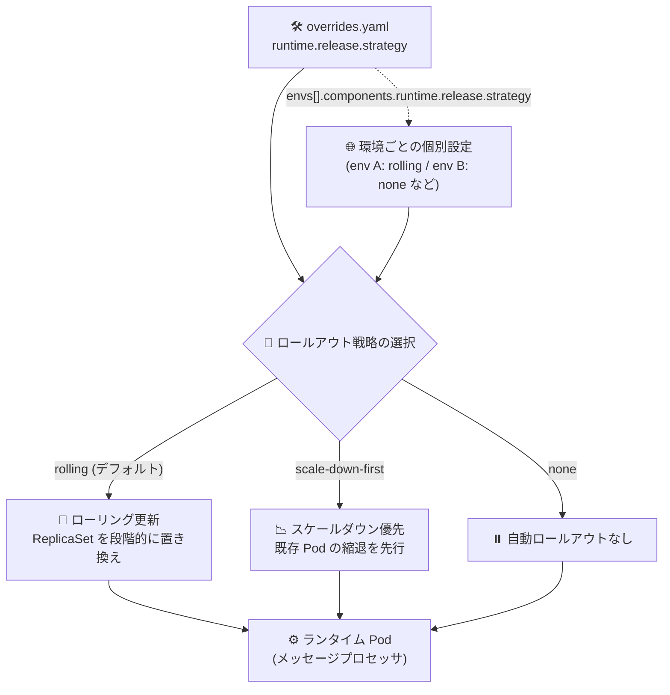

# Apigee hybrid: v1.15.7 リリース (ランタイムロールアウト戦略の設定機能 + セキュリティ修正)

**リリース日**: 2026-07-31

**サービス**: Apigee hybrid

**機能**: v1.15.7 パッチリリース (ランタイムロールアウト戦略の設定、セキュリティ / CVE 修正)

**ステータス**: Announcement / Feature / Security

📊 [このアップデートのインフォグラフィックを見る](https://takech9203.github.io/google-cloud-news-summary/20260731-apigee-hybrid-v1-15-7.html)

## 概要

2026 年 7 月 31 日、Apigee hybrid のパッチリリース v1.15.7 が公開されました。Apigee hybrid は、管理プレーンを Google Cloud 上で運用しつつ、ランタイムプレーンをユーザー自身の Kubernetes クラスタ (GKE、EKS、AKS、OpenShift など) で運用するハイブリッド型の API 管理プラットフォームです。

本リリースの目玉は、ランタイム (メッセージプロセッサ) の ReplicaSet を更新する際のロールアウト戦略を設定できる新機能です。overrides 設定ファイルの `runtime.release.strategy` プロパティに `rolling`、`scale-down-first`、`none` のいずれかを指定でき、`envs[].components.runtime.release.strategy` を使えば環境ごとに個別の戦略を設定することも可能です。デフォルトは従来どおり `rolling` です。

また、本リリースはパッチリリースであり、コンテナイメージは Apigee hybrid の Helm チャートに統合されています。Helm チャート経由でパッチにアップグレードするとイメージが自動的に更新されるため、通常は手動でのイメージ変更は不要です。あわせて、各種セキュリティ修正および CVE 修正も含まれているため、v1.15 系を運用中のユーザーには早期の適用が推奨されます。

**アップデート前の課題**

- ランタイム (メッセージプロセッサ) の ReplicaSet 更新時のロールアウト方式はユーザー側で選択できず、更新時のリソース消費やロールアウト挙動を環境の特性 (リソース制約、トラフィック特性など) に合わせて調整できなかった
- 環境 (environment) ごとにロールアウト挙動を変えるといった細かな制御ができなかった
- 既知のセキュリティ脆弱性 (CVE) への対応には新パッチの適用が必要だった

**アップデート後の改善**

- `runtime.release.strategy` プロパティで、ランタイム更新時のロールアウト戦略を `rolling` / `scale-down-first` / `none` から選択できるようになった
- `envs[].components.runtime.release.strategy` により、環境単位で異なるロールアウト戦略を設定できるようになった
- 各種セキュリティ / CVE 修正が適用され、ランタイムプレーンのセキュリティ姿勢が向上した
- パッチリリースのため、Helm チャートのアップグレードだけでコンテナイメージも自動更新される

## アーキテクチャ図



overrides 設定ファイルで指定したロールアウト戦略に応じて、ランタイム (メッセージプロセッサ) ReplicaSet の更新挙動が切り替わります。グローバル設定に加えて環境単位での上書きも可能です。

## サービスアップデートの詳細

### 主要機能

1. **ランタイムロールアウト戦略の設定 (新機能)**
   - ランタイム (メッセージプロセッサ) の ReplicaSet 更新時に使用するロールアウト戦略を設定可能
   - `runtime.release.strategy` プロパティで `rolling`、`scale-down-first`、`none` のいずれかを指定
   - `envs[].components.runtime.release.strategy` により環境 (environment) 単位での個別設定にも対応
   - デフォルト値は `rolling` (従来のローリング更新の挙動)
   - 各オプションの詳細な挙動は [構成プロパティリファレンス (runtime.release.strategy)](https://docs.cloud.google.com/apigee/docs/hybrid/v1.15/config-prop-ref#runtime-release-strategy) を参照

2. **セキュリティ / CVE 修正**
   - 各種セキュリティ修正および CVE 修正が本リリースに含まれる
   - 個別の CVE 番号はリリースノートでは公表されていない

3. **パッチリリースとしての提供**
   - コンテナイメージは Apigee hybrid の Helm チャートに統合されている
   - Helm チャート経由でパッチにアップグレードするとイメージが自動的に更新され、通常は手動のイメージ変更は不要
   - 詳細は [Apigee release process](https://docs.cloud.google.com/apigee/docs/release/apigee-release-process#apigee-hybrid-container-images) を参照

## 技術仕様

### ロールアウト戦略のオプション

| オプション | 説明 |
|------|------|
| `rolling` | デフォルト。ランタイム ReplicaSet をローリング方式で更新 |
| `scale-down-first` | 既存 Pod のスケールダウンを先行させる方式 |
| `none` | 自動ロールアウトを行わない |

### overrides 設定例

```yaml
# グローバル設定 (すべての環境に適用)
runtime:
  release:
    strategy: rolling  # rolling | scale-down-first | none

# 環境ごとの個別設定 (グローバル設定を上書き)
envs:
  - name: prod
    components:
      runtime:
        release:
          strategy: rolling
  - name: dev
    components:
      runtime:
        release:
          strategy: scale-down-first
```

## 設定方法

### 前提条件

1. Apigee hybrid v1.15 系を Helm チャートで運用していること
2. アップグレード前に Helm チャートディレクトリと Cassandra データベースのバックアップを取得していること (v1.14 以降は Guardrails によりバックアップ関連チェックが適用される)
3. cert-manager がサポート対象バージョンであること (推奨: v1.16.3+ または v1.17.2+)

### 手順

#### ステップ 1: v1.15.7 の Helm チャートを取得

```bash
export CHART_REPO=oci://us-docker.pkg.dev/apigee-release/apigee-hybrid-helm-charts
export CHART_VERSION=1.15.7

helm pull $CHART_REPO/apigee-operator --version $CHART_VERSION --untar
helm pull $CHART_REPO/apigee-datastore --version $CHART_VERSION --untar
helm pull $CHART_REPO/apigee-env --version $CHART_VERSION --untar
helm pull $CHART_REPO/apigee-ingress-manager --version $CHART_VERSION --untar
helm pull $CHART_REPO/apigee-org --version $CHART_VERSION --untar
helm pull $CHART_REPO/apigee-redis --version $CHART_VERSION --untar
helm pull $CHART_REPO/apigee-telemetry --version $CHART_VERSION --untar
helm pull $CHART_REPO/apigee-virtualhost --version $CHART_VERSION --untar
```

Apigee hybrid の Helm チャートは Google Artifact Registry でホストされています。

#### ステップ 2: Apigee CRD を更新

```bash
# dry-run で検証
kubectl apply -k apigee-operator/etc/crds/default/ \
  --server-side --force-conflicts --validate=false --dry-run=server

# 適用
kubectl apply -k apigee-operator/etc/crds/default/ \
  --server-side --force-conflicts --validate=false
```

CRD のインストールは `kubectl apply -k` と `--server-side` を使用する方法のみがサポートされています。

#### ステップ 3: overrides ファイルにロールアウト戦略を設定 (任意)

```yaml
runtime:
  release:
    strategy: rolling
```

新機能を利用する場合は、overrides 設定ファイルに `runtime.release.strategy` を追加します。設定しない場合はデフォルトの `rolling` が使用されます。

#### ステップ 4: Helm チャートをアップグレード

```bash
# 例: apigee-operator のアップグレード (他のチャートも同様に実行)
helm upgrade operator apigee-operator/ \
  --install \
  --namespace APIGEE_NAMESPACE \
  --atomic \
  -f OVERRIDES_FILE
```

パッチリリースのため、Helm チャートのアップグレードによりコンテナイメージも自動的に更新されます。実行前に `--dry-run` での検証が推奨されます。詳細な手順とチャートの適用順序は [公式アップグレードガイド](https://docs.cloud.google.com/apigee/docs/hybrid/v1.15/upgrade) を参照してください。

## メリット

### ビジネス面

- **セキュリティリスクの低減**: CVE 修正の適用により、API 基盤の脆弱性リスクを低減し、コンプライアンス要件への対応を維持できる
- **運用コストの削減**: パッチ適用が Helm チャートのアップグレードのみで完結し、イメージの手動更新作業が不要

### 技術面

- **ロールアウト挙動の制御**: 環境のリソース制約や運用ポリシーに応じて、ランタイム更新時のロールアウト戦略を選択できる
- **環境単位のきめ細かな設定**: 本番環境は `rolling`、開発環境は `scale-down-first` といった環境特性に応じた使い分けが可能
- **後方互換性**: デフォルトは従来と同じ `rolling` のため、設定を変更しなければ既存の挙動が維持される

## デメリット・制約事項

### 制限事項

- 本機能は v1.15.7 (および v1.14.7、v1.16.8 などの各系列の対応パッチ) 以降で利用可能
- 修正された CVE の個別の詳細はリリースノートでは公開されていない

### 考慮すべき点

- `scale-down-first` は既存 Pod の縮退が先行するため、更新中の処理キャパシティへの影響を事前に評価する必要がある (詳細な挙動は構成プロパティリファレンスを確認すること)
- `none` を選択した場合の更新運用フローを別途設計する必要がある
- アップグレード前に Cassandra のバックアップ取得が必要 (Guardrails によるチェックあり)
- アップグレード処理中は新しい環境 (environment) を作成しないこと

## ユースケース

### ユースケース 1: セキュリティパッチの定期適用

**シナリオ**: 金融系企業が Apigee hybrid v1.15 系を本番運用しており、CVE 修正を含むパッチを四半期ごとのメンテナンスサイクルで適用したい。

**実装例**:
```bash
export CHART_VERSION=1.15.7
# Helm チャートを取得し、既存の overrides ファイルのまま helm upgrade を実行
helm upgrade operator apigee-operator/ --install \
  --namespace apigee --atomic -f overrides.yaml
```

**効果**: Helm チャートのアップグレードだけでコンテナイメージも自動更新され、最小限の作業でセキュリティ修正を適用できる。

### ユースケース 2: リソース制約のあるクラスタでのランタイム更新

**シナリオ**: 開発用クラスタはノードリソースに余裕がなく、ローリング更新時に新旧 Pod が並存するとリソース不足でスケジューリングに失敗することがある。開発環境のみロールアウト方式を変更したい。

**効果**: `envs[].components.runtime.release.strategy` に `scale-down-first` を指定することで、開発環境のみ既存 Pod の縮退を先行させる方式に切り替えられ、本番環境は `rolling` のまま無停止更新を維持できる。

## 料金

Apigee hybrid 自体のライセンスは Apigee の料金体系 (サブスクリプションまたは従量課金) に従います。今回のパッチリリースによる料金変更はありません。ランタイムプレーンを稼働させる Kubernetes クラスタ (GKE など) のインフラ費用は別途発生します。

詳細は [Apigee 料金ページ](https://cloud.google.com/apigee/pricing) を参照してください。

## 利用可能リージョン

Apigee hybrid のランタイムプレーンはユーザー管理の Kubernetes クラスタ上で動作するため、特定リージョンへの依存はありません。サポートされるプラットフォーム (GKE、GKE on AWS/Azure、EKS、AKS、OpenShift、Google Distributed Cloud など) は [サポート対象プラットフォーム](https://docs.cloud.google.com/apigee/docs/hybrid/supported-platforms) を参照してください。

## 関連サービス・機能

- **Apigee X**: フルマネージド版の Apigee。2026 年 7 月 27 日にも 1-18-0-apigee-2 のセキュリティ更新がリリースされている
- **Google Kubernetes Engine (GKE)**: Apigee hybrid ランタイムプレーンの主要な稼働基盤。ReplicaSet のロールアウトは Kubernetes の仕組みの上で制御される
- **Google Artifact Registry**: Apigee hybrid の Helm チャート (`oci://us-docker.pkg.dev/apigee-release/apigee-hybrid-helm-charts`) のホスティング基盤
- **cert-manager**: Apigee hybrid の TLS 証明書管理に使用される前提コンポーネント

## 参考リンク

- 📊 [インフォグラフィック](https://takech9203.github.io/google-cloud-news-summary/20260731-apigee-hybrid-v1-15-7.html)
- [公式リリースノート (Google Cloud)](https://docs.cloud.google.com/release-notes#July_31_2026)
- [Apigee hybrid リリースノート](https://docs.cloud.google.com/apigee/docs/hybrid/release-notes)
- [Apigee hybrid v1.15.7 へのアップグレード](https://docs.cloud.google.com/apigee/docs/hybrid/v1.15/upgrade)
- [構成プロパティリファレンス: runtime.release.strategy](https://docs.cloud.google.com/apigee/docs/hybrid/v1.15/config-prop-ref#runtime-release-strategy)
- [Apigee release process (コンテナイメージのサポート)](https://docs.cloud.google.com/apigee/docs/release/apigee-release-process#apigee-hybrid-container-images)
- [Apigee hybrid の全体像 (The big picture)](https://docs.cloud.google.com/apigee/docs/hybrid/v1.15/big-picture)
- [料金ページ](https://cloud.google.com/apigee/pricing)

## まとめ

Apigee hybrid v1.15.7 は、CVE 修正を含むセキュリティパッチに加えて、ランタイム更新時のロールアウト戦略を制御できる実用的な新機能を提供するリリースです。v1.15 系を運用中のユーザーは、バックアップ取得のうえ Helm チャートのアップグレードによる早期適用を推奨します。リソース制約のある環境では、新しい `runtime.release.strategy` プロパティによる環境ごとのロールアウト制御の活用を検討してください。

---

**タグ**: #ApigeeHybrid #Apigee #APIManagement #Kubernetes #Helm #Security #CVE #PatchRelease
