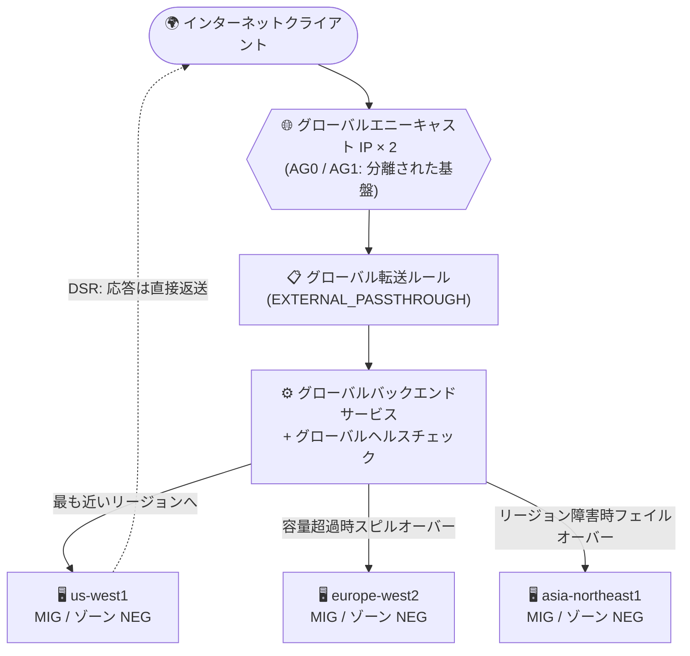

# Cloud Load Balancing: グローバル外部パススルー Network Load Balancer (Preview)

**リリース日**: 2026-07-31

**サービス**: Cloud Load Balancing

**機能**: グローバル外部パススルー Network Load Balancer

**ステータス**: Preview

📊 [このアップデートのインフォグラフィックを見る](https://takech9203.github.io/google-cloud-news-summary/20260731-cloud-load-balancing-global-external-passthrough-nlb.html)

## 概要

Cloud Load Balancing に、リージョン外部パススルー Network Load Balancer のグローバル版となる**グローバル外部パススルー Network Load Balancer** が Preview として追加されました。Layer 4 のパススルー型ロードバランサーとして、複数の Google Cloud リージョンにまたがるバックエンド (インスタンスグループまたは NEG) に外部トラフィックを分散します。

このロードバランサーはグローバルに分散配置された Maglev 上に構築されており、Google のグローバルエニーキャスト IP ルーティングを利用して、ユーザートラフィックが Google のグローバルネットワークに入った地点から最も近い、正常なバックエンドと容量を持つリージョンへトラフィックを誘導します。これにより、超低レイテンシと動的なリージョン間フェイルオーバーを実現します。Security Service Edge (SSE)、DNS ホスティング、アドテック (リアルタイムビディング)、リアルタイムコミュニケーション (RTC)、ライブストリーミング、オンラインゲームといった、単一のエニーキャスト IP で低レイテンシかつ高可用なグローバル L4 サービスを提供したいユースケースに対応します。

高可用性の面では、各ロードバランサーに 2 つの外部 IP アドレスが提供され、それぞれが完全に分離・独立したグローバルなコントロールプレーン/データプレーン基盤 (「アベイラビリティグループ」AG0 / AG1) によって提供されます。一方のアベイラビリティグループの障害がもう一方に影響しない設計です。

**アップデート前の課題**

外部パススルー Network Load Balancer はこれまでリージョナルのみの提供でした。

- パススルー型 (DSR、クライアント送信元 IP 保持、TCP/UDP 以外のプロトコル対応) の外部ロードバランサーは単一リージョンのバックエンドにしかトラフィックを分散できなかった
- 複数リージョンのバックエンドを使うには、リージョンごとにリージョン外部パススルー NLB を作成し、DNS ベースのルーティングなどで振り分ける必要があった
- リージョン障害や容量超過時のリージョン間フェイルオーバーを自前で設計・運用する必要があった

**アップデート後の改善**

- 単一のエニーキャスト IP (実際には AG0/AG1 の 2 つの IP) で、複数リージョンのバックエンドに L4 パススルーで外部トラフィックを分散できるようになった
- リージョンが容量超過の場合、既存接続を維持したまま超過分の新規接続を次に近い空き容量のあるリージョンへ自動的にスピルオーバーするようになった
- リージョンがダウンした場合、次に近い利用可能なリージョンへ自動的にフェイルオーバーするようになった
- 分離された 2 系統のコントロール/データプレーン (アベイラビリティグループ) により、ロードバランサー基盤自体の耐障害性が向上した

## アーキテクチャ図



クライアントのトラフィックはエニーキャスト IP により最寄りの Google エッジから入り、最も近い正常なリージョンのバックエンドへパススルーで転送されます。応答はロードバランサーを経由せず、バックエンドからクライアントへ直接返されます (Direct Server Return)。

## サービスアップデートの詳細

### 主要機能

1. **グローバルエニーキャストルーティングによるマルチリージョン分散**
   - Google のグローバルネットワークとコントロールプレーン上で動作する、グローバル分散された Maglev 上に構築
   - ユーザートラフィックが Google ネットワークに入った地点に最も近いバックエンドリージョンへ自動的にトラフィックを誘導
   - リージョンが容量超過の場合は、既存接続を維持しつつ新規接続を次に近い空き容量のあるリージョンへスピルオーバー
   - リージョンがダウンした場合は、次に近い利用可能なリージョンへ自動フェイルオーバー

2. **アベイラビリティグループによる高可用性設計**
   - ロードバランサーごとに 2 つのグローバル外部 IP アドレスを提供 (静的またはエフェメラル)
   - 各 IP は分離・独立したグローバルなコントロールプレーン/データプレーン基盤 (AG0、AG1) で提供され、一方の障害が他方に影響しない
   - 転送ルール (親) を 1 つ作成すると、各アベイラビリティグループ用に読み取り専用の子転送ルールが 2 つ自動生成される
   - クライアントは両方の IP に接続できるよう構成することが推奨される (AG0 の IP に接続できない場合は AG1 の IP へ接続)

3. **パススルー型 (DSR) による幅広いプロトコル対応**
   - TCP、UDP、ESP、GRE、ICMP、ICMPv6 をサポート。IPv4 と IPv6 の両方に対応
   - プロキシではないため、パケットの送信元/宛先 IP、プロトコル、ポートを変更せずバックエンドへ転送 (クライアント送信元 IP を保持)
   - バックエンドからの応答はロードバランサーを経由せずクライアントへ直接返送 (Direct Server Return)
   - TLS (SSL) トラフィックはバックエンドで終端する (ロードバランサーでの SSL 終端は非対応)

## 技術仕様

### グローバル外部パススルー NLB の仕様

| 項目 | 詳細 |
|------|------|
| スコープ | グローバル (複数リージョンのバックエンド) |
| ステータス | Preview |
| 種別 | Layer 4 パススルー (非プロキシ、DSR) |
| 対応プロトコル | TCP、UDP、ESP、GRE、ICMP、ICMPv6 |
| IP バージョン | IPv4 / IPv6 |
| ネットワークサービスティア | Premium |
| ロードバランシングスキーム | `EXTERNAL_PASSTHROUGH` |
| フロントエンドポート | 最大 5 個のポートリスト、ポート範囲、または全ポート |
| バランシングモード | RATE、UTILIZATION |
| バックエンド | インスタンスグループ (ゾーン MIG / ゾーン非マネージド)、または `GCE_VM_IP` エンドポイントのゾーン NEG |
| IP アドレス | グローバル外部 IP × 2 (AG0 / AG1、静的またはエフェメラル)。BYOIP のグローバル外部 IPv4 公開委任プレフィックスにも対応 |
| ヘルスチェック | グローバルヘルスチェック |

### 構成コンポーネント

- **グローバル外部 IP アドレス × 2**: アベイラビリティグループ AG0 / AG1 から 1 つずつ
- **グローバル転送ルール × 1**: 2 つの IP を指定。作成時に AG ごとの読み取り専用の子転送ルールが 2 つ自動生成される
- **グローバルバックエンドサービス × 1**: 複数リージョンのバックエンドへの分散方法を定義
- **グローバルヘルスチェック**: バックエンドサービスに関連付け
- **ファイアウォールルール**: ロードバランシングトラフィックとヘルスチェックプローブの許可

## 設定方法

### 前提条件

1. Premium ティアのネットワークサービスティアを使用すること
2. バックエンド (ゾーン MIG またはゾーン NEG) を対応リージョンに作成しておくこと
3. TLS を扱う場合はバックエンドで SSL を終端すること

### 手順

#### ステップ 1: アベイラビリティグループごとにグローバル外部 IP を予約

```bash
gcloud beta compute addresses create lb-ipv4-ag0 \
    --global \
    --purpose=PASSTHROUGH_LOAD_BALANCER_AVAILABILITY_GROUP0 \
    --ip-version=IPV4

gcloud beta compute addresses create lb-ipv4-ag1 \
    --global \
    --purpose=PASSTHROUGH_LOAD_BALANCER_AVAILABILITY_GROUP1 \
    --ip-version=IPV4
```

AG0 と AG1 のそれぞれから 1 つずつ、計 2 つのグローバル外部 IP を予約します。IPv6 の場合は `--ip-version=IPV6` を指定します。

#### ステップ 2: ヘルスチェックとグローバルバックエンドサービスを作成

```bash
gcloud compute health-checks create tcp hc-tcp-80 \
    --global \
    --port=80

gcloud beta compute backend-services create lb-backend-service \
    --load-balancing-scheme=EXTERNAL_PASSTHROUGH \
    --health-checks=hc-tcp-80 \
    --global
```

#### ステップ 3: 複数リージョンのバックエンドを追加

```bash
gcloud beta compute backend-services add-backend lb-backend-service \
    --instance-group=mig-us \
    --instance-group-zone=us-west1-a \
    --balancing-mode=UTILIZATION \
    --max-utilization=0.7 \
    --global

gcloud beta compute backend-services add-backend lb-backend-service \
    --instance-group=mig-eu \
    --instance-group-zone=europe-west2-a \
    --balancing-mode=UTILIZATION \
    --max-utilization=0.7 \
    --global
```

#### ステップ 4: グローバル転送ルールを作成

```bash
gcloud beta compute forwarding-rules create lb-forwarding-rule-ipv4 \
    --load-balancing-scheme=EXTERNAL_PASSTHROUGH \
    --ip-protocol=TCP \
    --ports=80 \
    --backend-service=lb-backend-service \
    --global \
    --ip-addresses=lb-ipv4-ag0,lb-ipv4-ag1
```

1 つの転送ルールに AG0 / AG1 の 2 つの IP アドレスを指定します。IPv4 と IPv6 の両方を扱う場合は、それぞれの転送ルールを作成します。

## メリット

### ビジネス面

- **グローバルサービスの構築簡素化**: SSE、DNS ホスティング、リアルタイムビディング、RTC、ライブストリーミング、オンラインゲームなど、世界中のユーザーに低レイテンシで L4 サービスを提供するアーキテクチャを、単一のロードバランサーで実現できる
- **可用性向上による機会損失の低減**: リージョン障害時の自動フェイルオーバーと、分離された 2 系統の基盤 (AG0/AG1) により、サービス停止のリスクを低減できる

### 技術面

- **エニーキャストによる超低レイテンシ**: トラフィックは Google ネットワークへの入口に最も近いリージョンのバックエンドへ誘導される
- **動的なクロスリージョンフェイルオーバー / スピルオーバー**: リージョン障害時は自動フェイルオーバー、容量超過時は既存接続を維持したまま新規接続のみをスピルオーバー
- **クライアント送信元 IP の保持**: パススルー型 (DSR) のため、元のパケットが変更されずにバックエンドに届く
- **幅広いプロトコル対応**: TCP/UDP に加え、ESP、GRE、ICMP、ICMPv6 という他のロードバランサーでは扱えないプロトコルもグローバルに分散可能

## デメリット・制約事項

### 制限事項

- Preview 段階であり、Pre-GA 利用規約が適用される (サポートが限定される場合がある)
- **GKE バックエンドは今回のリリースでは非対応**
- バックエンドを配置できるリージョンは 12 リージョンに限定される (下記「利用可能リージョン」参照)
- ロードバランサーでの SSL 終端は非対応 (バックエンドで終端する必要がある)
- Premium ネットワークサービスティアのみ対応
- バックエンドグループは、すべてインスタンスグループ (ゾーン MIG / ゾーン非マネージド) か、すべてゾーン NEG (`GCE_VM_IP` エンドポイント) のいずれかで統一する必要がある

### 考慮すべき点

- ロードバランサーごとに 2 つの外部 IP (AG0 / AG1) が提供されるため、クライアント側で両方の IP に接続できるよう構成する必要がある (一方に接続できない場合にもう一方へ切り替える)
- リージョン間フェイルオーバー/スピルオーバーを活かすには、2 つ以上のリージョンにバックエンドを構成する必要がある
- gcloud での構成には `beta` コンポーネントを使用する

## ユースケース

### ユースケース 1: グローバル配信のリアルタイムビディング (アドテック) 基盤

**シナリオ**: 広告取引所からの入札リクエストを世界各地から受け付けるリアルタイムビディング (RTB) システムでは、応答レイテンシが収益に直結する。従来はリージョンごとにリージョン外部パススルー NLB を構築し、DNS で振り分けていた。

**効果**: 単一のエニーキャスト IP で最寄りリージョンのバックエンドに直接ルーティングされるため、超低レイテンシを実現しつつ、リージョン障害時も DNS の切り替えを待たずに自動フェイルオーバーできる。

### ユースケース 2: Security Service Edge (SSE) / VPN ゲートウェイのグローバル提供

**シナリオ**: SSE ベンダーやセキュリティゲートウェイを提供する事業者が、ESP や GRE などのトンネリングプロトコルを世界中の拠点から受け付ける必要がある。プロキシ型ロードバランサーではこれらのプロトコルを扱えない。

**効果**: TCP/UDP に加えて ESP、GRE、ICMP、ICMPv6 をグローバルにパススルー分散でき、クライアント送信元 IP も保持されるため、セキュリティ製品の要件を満たしながらマルチリージョンで高可用な受け口を構築できる。

### ユースケース 3: ライブストリーミング / オンラインゲームの UDP トラフィック分散

**シナリオ**: ライブストリーミングやオンラインゲームでは、UDP ベースのリアルタイムトラフィックを最寄りのリージョンで処理してレイテンシを最小化したい。特定リージョンにトラフィックが集中した場合の容量対策も必要。

**効果**: エニーキャストによる最寄りリージョンへのルーティングに加え、リージョンの容量超過時には既存接続を維持したまま新規接続を近隣リージョンへスピルオーバーするため、ピーク時も安定したサービス品質を維持できる。

## 料金

Cloud Load Balancing の料金体系が適用されます。詳細は [ネットワーク料金: Cloud Load Balancing](https://cloud.google.com/vpc/network-pricing#cloud-load-balancing) を参照してください。

## 利用可能リージョン

今回のリリースでバックエンドを配置できるリージョンは以下の 12 リージョンです。

| 地域 | リージョン |
|------|-----------|
| 北米 | us-west1、us-west4、us-east4、us-east5 |
| 欧州 | europe-west2、europe-west3 |
| アジア | asia-southeast1、asia-south1、asia-northeast1 (東京) |
| 南米 | southamerica-east1 |
| アフリカ | africa-south1 |
| オセアニア | australia-southeast1 |

## 関連サービス・機能

- **リージョン外部パススルー Network Load Balancer**: 本機能のリージョナル版。単一リージョンのバックエンドへの分散で、Standard ティアや、ウェイト付きロードバランシング・トラフィックステアリングなどの機能を提供
- **内部パススルー Network Load Balancer**: VPC ネットワーク内部のトラフィックを分散するパススルー型ロードバランサー
- **Cloud DNS**: 従来のマルチリージョン L4 構成で使われていた DNS ベースのルーティング。本機能によりエニーキャスト IP での代替が可能になる
- **Compute Engine (MIG / ゾーン NEG)**: バックエンドとして使用するインスタンスグループおよびネットワークエンドポイントグループ

## 参考リンク

- 📊 [インフォグラフィック](https://takech9203.github.io/google-cloud-news-summary/20260731-cloud-load-balancing-global-external-passthrough-nlb.html)
- [公式リリースノート](https://docs.cloud.google.com/release-notes#July_31_2026)
- [グローバル外部パススルー Network Load Balancer アーキテクチャ概要](https://docs.cloud.google.com/load-balancing/docs/network/global-networklb-architecture)
- [パススルー Network Load Balancer 概要](https://docs.cloud.google.com/load-balancing/docs/passthrough-network-load-balancer)
- [VM バックエンドでのグローバル外部パススルー NLB のセットアップ](https://docs.cloud.google.com/load-balancing/docs/network/set-up-global-ext-passthrough-network-lb-vm-backends)
- [料金ページ](https://cloud.google.com/vpc/network-pricing#cloud-load-balancing)

## まとめ

外部パススルー Network Load Balancer にグローバル版が登場したことで、これまでリージョン単位でしか構成できなかった L4 パススルー型の外部負荷分散を、単一のエニーキャスト IP でマルチリージョンに展開できるようになりました。SSE、アドテック、RTC、ゲームなどグローバルな低レイテンシ L4 サービスを運用している場合は、Preview 段階の制約 (GKE 非対応、対応リージョン限定) を確認のうえ、検証環境での評価を推奨します。

---

**タグ**: Cloud Load Balancing, Network Load Balancer, パススルー, エニーキャスト, マルチリージョン, Layer 4, Preview, ネットワーキング
