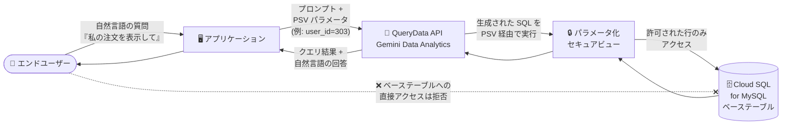

# Cloud SQL for MySQL: QueryData がパラメータ化セキュアビュー (PSV) をサポート

**リリース日**: 2026-07-31

**サービス**: Cloud SQL for MySQL

**機能**: QueryData のパラメータ化セキュアビュー (Parameterized Secure Views / PSV) サポート

**ステータス**: Preview

📊 [このアップデートのインフォグラフィックを見る](https://takech9203.github.io/google-cloud-news-summary/20260731-cloud-sql-mysql-querydata-parameterized-secure-views.html)

## 概要

Cloud SQL for MySQL の QueryData が、パラメータ化セキュアビュー (Parameterized Secure Views、以下 PSV) をサポートしました (Preview)。QueryData は、自然言語の質問を SQL クエリに変換してデータベースと対話できるデータエージェント機能です。今回のアップデートにより、QueryData 経由の自然言語クエリに対して、データベースレベルで行アクセス制御とデータセキュリティを適用できるようになりました。

PSV は MySQL ビューの拡張機能で、ビュー定義にアプリケーション固有の名前付きパラメータ (セッション変数) を埋め込めます。アプリケーションはエンドユーザー認証などのアプリケーションレベルのセキュリティに基づいてパラメータ値を渡し、クエリはそのユーザーに紐づく行のみを返します。これにより、LLM が生成する SQL が意図より広い範囲のデータを取得してしまうリスクや、プロンプトインジェクション攻撃によるデータ漏えいリスクをデータベース側で緩和できます。

自然言語クエリ機能を組み込んだアプリケーション (顧客サポートツール、マルチテナント SaaS など) を構築する開発者が主な対象です。

**アップデート前の課題**

- 自然言語クエリ (NL2SQL) では、LLM が本来のスコープより広い SQL を生成し、機密データが露出するリスクがあった
- エンドユーザーがプロンプトインジェクション攻撃により、アプリケーションがアクセスできる全データの取得を試みる余地があった
- ユーザーごとのデータ分離を実現するには、エンドユーザーごとに個別のデータベースユーザーやロールを作成するなどの運用負荷の高い方法が必要だった

**アップデート後の改善**

- QueryData への自然言語クエリに対し、PSV パラメータを指定することで、質問の言い回しに関係なくそのユーザーに許可された行のみを返すよう強制できるようになった
- 信頼できないクエリがアクセスできるテーブル・列を PSV で定義した範囲に限定し、プロンプトインジェクションや過剰スコープの SQL 生成によるデータ露出をデータベースレベルで防止できるようになった
- 単一のデータベースロールで全エンドユーザーにサービスを提供できるため、ユーザー管理と接続管理が簡素化された

## アーキテクチャ図



エンドユーザーの自然言語の質問は QueryData が SQL に変換し、アプリケーションが渡した PSV パラメータ (ユーザー ID など) によってフィルタされたビュー経由でのみ実行されます。ベーステーブルへの直接アクセスは権限で遮断されるため、質問の言い回しに関わらずユーザーは許可された行しか参照できません。

## サービスアップデートの詳細

### 主要機能

1. **QueryData と PSV の統合**
   - QueryData API (Gemini Data Analytics API の `queryData` リクエスト) で、コンテキストに `parameterized_secure_view_parameters` としてパラメータ名と値を指定できる
   - 自然言語の質問から生成された SQL は PSV を通じて実行され、指定したパラメータ値でフィルタされた行のみが返される

2. **行レベルのデータセキュリティ**
   - PSV は、ビューの処理が完了する前に悪意を持って選択された関数や演算子に行の値が渡されることを防ぎ、行レベルセキュリティを提供する
   - PSV にアクセスするクエリには追加の制約が適用され、パラメータ値に基づくビューのチェックを回避する攻撃を防止する

3. **名前付きビューパラメータ**
   - ビュー定義の `WHERE` 句などにセッション変数 (例: `@local_customer_id`) を使用し、アプリケーションが認証情報に基づいて値を提供する
   - `SET_VIEW_VARS` ヒント、または `mysql.execute_parameterized_query` ストアドプロシージャで値を設定してクエリを実行できる

4. **ユーザー管理の簡素化**
   - エンドユーザーごとにデータベースユーザー/ロールを作成せず、単一のデータベースロール (ビューへのアクセス権のみ、ベーステーブルへのアクセス権なし) で全ユーザーにサービスを提供できる

## 技術仕様

### PSV の定義とクエリ方法 (Cloud SQL for MySQL)

| 項目 | 詳細 |
|------|------|
| 対応バージョン | Cloud SQL for MySQL 8.0.43 以降 (それ以前のバージョンで作成しようとするとエラー) |
| パラメータの記述位置 | `WHERE`、`HAVING`、`ON` 句のみ (それ以外の場所では変数を指定不可) |
| クエリ方法 1 | `SELECT /*+ SET_VIEW_VARS(param=value) */ * FROM view;` |
| クエリ方法 2 | `CALL mysql.execute_parameterized_query('SELECT ...', 'param = value');` |
| クエリ方法 3 | QueryData API リクエストの `parameterized_secure_view_parameters` で指定 |
| 制約 | PSV に対する `EXPLAIN` は使用不可。クエリに追加の制約あり |
| ステータス | Preview (Pre-GA Offerings Terms が適用) |

### PSV の定義例と QueryData からの利用

```sql
-- パラメータ付きビューの作成
CREATE VIEW v_orders AS
SELECT * FROM orders
WHERE customer_id = @local_customer_id AND year >= @earliest_year;

-- パラメータを設定してクエリ
SELECT /*+ SET_VIEW_VARS(local_customer_id=5, earliest_year=2021) */ * FROM v_orders;

-- ストアドプロシージャ経由でのクエリ
CALL mysql.execute_parameterized_query(
  'SELECT * FROM db.v_orders',
  'local_customer_id = 5, earliest_year = 2021');
```

## 設定方法

### 前提条件

1. Cloud SQL for MySQL 8.0.43 以降のインスタンス
2. QueryData のセットアップ (コンテキストセットの作成を含む)

### 手順 (チュートリアルの概要)

公式チュートリアル「[Secure and control access to application data](https://docs.cloud.google.com/gemini/data-agents/querydata/sql-mysql/secure-app-data-parameterized-secure-views-qd)」では以下の流れで構成します。

#### ステップ 1: PSV の作成

```sql
CREATE VIEW store.secure_checked_items AS
SELECT bag_id, timestamp, location
FROM store.checked_items
WHERE customer_id = @app_end_userid;
```

名前付きビューパラメータを使用してビューを作成します。パラメータ名には一意な名前を使用します。

#### ステップ 2: ロールと権限の設定

```sql
-- ビューへのアクセスを付与
GRANT SELECT ON store.secure_checked_items TO psv_user;

-- ベーステーブルへの直接アクセスを剥奪
REVOKE ALL PRIVILEGES ON store.checked_items FROM psv_user;
```

アプリケーションがデータベース接続に使用する単一のロールを作成し、PSV への SELECT 権限のみを付与してベーステーブルへの直接アクセスを剥奪します。

#### ステップ 3: QueryData API から PSV パラメータ付きでクエリ

```bash
curl -X POST \
  "https://geminidataanalytics.googleapis.com/v1beta/projects/PROJECT_ID/locations/REGION:queryData" \
  -H "Authorization: Bearer $(gcloud auth print-access-token)" \
  -H "Content-Type: application/json; charset=utf-8" \
  -d '{
    "prompt": "Show me the checked items.",
    "context": {
      "datasource_references": { ... },
      "parameterized_secure_view_parameters": {
        "parameters": { "app_end_userid": "303" }
      }
    },
    "generation_options": {
      "generate_query_result": true,
      "generate_natural_language_answer": true
    }
  }'
```

自然言語プロンプトと PSV パラメータを指定して QueryData を呼び出すと、指定ユーザーに許可された行のみを対象に SQL が実行されます。

## メリット

### ビジネス面

- **自然言語クエリ機能の安全な提供**: エンドユーザー向けに自然言語でのデータ照会機能を提供しつつ、データ漏えいリスクをデータベースレベルで抑制できる
- **マルチテナント SaaS への適合**: エンドユーザーごとのロール作成が不要になり、ユーザー数が多いアプリケーションでも運用コストを抑えてデータ分離を実現できる

### 技術面

- **多層防御**: アプリケーション層の認証に加えて、データベース層でも行アクセス制御を強制できる。NL2SQL モデルの出力がどのような SQL であっても、PSV の範囲外のデータにはアクセスできない
- **プロンプトインジェクション対策**: モデルを操作して全データを取得しようとする攻撃に対し、ビューとパラメータによる制約で返却される行を制限できる
- **接続管理の簡素化**: 単一のデータベースロールで全ユーザーを処理できるため、コネクションプールの構成もシンプルになる

## デメリット・制約事項

### 制限事項

- Cloud SQL for MySQL 8.0.43 以降でのみサポートされる
- 変数は `WHERE`、`HAVING`、`ON` 句以外の場所には指定できない
- PSV に対して `EXPLAIN` は使用できない
- PSV へのクエリには追加の制約がある (詳細は [Restrictions on queries](https://docs.cloud.google.com/sql/docs/mysql/use-parameterized-secure-views#restrictions) を参照)

### 考慮すべき点

- Preview 機能のため、Pre-GA Offerings Terms が適用され、サポートが限定される場合がある。本番環境への適用は慎重に判断する
- PSV のパラメータ値はアプリケーション側の認証・認可に基づいて設定する必要があり、アプリケーション層のセキュリティ設計が引き続き重要
- QueryData 自体も Preview 機能であり、GenAI モデルの出力は非決定的である点に留意する

## ユースケース

### ユースケース 1: 顧客サポートアプリケーションでの注文照会

**シナリオ**: 顧客注文を管理するアプリケーションで、サポート担当者が「顧客 12345 の注文ステータスは?」と自然言語で質問する。

**実装例**:
```sql
CREATE VIEW v_orders AS
SELECT * FROM orders WHERE customer_id = @local_customer_id;
```
アプリケーションは認証済みのコンテキストに基づき `local_customer_id` を設定して QueryData を呼び出す。

**効果**: 質問の言い回しに関係なく、指定した顧客 ID に紐づく行のみが返され、他の顧客のデータは参照できない。

### ユースケース 2: マルチテナント SaaS での自然言語データ照会

**シナリオ**: マルチテナント SaaS アプリケーションで、各エンドユーザーが「私の注文を表示して」のような自然言語クエリを発行できる機能を提供したい。

**効果**: テナント/ユーザー ID をパラメータとする PSV を定義し、単一のデータベースロールで全ユーザーに対応。ユーザーごとのロール管理なしで、各ユーザーは自分のデータのみ参照できる。

## 料金

PSV 機能自体の追加料金に関する記載はありません。チュートリアルで使用する課金対象コンポーネントは以下のとおりです。

- [Cloud SQL for MySQL の料金](https://cloud.google.com/sql/pricing)
- [Gemini for Google Cloud API の料金](https://cloud.google.com/gemini/pricing) (QueryData 利用時)

## 利用可能リージョン

公式ドキュメントにリージョン限定の記載は確認できませんでした。最新情報は [QueryData のドキュメント](https://docs.cloud.google.com/sql/docs/mysql/querydata)を参照してください。

## 関連サービス・機能

- **QueryData (Gemini Data Analytics)**: 自然言語をコンテキストセットに基づいて SQL に変換するデータエージェント機能。今回 PSV と統合された
- **Cloud SQL for PostgreSQL**: 同日に PostgreSQL 版でも QueryData の PSV サポートが Preview として発表されている (`WITH (security_barrier)` 句と `parameterized_views` 拡張を使用)
- **AlloyDB for PostgreSQL**: 同様の PSV + QueryData のチュートリアルが提供されている
- **MCP Toolbox**: QueryData をツールとしてアプリケーションや ADK エージェントに統合するためのツールボックス

## 参考リンク

- 📊 [インフォグラフィック](https://takech9203.github.io/google-cloud-news-summary/20260731-cloud-sql-mysql-querydata-parameterized-secure-views.html)
- [公式リリースノート](https://docs.cloud.google.com/release-notes#July_31_2026)
- [チュートリアル: Secure and control access to application data](https://docs.cloud.google.com/gemini/data-agents/querydata/sql-mysql/secure-app-data-parameterized-secure-views-qd)
- [Parameterized secure views の概要 (Cloud SQL for MySQL)](https://docs.cloud.google.com/sql/docs/mysql/parameterized-secure-views)
- [Use parameterized secure views](https://docs.cloud.google.com/sql/docs/mysql/use-parameterized-secure-views)
- [QueryData の概要 (Cloud SQL for MySQL)](https://docs.cloud.google.com/sql/docs/mysql/querydata)
- [料金ページ (Cloud SQL)](https://cloud.google.com/sql/pricing)

## まとめ

Cloud SQL for MySQL の QueryData が PSV をサポートしたことで、自然言語クエリ機能を持つアプリケーションに対して、プロンプトインジェクションや過剰スコープの SQL 生成といった NL2SQL 特有のリスクをデータベースレベルで緩和できるようになりました。自然言語インターフェースやデータエージェントの導入を検討しているチームは、MySQL 8.0.43 以降へのアップグレードと、公式チュートリアルを使った PSV の検証から始めることを推奨します。

---

**タグ**: `Cloud SQL` `MySQL` `QueryData` `Parameterized Secure Views` `PSV` `NL2SQL` `Gemini Data Analytics` `セキュリティ` `行レベルセキュリティ` `Preview`
