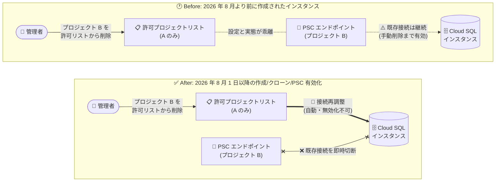

# Cloud SQL: Private Service Connect の接続再調整 (Connection Reconciliation) がデフォルトで有効化

**リリース日**: 2026-07-31 (2026 年 8 月 1 日から適用)

**サービス**: Cloud SQL (MySQL / PostgreSQL / SQL Server 共通)

**機能**: Private Service Connect の接続再調整 (Connection Reconciliation)

**ステータス**: Change (動作変更)

📊 [このアップデートのインフォグラフィックを見る](https://takech9203.github.io/google-cloud-news-summary/20260731-cloud-sql-psc-connection-reconciliation.html)

## 概要

2026 年 8 月 1 日以降、Private Service Connect (PSC) を有効にした Cloud SQL インスタンスを新規作成またはクローンする場合、あるいは既存インスタンスで PSC を新たに有効化する場合、**接続再調整 (Connection Reconciliation) の動作がデフォルトで有効になり、無効化できなくなります**。この変更は Cloud SQL for MySQL、PostgreSQL、SQL Server のすべてのエンジンに共通して適用されます。

接続再調整が有効な場合、許可プロジェクトリスト (Allowed Projects) からプロジェクトを削除すると、削除されたプロジェクトからの既存の PSC 接続はすべて即座に切断 (reconcile) されます。つまり、削除されたプロジェクト内の PSC エンドポイントを使用しているアプリケーションは、そのエンドポイント経由での接続を継続できなくなります。

この変更は、許可リストの設定を実際のネットワーク接続状態に即時に反映させるセキュリティ強化です。一方で、許可プロジェクトリストの運用を誤ると本番アプリケーションの接続断を引き起こすため、PSC を利用するすべての Cloud SQL 管理者が把握しておくべき重要な動作変更です。

**アップデート前の課題**

これまでの動作 (2026 年 8 月より前に作成されたインスタンス) では、許可リストの変更と実際の接続状態に乖離がありました。

- 許可プロジェクトリストからプロジェクトを削除しても、そのプロジェクト内の PSC エンドポイントを使用する既存接続は継続して接続可能だった
- 接続を完全に遮断するには、削除したプロジェクト側の PSC エンドポイントを手動で削除する必要があった
- 許可リストの設定と実際のアクセス可否が一致せず、アクセス制御の意図がすぐに反映されないセキュリティ上のギャップが存在した

**アップデート後の改善**

- 許可プロジェクトリストからプロジェクトを削除すると、そのプロジェクトからの既存 PSC 接続が即座に閉じられる (reconcile)
- エンドポイントの手動削除が不要になり、許可リストが単一の信頼できるアクセス制御ポイントとして機能する
- 侵害されたプロジェクトや退役したプロジェクトからのアクセスを即時に遮断でき、セキュリティ体制が向上する

## アーキテクチャ図



許可プロジェクトリストからプロジェクトを削除した際の動作比較です。従来は削除後も既存接続が継続しましたが、8 月以降に作成・クローン・PSC 有効化されたインスタンスでは、削除プロジェクトからの既存接続が即座に切断されます。

## サービスアップデートの詳細

### 主要機能

1. **接続再調整 (Connection Reconciliation) のデフォルト有効化**
   - 2026 年 8 月以降のインスタンス作成、クローン、PSC 有効化では、接続再調整がデフォルトで有効になり、無効化できない
   - 許可プロジェクトリストからプロジェクトを削除すると、そのプロジェクトからの既存 PSC 接続がすべて即座に閉じられる

2. **許可プロジェクトリスト (Allowed Projects) の役割強化**
   - PSC 有効の Cloud SQL インスタンスに接続するには、少なくとも 1 つのプロジェクトを許可リストに追加する必要がある
   - 許可リストに含まれるプロジェクトでは PSC エンドポイントを作成して接続できる
   - 許可リストに含まれないプロジェクトでもエンドポイント自体は作成できるが、接続はブロックされ、エンドポイントは `PENDING` 状態のままになる

3. **既存インスタンスへの影響 (経過措置)**
   - 2026 年 8 月より前に作成されたインスタンスでは従来の動作を維持: プロジェクトを許可リストから削除しても、エンドポイントを手動で削除するまで既存接続は継続する
   - ただし、既存インスタンスであっても新たに PSC を有効化した場合は新しい動作が適用される

## 技術仕様

### 動作の適用条件

| 条件 | 接続再調整の動作 |
|------|------------------|
| 2026 年 8 月以降にインスタンスを新規作成 | 有効 (無効化不可) |
| 2026 年 8 月以降にインスタンスをクローン | 有効 (無効化不可) |
| 2026 年 8 月以降に既存インスタンスで PSC を有効化 | 有効 (無効化不可) |
| 2026 年 8 月より前に作成された PSC 有効インスタンス | 従来動作 (エンドポイントを手動削除するまで接続継続) |

### 対象エンジン

| エンジン | 対象 |
|----------|------|
| Cloud SQL for MySQL | 対象 |
| Cloud SQL for PostgreSQL | 対象 |
| Cloud SQL for SQL Server | 対象 |

### 許可プロジェクトリストの設定 (API)

```json
{
  "settings": {
    "ipConfiguration": {
      "pscConfig": {
        "pscEnabled": "true",
        "allowedConsumerProjects": ["ALLOWED_PROJECT_1", "ALLOWED_PROJECT_2"]
      }
    }
  }
}
```

`allowedConsumerProjects` に指定したプロジェクトのリストは、すでに構成済みのプロジェクトを上書きします。

## 設定方法

### 前提条件

1. Cloud SQL インスタンスで Private Service Connect が有効化されていること
2. 許可プロジェクトリストを変更する権限 (Cloud SQL Admin 相当) があること

### 手順

#### ステップ 1: 現在の許可プロジェクトリストを確認する

```bash
gcloud sql instances describe INSTANCE_NAME \
  --project=PROJECT_ID \
  --format="value(settings.ipConfiguration.pscConfig.allowedConsumerProjects)"
```

現在許可されているプロジェクトの一覧を確認し、削除対象プロジェクトに依存するアプリケーションがないかを事前に洗い出します。

#### ステップ 2: 許可プロジェクトリストを更新する

```bash
gcloud sql instances patch INSTANCE_NAME \
  --project=PROJECT_ID \
  --allowed-psc-projects=ALLOWED_PROJECTS
```

`--allowed-psc-projects` にはカンマ区切りで残したいプロジェクト ID または番号を指定します。**8 月以降に作成・クローン・PSC 有効化されたインスタンスでは、リストから外れたプロジェクトの既存 PSC 接続は即座に切断される**点に注意してください。

## メリット

### ビジネス面

- **セキュリティガバナンスの強化**: 許可リストがアクセス制御の単一の管理ポイントとなり、プロジェクト削除の意図が即座にネットワークレベルで反映される
- **監査対応の簡素化**: 「許可リストにないプロジェクトからは接続できない」という状態が保証されるため、アクセス制御の実態と設定の乖離を説明する必要がなくなる

### 技術面

- **即時のアクセス遮断**: 侵害された、あるいは不要になったコンシューマプロジェクトからの接続を、エンドポイントの手動削除を待たずに即座に遮断できる
- **運用作業の削減**: 削除したプロジェクト側での PSC エンドポイント手動削除が接続遮断の前提条件でなくなる

## デメリット・制約事項

### 制限事項

- 2026 年 8 月以降に作成・クローン・PSC 有効化したインスタンスでは、接続再調整を無効化 (オプトアウト) できない
- 2026 年 8 月より前に作成された既存インスタンスは従来動作のままで、インスタンスごとに動作が異なる期間が生じる

### 考慮すべき点

- **意図しない接続断のリスク**: 許可リストからのプロジェクト削除が本番アプリケーションの即時接続断につながるため、削除前に対象プロジェクト内の PSC エンドポイント利用状況を必ず確認する
- **IaC (Terraform など) の運用**: `allowed_consumer_projects` はリスト全体を上書きするため、誤ったリストの適用が即時の接続断を引き起こす。plan の差分確認を徹底する
- **クローン時の動作差分**: 8 月より前に作成されたインスタンスでも、8 月以降にクローンを作成すると、クローン側は新しい動作 (再調整有効) になる

## ユースケース

### ユースケース 1: 退役プロジェクトからのアクセス即時遮断

**シナリオ**: マルチプロジェクト構成で、廃止するサービスプロジェクトから Cloud SQL への PSC 接続を確実に遮断したい。

**実装例**:
```bash
# 廃止プロジェクト (old-project) を除いたリストで更新
gcloud sql instances patch my-instance \
  --project=db-host-project \
  --allowed-psc-projects=app-project-1,app-project-2
```

**効果**: 従来必要だった廃止プロジェクト側での PSC エンドポイント削除を待たず、リスト更新と同時に既存接続が切断され、確実にアクセスが遮断される。

### ユースケース 2: セキュリティインシデント時の緊急遮断

**シナリオ**: あるコンシューマプロジェクトの侵害が疑われるため、そのプロジェクトからのデータベースアクセスを即時に止めたい。

**効果**: 許可リストから該当プロジェクトを削除するだけで、確立済みの PSC 接続も含めて即座に切断され、被害拡大を防止できる。事後にエンドポイントを個別に調査・削除する時間的猶予が生まれる。

## 料金

この動作変更自体に追加料金は発生しません。Cloud SQL および Private Service Connect の料金体系に変更はありません。

- [Cloud SQL の料金](https://cloud.google.com/sql/pricing)

## 利用可能リージョン

Private Service Connect をサポートするすべての Cloud SQL リージョンに適用されます。詳細は公式ドキュメントを参照してください。

## 関連サービス・機能

- **Private Service Connect (PSC)**: VPC ネットワーク間でサービスをプライベートに公開・利用する仕組み。本アップデートの対象機能
- **Network Connectivity Center (NCC)**: PSC エンドポイント伝播により、ハブに接続されたスポーク VPC から PSC エンドポイントへ推移的に到達可能にする。エンドポイント管理を集約するユースケースで併用される
- **AlloyDB for PostgreSQL**: 同様に PSC 経由の接続をサポートするマネージドデータベース。PSC ベースのアクセス制御設計の比較対象となる

## 参考リンク

- 📊 [インフォグラフィック](https://takech9203.github.io/google-cloud-news-summary/20260731-cloud-sql-psc-connection-reconciliation.html)
- [公式リリースノート](https://docs.cloud.google.com/release-notes#July_31_2026)
- [Cloud SQL for MySQL: Private Service Connect の概要 (許可プロジェクト)](https://docs.cloud.google.com/sql/docs/mysql/about-private-service-connect)
- [Cloud SQL for PostgreSQL: Private Service Connect の概要 (許可プロジェクト)](https://docs.cloud.google.com/sql/docs/postgres/about-private-service-connect)
- [Cloud SQL for SQL Server: Private Service Connect の概要 (許可プロジェクト)](https://docs.cloud.google.com/sql/docs/sqlserver/about-private-service-connect)
- [Private Service Connect が有効なインスタンスの構成 (MySQL)](https://docs.cloud.google.com/sql/docs/mysql/configure-private-service-connect)
- [料金ページ](https://cloud.google.com/sql/pricing)

## まとめ

2026 年 8 月 1 日以降、PSC 有効の Cloud SQL インスタンスの新規作成・クローン・PSC 有効化では、許可プロジェクトリストからの削除が既存接続の即時切断に直結するようになります。セキュリティ面では大きな改善ですが、運用面では許可リスト変更が本番接続断を引き起こしうるため、リスト変更前の影響確認プロセスと IaC の差分レビューを整備しておくことを推奨します。

---

**タグ**: #CloudSQL #MySQL #PostgreSQL #SQLServer #PrivateServiceConnect #PSC #ネットワークセキュリティ #アクセス制御 #Change
