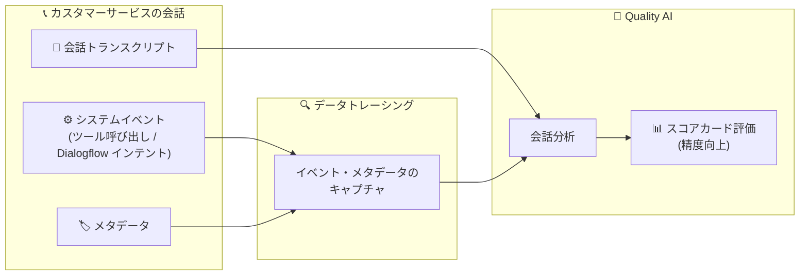

# Contact Center AI Insights (Customer Experience Insights): Quality AI データトレーシング

**リリース日**: 2026-07-31

**サービス**: Contact Center AI Insights (Customer Experience Insights)

**機能**: Quality AI データトレーシング (Data Tracing)

**ステータス**: Feature

📊 [このアップデートのインフォグラフィックを見る](https://takech9203.github.io/google-cloud-news-summary/20260731-contact-center-ai-insights-quality-ai-data-tracing.html)

## 概要

Customer Experience Insights (CX Insights、旧称 Conversational Insights / Contact Center AI Insights) の Quality AI に、データトレーシング (Data Tracing) 機能が追加されました。この機能は、カスタマーサービスの会話中に発生するシステムイベントとメタデータをキャプチャし、会話分析に組み込むことで、Quality AI スコアカードの評価精度を向上させます。

トレーシングがキャプチャするシステムイベントには、ツール呼び出し (tool calls) や Dialogflow のインテントが含まれます。従来のスコアカード評価は会話のトランスクリプト (発話内容) を主な入力としていましたが、データトレーシングを有効にすることで、「エージェントが実際にどのツールを呼び出したか」「どのインテントが検出されたか」といった会話の裏側で起きた事実を評価の根拠として利用できます。特に、ツールの実行有無に依存する質問 (tool-dependent questions) の評価精度が向上します。

コンタクトセンターの品質管理 (QA) を Quality AI で自動化している企業や、Dialogflow / 仮想エージェントと人間のエージェントが混在する環境で会話品質を評価しているチームが主な対象ユーザーです。

**アップデート前の課題**

- スコアカードの評価は主に会話トランスクリプトのテキスト情報に基づいており、会話の裏側で発生したシステム動作 (ツール呼び出しや検出されたインテントなど) を評価の根拠として利用できなかった
- 「エージェントが適切なツールを実行して手続きを完了したか」のような、システム動作に依存する質問は、発話内容だけからの推定になり評価精度に限界があった

**アップデート後の改善**

- 会話中のシステムイベント (ツール呼び出し、Dialogflow インテント) とメタデータを会話分析に取り込めるようになった
- ツール実行の有無に依存するスコアカード質問 (tool-dependent questions) の評価精度が向上した
- スコアカードの質問作成時に Tracing を有効化するだけで利用でき、評価根拠がトランスクリプト + システムイベントに拡張された

## アーキテクチャ図



会話トランスクリプトに加え、データトレーシングがキャプチャしたシステムイベント (ツール呼び出し・Dialogflow インテント) とメタデータが Quality AI の会話分析に入力され、スコアカード評価の精度を高めます。

## サービスアップデートの詳細

### 主要機能

1. **システムイベントのキャプチャ**
   - カスタマーサービスの会話中に発生するシステムイベントを記録
   - システムイベントにはツール呼び出し (tool calls) と Dialogflow インテントが含まれる

2. **メタデータの会話分析への活用**
   - キャプチャしたシステムイベントとメタデータを Quality AI の会話分析に組み込む
   - 発話内容だけでは判断が難しい評価項目に、客観的なシステム動作の記録を根拠として提供

3. **ツール依存の質問の精度向上**
   - トレーシングは、QAI スコアカード内のツール実行に依存する質問 (tool-dependent questions) の精度を特に向上させる
   - 例: 「エージェントは所定のツールを使って顧客情報を更新したか」のような質問

## 技術仕様

### スコアカードにおけるトレーシングの位置付け

Quality AI のスコアカードは以下の要素で構成され、トレーシングはその構成要素の 1 つとして定義されます。

| 項目 | 詳細 |
|------|------|
| Question | 会話・エージェントパフォーマンスを評価する質問 |
| Tag (任意) | 質問の分類 (business / customer / compliance / カスタムタグ) |
| Instructions | 質問の解釈と各回答選択肢の判定基準の定義 |
| **Tracing** | **システムイベントとメタデータを評価に含める設定 (今回の機能)** |
| Answer type | 回答形式 (テキスト / 数値 / Yes-No) |
| Answer choices | 回答選択肢 |
| Score | 各回答選択肢に対応するスコア |

## 設定方法

### 前提条件

1. Google Cloud プロジェクトで Customer Experience Insights が有効化されていること
2. Quality AI が利用可能なサブスクリプション (Enterprise エディションまたは Standalone Quality AI) であること

### 手順

#### ステップ 1: Quality AI コンソールを開く

1. [Google Cloud CCAI コンソール](https://ccai.cloud.google.com/projects) を開き、Customer Experience Insights が有効なプロジェクトを選択
2. 「Insights」>「Quality AI」をクリック

#### ステップ 2: スコアカードの質問で Tracing を有効化

1. 「Scorecards」>「+ Add scorecard」でスコアカードを作成 (既存スコアカードの編集も可)
2. 「+ Add question」で質問と Instructions を追加
3. **「Tracing」を有効化してデータトレーシングを有効にする**
4. 回答形式・回答選択肢・スコアを設定して「Save」をクリック

## メリット

### ビジネス面

- **QA 評価の信頼性向上**: システム動作という客観的な事実に基づく評価により、自動スコアリングの結果に対する現場の納得感が高まる
- **コンプライアンス確認の強化**: 「所定の手続き (ツール実行) を実施したか」といったプロセス遵守の評価を、発話の推定ではなく実際のイベント記録で確認できる

### 技術面

- **評価根拠の拡張**: トランスクリプトに加えてツール呼び出しや Dialogflow インテントを評価入力に利用でき、ツール依存の質問の精度が向上する
- **設定が容易**: スコアカードの質問単位で Tracing を有効化するだけで利用でき、追加のパイプライン構築は不要

## デメリット・制約事項

### 考慮すべき点

- 精度向上の効果は、ツール実行やシステムイベントに依存する質問で特に発揮されるため、純粋に発話内容のみで判断する質問への効果は限定的
- システムイベント (ツール呼び出し・Dialogflow インテント) が会話データとともに取り込まれていることが前提となる

## ユースケース

### ユースケース 1: ツール実行を伴う手続きの遵守確認

**シナリオ**: 住所変更などの手続きで、エージェントが顧客確認後に所定のツールを実行してアカウント情報を更新することが必須とされているコンタクトセンター。

**実装例**:
```
質問: エージェントは顧客の依頼に対して所定のツールを実行してアカウント情報を更新したか?
Tag: Compliance
Tracing: 有効
Answer type: Yes/No (Yes: 1, No: 0, N/A あり)
```

**効果**: ツール呼び出しイベントが評価根拠に含まれるため、発話内容からの推定に頼らず、実際にツールが実行されたかどうかを正確に評価できる。

### ユースケース 2: 仮想エージェント (Dialogflow) の品質評価

**シナリオ**: Dialogflow ベースの仮想エージェントと人間のエージェントが混在する環境で、インテント検出と応対内容の整合性を評価したい。

**効果**: Dialogflow インテントがシステムイベントとしてキャプチャされるため、検出されたインテントに対して適切な応対が行われたかをスコアカードで精度高く評価できる。

## 料金

Customer Experience Insights の料金は、顧客とのやり取りの形態に基づいて課金されます。

- チャット会話: メッセージ単位で課金
- 音声会話: 分単位で課金

Quality AI は Enterprise エディションまたは Standalone Quality AI サブスクリプションで利用できます。詳細は [料金ページ](https://cloud.google.com/contact-center/insights/docs/pricing) を参照してください。

## 利用可能リージョン

CX Insights コンソールは us (マルチリージョン) および eu (マルチリージョン) の指定に対応しています。詳細は [リージョン化のドキュメント](https://cloud.google.com/contact-center/insights/docs/regionalization) を参照してください。

## 関連サービス・機能

- **Quality AI**: CX Insights 上に構築された品質評価機能。個々の会話、人間のエージェント、仮想エージェントを対象にスコアカードで自動評価する。今回のデータトレーシングはこのスコアカード評価の精度を向上させる
- **Dialogflow CX**: 仮想エージェント基盤。会話のインポート元であり、Dialogflow インテントはトレーシングがキャプチャするシステムイベントの 1 つ
- **Agent Assist**: エージェント支援機能。CX Insights と統合され、会話データのインポートや要約生成に利用される

## 参考リンク

- 📊 [インフォグラフィック](https://takech9203.github.io/google-cloud-news-summary/20260731-contact-center-ai-insights-quality-ai-data-tracing.html)
- [公式リリースノート](https://docs.cloud.google.com/release-notes#July_31_2026)
- [Quality AI ベストプラクティス (Trace data)](https://docs.cloud.google.com/contact-center/insights/docs/qai-best-practices)
- [Quality AI セットアップガイド](https://docs.cloud.google.com/contact-center/insights/docs/qai-setup-guide)
- [Quality AI の基本 (スコアカード)](https://docs.cloud.google.com/contact-center/insights/docs/qai-basics)
- [料金ページ](https://cloud.google.com/contact-center/insights/docs/pricing)

## まとめ

Quality AI のデータトレーシングは、ツール呼び出しや Dialogflow インテントといったシステムイベントを評価根拠に加えることで、スコアカードの評価精度、特にツール依存の質問の精度を向上させる機能です。Quality AI で QA を自動化しているコンタクトセンターは、ツール実行やプロセス遵守に関する質問でスコアカードの Tracing を有効化し、評価の信頼性向上を検討することを推奨します。

---

**タグ**: `Contact Center AI Insights` `Customer Experience Insights` `Quality AI` `Data Tracing` `Scorecard` `Dialogflow` `コンタクトセンター` `品質管理`
