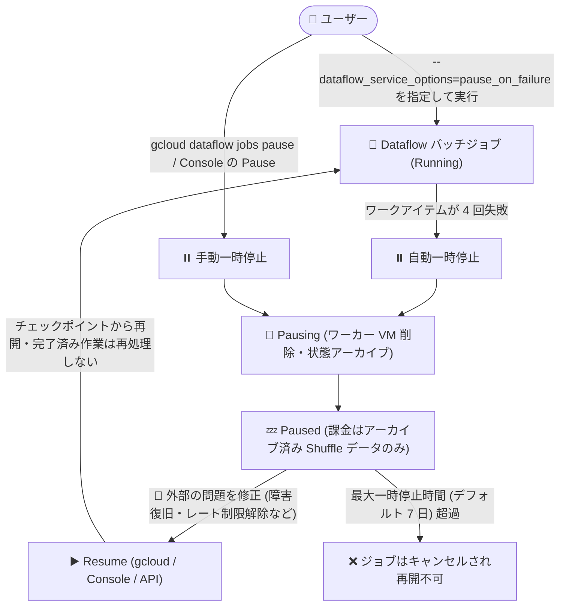

# Dataflow: バッチジョブの一時停止 (pause_on_failure サービスオプション)

**リリース日**: 2026-07-31

**サービス**: Dataflow

**機能**: バッチジョブの一時停止 (pause_on_failure サービスオプション)

**ステータス**: Feature (新機能)

📊 [このアップデートのインフォグラフィックを見る](https://takech9203.github.io/google-cloud-news-summary/20260731-dataflow-batch-job-pause-on-failure.html)

## 概要

Dataflow のバッチジョブを一時停止できる `pause_on_failure` サービスオプションが利用可能になりました。この機能を有効にすると、バッチパイプラインジョブの状態 (チェックポイント) を保持したままジョブを一時停止し、パイプライン外部の問題 (外部サービスの一時的な障害やレート制限など) に対処した後、完了済みの作業を失うことなく処理を再開できます。

一時停止は 2 通りの方法で行えます。1 つはジョブの失敗時に自動的に一時停止する方法 (ワークアイテムが 4 回失敗すると自動的に一時停止)、もう 1 つは実行中のジョブを手動で一時停止する方法です。一時停止中はワーカー VM が削除され、課金対象はアーカイブされた Shuffle データのみになるため、問題対処中の無駄なコンピュートコストを抑えられます。

大規模なバッチ処理を運用するデータエンジニアにとって、途中失敗による「最初からやり直し」のコストとリードタイムを大幅に削減できるアップデートです。特に GPU/TPU などの希少リソースを使うワークロードや、外部依存の多いパイプラインで効果を発揮します。

**アップデート前の課題**

- バッチジョブが失敗すると、途中まで完了していた処理を含めてジョブ全体を最初から再実行する必要があり、完了済みの作業に対して再度コンピュートコストを支払う必要があった
- 外部サービスの一時的な障害やレート制限が原因の失敗でも、根本原因に対処してからジョブを再開する手段がなかった
- 断続的・非決定的な失敗が発生するワークロードでは、リトライのたびに進捗がゼロに戻り、ジョブ全体が完了しないリスクがあった
- 優先度の低いバッチジョブが実行中の場合、進捗を失わずにクォータや GPU/TPU リソースを一時的に解放する方法がなかった

**アップデート後の改善**

- ジョブ失敗時に最後に記録されたチェックポイントから再開できるようになり、完了済みデータブロックの再処理が不要になった
- 一時停止中に外部の問題 (障害、レート制限など) の根本原因に対処し、完了済みの作業を失わずに処理を再開できるようになった
- 断続的な失敗が発生するワークロードでも、試行ごとに増分の進捗を確保でき、ジョブ全体の失敗を防止できるようになった
- 優先度の低いバッチジョブを一時停止して、クォータや GPU/TPU などの高価値リソースを緊急のワークロードに一時的に振り向けられるようになった

## アーキテクチャ図



バッチジョブが失敗 (または手動操作) で一時停止状態に遷移し、外部の問題を修正した後、チェックポイントから処理を再開するフローを示しています。一時停止中はワーカー VM が削除され、課金はアーカイブされた Shuffle データのみになります。

## サービスアップデートの詳細

### 主要機能

1. **失敗時の自動一時停止**
   - `pause_on_failure` サービスオプションを有効にすると、ワークアイテムが 4 回失敗した時点でジョブが自動的に一時停止する
   - 対象となる失敗はログ上で `Error message from worker` (ジョブメッセージ) および `Completed work item ITEM_NUMBER UNSUCCESSFULLY` (ワーカーメッセージ) として識別できる
   - ストックアウト (リソース不足) やクォータエラーなどその他の失敗は自動一時停止のトリガーにならず、通常どおりジョブが失敗する

2. **手動の一時停止・再開**
   - `pause_on_failure` を有効にしたジョブは、Google Cloud コンソール、gcloud CLI (`gcloud dataflow jobs pause` / `resume`)、REST API から手動で一時停止・再開できる
   - REST API では `projects.locations.jobs.update` エンドポイントに `"requestedState": "JOB_STATE_PAUSING"` (一時停止) または `"JOB_STATE_RUNNING"` (再開) を渡す

3. **チェックポイントの保持と再開時の動作**
   - 再開時、一時停止時点で完全に完了していたステージ・ワークアイテムは再処理されない
   - 一時停止時点で処理中だったワークアイテムは最初から再処理される
   - 再開時にすべてのワークアイテムの失敗カウントがゼロにリセットされる (再度 4 回失敗するまで自動一時停止しない)

4. **最大一時停止時間の設定**
   - デフォルトでは最大 7 日間 (`7d`) 一時停止状態を維持できる
   - `pause_on_failure=pause_duration:1d` のように 1 時間 (`1h`) から 7 日 (`7d`) の範囲で設定可能 (単位は `d` と `h` のみサポート)
   - 最大一時停止時間を超過するとジョブはキャンセルされ、再開できなくなる

## 技術仕様

### ジョブの状態遷移

| 状態 | 説明 | 課金 |
|------|------|------|
| Pausing | 処理を停止し、ワーカー VM を削除、バックエンド状態をアーカイブする中間状態 | VM の削除が完了するまで VM 課金が継続 |
| Paused | ジョブが完全に停止した状態 | アーカイブされた Shuffle データのみ課金 |

### 要件と制限

| 項目 | 詳細 |
|------|------|
| 対象ジョブ | バッチジョブのみ (ストリーミングは非対応) |
| 前提機能 | Dataflow Shuffle (バッチ用) を使用していること |
| 有効化方法 | ジョブ実行時に `pause_on_failure` サービスオプションを指定 |
| その他条件 | 過去に一時停止に失敗したジョブは対象外 |
| 一時停止中の変更 | パイプラインコードやワーカー VM 構成 (マシンタイプなど) は変更不可 |
| 自動一時停止条件 | ワークアイテムの 4 回失敗 (ストックアウト・クォータエラーは対象外) |
| 最大一時停止時間 | デフォルト 7 日、1 時間〜7 日で設定可能 |

### 例外的な動作

- 完了間際のジョブを手動で一時停止すると、一時停止せずにそのまま完了する場合がある
- まれに一時停止に失敗する場合があり、手動一時停止なら Running 状態に戻り、失敗起因の一時停止ならジョブは失敗状態になる

## 設定方法

### 前提条件

1. Dataflow バッチジョブであること
2. Dataflow Shuffle (バッチ用) を使用していること

### 手順

#### ステップ 1: pause_on_failure を有効にしてジョブを実行

```bash
# Java
--dataflowServiceOptions=pause_on_failure

# Python / Go
--dataflow_service_options=pause_on_failure

# 最大一時停止時間を 1 日に設定する場合 (Python / Go)
--dataflow_service_options=pause_on_failure=pause_duration:1d
```

ジョブ実行時にサービスオプションとして指定します。これにより失敗時の自動一時停止と手動一時停止の両方が有効になります。

#### ステップ 2: ジョブを手動で一時停止 (必要な場合)

```bash
# 実行中のジョブ一覧を確認
gcloud dataflow jobs list

# ジョブを一時停止
gcloud dataflow jobs pause JOB_ID --region=REGION
```

コンソールの場合は、ジョブ詳細ページで「Pause」をクリックします (ジョブが Running 状態である必要があります)。

#### ステップ 3: 外部の問題に対処後、ジョブを再開

```bash
gcloud dataflow jobs resume JOB_ID --region=REGION
```

コンソールの場合は、ジョブ詳細ページで「Resume」をクリックします (ジョブが Paused 状態である必要があり、Pausing 状態では再開できません)。REST API の場合は `projects.locations.jobs.update` に `"requestedState": "JOB_STATE_RUNNING"` を渡します。

## メリット

### ビジネス面

- **コンピュートコストの削減**: 失敗時に完了済み作業を再処理する必要がなくなり、成功済みの処理に対して二重にコストを支払うことがなくなる
- **リソースの柔軟な再配分**: 優先度の低いバッチジョブを一時停止し、GPU/TPU などの高価値リソースやクォータを ML モデルのトレーニング・推論などの緊急ワークロードに振り向けられる
- **一時停止中の低コスト**: Paused 状態ではアーカイブされた Shuffle データのみが課金対象となり、待機コストを最小化できる

### 技術面

- **チェックポイントからの再開**: 最後に記録されたチェックポイントから再開でき、ジョブ全体の再実行が不要になる
- **外部依存の障害への耐性**: 外部サービスの一時的な障害やレート制限に対して、根本原因への対処後に処理を継続できる
- **非決定的な失敗への対応**: 断続的な失敗が発生するワークロードでも試行ごとに増分の進捗を確保でき、ジョブ全体の失敗を防げる

## デメリット・制約事項

### 制限事項

- バッチジョブのみ対応 (ストリーミングジョブは非対応)
- Dataflow Shuffle (バッチ用) の使用が必須
- 一時停止中はパイプラインコードやワーカー VM 構成 (マシンタイプなど) を変更できない
- ストックアウトやクォータエラーは自動一時停止のトリガーにならず、通常どおりジョブが失敗する
- 最大一時停止時間 (デフォルト 7 日、上限 7 日) を超えるとジョブはキャンセルされ、再開不可になる
- 過去に一時停止に失敗したジョブは一時停止できない

### 考慮すべき点

- Pausing 状態の間はワーカー VM の削除が完了するまで VM の課金が継続する
- Paused 状態でもアーカイブされた Shuffle データに対する課金 (Shuffle Data Archived SKU) が発生する
- 完了間際のジョブを手動で一時停止すると、一時停止せずに完了する場合がある
- 再開時、処理中だったワークアイテムは最初から再処理されるため、その分の再計算は発生する
- 一時停止中のジョブは通常どおりキャンセルできるが、キャンセル後は再開できない

## ユースケース

### ユースケース 1: 外部 API のレート制限による失敗からの復旧

**シナリオ**: 大規模なバッチパイプラインが外部 API を呼び出しており、レート制限により処理の途中でワークアイテムが繰り返し失敗する。従来はジョブ全体が失敗し、数時間分の処理を最初からやり直す必要があった。

**実装例**:
```bash
python my_pipeline.py \
  --runner=DataflowRunner \
  --project=my-project \
  --region=us-central1 \
  --dataflow_service_options=pause_on_failure=pause_duration:1d
```

**効果**: ワークアイテムが 4 回失敗した時点でジョブが自動的に一時停止する。レート制限の引き上げや呼び出し頻度の調整 (外部側の対処) を行った後、`gcloud dataflow jobs resume` で再開すれば、完了済みの処理を失わずに続行できる。

### ユースケース 2: GPU/TPU リソースの一時的な再配分

**シナリオ**: 優先度の低いバッチ推論ジョブが GPU クォータを消費している中、緊急の ML モデルトレーニングを実行する必要が生じた。

**効果**: バッチジョブを手動で一時停止してワーカー VM を解放し、クォータを緊急ワークロードに振り向ける。トレーニング完了後にバッチジョブを再開すれば、それまでの進捗を失わずに処理を続行できる。

## 料金

この機能自体の追加料金に関する記載はありませんが、一時停止に伴う課金の挙動は以下のとおりです。

- **Pausing 状態**: ワーカー VM の削除が完了するまで VM の課金が継続
- **Paused 状態**: アーカイブされた Shuffle データ (Shuffle Data Archived SKU) のみ課金

詳細は [Dataflow の料金ページ](https://cloud.google.com/dataflow/pricing) を参照してください。

## 利用可能リージョン

リージョンに関する個別の記載は確認できませんでした。詳細は[公式ドキュメント](https://docs.cloud.google.com/dataflow/docs/guides/pause-job)を参照してください。

## 関連サービス・機能

- **Dataflow Shuffle (バッチ用)**: 本機能の前提条件。シャッフル処理をワーカー VM からサービスバックエンドに移すことで、状態のアーカイブと一時停止を可能にしている
- **Dataflow スナップショット**: ストリーミングパイプライン向けの状態保存機能。本機能はバッチ向けであり、ストリーミングにはスナップショットが該当する
- **Cloud Logging**: 自動一時停止のトリガーとなるワークアイテム失敗 (`Error message from worker` など) の確認に使用
- **gcloud CLI / Dataflow REST API**: `gcloud dataflow jobs pause` / `resume` コマンドや `projects.locations.jobs.update` エンドポイントで一時停止・再開を操作

## 参考リンク

- 📊 [インフォグラフィック](https://takech9203.github.io/google-cloud-news-summary/20260731-dataflow-batch-job-pause-on-failure.html)
- [公式リリースノート](https://docs.cloud.google.com/release-notes#July_31_2026)
- [ドキュメント: Pause a Dataflow job](https://docs.cloud.google.com/dataflow/docs/guides/pause-job)
- [ドキュメント: Dataflow service options](https://docs.cloud.google.com/dataflow/docs/reference/service-options)
- [ドキュメント: Dataflow Shuffle for batch jobs](https://docs.cloud.google.com/dataflow/docs/shuffle-for-batch)
- [料金ページ](https://cloud.google.com/dataflow/pricing)

## まとめ

`pause_on_failure` サービスオプションにより、Dataflow バッチジョブの失敗時に「最初からやり直し」ではなく「一時停止して修正後に再開」という運用が可能になり、大規模バッチ処理のコストと信頼性が大きく改善されます。外部依存の多いパイプラインや GPU/TPU を使う長時間バッチジョブを運用しているチームは、Dataflow Shuffle の利用を前提に、このオプションの有効化を検討することを推奨します。最大一時停止時間 (デフォルト 7 日) とアーカイブ済み Shuffle データの課金には留意してください。

---

**タグ**: Dataflow, バッチ処理, pause_on_failure, ジョブ管理, コスト最適化, フォールトトレランス
