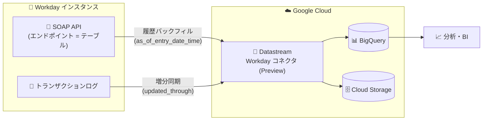

# Datastream: Workday ソースからの変更データレプリケーション (Preview)

**リリース日**: 2026-07-31

**サービス**: Datastream

**機能**: Workday ソースからの変更データレプリケーション

**ステータス**: Preview

📊 [このアップデートのインフォグラフィックを見る](https://takech9203.github.io/google-cloud-news-summary/20260731-datastream-workday-source.html)

## 概要

Datastream で Workday を変更データのソースとして利用できるようになりました (Preview)。Workday はクラウドベースの ERP (Enterprise Resource Planning) プラットフォームで、財務管理と人的資本管理 (HCM) に特化しており、採用、オンボーディング、報酬、勤怠管理など従業員ライフサイクル全般を管理できます。今回のアップデートにより、Workday 上の人事・財務データを Datastream 経由で BigQuery や Cloud Storage といったサポート対象の宛先へレプリケートできるようになります。

Workday コネクタは Workday SOAP API を利用します。Workday は内部テーブルスキーマをユーザーに公開しないため、Datastream は SOAP API のエンドポイントをテーブルとして扱います。データの整合性とパフォーマンスを確保するため、履歴バックフィルと増分同期の 2 つのレプリケーション方式をサポートします。

Datastream のアプリケーションソースは Salesforce、Salesforce Marketing Cloud (Preview)、Microsoft Dataverse (Preview)、ServiceNow (Preview) に続いて拡充が続いており、今回の Workday 対応により、SaaS アプリケーションのデータを BigQuery に集約して分析するユースケースがさらに広がります。人事・財務データを全社データ基盤に統合したいデータエンジニアや、ピープルアナリティクスに取り組む組織が主な対象です。

**アップデート前の課題**

- Datastream は Workday をソースとしてサポートしておらず、Workday の人事・財務データを BigQuery などに取り込むには、サードパーティの ETL ツールや Workday SOAP API を直接呼び出すカスタム連携の開発・運用が必要だった
- Workday は内部テーブルスキーマを公開しないため、SOAP API・WSDL の解析やページネーション、増分取得のロジックを自前で実装する必要があった

**アップデート後の改善**

- Datastream のマネージドなコネクタとして Workday からの履歴バックフィルと増分同期が利用可能になり、カスタム連携の開発・運用が不要になった
- WSDL ファイルに基づく動的ディスカバリにより、インスタンス内のオブジェクト (エンドポイント) が自動的に検出されるようになった
- ポーリング間隔 (5〜1440 分) を指定するだけで、Workday の変更データを継続的に宛先へ反映できるようになった

## アーキテクチャ図

Datastream の Workday コネクタは SOAP API 経由で履歴データのバックフィルとトランザクションログに基づく増分同期を行い、BigQuery や Cloud Storage へ変更データをレプリケートします。

## サービスアップデートの詳細

### 主要機能

1. **履歴バックフィル (Historical backfill)**
   - エンドポイント内の既存レコード全件を履歴同期できる
   - バックフィルクエリ間の一貫性を確保するため `as_of_entry_date_time` パラメータを使用し、1 ページずつ整合性を保ってデータを取得する

2. **増分同期 (Incremental synchronization)**
   - 初回バックフィル後に発生した挿入・更新などの変更をキャプチャする
   - トランザクションログをサポートするエンドポイントを選択し、`updated_through` フィールドでクエリをフィルタするサーバーサイド増分同期を採用。指定日時以降に更新されたレコードのみを取得する

3. **動的ディスカバリによるオブジェクト検出**
   - 各 SOAP API サービスに対応する WSDL ファイルを取得し、インスタンス内のオブジェクト一覧を自動的に特定する
   - 各エンドポイントがトランザクションログをサポートするかどうかも WSDL から判定する

4. **柔軟なオブジェクト選択とポーリング設定**
   - ストリーム作成時に「すべてのオブジェクト」「特定のオブジェクト (列単位の除外も可能)」「カスタム (カンマ区切りのテキスト定義)」から選択できる
   - ポーリング間隔は 5〜1440 分、増分同期非対応オブジェクト向けの完全更新 (フルリフレッシュ) 間隔は 60〜1440 分で設定できる
   - バックフィルモードは自動 (既存データ + 変更) と手動 (変更のみ) から選択できる

### サポート対象オブジェクト

以下のオブジェクトがサポートされ、いずれもバックフィルと増分同期に対応します。

| オブジェクト | レプリケーションタイプ |
|------|------|
| Financial_Management_Organizations | バックフィル、増分同期 |
| Human_Resources_Job_Profiles | バックフィル、増分同期 |
| Human_Resources_Organizations | バックフィル、増分同期 |
| Human_Resources_Workers | バックフィル、増分同期 |
| Recruiting_Candidates | バックフィル、増分同期 |
| Recruiting_Evergreen_Requisitions | バックフィル、増分同期 |
| Recruiting_Job_Requisitions | バックフィル、増分同期 |
| Recruiting_Organizations | バックフィル、増分同期 |
| Recruiting_Positions | バックフィル、増分同期 |
| Staffing_Organizations | バックフィル、増分同期 |
| Staffing_Positions | バックフィル、増分同期 |
| Staffing_Workers | バックフィル、増分同期 |

## 技術仕様

### コネクタの動作

| 項目 | 詳細 |
|------|------|
| 利用 API | Workday SOAP API (エンドポイントをテーブルとして扱う) |
| スキーマ検出 | WSDL ファイルに基づく動的ディスカバリ |
| バックフィル | `as_of_entry_date_time` パラメータで一貫性を確保しつつページ単位で取得 |
| 増分同期 | トランザクションログ対応エンドポイントで `updated_through` フィールドによるフィルタリング |
| 認証 | OAuth 2.0 (Authorization Code Grant、Bearer トークン) |
| ポーリング間隔 | 5〜1440 分 |
| フルリフレッシュ間隔 | 60〜1440 分 (増分同期非対応オブジェクト向け) |
| 宛先 | BigQuery、Cloud Storage などのサポート対象宛先 |

### ストリーム作成時の検証チェック

Workday をソースとするストリームの作成時に、Datastream は以下を検証します。

| チェック | 説明 |
|------|------|
| 認証情報ログイン | Workday との OAuth 2.0 認証を検証 |
| ISU 権限 | Integration System User (ISU) が必要なドメインセキュリティポリシー権限を持つことを検証 |
| レポート有効性 | 選択したオブジェクトが存在し、Report as a Service (RaaS) ソリューションでアクセス可能であることを確認 |

## 設定方法

### 前提条件

1. アクティブな Workday インスタンスへのアクセス権があること
2. Workday の設定変更方法 (ナビゲーション) に関する知識があること
3. Workday でインテグレーションシステムユーザー (ISU) とセキュリティグループを作成する方法に関する知識があること

### 手順

#### ステップ 1: Workday 側で API クライアントを登録する

Workday の「Register API Client for Integrations」タスクで API クライアントを構成します。

- Client Grant Type: `Authorization Code Grant`
- Access Token Type: `Bearer`
- Scopes: Implementation、Jobs & Positions、Organizations and Roles、Payroll Interface、Pre-Hire Process、Recruiting、Staffing、System、Talent Pipeline などの機能領域を含めることが推奨されている (必要なスコープはストリーム対象のエンドポイントに依存)
- 生成されたクライアント ID とクライアントシークレットを保存する

#### ステップ 2: リフレッシュトークンを生成する

「Manage Refresh Tokens for Integrations」で作成済みの ISU を選択し、リフレッシュトークンを生成します。無期限 (non-expiring) のリフレッシュトークンの作成が推奨されています。有効期限付きトークンを使用する場合は、期限切れのたびに Datastream の接続プロファイルを手動更新する必要があります。また、「Edit API Client」タスクで ISU に紐づくインテグレーションシステムセキュリティグループを API クライアントの許可リストに追加します。

#### ステップ 3: Datastream でストリームを作成する

Google Cloud コンソールの Datastream でストリームを作成し、ソースとして Workday を選択します。

- 取り込むオブジェクトを「All objects」「Specific objects」「Custom (カンマ区切り定義)」から指定 (オブジェクトが 5,000 を超えるとリストが読み込めないため、大量のオブジェクトがある場合は Custom が推奨)
- ポーリング間隔 (5〜1440 分) とフルリフレッシュポーリング間隔 (60〜1440 分) を設定
- バックフィルモード (自動 / 手動) を選択し、宛先の接続プロファイルを定義
- 検証チェックがすべて成功したら「CREATE & START」でストリームを開始

## メリット

### ビジネス面

- **人事・財務データの分析基盤への統合**: Workday が保持する従業員・採用・組織・財務データを BigQuery に集約し、他の業務データと組み合わせた全社横断の分析 (ピープルアナリティクスなど) が可能になる
- **開発・運用コストの削減**: サードパーティ ETL ツールのライセンスや、SOAP API を直接扱うカスタム連携の開発・保守が不要になる

### 技術面

- **サーバーレスなマネージドレプリケーション**: Datastream はサーバーレスであり、インフラのプロビジョニングや管理なしでレプリケーションを実行できる
- **一貫性のあるバックフィルと効率的な増分同期**: `as_of_entry_date_time` による整合性の取れた履歴同期と、トランザクションログを利用したサーバーサイドの増分同期により、データ整合性とパフォーマンスを両立する
- **API 負荷の制御**: ポーリング間隔を 5〜1440 分の範囲で調整でき、データ鮮度と Workday 側の負荷のバランスを取れる

## デメリット・制約事項

### 制限事項

- 削除イベントのレプリケーションはサポートされない
- トランザクションログをサポートしないエンドポイントから取得されたイベントはレプリケートされない
- ストリーム作成 UI の「Objects to include」ドロップダウンは、オブジェクトが 5,000 を超えるとリストを読み込めない (Custom 指定を推奨)

### 考慮すべき点

- Preview 段階の機能であり、Pre-GA Offerings Terms が適用される。「現状有姿 (as is)」で提供され、サポートが限定される場合があるため、本番ワークロードへの適用は慎重に判断する
- 有効期限付きリフレッシュトークンを使用する場合、期限切れ前後に Datastream 接続プロファイルの手動更新が必要になる
- 必要な Workday スコープ設定や ISU のドメインセキュリティポリシー権限など、Workday 側の管理者作業が発生する

## ユースケース

### ユースケース 1: ピープルアナリティクス基盤の構築

**シナリオ**: 人事部門が Workday で管理する従業員データ (Human_Resources_Workers、Staffing_Workers など) を BigQuery に継続的にレプリケートし、勤怠・評価・売上などの他システムのデータと組み合わせて離職リスク分析や要員計画を行う。

**効果**: カスタム連携を開発することなく、Workday の人事データを準リアルタイムで分析基盤に統合できる。ポーリング間隔の調整により、Workday への負荷とデータ鮮度のバランスを制御できる。

### ユースケース 2: 採用パイプラインの可視化

**シナリオ**: 採用チームが Recruiting_Candidates、Recruiting_Job_Requisitions、Recruiting_Positions を BigQuery にレプリケートし、BI ツールで応募〜内定までのファネルや募集ポジションの充足状況をダッシュボード化する。

**効果**: 採用活動の状況を Workday の画面を開かずに他のデータと合わせて可視化でき、データドリブンな採用戦略の立案につながる。

## 料金

Datastream の料金は処理されたデータ量 (GiB) に基づきます。「処理バイト」はソースデータの内部表現であり、多くのユースケースで実データの 2〜5 倍程度になる点に注意が必要です。ストリームの実行自体に追加料金はなく、アイドル状態のストリームは課金されません。

- **CDC**: 段階制料金。使用量が増えるほど GiB 単価が下がる
- **バックフィル**: 定額レート。毎月最初の 500 GB は無料
- なお、月間 100 GiB の CDC 無料枠 (Free Tier) は AlloyDB / Spanner から BigQuery へのストリームのみが対象で、Workday ソースには適用されない

### 料金例 (CDC、us-central1)

| 使用量 (月間 / アカウント) | 料金 (USD) |
|--------|-----------------|
| 0〜2,500 GiB | $2.00 / GiB |
| 2,500〜5,000 GiB | $1.50 / GiB |
| 5,000〜10,000 GiB | $1.20 / GiB |
| 10,000 GiB 以上 | $0.80 / GiB |

最新の料金と各リージョンの単価は [Datastream 料金ページ](https://cloud.google.com/datastream/pricing) を参照してください。

## 関連サービス・機能

- **BigQuery**: Datastream のサポート対象宛先。Workday の変更データを直接取り込み、分析に活用できる
- **Cloud Storage**: 変更イベントストリームの書き込み先。イベント駆動アーキテクチャの起点としても利用できる
- **Dataflow**: Datastream テンプレートとの統合により、Cloud Storage 上のデータを Cloud SQL や Spanner など多様な宛先にロードするカスタムワークフローを構築できる
- **他のアプリケーションソース**: Salesforce、Salesforce Marketing Cloud (Preview)、Microsoft Dataverse (Preview)、ServiceNow (Preview) も Datastream のソースとしてサポートされており、SaaS データの統合基盤として併用できる

## 参考リンク

- 📊 [インフォグラフィック](https://takech9203.github.io/google-cloud-news-summary/20260731-datastream-workday-source.html)
- [公式リリースノート](https://docs.cloud.google.com/release-notes#July_31_2026)
- [Stream data from Workday (ドキュメント)](https://docs.cloud.google.com/datastream/docs/sources-workday)
- [Configure a Workday source (設定ガイド)](https://docs.cloud.google.com/datastream/docs/configure-workday)
- [Create a stream (ストリーム作成)](https://docs.cloud.google.com/datastream/docs/create-a-stream)
- [Datastream ソース一覧](https://docs.cloud.google.com/datastream/docs/sources)
- [料金ページ](https://cloud.google.com/datastream/pricing)

## まとめ

Datastream が Workday をソースとしてサポートしたことで、ERP / HCM プラットフォーム上の人事・財務データをマネージドなサービスだけで BigQuery や Cloud Storage に統合できるようになりました。削除イベント非対応やトランザクションログ非対応エンドポイントの制限、Preview 段階である点を踏まえたうえで、ピープルアナリティクスや採用分析のパイプライン構築を検討している場合は、まず非本番環境での評価から始めることを推奨します。

---

**タグ**: Datastream, Workday, CDC, データレプリケーション, BigQuery, Preview, データ分析, ERP, HCM
