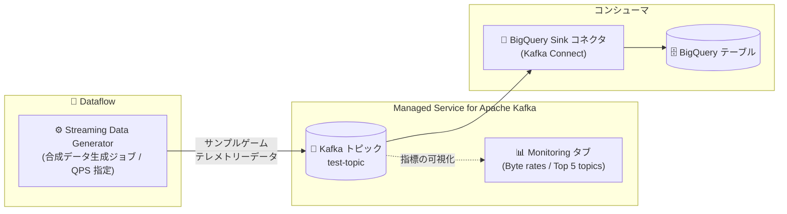

# Google Cloud Managed Service for Apache Kafka: Dataflow による合成データ生成

**リリース日**: 2026-07-31

**サービス**: Google Cloud Managed Service for Apache Kafka

**機能**: Dataflow を使用した Kafka クラスタ向け合成データ生成

**ステータス**: Feature

📊 [このアップデートのインフォグラフィックを見る](https://takech9203.github.io/google-cloud-news-summary/20260731-managed-kafka-synthetic-data-generation.html)

## 概要

Google Cloud Managed Service for Apache Kafka で、Dataflow を使用してクラスタに合成 (synthetic) データを生成できるようになりました。Google Cloud コンソールの Managed Service for Apache Kafka クラスタ画面 (Sources タブ) から、Dataflow の「Streaming Data Generator」テンプレートを利用したジョブを直接作成し、サンプルのゲームテレメトリーデータを指定した Kafka トピックへ自動的にパブリッシュできます。

Streaming Data Generator は、指定したスキーマに基づく合成テストレコードを設定可能なレート (QPS) で生成する Dataflow テンプレートです。この機能により、ローカルに Kafka クライアントをインストールしたり、カスタムのプロデューサーコードを書いたりすることなく、クラスタのアクティビティの観察、負荷処理のテスト、モニタリング指標の検証が可能になります。

Kafka クラスタを新規に構築した直後の動作確認や、負荷テスト、BigQuery Sink コネクタなどダウンストリーム連携の検証を行いたい開発者・データエンジニアに有用なアップデートです。

**アップデート前の課題**

- クラスタの動作確認や負荷テストを行うには、ローカル環境に Kafka クライアントをインストールするか、カスタムのプロデューサーコードを作成してテストデータを送信する必要があった
- クラスタ構築直後にモニタリング指標 (スループットなど) を検証するための手軽なデータソースがなかった

**アップデート後の改善**

- Google Cloud コンソールのクラスタ画面 (Sources タブ) から数クリックで合成データ生成用の Dataflow ジョブを起動できるようになった
- Output rate (QPS) を指定することで、クラスタが異なる負荷をどのように処理するかをテストできるようになった
- 必要な IAM ロールが不足している場合、コンソールが検出して「Grant」ボタンでその場で付与できるようになった

## アーキテクチャ図



Dataflow の Streaming Data Generator テンプレートが指定 QPS で合成データを Kafka トピックへパブリッシュし、クラスタのモニタリング指標で確認したり、BigQuery Sink コネクタ経由でダウンストリームへ流したりできます。

## サービスアップデートの詳細

### 主要機能

1. **コンソールからの Dataflow ジョブ作成**
   - クラスタ詳細画面の「Sources」タブにある「Generate Synthetic Data」カードから「Create a Dataflow job」をクリックしてジョブを作成
   - 「Produce Data」ペインで対象の Kafka トピックを選択 (トピックが存在しない場合はその場で作成可能)

2. **出力レート (QPS) の指定による負荷テスト**
   - Output rate (QPS) フィールドで 1 秒あたりの生成レートを指定 (例: 100)
   - 異なる負荷に対するクラスタの処理能力をテストできる

3. **サンプルゲームテレメトリーデータの自動生成**
   - Dataflow Streaming Data Generator テンプレートが、指定スキーマに基づく合成テストレコードを生成
   - 生成データには eventId、eventTimestamp、ipv4/ipv6、country、username、quest、score、completed などのフィールドが含まれる (JSON 形式)

4. **IAM 権限の自動付与サポート**
   - Dataflow サービスアカウントに必要な権限が不足している場合、警告が表示され「Grant」クリックで Dataflow Worker と Managed Kafka Client ロールを付与できる

## 技術仕様

### 必要な IAM ロール

| プリンシパル | 必要なロール |
|------|------|
| 操作するユーザー | Dataflow Developer (`roles/dataflow.developer`)、Project IAM Admin (`roles/resourcemanager.projectIamAdmin`) |
| Compute Engine デフォルトサービスアカウント | Dataflow Worker (`roles/dataflow.worker`)、Managed Kafka Client (`roles/managedkafka.client`) |

ユーザーに必要な主な権限: `dataflow.jobs.create`、`dataflow.jobs.get`、`managedkafka.clusters.get`、`managedkafka.topics.get`、`managedkafka.topics.create`、`managedkafka.topics.publish`、`resourcemanager.projects.setIamPolicy`

**注意**: Dataflow Worker と Managed Kafka Client のロールは、ユーザーアカウントではなく Compute Engine デフォルトサービスアカウントに付与する必要があります。

### 生成されるデータのスキーマ (BigQuery 連携時のテーブル定義例)

```json
[
  {"name": "eventId", "type": "STRING"},
  {"name": "eventTimestamp", "type": "INTEGER"},
  {"name": "ipv4", "type": "STRING"},
  {"name": "ipv6", "type": "STRING"},
  {"name": "country", "type": "STRING"},
  {"name": "username", "type": "STRING"},
  {"name": "quest", "type": "STRING"},
  {"name": "score", "type": "INTEGER"},
  {"name": "completed", "type": "BOOLEAN"}
]
```

## 設定方法

### 前提条件

1. Managed Service for Apache Kafka クラスタが作成済みであること
2. 必要な IAM ロール (上記「技術仕様」参照) が付与されていること

### 手順

#### ステップ 1: クラスタの Sources タブからジョブ作成を開始

1. Google Cloud コンソールで「Managed Service for Apache Kafka > Clusters」ページに移動
2. クラスタ名 (例: `test-cluster`) をクリックし、「Sources」タブを選択
3. 「Generate Synthetic Data」カードの「Create a Dataflow job」をクリック

#### ステップ 2: トピックと出力レートを設定

1. 「Produce Data」ペインで Kafka トピック (例: `test-topic`) を選択。存在しない場合は「Create topic」からパーティション数 3、レプリケーション係数 3 (デフォルト) で作成
2. 「Output rate (QPS)」に生成レート (例: `100`) を入力
3. 権限不足の警告が表示された場合は「Grant」をクリックしてロールを付与
4. 「Create」をクリックして Dataflow ジョブを起動

#### ステップ 3: データフローとメトリクスを確認

1. 通知の「View job」から Dataflow の Job details ページを開き、ジョブグラフ・ステータス・実行メトリクスを確認
2. クラスタ詳細ページの「Monitoring」タブで「Byte rates」と「Top 5 topics by produce throughput」チャートを確認し、データがトピックに生成されていることを検証

## メリット

### ビジネス面

- **検証の高速化**: プロデューサーコードの開発なしでクラスタの動作確認・負荷テストを開始でき、PoC や本番導入前の評価期間を短縮できる
- **学習コストの低減**: Kafka クライアントのセットアップが不要なため、Kafka に不慣れなチームでもマネージドサービスの評価を始めやすい

### 技術面

- **コード不要のテストデータ生成**: ローカル Kafka クライアントのインストールやカスタムプロデューサーの実装が不要
- **負荷レートの制御**: QPS を指定して異なる負荷条件でのクラスタ挙動を再現・検証できる
- **モニタリング検証**: 実データ投入前にモニタリング指標 (スループットなど) やダウンストリーム連携 (BigQuery Sink コネクタなど) の動作を確認できる

## デメリット・制約事項

### 考慮すべき点

- 合成データ生成は Dataflow ジョブとして実行されるため、ジョブ実行中は Dataflow の料金が発生する。検証終了後はジョブを停止 (Cancel) する必要がある
- 生成されるのはテンプレートに基づくサンプルデータ (ゲームテレメトリー) であり、生の JSON 形式のため、BigQuery へ連携する場合は事前にスキーマを定義したテーブルを手動で作成する必要がある
- Dataflow ワーカー用に Compute Engine デフォルトサービスアカウントへの適切なロール付与が必要 (付与先を誤ると権限エラーになる)

## ユースケース

### ユースケース 1: 新規クラスタの動作確認とモニタリング検証

**シナリオ**: Managed Service for Apache Kafka クラスタを新規作成し、本番データを流す前にクラスタとモニタリングが正しく機能することを確認したい。

**実装例**:
```
1. クラスタの Sources タブ → Generate Synthetic Data → Create a Dataflow job
2. トピック test-topic を選択し、QPS に 100 を指定して Create
3. Monitoring タブで Byte rates / Top 5 topics by produce throughput を確認
```

**効果**: プロデューサーコードを書かずに、クラスタへのデータ流入とメトリクスの可視化を数分で検証できる。

### ユースケース 2: BigQuery Sink コネクタを使ったパイプラインのエンドツーエンドテスト

**シナリオ**: Kafka Connect の BigQuery Sink コネクタでトピックのメッセージを BigQuery にストリーミングする構成を、本番データ投入前に検証したい。

**効果**: 合成データをトピックに流し込みながら、BigQuery テーブルへのストリーミングとクエリによるデータ確認まで、パイプライン全体をエンドツーエンドでテストできる。

### ユースケース 3: 負荷テスト

**シナリオ**: クラスタ構成 (vCPU、メモリなど) が想定スループットに耐えられるか確認したい。

**効果**: QPS を段階的に変えて合成データを生成することで、異なる負荷条件でのクラスタの挙動をメトリクスで比較検証できる。

## 料金

この機能自体は Managed Service for Apache Kafka のコンソール機能ですが、合成データ生成は Dataflow ジョブとして実行されるため、ジョブ実行中は Dataflow の料金が発生します。また、クラスタ側では Managed Service for Apache Kafka の料金が通常どおり適用されます。検証終了後は Dataflow ジョブの停止と不要なクラスタの削除を推奨します。

- [Dataflow の料金](https://cloud.google.com/dataflow/pricing)
- [Managed Service for Apache Kafka の料金](https://cloud.google.com/managed-service-for-apache-kafka/pricing)

## 関連サービス・機能

- **Dataflow (Streaming Data Generator テンプレート)**: 本機能の実行基盤。指定スキーマに基づく合成レコードを設定可能なレートで生成する Flex テンプレート
- **Kafka Connect (BigQuery Sink コネクタ)**: 生成した合成データをトピックから BigQuery テーブルへストリーミングし、エンドツーエンドの検証に利用可能
- **BigQuery**: 合成データのストリーミング先。ストリーミングされたレコードをプレビューや SQL クエリで確認できる
- **Cloud Monitoring**: クラスタの Monitoring タブでバイトレートやトピック別プロデューススループットを確認

## 参考リンク

- 📊 [インフォグラフィック](https://takech9203.github.io/google-cloud-news-summary/20260731-managed-kafka-synthetic-data-generation.html)
- [公式リリースノート](https://docs.cloud.google.com/release-notes#July_31_2026)
- [Generate synthetic data for a Managed Service for Apache Kafka cluster](https://docs.cloud.google.com/managed-service-for-apache-kafka/docs/quickstart-synthetic-data)
- [Dataflow Streaming Data Generator template](https://docs.cloud.google.com/dataflow/docs/guides/templates/provided/streaming-data-generator)
- [Managed Service for Apache Kafka リリースノート](https://docs.cloud.google.com/managed-service-for-apache-kafka/docs/release-notes)
- [Dataflow の料金](https://cloud.google.com/dataflow/pricing)

## まとめ

Managed Service for Apache Kafka のクラスタに対して、コンソールから数クリックで Dataflow ベースの合成データ生成ジョブを起動できるようになり、Kafka クライアントのセットアップやプロデューサーコードの実装なしにクラスタの動作確認・負荷テスト・モニタリング検証が可能になりました。新規クラスタの評価やダウンストリーム連携 (BigQuery Sink など) のエンドツーエンドテストを行う際は、まずこの機能でデータを流して検証することを推奨します。検証後は Dataflow の課金を避けるためジョブの停止を忘れないようにしましょう。

---

**タグ**: Managed Service for Apache Kafka, Dataflow, Streaming Data Generator, 合成データ, 負荷テスト, Kafka Connect, BigQuery
