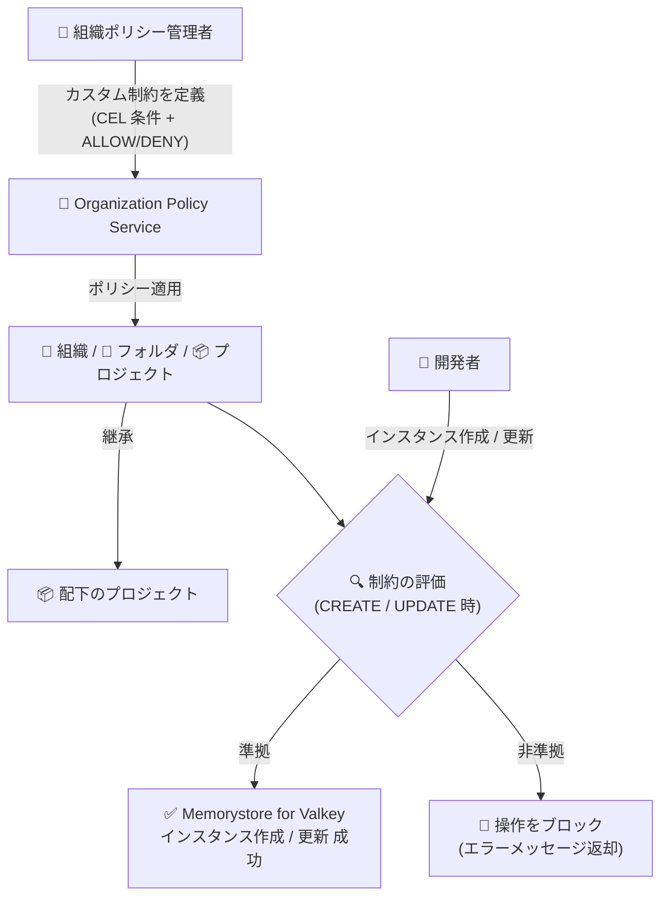

# Memorystore for Valkey: カスタム組織ポリシーが一般提供 (GA) に

**リリース日**: 2026-07-31

**サービス**: Memorystore for Valkey

**機能**: カスタム組織ポリシー (Custom Organization Policies)

**ステータス**: Generally Available (GA)

📊 [このアップデートのインフォグラフィックを見る](https://takech9203.github.io/google-cloud-news-summary/20260731-memorystore-valkey-custom-org-policies.html)

## 概要

Memorystore for Valkey インスタンスに対する**カスタム組織ポリシー (Custom Organization Policies)** が一般提供 (GA) となりました。組織ポリシー管理者は、Organization Policy Service を通じて Memorystore for Valkey インスタンスの構成フィールドに対するカスタム制約 (Custom Constraint) を CEL (Common Expression Language) で定義し、組織・フォルダ・プロジェクトの各レベルで一貫した構成と制限を強制できます。

これにより、インスタンスがセキュリティのベストプラクティスや規制要件に準拠していることを組織全体で保証できます。制約に準拠しないインスタンスの作成・更新操作はブロックされるため、ガバナンスをコードとして中央集権的に管理できるようになります。エンタープライズのセキュリティ管理者、コンプライアンス担当者、プラットフォームチームにとって重要なアップデートです。

**アップデート前の課題**

Memorystore for Valkey では、事前定義の組織ポリシー制約は CMEK (顧客管理の暗号鍵) 関連の制御に限られていました。

- 事前定義制約 (`constraints/gcp.restrictNonCmekServices`、`constraints/gcp.restrictCmekCryptoKeyProjects`) は CMEK 保護の強制に特化しており、CMEK 以外の設定 (シャード数、ノードタイプ、エンジンバージョン、永続化設定など) を組織ポリシーで制御できなかった
- インスタンス構成の統制は、IAM 権限管理やレビュープロセスなど運用ルールに依存する必要があった
- 組織全体でインスタンス構成の一貫性を自動的に強制する仕組みがなかった

**アップデート後の改善**

- インスタンスの特定フィールド (シャード数、ノードタイプ、エンジンバージョン、永続化、バックアップ、メンテナンスウィンドウなど) に対して、CEL 条件によるきめ細かなカスタム制約を定義できるようになった
- 制約に準拠しないインスタンスの作成・更新が自動的にブロックされ、セキュリティベストプラクティスと規制要件への準拠を強制できるようになった
- 組織・フォルダ・プロジェクトレベルでポリシーを適用でき、配下のリソースへの継承により新規プロジェクトにも自動的に制約が適用されるようになった

## アーキテクチャ図



組織ポリシー管理者が定義したカスタム制約は組織・フォルダ・プロジェクトに適用され、配下のリソースに継承されます。開発者がインスタンスを作成・更新する際に制約が評価され、非準拠の操作はブロックされます。

## サービスアップデートの詳細

### 主要機能

1. **CEL によるきめ細かなカスタム制約**
   - Common Expression Language (CEL) で条件を記述し、インスタンスの特定フィールドを制御 (例: `resource.shardCount == 5`)
   - 条件が true の場合の動作として `ALLOW` (許可、それ以外はブロック) または `DENY` (拒否) を指定可能
   - 制約は `CREATE` および `UPDATE` オペレーションに対して適用可能

2. **リソース階層でのポリシー適用と継承**
   - 組織、フォルダ、プロジェクトの各レベルでポリシーを適用可能
   - デフォルトでポリシーは配下のリソースに継承され、フォルダに適用するとフォルダ内の全プロジェクトに適用される
   - カスタム組織ポリシーを使用する組織・フォルダに追加された新規プロジェクトも自動的に制約を継承

3. **豊富なサポート対象フィールド**
   - シャード数、レプリカ数、ノードタイプ、エンジンバージョン、モードなどの基本構成
   - 永続化設定 (RDB / AOF)、自動バックアップ設定、メンテナンスウィンドウ、削除保護
   - クロスインスタンスレプリケーション、ゾーン分散、転送中の暗号化モード、認可モード、CMEK キーなど

4. **ドライラン (Dry-run) とポリシーシミュレーション**
   - `dryRunSpec` を使ってポリシーの影響を本番適用前に検証可能
   - コンソールの Policy Simulator で組織ポリシー変更の影響をテスト可能

## 技術仕様

### カスタム制約の仕様

| 項目 | 詳細 |
|------|------|
| 対象リソースタイプ | `memorystore.googleapis.com/Instance` |
| 対象オペレーション | `CREATE`、`UPDATE` |
| 条件記述言語 | CEL (Common Expression Language)、最大 1,000 文字 |
| アクション | `ALLOW` / `DENY` |
| 制約名 | `custom.` で始まる、プレフィックスを除き最大 70 文字 |
| 適用レベル | 組織 / フォルダ / プロジェクト |
| ポリシー反映時間 | 最大 15 分 |

### サポートされる主なカスタム制約フィールド

| カテゴリ | フィールド例 |
|----------|-------------|
| 基本構成 | `resource.name`、`resource.shardCount`、`resource.replicaCount`、`resource.nodeType`、`resource.engineVersion`、`resource.mode`、`resource.engineConfigs` |
| セキュリティ | `resource.kmsKey`、`resource.transitEncryptionMode`、`resource.authorizationMode`、`resource.serverCaMode`、`resource.deletionProtectionEnabled` |
| 永続化 | `resource.persistenceConfig.mode`、`resource.persistenceConfig.rdbConfig.rdbSnapshotPeriod`、`resource.persistenceConfig.aofConfig.appendFsync` |
| バックアップ | `resource.automatedBackupConfig.automatedBackupMode`、`resource.automatedBackupConfig.retention`、`resource.managedBackupSource.backup` |
| 運用 | `resource.maintenancePolicy.weeklyMaintenanceWindow.day`、`resource.zoneDistributionConfig.mode`、`resource.crossInstanceReplicationConfig.instanceRole` |

### カスタム制約の定義例

シャード数が 5 のインスタンスの作成・更新を禁止する例:

```yaml
name: organizations/ORGANIZATION_ID/customConstraints/custom.restrictFiveShardInstances
resourceTypes:
- memorystore.googleapis.com/Instance
methodTypes:
- CREATE
- UPDATE
condition: "resource.shardCount == 5"
actionType: DENY
displayName: Restrict five-shard Memorystore for Valkey instances
description: Prevent users from creating or updating instances that have five shards.
```

## 設定方法

### 前提条件

1. Google Cloud プロジェクトで課金が有効化されており、Memorystore for Valkey API が有効であること
2. gcloud CLI バージョン 489.0.0 以上がインストールされていること
3. 組織 ID を把握していること
4. 必要な IAM ロールが付与されていること:
   - プロジェクトに対する `roles/memorystore.admin`、`roles/owner`、または `roles/editor` のいずれか
   - `roles/orgpolicy.policyAdmin` (組織ポリシー管理者) ロールと `memorystore.instances.create` 権限

### 手順

#### ステップ 1: カスタム制約の YAML ファイルを作成

```yaml
# customconstraint.yaml
name: organizations/ORGANIZATION_ID/customConstraints/CONSTRAINT_NAME
resourceTypes:
- memorystore.googleapis.com/Instance
methodTypes:
- CREATE
- UPDATE
condition: "CONDITION"
actionType: ACTION  # ALLOW または DENY
displayName: DISPLAY_NAME
description: DESCRIPTION
```

制約名・表示名・説明にはエラーメッセージで露出する可能性があるため、個人情報 (PII) や機密データを含めないよう注意します。

#### ステップ 2: カスタム制約を登録

```bash
gcloud org-policies set-custom-constraint /path/to/customconstraint.yaml

# 登録済みカスタム制約の確認
gcloud org-policies list-custom-constraints --organization=ORGANIZATION_ID
```

登録後、カスタム制約は組織ポリシーの一覧で利用可能になります。

#### ステップ 3: 組織ポリシーを作成して適用

```yaml
# policy.yaml
name: projects/PROJECT_ID/policies/CONSTRAINT_NAME
spec:
  rules:
  - enforce: true
dryRunSpec:
  rules:
  - enforce: true
```

```bash
# ドライランモードで適用して影響を検証
gcloud org-policies set-policy /path/to/policy.yaml --update-mask=dryRunSpec

# 検証後、本番ポリシーとして適用
gcloud org-policies set-policy /path/to/policy.yaml --update-mask=spec
```

ポリシーの反映には最大 15 分かかります。

#### ステップ 4: 制約のテスト

制約に違反するインスタンスの作成を試み、操作がブロックされることを確認します。例えば、シャード数 5 を禁止する制約を適用した状態でシャード数 5 のインスタンスを作成しようとすると、Memorystore for Valkey はインスタンスを作成しません。

## メリット

### ビジネス面

- **コンプライアンスの自動化**: 規制要件やセキュリティベストプラクティスへの準拠を、レビュープロセスに頼らずポリシーとして自動強制できる
- **ガバナンスの中央集権化**: 組織・フォルダレベルでの一括適用と継承により、新規プロジェクトを含む組織全体の統制を単一のポリシーで実現できる

### 技術面

- **きめ細かな制御**: 事前定義制約 (CMEK のみ) では不可能だった、シャード数・ノードタイプ・永続化・バックアップなど幅広いフィールドの制御が可能
- **安全な導入**: ドライランモードと Policy Simulator により、本番適用前にポリシーの影響を検証できる
- **明確なフィードバック**: 制約違反時には description に記載した内容がエラーメッセージとして返却され、開発者が違反理由と解決方法を把握しやすい

## デメリット・制約事項

### 制限事項

- 組織ポリシーの変更は既存インスタンスに遡及適用されない (新しいポリシーは既存インスタンスに影響しない)
- 制約が適用されるのは `CREATE` と `UPDATE` オペレーションのみ
- ポリシーの反映に最大 15 分かかる
- CEL 条件は最大 1,000 文字

### 考慮すべき点

- `ALLOW` アクションは条件に明示的に合致するケース以外をすべてブロックするため、意図しない操作ブロックが起きないよう設計に注意が必要
- 条件付きルールを追加する場合は、少なくとも 1 つの無条件ルールが必要
- 制約名・表示名・説明はエラーメッセージに露出するため、PII や機密データを含めない

## ユースケース

### ユースケース 1: 本番環境でのノードタイプ統制

**シナリオ**: shared-core-nano ノードタイプは SLA がなく開発・テスト用途向けのため、本番プロジェクトでの利用を禁止したい。

**実装例**:
```yaml
name: organizations/123456789/customConstraints/custom.denySharedCoreNano
resourceTypes:
- memorystore.googleapis.com/Instance
methodTypes:
- CREATE
- UPDATE
condition: "resource.nodeType == 'SHARED_CORE_NANO'"
actionType: DENY
displayName: Deny shared-core-nano node type
description: shared-core-nano has no SLA. Use a production-grade node type.
```

**効果**: 本番フォルダ配下の全プロジェクトで SLA のないノードタイプの利用を自動的にブロックし、可用性要件への準拠を保証できる。

### ユースケース 2: 規制業界でのセキュリティ構成の強制

**シナリオ**: 金融・医療などの規制業界で、削除保護の有効化や転送中の暗号化など、セキュリティ関連の構成を全インスタンスに強制したい。

**効果**: `resource.deletionProtectionEnabled` や `resource.transitEncryptionMode` などのフィールドに対する制約により、規制要件に準拠しない構成のインスタンス作成・更新を組織全体で防止できる。

## 料金

Organization Policy Service のカスタム制約と Memorystore for Valkey インスタンスの料金の詳細は、公式料金ページを参照してください。

- [Memorystore for Valkey の料金](https://cloud.google.com/memorystore/docs/valkey/pricing)

## 利用可能リージョン

カスタム組織ポリシーは Organization Policy Service の機能として、組織・フォルダ・プロジェクトレベルで適用されます。Memorystore for Valkey の利用可能リージョンは[公式ドキュメント](https://cloud.google.com/memorystore/docs/valkey/locations)を参照してください。

## 関連サービス・機能

- **Organization Policy Service**: カスタム制約と組織ポリシーの定義・適用を担う基盤サービス。事前定義制約とカスタム制約の両方を提供
- **Cloud Key Management Service (KMS)**: 事前定義制約 (`gcp.restrictNonCmekServices`、`gcp.restrictCmekCryptoKeyProjects`) による CMEK 保護の強制と組み合わせて利用
- **Policy Simulator**: 組織ポリシー変更の影響を本番適用前にシミュレーションできるツール
- **IAM**: 組織ポリシー管理者ロール (`roles/orgpolicy.policyAdmin`) や Memorystore の各ロールと組み合わせたアクセス制御

## 参考リンク

- 📊 [インフォグラフィック](https://takech9203.github.io/google-cloud-news-summary/20260731-memorystore-valkey-custom-org-policies.html)
- [公式リリースノート](https://docs.cloud.google.com/release-notes#July_31_2026)
- [カスタム組織ポリシー制約の使用 (公式ドキュメント)](https://docs.cloud.google.com/memorystore/docs/valkey/use-custom-org-policies)
- [Memorystore for Valkey の組織ポリシーの概要](https://docs.cloud.google.com/memorystore/docs/valkey/about-org-policies)
- [カスタム制約の作成と管理](https://docs.cloud.google.com/organization-policy/create-custom-constraints)
- [料金ページ](https://cloud.google.com/memorystore/docs/valkey/pricing)

## まとめ

Memorystore for Valkey のカスタム組織ポリシーの GA により、CMEK 以外の幅広いインスタンス構成フィールドを組織全体で統制できるようになりました。エンタープライズでガバナンスやコンプライアンスを担うチームは、まずドライランモードで既存ワークロードへの影響を検証しながら、本番環境向けのノードタイプ制限や削除保護の強制など、優先度の高い制約から段階的に導入することを推奨します。

---

**タグ**: #MemorystoreForValkey #OrganizationPolicy #Security #Compliance #Governance #GA
