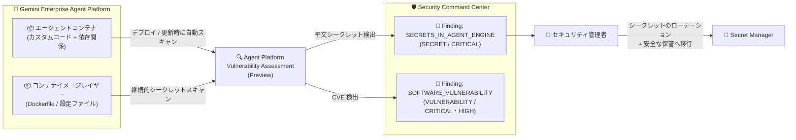

# Security Command Center: データレジデンシー設定の変更対応 (Preview プログラム) と Agent Platform Vulnerability Assessment のシークレットスキャン

**リリース日**: 2026-07-31

**サービス**: Security Command Center

**機能**: データレジデンシー Preview プログラム組織の設定変更対応 / Agent Platform Vulnerability Assessment によるプレーンテキストシークレット検出

**ステータス**: Preview

📊 [このアップデートのインフォグラフィックを見る](https://takech9203.github.io/google-cloud-news-summary/20260731-security-command-center-data-residency-agent-platform-vuln.html)

## 概要

2026 年 7 月 31 日、Security Command Center に 2 つの機能アップデートが発表されました。いずれもセキュリティ運用とコンプライアンスに関わる重要な強化です。

1 つ目は、**データレジデンシー Preview プログラムに登録している組織が、組織のデータレジデンシーおよびデータ暗号化の設定を変更できるようになった**ことです。2026 年 7 月 9 日には Standard / Premium ティア (GA 構成) 向けに設定変更機能が提供されていましたが、今回のアップデートにより、Preview プログラムに登録済みの組織も既存の設定を GA 構成へ更新し、データロケーションの変更 (例: マルチリージョン構成から単一ロケーションへの移行) や、Google 管理の暗号鍵と Cloud KMS 鍵 (CMEK) の切り替えが可能になりました。

2 つ目は、**Agent Platform Vulnerability Assessment (Preview) が、顧客がデプロイした Gemini Enterprise Agent Platform コンテナ内のプレーンテキストシークレット (認証情報、アクセストークン、API キーなど) をスキャンできるようになった**ことです。エージェント型ワークロードのコンテナイメージに埋め込まれた平文の秘密情報を継続的・自動的に検出し、Security Command Center に検出結果 (Finding) を生成します。AI エージェントを本番運用する組織にとって、シークレット漏洩リスクを早期に発見するための重要な機能です。

**アップデート前の課題**

- データレジデンシー Preview プログラムに登録した組織は、一度設定したデータレジデンシー / データ暗号化の構成を後から変更する手段がなかった
- Preview 時代のマルチリージョン構成から GA のデータレジデンシー構成へ移行するパスが提供されていなかった
- Agent Platform (旧 Agent Engine) にデプロイしたエージェントのコンテナイメージに平文シークレットが含まれていても、自動検出する仕組みがなく、手動レビューに頼る必要があった

**アップデート後の改善**

- Preview プログラム登録組織が、コンソールからデータレジデンシー設定 (有効化 / 無効化、データロケーションの選択) とデータ暗号化設定 (Google 管理鍵 / Cloud KMS 鍵) を変更できるようになった
- 初回の更新でマルチリージョン構成から選択した単一ロケーションへデータが移行され、GA 構成に統一できるようになった
- Agent Platform Vulnerability Assessment が、デプロイ済み Agent Platform コンテナイメージ内のプレーンテキストシークレットを継続的・自動的にスキャンし、`SECRETS_IN_AGENT_ENGINE` カテゴリの重大度 CRITICAL の検出結果を生成するようになった

## アーキテクチャ図



Agent Platform Vulnerability Assessment は、Agent Platform にデプロイされたコンテナイメージをスキャンし、平文シークレットや CVE を検出して Security Command Center に Finding を生成します。管理者は検出結果をもとにシークレットをローテーションし、Secret Manager などの安全な管理方式へ移行します。

## サービスアップデートの詳細

### 主要機能

1. **データレジデンシー / データ暗号化設定の変更 (Preview プログラム組織向け)**
   - Preview プログラムに登録済みの組織が、Google Cloud コンソール (グローバルまたは管轄コンソール) から設定を変更可能
   - データレジデンシーの有効化 / 無効化、データロケーションの変更 (`eu`、`sa`、`us` のマルチリージョンをサポート)
   - データ暗号化を Google 管理鍵と Cloud KMS 鍵 (CMEK) の間で切り替え、または Cloud KMS 鍵自体の変更が可能
   - Preview 構成の初回更新では、まず GA のデータレジデンシー構成への更新が必須 (データ暗号化のみの変更は初回には不可)。データはマルチリージョン構成から選択した単一ロケーションへ移行される

2. **データ移行プロセス**
   - 移行には検出結果 (Finding) の量に応じて 4〜24 時間かかる
   - 移行中は Security Command Center と組み込み検出サービスが一時停止 (Finding の生成・更新停止、エクスポート停止、コンソールページへのアクセス不可、`securitycenter.googleapis.com` / `securitycentermanagement.googleapis.com` API が `FAILED_PRECONDITION` エラーを返す)
   - 移行完了後は自動的に再開。データロケーション変更時は Finding の `name` / `canonicalName` のロケーション識別子が更新される (例: `global` → `us`)

3. **Agent Platform Vulnerability Assessment のシークレット検出 (Preview)**
   - 顧客がデプロイした Agent Platform コンテナイメージ内のプレーンテキストシークレット (認証情報、鍵、アクセストークン、証明書など) を継続的・自動的にスキャン
   - 検出結果には Agent Platform URI、イメージリポジトリ、シークレットのタイプ、パスが含まれる
   - 検出器: `SECRETS_IN_AGENT_ENGINE` (クラス: `SECRET`、重大度: `CRITICAL`)。検出内容の例: 「Plaintext credential of type &lt;TYPE&gt; was found in image layer at path: &lt;PATH&gt;」
   - 既存の CVE 検出 (`SOFTWARE_VULNERABILITY`、クラス: `VULNERABILITY`、重大度: `CRITICAL` / `HIGH`) と合わせて、エージェント型ワークロードの脆弱性を包括的に評価
   - 修正後にコンテナイメージを再デプロイすると再スキャンが実行され、シークレットが存在しなければ Finding は `INACTIVE` に変更される

## 技術仕様

### データレジデンシー / データ暗号化設定変更

| 項目 | 詳細 |
|------|------|
| 対象ティア | Standard-legacy、Standard、Premium (組織レベル有効化が必要) |
| 対象組織 | データレジデンシー Preview プログラム登録組織 (今回の対象) および GA 構成の組織 |
| サポートロケーション | European Union (`eu`)、Kingdom of Saudi Arabia (`sa`)、United States (`us`) |
| 必要な IAM ロール | Security Center 管理者 (`roles/securitycenter.admin`) を組織に対して付与 |
| 移行所要時間 | 4〜24 時間 (Finding の量に依存) |
| 変更頻度の制限 | データ移行は週 1 回まで |
| API 要件 | データレジデンシー有効時は Security Command Center v2 API が必須 |
| 非サポート | プロジェクトレベルのみの有効化では利用不可 |

### Agent Platform Vulnerability Assessment 検出器

| 項目 | Secrets in Agent Platform | Software vulnerability |
|------|---------------------------|------------------------|
| API カテゴリ名 | `SECRETS_IN_AGENT_ENGINE` | `SOFTWARE_VULNERABILITY` |
| クラス | `SECRET` | `VULNERABILITY` |
| 重大度 | `CRITICAL` | `CRITICAL` または `HIGH` |
| スキャン対象 | Agent Platform コンテナイメージのレイヤー内の平文シークレット | エージェント型ワークロードのカスタムコードと依存関係 (CVE) |
| スキャンタイミング | 継続的・自動 | デプロイ / 更新時に自動 |
| 対象ティア | Premium / Enterprise (Deprecated) | Premium / Enterprise (Deprecated) |

## 設定方法

### 前提条件

**データレジデンシー / データ暗号化設定の変更:**

1. Security Command Center が組織レベルで有効化されていること (Standard / Premium ティア)
2. `roles/securitycenter.admin` ロールが組織に対して付与されていること
3. CMEK を使用する場合は Cloud KMS 鍵を作成・準備しておくこと (データロケーション変更時は鍵の再選択が必要)
4. ロケーション識別子に依存するミュートルールや Pub/Sub 継続エクスポート設定を事前に確認・更新準備しておくこと
5. 一括エクスポートの実行中でないこと

**Agent Platform Vulnerability Assessment:**

1. Security Command Center Premium または Enterprise (Deprecated) ティア
2. AI Protection の有効化 (新規の AI Protection 有効化では本スキャナーは自動有効)

### 手順

#### ステップ 1: データレジデンシー / データ暗号化設定の変更

```text
1. Google Cloud コンソールで [設定] > [セットアップの詳細] に移動
2. Security Command Center を有効化した組織を選択
3. [データ レジデンシーと暗号化の管理] をクリック
4. データレジデンシーの有効化 / 無効化とデータロケーションを選択
5. 暗号化構成 (Google 管理鍵 or Cloud KMS 鍵) を選択
6. [移行を開始] をクリックし、組織 ID を入力して確定
```

移行中は Security Command Center のページにアクセスできず、ステータスページが表示されます。完了後、新しいロケーションのコンソールへのリンクが表示されます。

#### ステップ 2: Agent Platform Vulnerability Assessment の有効化 (既存顧客)

```text
1. Google Cloud コンソールで AI Protection カードの [設定] > [設定を管理] に移動
   (組織レベルビューでのみ利用可能)
2. [Vulnerability Assessment for Agent Platform] セクションで [設定を管理] をクリック
3. 組織またはプロジェクトに対してサービスを有効化
```

#### ステップ 3: シークレット検出結果への対応

```text
1. Finding の詳細を調査し、シークレットの内容を確認
2. 露出した認証情報を失効 (revoke) またはローテーション
3. Dockerfile、ソースコード、設定ファイルから平文シークレットを削除
4. Secret Manager などのシークレット管理ソリューションへ移行
5. イメージを再ビルドして Agent Platform インスタンスを再デプロイ
   (再デプロイで再スキャンが実行され、解消済みなら Finding は INACTIVE に)
```

## メリット

### ビジネス面

- **コンプライアンス対応の柔軟性**: Preview プログラムで先行導入した組織も、規制要件の変化に合わせてデータロケーション (EU / KSA / US) や暗号鍵管理方式を後から変更できる
- **AI エージェントの安全な本番運用**: エージェントコンテナに混入した認証情報や API キーを自動検出することで、シークレット漏洩による情報流出リスクを低減できる

### 技術面

- **Preview 構成から GA 構成への移行パス**: マルチリージョン構成のデータが選択した単一ロケーションへ自動的に統合・移行される
- **CMEK 対応**: Google 管理鍵から Cloud KMS 鍵への切り替えにより、鍵のライフサイクルを自組織で管理できる
- **修復サイクルの自動化**: 再デプロイをトリガーに再スキャンが実行され、解消された Finding が自動的に `INACTIVE` になるため、修復状況の追跡が容易

## デメリット・制約事項

### 制限事項

- データ移行は週 1 回まで。複数回変更する場合は 1 週間以上間隔を空ける必要がある
- プロジェクトレベルのみの Security Command Center 有効化ではデータレジデンシー設定変更を利用できない
- Preview プログラム組織の初回更新では、データ暗号化のみの変更は不可 (データレジデンシー構成の GA 化が必須)
- 移行中は Security Command Center 全体 (コンソール、API、Finding 生成、エクスポート) が一時停止する (4〜24 時間)
- Agent Platform Vulnerability Assessment は Preview のため、Pre-GA Offerings Terms が適用され、サポートが限定される場合がある
- Agent Platform Vulnerability Assessment は Premium / Enterprise (Deprecated) ティアでのみ利用可能

### 考慮すべき点

- データロケーション変更後は Finding の `name` / `canonicalName` が変わるため、ミュートルール、検索クエリ、外部システム連携、スクリプトの更新が必要
- ロケーション変更後に外部システムへエクスポートしている場合、ロケーション識別子の更新により重複した Finding が発生する
- 移行中に `notificationConfigs` が v1 構造から v2 構造へ更新され、`source_properties` フィールドは v2 API では非サポートのため、Pub/Sub / BigQuery エクスポート設定の見直しが必要な場合がある
- Preview 構成からの移行では、移行前の日付のダッシュボード集計値が正しく表示されない場合や、リージョン間の重複 Finding は最新の `eventTime` を持つバージョンのみ移行される点に注意
- データレジデンシーのロケーション選択は組織ポリシー (`gcp.resourceLocations` 制約) と整合性を取る必要がある (Security Command Center 側では検証されない)

## ユースケース

### ユースケース 1: Preview プログラム組織の GA 構成への移行

**シナリオ**: EU 域内のデータ保管要件を持つ金融機関が、データレジデンシー Preview プログラムに早期登録して Security Command Center を運用してきた。GA 構成へ統一し、あわせて CMEK による鍵管理へ切り替えたい。

**実装例**:
```text
1. Cloud KMS で EU リージョンの鍵リング・鍵を作成
2. ミュートルールと Pub/Sub 継続エクスポートのロケーション識別子依存を棚卸し
3. コンソールから [データ レジデンシーと暗号化の管理] でロケーション eu + Cloud KMS 鍵を選択して移行開始
4. 移行完了後、エクスポート設定・ミュートルール・検索クエリを新ロケーションに合わせて更新
```

**効果**: マルチリージョン構成の Preview データが `eu` に統合され、CMEK による暗号鍵の自組織管理と EU データレジデンシー要件への準拠を両立できる。

### ユースケース 2: AI エージェント開発でのシークレット混入検出

**シナリオ**: 開発チームが Gemini Enterprise Agent Platform にカスタムエージェントをデプロイしている。開発中に外部 API の API キーを誤ってソースコードにハードコードしたままコンテナイメージをビルド・デプロイしてしまった。

**効果**: Agent Platform Vulnerability Assessment が継続スキャンでイメージレイヤー内の平文 API キーを検出し、CRITICAL の Finding (シークレットのタイプとパス付き) を生成。セキュリティチームは即座にキーをローテーションし、Secret Manager 経由のランタイム取得へ修正して再デプロイすることで、漏洩リスクを最小化できる。

## 料金

Security Command Center のデータレジデンシー / データ暗号化設定変更は Standard / Premium ティアで利用可能です。Agent Platform Vulnerability Assessment は Premium または Enterprise (Deprecated) ティアの機能です。CMEK を使用する場合は Cloud KMS の料金が別途発生します。

詳細は [Security Command Center 料金ページ](https://cloud.google.com/security-command-center/pricing) を参照してください。

## 利用可能リージョン

データレジデンシーで選択可能なデータロケーションは以下のマルチリージョンです。

| ロケーション | 識別子 |
|--------------|--------|
| European Union | `eu` |
| Kingdom of Saudi Arabia | `sa` |
| United States | `us` |

なお、Premium ティアではサウジアラビア (KSA) データレジデンシー環境で AI Protection が利用できないなど、データレジデンシー有効時に一部機能が制限されます。また、Pre-GA (Preview) 機能にはデータロケーション条項が適用されない点に注意してください。

## 関連サービス・機能

- **Cloud Key Management Service (Cloud KMS)**: CMEK によるデータ暗号化に使用。データロケーション変更時は鍵の再選択が必要
- **Secret Manager**: 検出された平文シークレットの修復先として推奨されるシークレット管理サービス
- **AI Protection**: Agent Platform Vulnerability Assessment を含む AI ワークロード保護機能群。AI セキュリティダッシュボードで検出結果を確認可能
- **Gemini Enterprise Agent Platform**: スキャン対象のエージェント実行基盤。Agent Platform Threat Detection や Model Armor とも連携
- **Pub/Sub / BigQuery エクスポート**: Finding のエクスポート先。データロケーション変更時に設定の見直しが必要

## 参考リンク

- 📊 [インフォグラフィック](https://takech9203.github.io/google-cloud-news-summary/20260731-security-command-center-data-residency-agent-platform-vuln.html)
- [公式リリースノート](https://docs.cloud.google.com/release-notes#July_31_2026)
- [Modify data residency or data encryption configuration](https://docs.cloud.google.com/security-command-center/docs/modify-data-residency-encryption)
- [Planning for data residency](https://docs.cloud.google.com/security-command-center/docs/data-residency-support)
- [Enable CMEK for Security Command Center](https://docs.cloud.google.com/security-command-center/docs/cmek)
- [Agent Platform Vulnerability Assessment (Security sources)](https://docs.cloud.google.com/security-command-center/docs/concepts-security-sources#aevs)
- [Configure AI Protection](https://docs.cloud.google.com/security-command-center/docs/configure-ai-protection)
- [料金ページ](https://cloud.google.com/security-command-center/pricing)

## まとめ

今回のアップデートにより、データレジデンシー Preview プログラムの早期導入組織が GA 構成へ安全に移行できるようになり、規制対応の柔軟性が大きく向上しました。また、Agent Platform Vulnerability Assessment のシークレットスキャンは、AI エージェントの本番運用における認証情報漏洩リスクへの実効的な対策となります。Preview プログラム登録組織は移行計画 (週 1 回制限、4〜24 時間の停止、ロケーション識別子の変更影響) を立てたうえで GA 構成への更新を、AI Protection 利用組織は Agent Platform Vulnerability Assessment の有効化を検討してください。

---

**タグ**: #SecurityCommandCenter #DataResidency #CMEK #CloudKMS #AIProtection #AgentPlatform #GeminiEnterprise #VulnerabilityAssessment #SecretManagement #Preview
