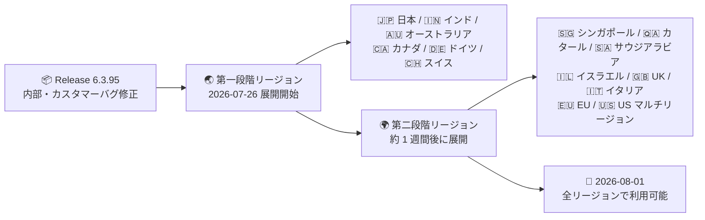

# Google SecOps SOAR: Release 6.3.95 が全リージョンで利用可能に

**リリース日**: 2026-08-01

**サービス**: Google SecOps SOAR

**機能**: Release 6.3.95 全リージョン展開完了

**ステータス**: Announcement

📊 [このアップデートのインフォグラフィックを見る](https://takech9203.github.io/google-cloud-news-summary/20260801-google-secops-soar-release-6-3-95-all-regions.html)

## 概要

Google SecOps SOAR の Release 6.3.95 が、全リージョンで利用可能になりました。本リリースは、内部バグおよびカスタマー報告バグの修正を含むメンテナンスリリースで、新機能の追加はアナウンスされていません。

Release 6.3.95 は、公式の[段階的リリースプラン](https://docs.cloud.google.com/chronicle/docs/soar/overview-and-introduction/soar-gradual-release)に基づき、2026 年 7 月 26 日に第一段階リージョン (日本、インド、オーストラリア、カナダ、ドイツ、スイス) へのロールアウトが開始されていました。今回のアナウンスにより、第二段階リージョン (シンガポール、カタール、サウジアラビア、イスラエル、UK、イタリア、EU マルチリージョン、US マルチリージョン) を含むすべてのリージョンへの展開が完了したことになります。第一段階のロールアウトについては[既存レポート (2026-07-26)](2026-07-26-google-secops-soar-release-6-3-95.md) を参照してください。

本アップデートは、Google SecOps SOAR (スタンドアロン利用) および Google SecOps 内の SOAR コンポーネントを利用するすべての顧客が対象です。SaaS 型プラットフォームのため、ユーザー側でのアップグレード作業は不要です。

**アップデート前の課題**

- 2026 年 7 月 26 日時点では Release 6.3.95 は第一段階リージョンのみに展開されており、第二段階リージョン (US・EU マルチリージョンなど) の環境ではバグ修正が未反映だった
- 同一組織内で複数リージョンのテナントを運用している場合、リージョンによってプラットフォームのバージョンが異なる期間が存在した

**アップデート後の改善**

- すべてのリージョンで Release 6.3.95 (内部・カスタマーバグ修正) が反映され、既知の問題の修正が全環境に行き渡った
- 全リージョンでプラットフォームバージョンが揃い、マルチリージョン運用の MSSP などでも一貫した動作が期待できる

## アーキテクチャ図

Release 6.3.95 の 2 段階ロールアウトのタイムラインを示しています。2026 年 7 月 26 日の第一段階リージョンへの展開開始から約 1 週間で、全リージョンへの展開が完了しました。

## サービスアップデートの詳細

### 主要な内容

1. **全リージョンでの利用可能化**
   - Release 6.3.95 が第二段階リージョンを含むすべてのリージョンに展開完了
   - 段階的リリースプランに沿った標準的なスケジュール (第一段階の約 1 週間後) での完了

2. **バグ修正リリース**
   - 内部バグおよびカスタマー報告バグの修正が含まれる
   - 個別の修正内容 (バグ ID など) は本リリースノートでは公開されていない

## 技術仕様

### リリース概要

| 項目 | 詳細 |
|------|------|
| リリースバージョン | 6.3.95 |
| リリースタイプ | バグ修正 (内部・カスタマー) |
| ロールアウト方式 | 2 段階の段階的リリース |
| 第一段階開始日 | 2026 年 7 月 26 日 |
| 全リージョン利用可能日 | 2026 年 8 月 1 日 |
| 前バージョン | 6.3.94 (2026 年 7 月 25 日に全リージョン展開完了) |

## メリット

### ビジネス面

- **全環境での品質改善**: カスタマー報告バグの修正が全リージョンに行き渡り、SOC 運用における既知の問題がどのリージョンでも解消される
- **バージョンの一貫性**: マルチリージョンでテナントを運用する MSSP やグローバル企業でも、全環境が同一バージョンとなり運用が予測しやすくなる

### 技術面

- **自動アップグレード**: SaaS 型プラットフォームのため、ユーザー側でのアップグレード作業は不要
- **予測可能なリリースサイクル**: 週次の段階的リリースが公式プラン通りに完了しており、今後のリリースタイミングの見通しが立てやすい

## デメリット・制約事項

### 考慮すべき点

- 個別のバグ修正内容 (対象機能や不具合 ID) は公開されていないため、特定の既知の問題が修正されたかを確認するにはサポートへの問い合わせが必要
- 自組織のリージョンがどの段階に属するか不明な場合は、Google SecOps の担当者への確認が推奨される
- 公式のメンテナンスウィンドウは日曜日 11:00〜15:00 UTC であり、次期リリース (6.3.96 以降) のロールアウトもこのウィンドウで実施される見込み

## 利用可能リージョン

全リージョンで利用可能です。

- 第一段階リージョン: 日本、インド、オーストラリア、カナダ、ドイツ、スイス (2026 年 7 月 26 日展開開始)
- 第二段階リージョン: シンガポール、カタール、サウジアラビア、イスラエル、UK (ロンドン)、イタリア、EU (マルチリージョン)、US (マルチリージョン)

詳細は [Google SecOps リリースプラン](https://docs.cloud.google.com/chronicle/docs/soar/overview-and-introduction/soar-gradual-release)を参照してください。

## 関連サービス・機能

- **Google SecOps (SIEM)**: SOAR と統合されたセキュリティ運用プラットフォーム。SOAR はアラートのケース管理・プレイブック自動化を担う
- **Google SecOps SOAR ステータスダッシュボード**: [status.cloud.google.com/security](https://status.cloud.google.com/security/) で SOAR のサービスステータスを確認可能
- **Chronicle API**: SOAR のケース、プレイブック、インテグレーションなどをプログラムから操作する統合 API

## 参考リンク

- 📊 [インフォグラフィック](https://takech9203.github.io/google-cloud-news-summary/20260801-google-secops-soar-release-6-3-95-all-regions.html)
- [公式リリースノート (Google Cloud)](https://docs.cloud.google.com/release-notes#August_01_2026)
- [Google SecOps SOAR リリースノート](https://docs.cloud.google.com/chronicle/docs/soar/release-notes)
- [Google SecOps リリースプラン (段階的リリース)](https://docs.cloud.google.com/chronicle/docs/soar/overview-and-introduction/soar-gradual-release)
- [第一段階ロールアウトのレポート (2026-07-26)](2026-07-26-google-secops-soar-release-6-3-95.md)

## まとめ

Release 6.3.95 (内部・カスタマーバグ修正を含むメンテナンスリリース) の全リージョン展開が完了し、第二段階リージョンの環境にもバグ修正が反映されました。SaaS 型のため対応作業は不要です。既知の問題の解消状況を確認したい場合は、リリースノートやサポートを通じてフォローすることを推奨します。

---

**タグ**: #GoogleSecOps #SOAR #リリース #バグ修正 #セキュリティ運用
