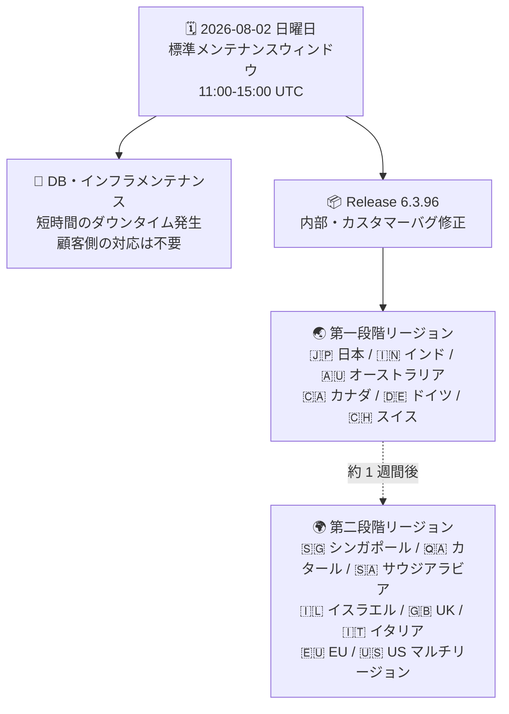

# Google SecOps SOAR: Release 6.3.96 の第一段階ロールアウト開始とデータベース・インフラ定期メンテナンス

**リリース日**: 2026-08-02

**サービス**: Google SecOps SOAR

**機能**: Release 6.3.96 第一段階リージョンへのロールアウト / SOAR データベース・インフラの定期メンテナンス

**ステータス**: Announcement

📊 [このアップデートのインフォグラフィックを見る](https://takech9203.github.io/google-cloud-news-summary/20260802-google-secops-soar-release-6-3-96.html)

## 概要

Google SecOps SOAR の Release 6.3.96 が、第一段階リージョン (日本、インド、オーストラリア、カナダ、ドイツ、スイス) へのロールアウトを開始しました。本リリースは、内部バグおよびカスタマー報告バグの修正を含むメンテナンスリリースで、新機能の追加はアナウンスされていません。公式の[段階的リリースプラン](https://docs.cloud.google.com/chronicle/docs/soar/overview-and-introduction/soar-gradual-release)に基づき、第二段階リージョン (シンガポール、カタール、サウジアラビア、イスラエル、UK、イタリア、EU マルチリージョン、US マルチリージョン) へは第一段階の約 1 週間後に展開される見込みです。

あわせて、SOAR のデータベースおよびインフラストラクチャの定期メンテナンスが、8 月 2 日の標準メンテナンスウィンドウ内で実施されることがアナウンスされました。メンテナンス中、各環境では短時間のダウンタイムが発生しますが、ユーザー側での対応は不要です。なお、公式の標準メンテナンスウィンドウは日曜日 11:00〜15:00 UTC (日本時間 20:00〜24:00) と定められています。

本アップデートは、Google SecOps SOAR (スタンドアロン利用) および Google SecOps 内の SOAR コンポーネントを利用するすべての顧客が対象です。前バージョンの Release 6.3.95 は前日 (2026 年 8 月 1 日) に全リージョンへの展開が完了しており、週次の段階的リリースサイクルが継続しています ([既存レポート (2026-08-01)](2026-08-01-google-secops-soar-release-6-3-95-all-regions.md) 参照)。

**アップデート前の課題**

- Release 6.3.95 までに修正されていない内部バグおよびカスタマー報告バグが残存していた
- SOAR のデータベース・インフラは定期的なメンテナンスを必要とし、実施時期の事前把握が SOC 運用のスケジュール調整に必要だった

**アップデート後の改善**

- Release 6.3.96 により、内部バグおよびカスタマー報告バグの修正が第一段階リージョンの環境に反映される
- データベース・インフラメンテナンスにより、プラットフォーム基盤の健全性が維持される (ユーザー側の作業は不要)

## アーキテクチャ図

8 月 2 日の標準メンテナンスウィンドウ内で、DB・インフラメンテナンスと Release 6.3.96 の第一段階ロールアウトが実施される流れを示しています。第二段階リージョンへは約 1 週間後に展開される見込みです。

## サービスアップデートの詳細

### 主要な内容

1. **Release 6.3.96 の第一段階ロールアウト開始**
   - 第一段階リージョン (日本、インド、オーストラリア、カナダ、ドイツ、スイス) への展開を開始
   - 内部バグおよびカスタマー報告バグの修正を含む
   - 個別の修正内容 (バグ ID など) は本リリースノートでは公開されていない

2. **SOAR データベース・インフラの定期メンテナンス**
   - 8 月 2 日の標準メンテナンスウィンドウ (日曜 11:00〜15:00 UTC) 内で実施
   - メンテナンス中、各環境で短時間のダウンタイムが発生
   - ユーザー側での対応は不要

## 技術仕様

### リリース概要

| 項目 | 詳細 |
|------|------|
| リリースバージョン | 6.3.96 |
| リリースタイプ | バグ修正 (内部・カスタマー) |
| ロールアウト方式 | 2 段階の段階的リリース |
| 第一段階開始日 | 2026 年 8 月 2 日 |
| 第二段階展開見込み | 第一段階の約 1 週間後 (公式リリースプランに基づく) |
| 前バージョン | 6.3.95 (2026 年 8 月 1 日に全リージョン展開完了) |

### メンテナンス概要

| 項目 | 詳細 |
|------|------|
| 対象 | SOAR データベースおよびインフラストラクチャ |
| 実施日 | 2026 年 8 月 2 日 (日曜日) |
| メンテナンスウィンドウ | 日曜日 11:00〜15:00 UTC (標準ウィンドウ) |
| 影響 | 短時間のダウンタイム |
| 顧客側の対応 | 不要 |

## メリット

### ビジネス面

- **継続的な品質改善**: 週次リリースサイクルによりカスタマー報告バグが迅速に修正され、SOC 運用の安定性が向上する
- **予告されたメンテナンス**: ダウンタイムを伴うメンテナンスが標準ウィンドウ内で事前告知されており、運用チームがスケジュールを把握しやすい

### 技術面

- **自動アップグレード**: SaaS 型プラットフォームのため、ユーザー側でのアップグレードやメンテナンス作業は不要
- **段階的リリースによるリスク低減**: 第一段階リージョンでの安定稼働を確認してから第二段階に展開するため、問題発生時の影響範囲が限定される

## デメリット・制約事項

### 考慮すべき点

- メンテナンスウィンドウ中 (日曜 11:00〜15:00 UTC、日本時間 20:00〜24:00) に短時間のダウンタイムが発生するため、この時間帯のケース対応・プレイブック実行に影響が出る可能性がある
- 個別のバグ修正内容 (対象機能や不具合 ID) は公開されていないため、特定の既知の問題が修正されたかを確認するにはサポートへの問い合わせが必要
- 第二段階リージョン (US・EU マルチリージョンなど) の環境には Release 6.3.96 が未展開であり、約 1 週間はリージョン間でバージョンが異なる期間が発生する
- 自組織のリージョンがどの段階に属するか不明な場合は、Google SecOps の担当者への確認が推奨される

## 利用可能リージョン

Release 6.3.96 は第一段階リージョンから順次展開されます。

- 第一段階リージョン (2026 年 8 月 2 日展開開始): 日本、インド、オーストラリア、カナダ、ドイツ、スイス
- 第二段階リージョン (約 1 週間後に展開見込み): シンガポール、カタール、サウジアラビア、イスラエル、UK (ロンドン)、イタリア、EU (マルチリージョン)、US (マルチリージョン)

詳細は [Google SecOps リリースプラン](https://docs.cloud.google.com/chronicle/docs/soar/overview-and-introduction/soar-gradual-release)を参照してください。

## 関連サービス・機能

- **Google SecOps (SIEM)**: SOAR と統合されたセキュリティ運用プラットフォーム。SOAR はアラートのケース管理・プレイブック自動化を担う
- **Google SecOps SOAR ステータスダッシュボード**: [status.cloud.google.com/security](https://status.cloud.google.com/security/) で SOAR のサービスステータスやメンテナンス状況を確認可能
- **Chronicle API**: SOAR のケース、プレイブック、インテグレーションなどをプログラムから操作する統合 API

## 参考リンク

- 📊 [インフォグラフィック](https://takech9203.github.io/google-cloud-news-summary/20260802-google-secops-soar-release-6-3-96.html)
- [公式リリースノート (Google Cloud)](https://docs.cloud.google.com/release-notes#August_02_2026)
- [Google SecOps SOAR リリースノート](https://docs.cloud.google.com/chronicle/docs/soar/release-notes)
- [Google SecOps リリースプラン (段階的リリース)](https://docs.cloud.google.com/chronicle/docs/soar/overview-and-introduction/soar-gradual-release)
- [前バージョン 6.3.95 全リージョン展開のレポート (2026-08-01)](2026-08-01-google-secops-soar-release-6-3-95-all-regions.md)

## まとめ

Release 6.3.96 (内部・カスタマーバグ修正) の第一段階リージョンへのロールアウトと、SOAR データベース・インフラの定期メンテナンスが 8 月 2 日の標準メンテナンスウィンドウ内で実施されます。SaaS 型のためユーザー側の対応は不要ですが、メンテナンスウィンドウ中の短時間のダウンタイムを考慮し、該当時間帯の SOC 運用スケジュールを確認しておくことを推奨します。第二段階リージョンへの展開は約 1 週間後に完了する見込みです。

---

**タグ**: #GoogleSecOps #SOAR #リリース #バグ修正 #メンテナンス #セキュリティ運用
