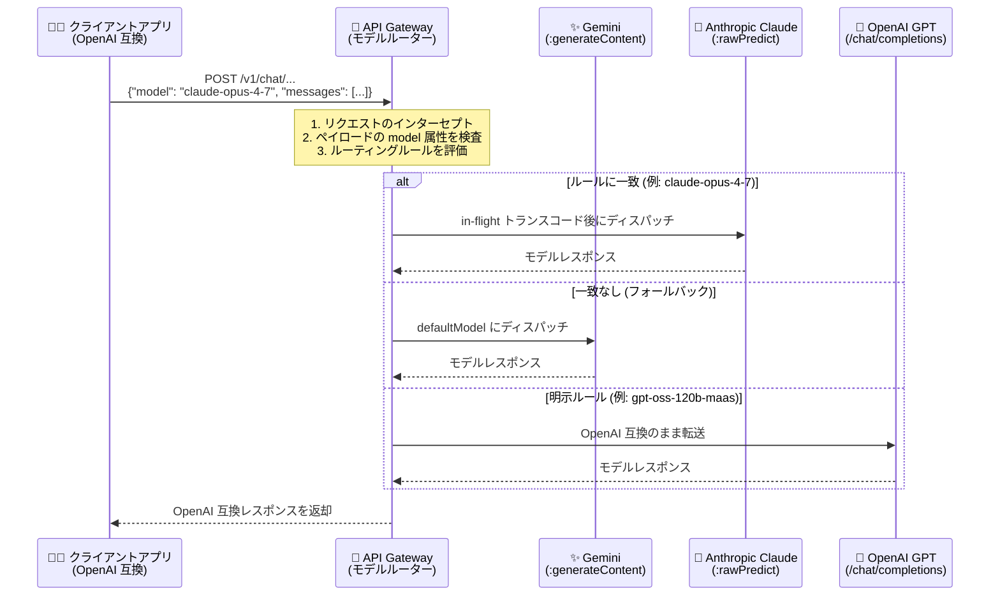

# API Gateway: モデルルーティングによる LLM リクエストのルーティング

**リリース日**: 2026-08-03

**サービス**: API Gateway

**機能**: モデルルーティング (Model Routing) による LLM リクエストのルーティング

**ステータス**: Public Preview

📊 [このアップデートのインフォグラフィックを見る](https://takech9203.github.io/google-cloud-news-summary/20260803-api-gateway-llm-model-routing.html)

## 概要

API Gateway に、LLM リクエストをルーティングする「モデルルーティング (Model Routing)」機能が追加されました。API Gateway をマネージドなトラフィック管理レイヤーとして使用し、OpenAI 互換のプロンプトリクエストを受け付け、通信中 (in-flight) にトランスコードして、Vertex AI Model Garden 上の特定の基盤モデル (Gemini、Anthropic Claude、OpenAI GPT モデルを含む) にルーティングできます。

この機能は、LiteLLM のようなクライアントサイドプロキシのマネージドな代替として機能します。ルーティングロジックをネットワークエッジに移動し、Vertex AI Model Garden と統合することで、プロキシサーバーのホスティング・スケーリング・保守が不要になり、運用オーバーヘッドとインフラコストを削減できます。マルチモデル構成の AI アプリケーションを運用するプラットフォームエンジニア、AI 開発者、ガバナンス管理者が主な対象ユーザーです。

**アップデート前の課題**

このアップデート以前は、複数の基盤モデルへのトラフィック振り分けをクライアント側で行う必要がありました。

- 複数の基盤モデル (Gemini、Claude、GPT など) を切り替えるには、LiteLLM などのスタンドアロンなクライアントサイドプロキシを自前でホスト・スケーリング・保守する必要があった
- モデルごとに API スキーマが異なるため (Gemini は `:generateContent`、Claude は `:rawPredict` など)、クライアントアプリケーション側でモデルごとのリクエスト変換ロジックを実装する必要があった
- AI トラフィックのルーティング設定がクライアントごとに分散し、組織全体での一元的なアクセスポリシーの適用やトラフィック監視が困難だった

**アップデート後の改善**

- API Gateway が単一のマネージドゲートウェイとして AI トラフィックのルーティングとライフサイクル管理をネットワークエッジで一元化し、スタンドアロンプロキシのホスティングが不要になった
- クライアントアプリケーションは統一された OpenAI 互換 REST インターフェースに標準化でき、ゲートウェイが in-flight トランスコーディングで Vertex AI の各モデルのスキーマに動的に変換・ディスパッチするようになった
- 新しい OpenAPI 3.x 拡張 `x-google-api-management.ai.models.routing` と `x-google-model-router` を使い、モデルルーティングテーブル、明示的なルーティングルール、デフォルトモデルへのフォールバックを宣言的に定義できるようになった

## アーキテクチャ図



クライアントは OpenAI 互換の単一インターフェースにリクエストを送信し、API Gateway が JSON ペイロード内の `model` 属性に基づきルーティングルールを評価、Vertex AI Model Garden 上の各モデルのスキーマにトランスコードしてディスパッチします。

## サービスアップデートの詳細

### 主要機能

1. **集中型トラフィック管理 (Centralized traffic management)**
   - AI トラフィックのルーティングとライフサイクル管理をネットワークエッジの単一マネージドゲートウェイに集約
   - LiteLLM などのスタンドアロンなクライアントサイドプロキシのホスティングが不要になり、断片化したクライアント側ルーティング設定を置き換え
   - 認証やクォータなどの集中型アクセスポリシーの適用と、組織全体の AI トラフィック量の監視が可能

2. **In-flight トランスコーディング**
   - クライアントアプリケーションを OpenAI 互換の REST インターフェースに標準化
   - ゲートウェイが OpenAI 互換リクエストを宛先の Vertex AI 予測スキーマ (Gemini の `:generateContent`、Claude の `:rawPredict` など) に通信中に変換
   - レスポンスも変換され、クライアントには OpenAI 互換の形式で返却される

3. **OpenAPI 3.x による宣言的な設定**
   - 新しい `x-google-api-management.ai.models.routing` 拡張でモデルルーティングテーブル (routers) を定義
   - 各ルーターには明示的なルーティングルール (`rules`) と、どのルールにも一致しない場合のフォールバック先 (`defaultModel`) を設定
   - 操作 (operation) レベルで `x-google-model-router` 拡張を指定し、API パスにルーターをアタッチ

### リクエスト処理フロー

1. **リクエストのインターセプト**: ゲートウェイが受信 POST リクエスト (例: `POST /chat/completions`) をインターセプト
2. **ペイロードの検査**: モデルルーターが JSON ペイロード内の `model` 属性 (例: `{"model": "claude-opus-4-7", ...}`) を検査
3. **ルール評価**: `model` 文字列を OpenAPI 仕様で定義したルーティングルールと照合。一致するルールがない場合は設定済みのデフォルトモデルを選択
4. **In-flight トランスコーディング**: OpenAI 互換リクエストを宛先の Vertex AI 予測スキーマに変換
5. **バックエンドへのディスパッチ**: 変換済みリクエストを指定の Vertex AI Model Garden エンドポイントに送信し、レスポンスをクライアントに返却

## 技術仕様

### 対応モデルとエンドポイント

| プロバイダー | targetModel の例 | Vertex AI エンドポイントメソッド |
|------|------|------|
| Google Gemini | `google/gemini-3.5-flash-lite` | `:generateContent` |
| Anthropic Claude | `anthropic/claude-opus-4-7` | `:rawPredict` |
| OpenAI | `openai/gpt-oss-120b-maas` | `/endpoints/openapi/chat/completions` |

- `targetModel` は `<provider>/<model-id>` 形式で、provider は `google`、`openai`、`anthropic` のいずれか (デプロイ時に検証される)
- 対象モデルは Vertex AI Model Garden の Model as a Service (MaaS) としてデプロイ済みのオープンモデルである必要がある
- 1 つのルーターが参照するすべてのモデルは同一ホスト名 (グローバルエンドポイント `aiplatform.googleapis.com` または単一のリージョナルエンドポイント) を共有する必要がある

### OpenAPI 3.x 設定例

```yaml
openapi: 3.0.3
info:
  title: OpenAPI 3.x spec using Model Routing
  version: 1.0.0

x-google-api-management:
  backends:
    gemini-35-flashlite:
      address: "https://aiplatform.googleapis.com/v1/projects/YOUR_PROJECT_ID/locations/global/publishers/google/models/gemini-3.5-flash-lite:generateContent"
      deadline: 60.0
      pathTranslation: CONSTANT_ADDRESS
    anthropic-claude-opus-47:
      address: "https://aiplatform.googleapis.com/v1/projects/YOUR_PROJECT_ID/locations/global/publishers/anthropic/models/claude-opus-4-7:rawPredict"
      deadline: 60.0
      pathTranslation: CONSTANT_ADDRESS
  ai:
    models:
      routing:
        routers:
          gemini-claude-router:
            defaultModel:
              backend: gemini-35-flashlite
              targetModel: google/gemini-3.5-flash-lite
            rules:
              - model: "claude-opus-4-7"
                backend: anthropic-claude-opus-47
                targetModel: anthropic/claude-opus-4-7

paths:
  /v1/chat/gemini-claude:
    post:
      operationId: "chatGeminiClaude"
      x-google-model-router: gemini-claude-router
      responses:
        '200':
          description: "OK"
```

### 設定検証の主なルール

| 検証項目 | ルール |
|------|------|
| 拡張の配置 | `x-google-model-router` は operation レベルのみ指定可能 (path/root レベルは拒否) |
| HTTP メソッド | `x-google-model-router` は POST メソッドのみに適用可能 |
| バックエンド | `pathTranslation: CONSTANT_ADDRESS` が必須。`https` スキームを推奨 |
| ルーター内容 | 各ルーターに `defaultModel` が必須。`rules` 内の `model` 値はルーター内で一意 |
| 混在禁止 | 同一 API 操作で `x-google-model-router` と `x-google-backend` の併用は不可 |
| ホスト整合性 | 1 ルーター内の全バックエンドは同一ホスト名・同一スキームを共有 |

## 設定方法

### 前提条件

1. API Gateway 管理プレーンと Vertex AI Model Garden へのアクセス権があること。API config とゲートウェイの作成には API Gateway Admin (`roles/apigateway.admin`) ロールが必要
2. ゲートウェイが使用するサービスアカウント (デフォルトの Compute Engine サービスアカウント、または API config 作成時に指定するユーザー管理サービスアカウント) に Vertex AI User (`roles/aiplatform.user`) ロールが付与されていること
3. ルーティング対象モデルが Vertex AI Model Garden の MaaS としてデプロイ済みのオープンモデルであり、1 ルーター内の全モデルが同一ホスト名を共有していること
4. 対象プロジェクトと API Gateway インスタンスが VPC Service Controls の境界で制限されていないこと

### 手順

#### ステップ 1: 対象モデルの特定

ルーティング対象の基盤モデルと、対応する Vertex AI エンドポイント URL を特定します。MaaS オープンモデルのホスト名は `aiplatform.googleapis.com` です。

#### ステップ 2: OpenAPI 3.x 仕様の作成

`x-google-api-management.backends` にバックエンドエンドポイントを、`ai.models.routing.routers` にルーターを定義し、各 API パスの POST 操作に `x-google-model-router` でルーターをアタッチします (前掲の設定例を参照)。

#### ステップ 3: API config の作成とデプロイ

作成した OpenAPI 3.x 仕様を使って API config を作成し、API Gateway インスタンスにデプロイします。管理プレーンがモデルルーティング設定を処理し、ルーティングレイヤーを有効化します。

#### ステップ 4: ルーティング動作のテスト

ゲートウェイが `ACTIVE` 状態になるのを待ってから URL を取得し、OpenAI 互換リクエストでテストします。

```bash
# ゲートウェイ URL の取得
gcloud api-gateway gateways describe GATEWAY_ID \
  --location=GATEWAY_LOCATION \
  --project=PROJECT_ID \
  --format='value(defaultHostname)'

# 明示ルールによるルーティングのテスト (Claude にルーティング)
curl https://GATEWAY_URL/v1/chat/gemini-claude \
  -H "Content-Type: application/json" \
  -H "Authorization: Bearer $TOKEN" \
  -d '{
    "model": "claude-opus-4-7",
    "messages": [
      {"role": "user", "content": "Explain recursion in one sentence."}
    ]
  }'
```

ペイロード内の `"model": "claude-opus-4-7"` がルーターの明示ルールに一致し、Claude バックエンドにルーティングされます。一致しないモデル名を指定した場合は `defaultModel` にフォールバックします。

## メリット

### ビジネス面

- **運用コストの削減**: スタンドアロンプロキシサーバーのホスティング・スケーリング・保守が不要になり、インフラコストと運用負荷を削減
- **ガバナンスの強化**: 認証・クォータなどのアクセスポリシーを一元的に適用し、組織全体の AI トラフィック量を監視可能
- **ベンダーロックインの緩和**: クライアントコードを変更せずに、ルーティング設定の変更だけで Gemini、Claude、GPT 間のモデル切り替えが可能

### 技術面

- **クライアントの標準化**: すべてのクライアントアプリケーションが OpenAI 互換の単一 REST インターフェースで実装でき、モデルごとのスキーマ差異をゲートウェイが吸収
- **エッジ最適化されたパフォーマンス**: ネットワークエッジでプロンプトを検査してルーティングし、Vertex AI Model Garden エンドポイントとの直接統合 (same-host 最適化) を活用
- **宣言的な構成管理**: ルーティングテーブルを OpenAPI 3.x 仕様としてコード管理でき、デプロイ時に管理プレーンが構成を検証

## デメリット・制約事項

### 制限事項

- **Public Preview**: ルーティングは JSON ペイロード内の `model` タグ/名前のみに基づく (コンテンツベースやコストベースのルーティングは未対応)
- **対象モデルの制約**: Vertex AI Model Garden にデプロイ済みの MaaS モデルのみ対応。1 ルーター内の全モデルは同一ホスト名を共有する必要がある
- **OpenAPI 3.x 必須**: OpenAPI 2.0 (Swagger) 仕様は非対応
- **ゲートウェイの更新不可**: モデルルーティングなしでデプロイした既存ゲートウェイへの有効化や、有効化済みゲートウェイからの無効化はできない。切り替えには新しい API config とゲートウェイの作成・デプロイが必要
- **混在構成の禁止**: 1 つの OpenAPI 仕様内でモデルルーティング操作と非モデルルーティング操作を混在させることはできない
- **VPC Service Controls 非対応**: モデルルーティングを有効にしたゲートウェイでは VPC Service Controls 境界や Private Service Connect (PSC) エンドポイント構成を使用できない
- **プロトコル制約**: レスポンスストリーミング (SSE) には対応するが、リクエスト側ストリーミング、gRPC、WebSocket、Gemini Live は非対応
- **モダリティ**: Public Preview 期間中はテキストベースのプロンプトリクエストのみを想定

### 考慮すべき点

- **`model` 属性の必須指定**: Public Preview 期間中、リクエストペイロードに `model` フィールドがない場合、エラーで拒否されずに誤って処理される。クライアントリクエストには必ず `model` フィールドを含めること
- **最大タイムアウト**: ゲートウェイはリクエストあたり最大 3,600 秒 (1 時間) のタイムアウトを適用 (長時間のストリーミングリクエストにも適用)
- **コールドスタートレイテンシ**: 非アクティブ期間中にゲートウェイインスタンスがゼロにスケールした場合、初回リクエストにコールドスタートレイテンシが発生し、レイテンシに敏感な AI 推論パスに影響する可能性がある
- **モデル別の可観測性が限定的**: Public Preview では、リクエスト単位でどのターゲットモデルが処理したかの帰属情報は利用不可 (構造化されたルーティング決定ログは将来のリリースで追加予定)
- **OpenAI 互換ルートのモデルセレクター**: 宛先が `/openapi/chat/completions` のルートでは、ルールの `model` 値がそのまま Vertex AI への送信ペイロードに転送されるため、有効なパブリッシャーモデル識別子 (例: `openai/gpt-oss-120b-maas`) を指定する必要がある

## ユースケース

### ユースケース 1: マルチモデル AI アプリケーションの統一エンドポイント

**シナリオ**: 社内の複数チームが Gemini、Claude、GPT をユースケースに応じて使い分けている。各チームが個別に LiteLLM プロキシを運用しており、認証・監視・ルーティング設定が分散している。

**実装例**:
```yaml
# 単一のゲートウェイに複数ルーターを定義
ai:
  models:
    routing:
      routers:
        multi-model-router:
          defaultModel:
            backend: gemini-35-flashlite
            targetModel: google/gemini-3.5-flash-lite
          rules:
            - model: "claude-opus-4-7"
              backend: anthropic-claude-opus-47
              targetModel: anthropic/claude-opus-4-7
```

**効果**: 全チームが単一の OpenAI 互換エンドポイントに標準化され、プロキシ運用が不要になる。認証・クォータ・監視をゲートウェイで一元管理できる。

### ユースケース 2: デフォルトモデルへのフォールバックによる安全なモデル切り替え

**シナリオ**: クライアントアプリケーションが指定するモデル名が多様で、未知のモデル名によるエラーを避けつつ、コスト効率の良いモデルをデフォルトとして運用したい。

**効果**: ルールに一致しないモデル名のリクエストは自動的に `defaultModel` (例: Gemini Flash-Lite) にフォールバックし、リクエストの失敗を防ぎつつコストを制御できる。

### ユースケース 3: クライアントコード変更なしのモデル移行・評価

**シナリオ**: OpenAI SDK ベースの既存アプリケーションを、コード変更なしに Vertex AI Model Garden のモデルへ移行・比較評価したい。

**効果**: クライアントは OpenAI 互換インターフェースのまま、ゲートウェイ側のルーティング設定変更のみで異なる基盤モデルへの切り替え・比較が可能になる。

## 料金

API Gateway は Service Control への呼び出し数 (API 呼び出し数) に基づいて課金されます。モデルルーティング固有の追加料金は現時点で発表されていません。ルーティング先の Vertex AI モデルの推論料金は別途発生します。

### 料金例 (API Gateway の呼び出し課金)

| 月間 API 呼び出し数 (請求先アカウントごと) | 100 万呼び出しあたりの料金 |
|--------|-----------------|
| 0〜200 万回 | $0.00 (無料枠) |
| 200 万〜10 億回 | $3.00 |
| 10 億回超 | $1.50 |

このほか、Google Cloud 外へのデータ転送 (Premium Tier) の料金が別途適用されます。詳細は [API Gateway 料金ページ](https://cloud.google.com/api-gateway/pricing) を参照してください。

## 利用可能リージョン

対象モデルは Vertex AI のグローバルエンドポイント (`aiplatform.googleapis.com`) または単一のリージョナルエンドポイント (例: `us-central1-aiplatform.googleapis.com`) を使用できます。1 つのルーター内では同一エンドポイント (ホスト名) に統一する必要があります。ゲートウェイ自体の利用可能リージョンは [API Gateway のドキュメント](https://cloud.google.com/api-gateway/docs) を参照してください。

## 関連サービス・機能

- **Vertex AI Model Garden (MaaS)**: ルーティング先となる基盤モデル (Gemini、Anthropic Claude、OpenAI GPT) のホスティング基盤。モデルルーティングは MaaS オープンモデルとの直接統合を前提とする
- **Cloud Logging**: ゲートウェイを通過する全リクエストが標準の API Gateway リクエストログに記録される。モデルルーター障害時は `responseDetails` フィールドに `model_router_application_error` などのカテゴリが付与され、トラブルシューティングに利用可能
- **Cloud Monitoring**: `apigateway.googleapis.com/proxy/request_count` メトリクスでトラフィック量とエラー率を監視可能 (ルーター別・モデル別のメトリクスは将来追加予定)
- **Apigee AI Gateway**: より高度な AI トラフィックガバナンス (Model Armor、セマンティックキャッシング、トークン制限、Model FinOps など) が必要な場合のエンタープライズ向け選択肢
- **IAM**: ゲートウェイのサービスアカウントに Vertex AI User ロールを付与してモデルへのアクセスを制御

## 参考リンク

- 📊 [インフォグラフィック](https://takech9203.github.io/google-cloud-news-summary/20260803-api-gateway-llm-model-routing.html)
- [公式リリースノート](https://docs.cloud.google.com/release-notes#August_03_2026)
- [Overview of model routing](https://docs.cloud.google.com/api-gateway/docs/model-routing-overview)
- [Configure model routing](https://docs.cloud.google.com/api-gateway/docs/model-routing-configure)
- [OpenAPI 3.x extensions in API Gateway](https://docs.cloud.google.com/api-gateway/docs/oasv3-extensions)
- [Vertex AI Model Garden のオープンモデル (MaaS)](https://docs.cloud.google.com/vertex-ai/generative-ai/docs/maas/use-open-models)
- [API Gateway 料金ページ](https://cloud.google.com/api-gateway/pricing)

## まとめ

API Gateway のモデルルーティングは、LiteLLM などのクライアントサイドプロキシを自前運用することなく、OpenAI 互換の単一インターフェースで Gemini・Claude・GPT へのトラフィックをマネージドに振り分けられる重要なアップデートです。マルチモデル構成の AI アプリケーションを運用している組織は、プロキシ運用の廃止とガバナンスの一元化を検討する価値があります。Public Preview のため、VPC Service Controls 非対応や `model` フィールド必須などの制約を確認した上で、非本番環境での評価から始めることを推奨します。

---

**タグ**: #APIGateway #VertexAI #ModelGarden #LLM #ModelRouting #Gemini #Claude #GPT #OpenAPI #AIGateway #Preview
