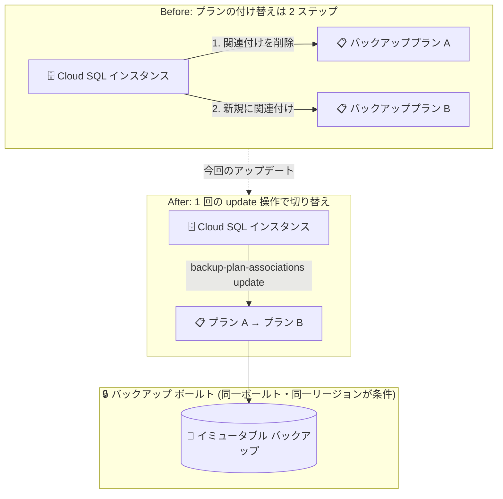

# Backup and DR / Cloud SQL: Cloud SQL インスタンスに関連付けたバックアッププランの変更が可能に

**リリース日**: 2026-08-03

**サービス**: Backup and DR Service / Cloud SQL (MySQL, PostgreSQL, SQL Server)

**機能**: Cloud SQL インスタンスに関連付けられたバックアッププランの変更

**ステータス**: 一般提供 (Feature / Change)

📊 [このアップデートのインフォグラフィックを見る](https://takech9203.github.io/google-cloud-news-summary/20260803-backup-dr-cloud-sql-backup-plan-change.html)

## 概要

Backup and DR Service を利用した Cloud SQL の拡張バックアップ (enhanced backups) において、インスタンスに関連付けられたバックアッププランを別のプランに変更できるようになりました。変更先のプランが「同じバックアップ ボールトを使用している」かつ「インスタンスと同じリージョンにある」という条件を満たしていれば、既存のプランの関連付けを解除することなく、直接プランを切り替えられます。

この機能は Google Cloud コンソールと gcloud CLI の両方から利用でき、Cloud SQL の MySQL、PostgreSQL、SQL Server のすべてのエディションに対応しています。Cloud SQL の拡張バックアップは 2025 年 7 月に Preview、2025 年 12 月に GA となった機能で、バックアップをバックアップ ボールト (イミュータブルかつ削除不可能なストレージ) に集中管理できます。今回のアップデートにより、バックアップ スケジュールや保持期間の要件が変わった際の運用が大幅に簡素化されます。

バックアップ運用を担当するデータベース管理者や、組織全体のデータ保護ポリシーを管理するプラットフォーム チームにとって、バックアップ要件の変更に柔軟に追従できる重要な改善です。

**アップデート前の課題**

- 拡張バックアップを利用する Cloud SQL インスタンスのバックアッププランを変更するには、既存のバックアッププランの関連付け (backup plan association) を一度削除してから、新しいプランを関連付け直す必要があった
- プランの付け替え作業が複数ステップに分かれるため、運用手順が煩雑で、関連付けが解除されている間の設定管理に注意が必要だった
- バックアップ要件 (スケジュール、保持期間) の変更に迅速に対応しにくかった

**アップデート後の改善**

- 既存のプランを削除することなく、1 回の操作でバックアッププランを別のプランに切り替えられるようになった
- Google Cloud コンソール (Backup and DR の「Vaulted backups」ページまたは Cloud SQL インスタンスの編集画面) から GUI で変更できるようになった
- gcloud CLI の `gcloud backup-dr backup-plan-associations update` コマンドで変更を自動化できるようになった

## アーキテクチャ図



従来はバックアッププランの関連付けを削除してから再作成する必要がありましたが、今回のアップデートで同一バックアップ ボールト・同一リージョン内のプランであれば 1 回の操作で直接切り替えられるようになりました。

## サービスアップデートの詳細

### 主要機能

1. **バックアッププランの直接変更**
   - Cloud SQL インスタンスに適用されているバックアッププランを、既存プランの削除なしで別のプランに切り替え可能
   - 切り替え後は新しいプランのバックアップ スケジュールと保持設定が以降のバックアップに適用される

2. **コンソールからの変更**
   - Backup and DR の「Vaulted backups」ページから対象データソースを選択し、「Change backup plan」で変更
   - または Cloud SQL インスタンスの編集画面の「Data Protection」セクション (Enhanced backup tier) から「Change」ボタンで変更
   - 選択画面には、対象インスタンスに対して有効なバックアッププランのみが表示される

3. **gcloud CLI からの変更**
   - `gcloud backup-dr backup-plan-associations update` コマンドで backup plan association を更新
   - スクリプト化による一括変更や CI/CD への組み込みが可能

## 技術仕様

### プラン変更の条件

| 項目 | 詳細 |
|------|------|
| バックアップ ボールト | 変更先のプランが現在のプランと同じバックアップ ボールトを使用していること |
| リージョン | 変更先のプランが Cloud SQL インスタンスと同じリージョンにあること |
| 対象データベース エンジン | Cloud SQL for MySQL / PostgreSQL / SQL Server |
| 前提となるバックアップ オプション | 拡張バックアップ (enhanced backups) が有効であること |
| 操作インターフェース | Google Cloud コンソール、gcloud CLI |

### 拡張バックアップと標準バックアップの位置付け

| 項目 | 拡張バックアップ (enhanced) | 標準バックアップ (standard) |
|------|---------------------------|---------------------------|
| 管理主体 | Backup and DR Service (集中管理プロジェクト) | Cloud SQL (インスタンスと同一プロジェクト) |
| ストレージ | バックアップ ボールト (イミュータブル・削除不可能) | インスタンスと同一プロジェクト内 |
| スケジュール | バックアッププランによる詳細なスケジューリング | Cloud SQL の自動バックアップ設定 |
| 保持の強制 | 最小強制保持期間を設定可能 | 通常の保持設定 |
| 今回の機能の対象 | 対象 | 対象外 |

## 設定方法

### 前提条件

1. Cloud SQL インスタンスで拡張バックアップ (enhanced backups) が有効になっており、バックアッププランが関連付けられていること
2. 変更先のバックアッププランが、現在のプランと同じバックアップ ボールトを使用し、インスタンスと同じリージョンに存在すること

### 手順

#### ステップ 1: 変更先のバックアッププランを確認

```bash
# 対象リージョンのバックアッププラン一覧を確認
gcloud backup-dr backup-plans list \
    --location=INSTANCE_REGION \
    --project=BACKUP_PLAN_PROJECT_ID
```

現在のプランと同じバックアップ ボールトを使用するプランを変更先として選択します。

#### ステップ 2: backup plan association を更新

```bash
gcloud backup-dr backup-plan-associations update BACKUP_PLAN_ASSOCIATION_NAME \
    --workload-project=INSTANCE_PROJECT_ID \
    --location=INSTANCE_REGION \
    --backup-plan=BACKUP_PLAN \
    --project=SELECTED_BACKUP_PLAN_PROJECT_ID
```

- `BACKUP_PLAN_ASSOCIATION_NAME`: backup plan association リソースの名前
- `INSTANCE_PROJECT_ID`: Cloud SQL インスタンスのプロジェクト ID
- `INSTANCE_REGION`: Cloud SQL インスタンスのリージョン
- `BACKUP_PLAN`: 切り替え先のバックアッププラン名
- `SELECTED_BACKUP_PLAN_PROJECT_ID`: 切り替え先バックアッププランのプロジェクト ID

コンソールの場合は、Backup and DR の「Vaulted backups」ページで対象データソースのメニューから「Change backup plan」を選択し、表示された有効なプランの中から選んで「Apply」をクリックします。

## メリット

### ビジネス面

- **運用工数の削減**: プランの削除と再関連付けという 2 段階の作業が 1 回の操作になり、バックアップ要件変更時の運用負荷が下がる
- **ポリシー変更への迅速な追従**: コンプライアンス要件や事業要件の変化 (保持期間の延長、バックアップ頻度の変更など) に素早く対応できる

### 技術面

- **オペレーションミスの低減**: 関連付けの削除と再作成の間に生じ得る設定漏れや作業ミスのリスクを排除できる
- **自動化との親和性**: gcloud CLI の update コマンドにより、多数のインスタンスに対するプラン切り替えをスクリプトで一括実行できる
- **有効なプランのみ提示**: コンソールの選択画面では対象インスタンスに対して有効なプランのみが表示されるため、条件を満たさないプランを誤って選択する心配がない

## デメリット・制約事項

### 制限事項

- 変更先のプランは、現在のプランと同じバックアップ ボールトを使用している必要がある (別のボールトを使用するプランへの直接切り替えは不可)
- 変更先のプランは、Cloud SQL インスタンスと同じリージョンに存在する必要がある
- バックアッププラン自体の編集では、割り当てられたバックアップ ボールトを変更できない。別のボールトにバックアップを保存したい場合は新しいプランの作成が必要

### 考慮すべき点

- Cloud SQL コンソールの編集画面 (Data Protection セクション) 経由でバックアッププランを変更する場合、インスタンスが再起動される点に注意が必要
- 切り替え後は新しいプランのスケジュール・保持設定が適用されるため、既存バックアップの保持期間との整合性を事前に確認しておく
- 拡張バックアップが前提のため、標準バックアップを使用しているインスタンスはまず拡張バックアップへの移行が必要

## ユースケース

### ユースケース 1: コンプライアンス要件の変更に伴う保持期間の切り替え

**シナリオ**: 金融系システムで監査要件が変わり、本番 Cloud SQL インスタンスのバックアップ保持期間を 30 日から 90 日に延長する必要が生じた。同じバックアップ ボールト内に 90 日保持のバックアッププランを用意している。

**実装例**:
```bash
gcloud backup-dr backup-plan-associations update prod-mysql-bpa \
    --workload-project=prod-project \
    --location=asia-northeast1 \
    --backup-plan=plan-retention-90d \
    --project=backup-mgmt-project
```

**効果**: 既存プランの関連付けを解除することなく 1 コマンドで切り替えが完了し、バックアップの空白期間や設定ミスのリスクなしに新しい保持ポリシーへ移行できる。

### ユースケース 2: 環境のライフサイクル変化に応じたバックアップ頻度の調整

**シナリオ**: 開発フェーズを終えて本番稼働に移行するインスタンスについて、開発用の低頻度バックアッププランから、本番用の高頻度・長期保持プランに切り替えたい。

**効果**: Backup and DR の「Vaulted backups」ページから GUI 操作でプランを切り替えるだけで、本番相当のデータ保護レベルに引き上げられる。多数のインスタンスがある場合は gcloud CLI で一括変更も可能。

## 料金

バックアッププランの変更操作自体に追加料金は発生しません。拡張バックアップの利用にはバックアップ ボールトのストレージ料金など Backup and DR Service の料金が適用されます。切り替え先プランの保持期間が長くなる場合は、保存されるバックアップ量の増加に伴いストレージ費用が増える可能性があります。

詳細は [Backup and DR Service の料金ページ](https://cloud.google.com/backup-disaster-recovery/pricing)を参照してください。

## 利用可能リージョン

Cloud SQL の拡張バックアップおよびバックアップ ボールトがサポートされるリージョンで利用できます。変更先のプランはインスタンスと同じリージョンにある必要があります。サポートされるロケーションの詳細は[バックアップ ボールトのドキュメント](https://docs.cloud.google.com/backup-disaster-recovery/docs/concepts/backup-vault)を参照してください。

## 関連サービス・機能

- **Backup and DR Service**: 本機能の基盤となる集中バックアップ管理サービス。バックアッププラン、バックアップ ボールト、backup plan association の管理を担う
- **Cloud SQL 拡張バックアップ (enhanced backups)**: 2025 年 12 月に GA。バックアップを集中管理プロジェクトのバックアップ ボールトに保存し、強制保持・詳細なスケジューリング・インスタンス削除後の PITR をサポート
- **バックアップ ボールト (Backup vault)**: イミュータブル (変更不可) かつインデリブル (削除不可) なバックアップ用ストレージ。2026 年 3 月には Cloud SQL 向けマルチリージョン ボールトも GA
- **編集可能なバックアッププラン (Editable Backup Plans)**: 既存プランのスケジュールや保持期間を直接編集できる機能。プラン自体の編集と今回のプラン付け替えを組み合わせることで柔軟なポリシー運用が可能
- **Database Center**: Backup and DR Service で保護されたデータベースの保護状況を一元的に可視化する AI 支援ダッシュボード

## 参考リンク

- 📊 [インフォグラフィック](https://takech9203.github.io/google-cloud-news-summary/20260803-backup-dr-cloud-sql-backup-plan-change.html)
- [公式リリースノート](https://docs.cloud.google.com/release-notes#August_03_2026)
- [Change the associated backup plan for a Cloud SQL instance (Backup and DR ドキュメント)](https://docs.cloud.google.com/backup-disaster-recovery/docs/cloud-console/sql/csql-backup)
- [Change your instance's associated backup plan (Cloud SQL ドキュメント)](https://docs.cloud.google.com/sql/docs/mysql/backup-recovery/manage-enhanced-backups)
- [Cloud SQL のバックアップ オプション](https://docs.cloud.google.com/sql/docs/mysql/backup-recovery/backups)
- [料金ページ (Backup and DR Service)](https://cloud.google.com/backup-disaster-recovery/pricing)

## まとめ

Cloud SQL の拡張バックアップにおいて、バックアッププランを既存の関連付けを削除せずに直接切り替えられるようになり、バックアップ ポリシー変更時の運用が大きく簡素化されました。同一バックアップ ボールト・同一リージョンという条件はあるものの、コンソールと gcloud CLI の両方に対応しており自動化も容易です。拡張バックアップを利用中のチームは、保持期間や頻度の異なるプランをあらかじめ用意しておき、要件変化に応じて素早く切り替える運用を検討することをおすすめします。

---

**タグ**: #BackupAndDR #CloudSQL #MySQL #PostgreSQL #SQLServer #バックアップ #EnhancedBackups #BackupVault #データ保護
