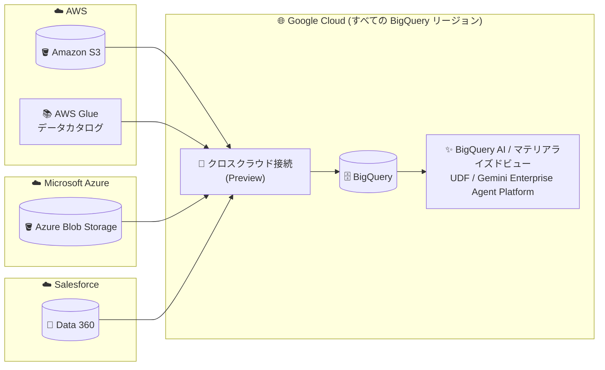

# BigQuery: クロスクラウド接続 (Cross-Cloud Connections) が全リージョンで利用可能に (Preview)

**リリース日**: 2026-08-03

**サービス**: BigQuery

**機能**: クロスクラウド接続による AWS / Azure / Salesforce Data 360 データのクエリ

**ステータス**: Preview

📊 [このアップデートのインフォグラフィックを見る](https://takech9203.github.io/google-cloud-news-summary/20260803-bigquery-cross-cloud-connections.html)

## 概要

BigQuery に「クロスクラウド接続 (Cross-Cloud Connections)」が Preview として追加されました。この新しい接続タイプを使用すると、Amazon Web Services (AWS)、Microsoft Azure、Salesforce Data 360 にあるデータを、**すべての BigQuery リージョン**から直接クエリできるようになります。

クロスクラウド接続は、BigQuery Omni を使用する従来の標準接続 (standard connections) の代替となるものです。BigQuery Omni では、リモートリージョンに軽量なコンピュートワーカーをデプロイしてデータ移動なしにクエリを実行していましたが、クロスクラウド接続では他クラウドのデータを BigQuery 側に取り込んでクエリする方式を採用しています。これにより、BigQuery AI 機能、Gemini Enterprise Agent Platform、マテリアライズドビュー、ユーザー定義関数 (UDF) など、標準接続では利用できなかった BigQuery のフル機能を活用できます。さらに、標準のスロット予約・コミットメントを消費するため、BigQuery Omni 用に別途コンピュートキャパシティを管理する必要がなく、コスト効率にも優れています。

マルチクラウド環境でデータ分析基盤を運用する企業、特に AWS S3 / Azure Blob Storage / Salesforce Data 360 のデータを BigQuery の高度な分析・AI 機能と組み合わせたい Solutions Architect やデータエンジニアにとって重要なアップデートです。

**アップデート前の課題**

- 他クラウド (AWS / Azure) のデータをクエリするには BigQuery Omni の標準接続を使用する必要があり、接続を作成できるのは限られた BigQuery Omni リージョン (aws-us-east-1、azure-eastus2 など) のみだった
- BigQuery Omni 経由のクエリでは、BigQuery AI 機能、マテリアライズドビュー (Omni リージョンでの制約あり)、ユーザー定義関数などの一部の BigQuery 機能が利用できなかった
- BigQuery Omni のワークロードには専用のコンピュートキャパシティ (Omni リージョンのスロット) が必要で、Google Cloud リージョンの標準スロット予約とは別に管理する必要があった

**アップデート後の改善**

- すべての BigQuery 標準リージョン (東京 asia-northeast1 を含む) でクロスクラウド接続を作成し、AWS / Azure / Salesforce Data 360 のデータをクエリできるようになった
- データを BigQuery に取り込む方式のため、BigQuery AI 機能、Gemini Enterprise Agent Platform、マテリアライズドビュー、UDF など BigQuery のフル機能を他クラウドのデータに対して直接利用できるようになった
- 標準のスロット予約・コミットメントを消費するため、Omni 用の個別のコンピュートキャパシティ管理が不要になり、コスト効率が向上した

## アーキテクチャ図



AWS (S3 / Glue)、Azure Blob Storage、Salesforce Data 360 のデータをクロスクラウド接続経由で BigQuery の標準リージョンに取り込み、BigQuery AI やマテリアライズドビューなどのフル機能で分析できます。BigQuery Omni リージョンに依存しない構成が特徴です。

## サービスアップデートの詳細

### 主要機能

1. **全 BigQuery リージョンからのクロスクラウドクエリ**
   - 接続の作成先に BigQuery Omni リージョンではなく、標準の BigQuery リージョン (us-east4、asia-northeast1 など) を指定できる
   - データに物理的に近いリージョンを選択することで、コストとパフォーマンスを最適化できる (公式ドキュメントに AWS / Azure リージョンごとの推奨 BigQuery リージョン対応表あり)

2. **機能の一貫性 (Feature Consistency)**
   - 他クラウドのデータを BigQuery に取り込むことで、BigQuery AI 機能、Gemini Enterprise Agent Platform、マテリアライズドビュー、ユーザー定義関数など、標準接続 (BigQuery Omni) では利用できない機能に直接アクセスできる

3. **コスト効率 (Cost Efficiency)**
   - クロスクラウド接続を使用するワークロードは標準のスロット予約・コミットメントを消費する
   - BigQuery Omni 用の個別コンピュートキャパシティの管理が不要になる

4. **AWS Glue 連携によるデータベース単位のフェデレーション**
   - `CREATE EXTERNAL SCHEMA` を使用して、AWS Glue データカタログのデータベース全体を BigQuery にフェデレーションできる

5. **Salesforce Data 360 との連携**
   - Data 360 データセットのリンク時に、BigQuery Omni ロケーションではなく標準の BigQuery ロケーションを指定してリンクデータセットを作成できる
   - 移行後は旧来のリンクデータセットや BigQuery Omni マテリアライズドビューを削除可能

## 技術仕様

### 接続タイプと対応データソース

| 項目 | 詳細 |
|------|------|
| 対応データソース | Amazon S3、AWS Glue、Azure Blob Storage、Salesforce Data 360 |
| 接続の作成先ロケーション | 標準の BigQuery リージョン (BigQuery Omni ロケーションは不可) |
| 必要な BigQuery ロール | BigQuery Admin (`roles/bigquery.admin`) |
| 必要な AWS 側の権限 | AWS アカウントで IAM ポリシー・ロールを作成できるロール |
| 必要な Azure 側の権限 | Microsoft Entra ID (Azure AD) でのアプリ登録管理と Storage Blob Data Reader などのロール割り当て |
| コンピュート | 標準のスロット予約・コミットメントを消費 |
| ステータス | Preview (Pre-GA Offerings Terms が適用) |

### リージョン選択の推奨 (代表例)

| データの所在リージョン | 最も近い BigQuery リージョン |
|------|------|
| AWS us-east-1 | us-east4 |
| AWS ap-northeast-1 (東京) | asia-northeast1 (東京) |
| AWS eu-west-1 | europe-west1 |
| Azure East US | us-east4 |
| Azure Japan East | asia-northeast1 (東京) |
| Azure West Europe | europe-west4 |

データに物理的に最も近い BigQuery リージョンを選択することが、コスト・パフォーマンス両面で推奨されています。

## 設定方法

### 前提条件

1. BigQuery Admin (`roles/bigquery.admin`) IAM ロールが付与されていること
2. AWS の場合: IAM ポリシー・ロールを作成できる AWS 側の権限があること
3. Azure の場合: Microsoft Entra ID でアプリ登録を管理し、対象ストレージにロールを割り当てられる権限があること

### 手順

#### ステップ 1: AWS クロスクラウド接続の作成

```bash
bq mk --connection \
  --connection_type='AWS' \
  --location=LOCATION \
  --project_id=PROJECT_ID \
  --properties='{"accessRole":{"iamRoleId":"arn:aws:iam::AWS_ACCOUNT_ID:role/ROLE_NAME"}}' \
  CONNECTION_ID
```

`LOCATION` には BigQuery Omni ロケーションではなく、標準の BigQuery リージョン (例: `us-east4`) を指定します。事前に標準接続と同様の手順で AWS IAM ポリシーとロールを作成しておきます。作成後は `bq show --connection` でサービスアカウント情報を確認し、AWS ロールに信頼ポリシーを追加します。

#### ステップ 2: Azure クロスクラウド接続の作成

```bash
bq mk --connection \
  --connection_type='Azure' \
  --tenant_id=TENANT_ID \
  --location=LOCATION \
  --federated_azure=true \
  --federated_app_client_id=APP_ID \
  --project_id=PROJECT_ID \
  CONNECTION_ID
```

Azure テナントにアプリケーションを作成し、ロールを割り当てた後、フェデレーション認証情報を追加します。

#### ステップ 3: 外部テーブルの作成とクエリ

```sql
-- Amazon S3 の Parquet ファイルを直接クエリする外部テーブル
CREATE SCHEMA `my-project.aws_raw_data`
OPTIONS (location = 'us-east4');

CREATE EXTERNAL TABLE `my-project.aws_raw_data.sales_parquet`
WITH CONNECTION `us-east4.my-aws-connection`
OPTIONS (
  format = 'PARQUET',
  uris = ['s3://my-data-bucket/sales/year=2025/*']);
```

AWS Glue のデータベース全体をフェデレーションする場合は次のようにします。

```sql
CREATE EXTERNAL SCHEMA `my-project.aws_glue_data`
WITH CONNECTION `us-east4.my-aws-connection`
OPTIONS (
  location = 'us-east4',
  external_source = 'aws-glue://arn:aws:glue:us-east-4:123456789:database/test_database');
```

## メリット

### ビジネス面

- **マルチクラウドデータの価値最大化**: AWS / Azure / Salesforce に分散したデータを BigQuery の AI・分析機能で一元的に活用でき、ETL パイプラインの構築・維持コストを削減できる
- **キャパシティ管理の簡素化**: 標準のスロット予約に一本化されるため、BigQuery Omni 用の別枠キャパシティの購入・管理が不要になり、コミットメントの利用効率が向上する

### 技術面

- **リージョン制約の解消**: BigQuery Omni リージョンに限定されず、東京 (asia-northeast1) を含むすべての BigQuery リージョンで他クラウドデータへの接続を作成できる
- **BigQuery フル機能へのアクセス**: BigQuery AI、Gemini Enterprise Agent Platform、マテリアライズドビュー、UDF など、標準接続では使えなかった機能を他クラウド由来のデータに適用できる
- **既存の認証設定を流用可能**: AWS IAM ロールや Azure アプリ登録の設定手順は標準接続 (BigQuery Omni) と同様であり、既存のマルチクラウド認証設計を活かせる

## デメリット・制約事項

### 制限事項

- Preview 段階の機能であり、Pre-GA Offerings Terms が適用される (SLA 対象外、サポートが限定的な可能性がある)
- サポートやフィードバックは専用メールアドレス (biglake-help@google.com) 経由となる
- Apache Iceberg カタログを扱うワークロードや、BigQuery 以外のエンジンからのクエリが必要な場合は、クロスクラウド接続ではなく cross-cloud Lakehouse for Apache Iceberg の利用が推奨されている

### 考慮すべき点

- BigQuery Omni の標準接続は「データ移動なし」でリモートクエリを実行するのに対し、クロスクラウド接続はデータを BigQuery に取り込む方式のため、データレジデンシー (データ所在地) 要件がある場合は方式の違いを評価する必要がある
- 最適なコスト・パフォーマンスを得るには、データに物理的に近い BigQuery リージョンを選択することが推奨される
- Salesforce Data 360 の既存連携 (BigQuery Omni 経由) から移行する場合、クエリの参照先を新しいデータセットに更新した上で、旧リンクデータセットと Omni マテリアライズドビューの削除を検討する

## ユースケース

### ユースケース 1: AWS S3 上の販売データに BigQuery AI を適用

**シナリオ**: 販売データを Amazon S3 (Parquet 形式) に保持している企業が、BigQuery の AI 関数やマテリアライズドビューを使って高度な分析を行いたい。従来の BigQuery Omni では利用できる機能に制約があった。

**実装例**:
```sql
CREATE EXTERNAL TABLE `my-project.aws_raw_data.sales_parquet`
WITH CONNECTION `us-east4.my-aws-connection`
OPTIONS (
  format = 'PARQUET',
  uris = ['s3://my-data-bucket/sales/year=2025/*']);

-- BigQuery のフル機能 (マテリアライズドビューなど) を適用
CREATE MATERIALIZED VIEW `my-project.aws_raw_data.daily_sales_mv` AS
SELECT DATE(order_time) AS order_date, SUM(total_price) AS sales
FROM `my-project.aws_raw_data.sales_parquet`
GROUP BY 1;
```

**効果**: S3 のデータに対して BigQuery AI・マテリアライズドビュー・UDF を直接活用でき、専用の Omni キャパシティなしで標準スロットのみで運用できる。

### ユースケース 2: Salesforce Data 360 データの東京リージョンでの分析

**シナリオ**: 日本企業が Salesforce Data 360 の顧客データを、国内 (asia-northeast1) の BigQuery データセットと組み合わせて分析したい。従来は BigQuery Omni ロケーションにリンクデータセットを作成する必要があった。

**効果**: Data 360 データセットを標準の BigQuery ロケーションに直接リンクできるため、国内リージョンのデータと同一環境で結合・分析でき、旧来の Omni マテリアライズドビューの管理が不要になる。

## 料金

クロスクラウド接続を使用するワークロードは、BigQuery の**標準のスロット予約・コミットメント**を消費します。BigQuery Omni のような専用コンピュートキャパシティ (Omni リージョンのスロット) を別途購入・管理する必要がないため、コスト効率が向上するとされています。

なお、比較対象となる従来の BigQuery Omni 経由のクロスクラウド転送では、クラウド間で転送されたバイト数に対する課金 (Omni Data Transfer) と Omni リージョンのスロット消費が発生していました。詳細な料金は BigQuery 料金ページを参照してください。

- [BigQuery の料金](https://cloud.google.com/bigquery/pricing)

## 利用可能リージョン

すべての BigQuery 標準リージョン (マルチリージョンおよび各リージョン) でクロスクラウド接続を作成できます。データに物理的に最も近いリージョンの選択が推奨されており、公式ドキュメントに AWS / Azure の各リージョンに対応する推奨 BigQuery リージョンの一覧表が掲載されています。

## 関連サービス・機能

- **BigQuery Omni**: 従来の標準接続で使用される仕組み。リモートリージョンにコンピュートワーカーをデプロイし、データ移動なしでクエリを実行する。クロスクラウド接続はその代替となる新方式
- **BigLake / cross-cloud Lakehouse for Apache Iceberg**: Apache Iceberg カタログを扱う場合や BigQuery 以外のエンジンからのクエリが必要な場合の推奨ソリューション
- **AWS Glue**: `CREATE EXTERNAL SCHEMA` によりデータベース単位で BigQuery にフェデレーション可能なデータカタログ
- **Analytics Hub**: Salesforce Data 360 のデータ共有 (リンクデータセット) の基盤となるサービス
- **BigQuery ML / BigQuery AI**: クロスクラウド接続で取り込んだ他クラウドのデータに直接適用できる AI・機械学習機能

## 参考リンク

- 📊 [インフォグラフィック](https://takech9203.github.io/google-cloud-news-summary/20260803-bigquery-cross-cloud-connections.html)
- [公式リリースノート](https://docs.cloud.google.com/release-notes#August_03_2026)
- [ドキュメント: Create cross-cloud connections](https://docs.cloud.google.com/bigquery/docs/cross-cloud-connections)
- [ドキュメント: BigQuery Omni の概要](https://docs.cloud.google.com/bigquery/docs/omni-introduction)
- [ドキュメント: Salesforce Data 360 データを BigQuery で扱う](https://docs.cloud.google.com/bigquery/docs/salesforce-quickstart)
- [料金ページ](https://cloud.google.com/bigquery/pricing)

## まとめ

クロスクラウド接続の登場により、AWS / Azure / Salesforce Data 360 のデータを BigQuery Omni リージョンの制約なしに、東京を含むすべての BigQuery リージョンから BigQuery のフル機能で分析できるようになりました。標準スロットを消費する方式によりキャパシティ管理も簡素化されます。マルチクラウドのデータ分析基盤を運用中、または BigQuery Omni を利用中の場合は、Preview 段階のうちに接続方式の比較検証を行い、GA に向けた移行計画を検討することを推奨します。

---

**タグ**: BigQuery, Cross-Cloud, BigQuery Omni, AWS, Azure, Salesforce Data 360, マルチクラウド, データ分析, Preview
