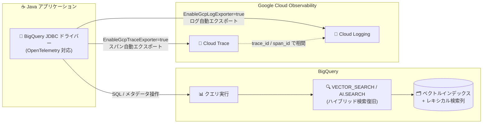

# BigQuery: JDBC ドライバーの OpenTelemetry 対応 (GA) とハイブリッド検索の復旧

**リリース日**: 2026-08-03

**サービス**: BigQuery

**機能**: JDBC ドライバーの OpenTelemetry サポート (GA) / VECTOR_SEARCH・AI.SEARCH のハイブリッド検索の復旧

**ステータス**: GA (JDBC OpenTelemetry サポート) / Announcement (ハイブリッド検索の復旧)

📊 [このアップデートのインフォグラフィックを見る](https://takech9203.github.io/google-cloud-news-summary/20260803-bigquery-jdbc-otel-hybrid-search.html)

## 概要

2026 年 8 月 3 日、BigQuery に関して 2 つの関連アップデートが発表されました。

1 つ目は、**BigQuery 用 JDBC ドライバーの OpenTelemetry (OTel) サポートが一般提供 (GA) になった**ことです。トレーシングとロギングの両方に対応し、JDBC 経由のデータベース操作 (クエリ実行、メタデータ取得、結果ページネーションなど) のパフォーマンス監視とトラブルシューティングが可能になります。さらに、接続プロパティを設定するだけで Google Cloud Observability (Cloud Trace / Cloud Logging) へテレメトリーを自動エクスポートするゼロコンフィグレーション機能も提供されます。Java アプリケーションから JDBC で BigQuery に接続している開発者・運用者にとって、可観測性を大幅に向上させるアップデートです。

2 つ目は、**ハイブリッド検索機能のサポート復旧**のアナウンスです。`VECTOR_SEARCH` 関数でセマンティック検索 (ベクトル検索) とレキシカル検索 (キーワード検索) を組み合わせるハイブリッド検索、および `AI.SEARCH` 関数での `HYBRID` モードの利用が再び可能になりました。一時的に利用できない状態となっていたこれらの機能が復旧したことで、検索精度を重視する RAG (Retrieval-Augmented Generation) や検索アプリケーションの構築を再開できます。

**アップデート前の課題**

- JDBC ドライバー経由の BigQuery アクセスでは、分散トレーシングの標準的な仕組みがなく、アプリケーション側のトレースと BigQuery クエリの実行状況を関連付けることが困難だった
- JDBC ドライバーのログはローカルファイル出力 (`LogLevel` / `LogPath`) が中心で、Cloud Logging に集約するには独自の仕組みが必要だった
- ハイブリッド検索 (`VECTOR_SEARCH` のレキシカル検索オプション、`AI.SEARCH` の `HYBRID` モード) のサポートが一時停止されており、セマンティック検索とキーワード検索を組み合わせたクエリを実行できなかった

**アップデート後の改善**

- JDBC ドライバーが OpenTelemetry のスパンを生成し、クエリ実行・メタデータ操作・ページネーションまでエンドツーエンドでトレース可能になった (GA)
- 接続プロパティ (`EnableGcpTraceExporter=true` / `EnableGcpLogExporter=true`) を追加するだけで、Cloud Trace と Cloud Logging への自動エクスポートが有効化できるようになった
- アプリケーション側の OpenTelemetry インスタンス (カスタム / グローバル) との統合にも対応し、既存の可観測性基盤にシームレスに組み込めるようになった
- `VECTOR_SEARCH` によるハイブリッド検索と `AI.SEARCH` の `HYBRID` モードが復旧し、セマンティック + レキシカルの組み合わせ検索が再び利用可能になった

## アーキテクチャ図



Java アプリケーションから JDBC ドライバー経由で BigQuery (ハイブリッド検索を含む) にクエリを実行し、その実行状況が OpenTelemetry のトレース・ログとして Cloud Trace / Cloud Logging に自動エクスポートされる構成です。ログとトレースは trace_id / span_id で自動的に相関付けられます。

## サービスアップデートの詳細

### 主要機能

1. **JDBC ドライバーの OpenTelemetry トレーシング (GA)**
   - 以下の操作でスパンが生成される
     - クエリ実行: `BigQueryStatement` (`execute()`, `executeQuery()`, `executeLargeUpdate()`, `executeBatch()`) および `BigQueryPreparedStatement`
     - メタデータ操作: `DatabaseMetaData` の `getCatalogs()`, `getSchemas()`, `getTables()`, `getColumns()`
     - ページネーション: REST API パス使用時の追加ページの非同期フェッチが `BigQueryStatement.pagination` スパンとしてトレースされ、Span Links で元のクエリ実行スパンと関連付けられる
   - コンテキスト伝播: アクティブなコンテキストが下位の `google-cloud-bigquery` SDK に伝播され、SDK が生成するスパン (HTTP RPC 呼び出しなど) が JDBC スパンの子として表示され、エンドツーエンドのトレース階層が得られる

2. **3 つの構成モード**
   - **アプリケーション管理**: `BigQueryDataSource` の `setCustomOpenTelemetry()` で自前の OpenTelemetry インスタンスを注入し、アプリケーションのテレメトリーと相関させる
   - **グローバルインスタンス**: OpenTelemetry Java Agent や `GlobalOpenTelemetry.set()` で初期化済みの場合、接続プロパティ `UseGlobalOpenTelemetry=TRUE` で利用
   - **ゼロコンフィグレーション**: `EnableGcpTraceExporter=true` / `EnableGcpLogExporter=true` を接続 URL に追加するだけで Cloud Trace / Cloud Logging へ自動エクスポート

3. **ログとトレースの自動相関**
   - `db.connection_id` がすべての JDBC スパンにスパン属性として付与される
   - `jdbc.connection_id` が baggage キーとして使用され、Cloud Logging のログエントリにラベルとして付与される
   - クエリ実行スコープ内のログには `trace_id` と `span_id` が自動的に含まれる

4. **ハイブリッド検索の復旧 (VECTOR_SEARCH / AI.SEARCH)**
   - `VECTOR_SEARCH` 関数の単一クエリ構文で `lexical_search_columns` と `lexical_search_query_value` を指定し、セマンティック検索とレキシカル (キーワード) 検索を組み合わせられる (Preview)
   - レキシカル検索は基表の 1 つ以上の STRING 列に対して実行でき、埋め込み生成元の列と一致する必要はない (クロスカラム検索が可能)
   - `AI.SEARCH` 関数の `mode` パラメータで `HYBRID` を指定するとハイブリッド検索、`VECTOR` でセマンティックのみ、デフォルトの `AUTO` ではハイブリッドインデックスが存在する場合に自動的にハイブリッド検索が実行される
   - ベクトルインデックスにキーワード情報を含めるよう拡張することで、レキシカル検索部分を高速化できる

## 技術仕様

### OpenTelemetry 関連の接続プロパティ

| 接続プロパティ | 説明 | デフォルト値 |
|------|------|------|
| `EnableGcpTraceExporter` | Cloud Trace へのトレース自動エクスポートの有効化 | FALSE |
| `EnableGcpLogExporter` | Cloud Logging へのログ自動エクスポートの有効化 | FALSE |
| `UseGlobalOpenTelemetry` | グローバル OpenTelemetry インスタンスの利用 | FALSE |
| `GcpTelemetryProjectId` | テレメトリーの送信先プロジェクト | N/A |
| `GcpTelemetryCredentials` | テレメトリー送信用のサービスアカウント認証情報 | N/A |

### 動作上の重要な仕様

| 項目 | 詳細 |
|------|------|
| `LogLevel` との関係 | `LogLevel=0` (OFF) の場合、`EnableGcpLogExporter=true` でもログは一切エクスポートされない。OTel ロギングには `LogLevel` を 1 以上に設定する必要がある |
| 認証 | Application Default Credentials (ADC) と `GcpTelemetryCredentials` による明示的なサービスアカウント認証の両方をサポート |
| 必要な API | Cloud Trace API (`cloudtrace.googleapis.com`)、Cloud Logging API (`logging.googleapis.com`) |
| 必要な IAM ロール | トレース: `roles/cloudtrace.agent`、ログ: `roles/logging.logWriter` |
| メトリクス | OpenTelemetry メトリクスは非対応 (トレースとログのみ) |
| 依存関係 | OpenTelemetry SDK とエクスポーターはシェーディング済み (クラスパス競合を防止)。OpenTelemetry API は非シェードでアプリケーション側 SDK と相互運用可能 |

### AI.SEARCH の mode パラメータ

| モード | 動作 |
|------|------|
| `AUTO` (デフォルト) | ハイブリッドインデックスが存在する場合はハイブリッド検索、存在しない場合はセマンティック検索のみ |
| `HYBRID` | セマンティック検索 + レキシカル検索のハイブリッド検索を実行 |
| `VECTOR` | セマンティック検索のみを実行 |

## 設定方法

### 前提条件

1. (JDBC OTel) BigQuery 用 JDBC ドライバーの最新バージョンを使用していること
2. (JDBC OTel、GCP 自動エクスポート利用時) 送信先プロジェクトで Cloud Trace API と Cloud Logging API が有効で、プリンシパルに `roles/cloudtrace.agent` と `roles/logging.logWriter` が付与されていること
3. (AI.SEARCH ハイブリッド検索) 基表で自律的埋め込み生成 (autonomous embedding generation) が有効であること

### 手順

#### ステップ 1: JDBC 接続 URL でゼロコンフィグレーションのテレメトリーを有効化

```text
jdbc:bigquery://https://www.googleapis.com/bigquery/v2:443;ProjectId=your-project-id;EnableGcpTraceExporter=true;EnableGcpLogExporter=true;LogLevel=5;
```

ログのエクスポートには `LogLevel` を 1 以上 (詳細ログは 5 など) に設定します。

#### ステップ 2: (代替) アプリケーションの OpenTelemetry インスタンスを注入

```java
BigQueryDataSource dataSource = new BigQueryDataSource();
// ... 他のプロパティを設定 ...
dataSource.setCustomOpenTelemetry(yourOpenTelemetryInstance);
```

アプリケーションが既に OpenTelemetry を使用している場合は、この方法でドライバーのテレメトリーをアプリケーションのテレメトリーと相関させます。グローバルインスタンスを使う場合は接続プロパティに `UseGlobalOpenTelemetry=TRUE` を設定します。

#### ステップ 3: ハイブリッド検索の実行 (AI.SEARCH の HYBRID モード)

```sql
SELECT base.name, base.description, distance
FROM AI.SEARCH(
  TABLE mydataset.products,
  'description',
  "A really fun toy",
  mode => 'HYBRID');
```

自律的埋め込み生成が有効なテーブルに対して、セマンティック検索とキーワード検索を組み合わせた検索を 1 つの関数呼び出しで実行できます。

#### ステップ 4: ハイブリッド検索の実行 (VECTOR_SEARCH の単一クエリ構文)

```sql
SELECT *
FROM VECTOR_SEARCH(
  TABLE mydataset.base_table,
  'embedding_column',
  query_value => single_query_value,
  lexical_search_columns => ['description'],
  lexical_search_query_value => 'keyword',
  top_k => 10);
```

`lexical_search_columns` に指定する列は埋め込み生成元の列と一致する必要がなく、クロスカラムのキーワード検索が可能です。

## メリット

### ビジネス面

- **障害対応時間の短縮**: JDBC 経由の BigQuery アクセスの遅延やエラーをトレースで即座に特定でき、MTTR (平均復旧時間) を削減できる
- **検索品質の向上**: ハイブリッド検索の復旧により、セマンティック検索だけでは取りこぼす固有名詞や型番などの完全一致検索を組み合わせられ、検索・RAG アプリケーションの精度が向上する
- **GA による本番利用の安心感**: JDBC の OpenTelemetry サポートが GA となり、SLA の対象として本番環境で安心して利用できる

### 技術面

- **エンドツーエンドのトレース**: JDBC スパンから下位 SDK の HTTP RPC スパンまで親子関係で可視化され、ボトルネックの所在 (アプリ / ドライバー / API) を切り分けられる
- **ゼロコンフィグレーションの導入容易性**: 接続 URL のプロパティ追加のみで Cloud Trace / Cloud Logging への出力が有効化でき、コード変更が不要
- **ベンダーニュートラルな標準準拠**: OpenTelemetry 標準に準拠しているため、Google Cloud Observability 以外のバックエンドにもエクスポート可能
- **ログ・トレースの自動相関**: `trace_id` / `span_id` / `connection_id` による自動相関で、特定クエリに紐づくログを Cloud Logging で即座に絞り込める

## デメリット・制約事項

### 制限事項

- JDBC ドライバーの OpenTelemetry 統合は**メトリクスをサポートしない** (トレースとログのみ)
- `LogLevel=0` (デフォルト) ではログレコードが生成されず、`EnableGcpLogExporter=true` でもログはエクスポートされない
- ハイブリッド検索 (`VECTOR_SEARCH` のレキシカル検索、`AI.SEARCH` の `HYBRID` モード) は **Preview** の位置づけであり、Pre-GA 提供条件が適用される
- `VECTOR_SEARCH` / `AI.SEARCH` を含むクエリは BigQuery BI Engine による高速化の対象外
- ベクトルインデックスの利用は BigQuery Standard エディションではサポートされない

### 考慮すべき点

- テレメトリーの自動エクスポートを有効にすると、Cloud Trace / Cloud Logging の取り込みデータ量に応じた課金が発生し得る
- ログにはリソース名やエラーメッセージなどの機密情報が含まれる可能性があるため、エクスポート前にフィルタリング方針を検討する
- 詳細ログ (`LogLevel` 5 以上) はパフォーマンスとログ量に影響するため、常時有効化する場合はレベル設定を慎重に選ぶ
- `AI.SEARCH` の `AUTO` モードはインデックス構成に依存して動作が変わるため、ハイブリッド検索を確実に実行したい場合は明示的に `HYBRID` を指定する

## ユースケース

### ユースケース 1: BI ツール・バッチアプリケーションの遅延分析

**シナリオ**: Java 製の ETL バッチや社内 BI ツールが JDBC 経由で BigQuery にアクセスしており、「クエリが遅い」という報告があるが、アプリケーション側・ドライバー・BigQuery のどこに時間がかかっているか切り分けられない。

**実装例**:
```text
jdbc:bigquery://https://www.googleapis.com/bigquery/v2:443;ProjectId=my-project;EnableGcpTraceExporter=true;EnableGcpLogExporter=true;LogLevel=5;
```

**効果**: Cloud Trace 上で JDBC スパン (クエリ実行、ページネーション) と SDK の HTTP RPC スパンが階層表示され、遅延の発生箇所を即座に特定できる。関連ログも trace_id で自動相関される。

### ユースケース 2: RAG アプリケーションでのハイブリッド検索

**シナリオ**: BigQuery 上の製品ドキュメントに対して RAG を構築しているが、セマンティック検索のみでは製品型番や固有名詞の完全一致検索に弱く、検索精度に課題がある。

**実装例**:
```sql
SELECT base.doc_id, base.content, distance
FROM AI.SEARCH(
  TABLE mydataset.documents,
  'content',
  "モデル XZ-100 のバッテリー交換手順",
  mode => 'HYBRID',
  top_k => 5);
```

**効果**: セマンティックな類似性と「XZ-100」のようなキーワードの一致を組み合わせて検索でき、LLM に渡すコンテキストの適合率が向上する。

## 料金

- **JDBC ドライバー**: 無償でダウンロード可能。ドライバー使用時は標準の BigQuery 料金が適用される
- **テレメトリーエクスポート**: `EnableGcpTraceExporter` / `EnableGcpLogExporter` 使用時は Cloud Trace / Cloud Logging の取り込みデータ量に応じた課金が発生し得る ([Google Cloud Observability の料金](https://cloud.google.com/stackdriver/pricing) を参照)
- **VECTOR_SEARCH / AI.SEARCH**: BigQuery のコンピューティング料金 (オンデマンドの場合はスキャンバイト数、Editions の場合はスロット使用量) が適用される
- **ベクトルインデックス**: 組織あたりの上限内であればインデックスの構築・更新処理は無償。インデックスの保存にはアクティブストレージ料金が発生する

詳細は [BigQuery の料金ページ](https://cloud.google.com/bigquery/pricing) を参照してください。

## 利用可能リージョン

- **JDBC ドライバーの OpenTelemetry サポート**: ドライバー機能のため特定リージョンに依存しない
- **AI.SEARCH**: 埋め込みモデルをサポートするロケーション、および US / EU マルチリージョンで利用可能

## 関連サービス・機能

- **Cloud Trace**: JDBC ドライバーのスパンの自動エクスポート先。`roles/cloudtrace.agent` が必要
- **Cloud Logging**: JDBC ドライバーのログの自動エクスポート先。`roles/logging.logWriter` が必要
- **google-cloud-bigquery SDK (Java)**: JDBC ドライバーからコンテキストが伝播され、SDK 生成のスパンが JDBC スパンの子として表示される
- **BigQuery ベクトルインデックス**: `CREATE VECTOR INDEX` で作成。レキシカル検索列を含めるよう拡張するとハイブリッド検索のキーワード検索部分が高速化される
- **自律的埋め込み生成 (Autonomous Embedding Generation)**: `AI.SEARCH` の前提となる機能。`AI.EMBED` による生成列でテーブルの埋め込みを自動管理する
- **AI.SIMILARITY 関数**: 少数の比較や埋め込み未計算の場合の代替。大量の埋め込みに対する検索には VECTOR_SEARCH / AI.SEARCH が適する

## 参考リンク

- 📊 [インフォグラフィック](https://takech9203.github.io/google-cloud-news-summary/20260803-bigquery-jdbc-otel-hybrid-search.html)
- [公式リリースノート](https://docs.cloud.google.com/release-notes#August_03_2026)
- [JDBC driver for BigQuery (OpenTelemetry セクション)](https://docs.cloud.google.com/bigquery/docs/jdbc-for-bigquery)
- [Introduction to embeddings and vector search](https://docs.cloud.google.com/bigquery/docs/vector-search-intro)
- [VECTOR_SEARCH 関数リファレンス](https://docs.cloud.google.com/bigquery/docs/reference/standard-sql/search_functions#vector_search)
- [AI.SEARCH 関数リファレンス](https://docs.cloud.google.com/bigquery/docs/reference/standard-sql/bigqueryml-syntax-ai-search)
- [BigQuery 料金ページ](https://cloud.google.com/bigquery/pricing)
- [Google Cloud Observability 料金ページ](https://cloud.google.com/stackdriver/pricing)

## まとめ

JDBC ドライバーの OpenTelemetry サポートが GA となり、Java アプリケーションから BigQuery への接続の可観測性を接続プロパティの追加だけで本番レベルに引き上げられるようになりました。あわせてハイブリッド検索 (`VECTOR_SEARCH` / `AI.SEARCH` の `HYBRID` モード) が復旧したため、検索精度を重視する RAG・検索ワークロードの構築を再開できます。JDBC 利用中のチームはまず `EnableGcpTraceExporter` / `EnableGcpLogExporter` を有効化してトレース収集を試し、検索ワークロードでは `HYBRID` モードでの精度検証を推奨します。

---

**タグ**: BigQuery, JDBC, OpenTelemetry, Cloud Trace, Cloud Logging, Observability, VECTOR_SEARCH, AI.SEARCH, ハイブリッド検索, ベクトル検索, GA
