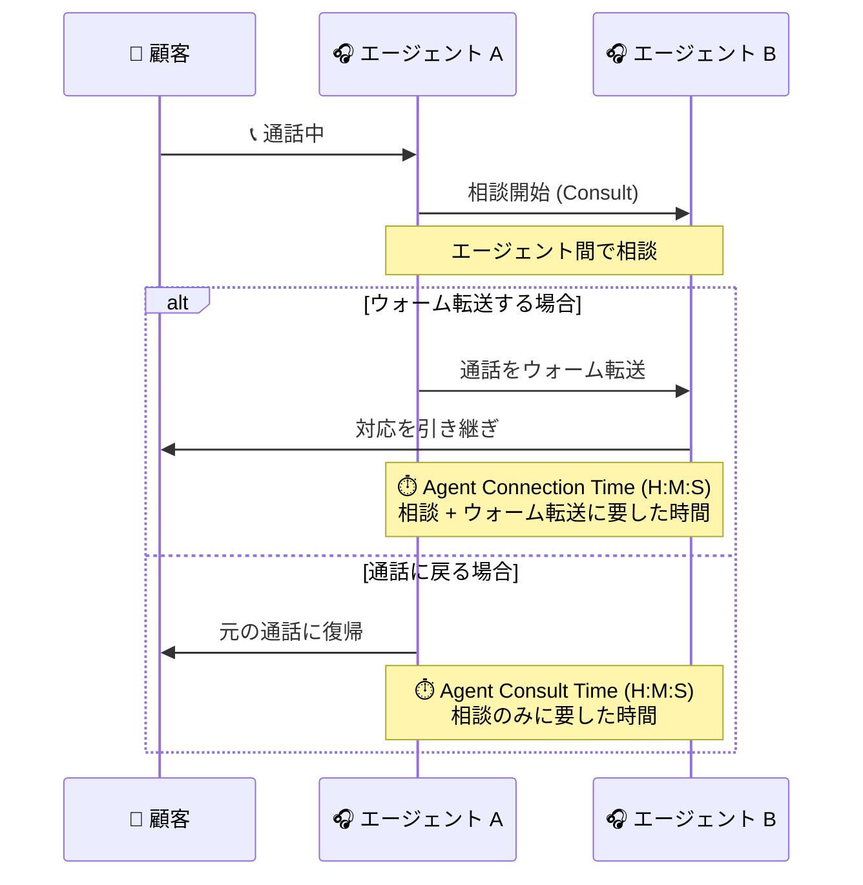

# Google Cloud Contact Center as a Service (CCaaS): 高度なレポーティングダッシュボードのプレリリースノート (新機能・多数の修正)

**リリース日**: 2026-08-03

**サービス**: Google Cloud Contact Center as a Service (CCaaS / CCAI Platform)

**機能**: 高度なレポーティングダッシュボード (Advanced Reporting Dashboards) のアップデート

**ステータス**: プレリリースノート (Announcement / Feature / Fixed)

📊 [このアップデートのインフォグラフィックを見る](https://takech9203.github.io/google-cloud-news-summary/20260803-ccaas-advanced-reporting-dashboards-prerelease.html)

## 概要

Google Cloud Contact Center as a Service (CCaaS / CCAI Platform) の高度なレポーティングダッシュボード (Advanced Reporting Dashboards) に関するプレリリースノートが公開されました。これは今後リリース予定のアップデート内容を事前に告知するもので、リリース時には記載どおりの新機能が提供される見込みです。

今回のプレリリースノートには、3 つの新機能と多数のダッシュボード修正が含まれています。新機能は、(1) Team フィルタでトップレベルチームを選択した際のサブチーム自動包含、(2) Agent Performance ダッシュボードへの平均チャット同時対応数 (average chat concurrency) メトリクスの追加、(3) ウォーム転送とエージェント相談 (コンサルテーション) に関する新メトリクス (Agent Connection Time / Agent Consult Time) の追加です。

また、キュー放棄率の集計不具合、仮想エージェントのコールメトリクス誤り、7 日超のエクスポート失敗、エージェント稼働状況の表示不整合など、レポート精度に直結する多数の不具合修正が予告されています。コンタクトセンターの運用管理者やワークフォースマネジメント (WFM) 担当者にとって、レポート指標の信頼性が大きく向上するアップデートです。

**アップデート前の課題**

- Team フィルタでトップレベルチームを選択しても、サブチームのデータが集計に含まれず、組織階層に沿った分析には個別のフィルタ操作が必要だった
- エージェントの同時チャット対応数 (コンカレンシー) の傾向を Agent Performance ダッシュボードで直接確認できなかった
- ウォーム転送やエージェント間相談に費やされた時間を測定する専用メトリクスがなく、転送品質の定量評価が難しかった
- This Week / This Month の時間あたり集計値、チャットの Queue Abandons / Abandon %、仮想エージェントのコールメトリクスなど、複数のダッシュボード指標が不正確な値を表示していた
- 7 日を超える期間を指定するとデータのエクスポートが失敗していた

**アップデート後の改善**

- Team フィルタでトップレベルチームを選択すると、そのサブチームのデータも自動的に含まれるようになる
- Agent Performance ダッシュボードで平均チャット同時対応数メトリクスが利用可能になり、エージェント・チーム・キュー単位のコンカレンシー傾向を把握できる
- Transfers - Calls / Transfers - Chats ダッシュボードに Agent Connection Time (H:M:S) と Agent Consult Time (H:M:S) が追加され、ウォーム転送・相談時間を定量的に評価できる
- キュー放棄・転送・エージェント稼働などに関する多数の集計不具合が修正され、レポートの信頼性が向上する
- 時間関連のエクスポートに HH:MM:SS 形式の新しい列が追加され、7 日超の期間でもエクスポートが可能になる

## アーキテクチャ図

新メトリクスが測定する 2 つのフローを示しています。相談後にウォーム転送した場合は Agent Connection Time、相談後に元の通話へ戻った場合は Agent Consult Time として記録されます。

## サービスアップデートの詳細

### 主要機能

1. **Team フィルタでのサブチーム自動包含**
   - ダッシュボードの Team フィルタでチームを選択すると、そのチームのサブチームのデータも集計に含まれるようになる
   - 組織階層に沿ったチーム単位の分析が、個別のサブチーム選択なしで可能になる

2. **Agent Performance ダッシュボードの平均チャット同時対応数メトリクス**
   - 平均チャット同時対応数 (average chat concurrency) メトリクスが追加される
   - エージェント、チーム、キューの各単位でコンカレンシー傾向を把握でき、チャットの人員計画や負荷配分の最適化に活用できる

3. **ウォーム転送・エージェント相談の新メトリクス**
   - Transfers - Calls / Transfers - Chats ダッシュボードの Call Transfers / Chat Transfers テーブルに以下が追加される
   - **Agent Connection Time (H:M:S)**: 別のエージェントと相談したうえでウォーム転送するまでに費やした時間
   - **Agent Consult Time (H:M:S)**: 別のエージェントと相談したのち、元の通話に戻るまでに費やした時間

### 修正される不具合 (Fixed)

今回のリリースでは、以下の多数のダッシュボード不具合の修正が予告されています。

| 分類 | 修正内容 |
|------|---------|
| 集計精度 | This Week / This Month の時間あたり集計値が不正確な問題 |
| 集計精度 | チャットの Queue Abandons と Abandon % が常に 0 と表示される問題 |
| 集計精度 | 仮想エージェントのコールメトリクスが不正確な問題 |
| 集計精度 | 接続していない通話のエージェントが Assigned Agent に表示される問題 |
| 集計精度 | Ave Current Queue Time が不正確な問題 |
| 集計精度 | Available Agents が実際の対応可能数より過大に表示される問題 |
| 集計精度 | Explore における Max Queue Wait Time / Max Speed To Answer / Max Queue Abandon Time が不正確な問題 |
| 表示 | 転送された通話が誤って Queued と表示される問題 |
| 表示 | 無効化したキューグループが表示されたままになる問題 |
| 表示 | Queue Time フィルタでデータが表示されない問題 |
| 表示 | SLA Target フィールドが空になる問題 |
| 表示 | Child Queues フィルタのチェックボックス挙動の問題 |
| 表示 | エージェントの対応可否設定 (availability preference) の変更が Agent Activity ダッシュボードに反映されない問題 |
| 表示 | Agent Metrics (Historical) Explore のラベルがチャネル非依存 (channel-agnostic) の表記に統一 |
| エクスポート | 7 日を超える期間を指定するとエクスポートが失敗する問題 |
| エクスポート | 時間関連のエクスポートに HH:MM:SS 形式の新しい列を追加 |

## 技術仕様

### 高度なレポーティングダッシュボードの前提

| 項目 | 詳細 |
|------|------|
| 提供形態 | CCAI Platform の Advanced Reporting 拡張機能 (Looker ベースのダッシュボード) |
| 有効化 | Google Cloud コンソールの CCAI Platform インスタンス設定で Advanced reporting 拡張を有効化 |
| 有効化の影響 | 有効化するとレガシーダッシュボードは利用不可になる。カスタムロールの権限設定に影響する場合がある |
| 日付範囲 | ダッシュボードで指定可能な最大日付範囲は 45 日 |
| 閲覧権限 | Admin (閲覧・編集可)、Manager Admin (全閲覧)、Manager / Manager Team / Manager Data (担当キューのみ閲覧)、Agent (閲覧不可) |

### プレリリースノートの位置づけ

- 本アップデートは「プレリリースノート」として公開されたものであり、実際のリリース時に新機能が記載内容のとおり提供される見込みであることを示す
- 正式リリースまでに内容が変更される可能性がある点に留意が必要

## メリット

### ビジネス面

- **レポート指標の信頼性向上**: キュー放棄率や仮想エージェントメトリクスなど KPI 集計の不具合が解消され、データに基づく意思決定の精度が高まる
- **転送品質の可視化**: ウォーム転送・相談時間の新メトリクスにより、エスカレーションプロセスの効率やエージェント間連携のコストを定量評価できる
- **人員計画の高度化**: チャットコンカレンシー傾向をチーム・キュー単位で把握でき、WFM (ワークフォースマネジメント) の精度が向上する

### 技術面

- **階層的なチーム分析**: Team フィルタのサブチーム自動包含により、組織階層に沿った集計がフィルタ操作なしで実現できる
- **エクスポートの制約解消**: 7 日超の期間エクスポートが可能になり、HH:MM:SS 列の追加で外部ツールでの時間データ処理が容易になる

## デメリット・制約事項

### 制限事項

- 高度なレポーティングダッシュボードは、us-east1、us-central1、us-west1、europe-west2、asia-northeast1、northamerica-northeast1、australia-southeast1 のリージョンのインスタンスでのみ利用可能
- ダッシュボードで指定できる日付範囲は最大 45 日
- Advanced reporting 拡張を有効化すると、レガシーの CCAI Platform ダッシュボードは利用できなくなる

### 考慮すべき点

- 本内容はプレリリースノートであり、正式リリース時に内容が変わる可能性がある
- 集計ロジックの修正により、リリース前後で KPI の値が変動する可能性がある。既存レポートとの比較時には修正内容を考慮する必要がある
- Advanced reporting のオン・オフはカスタムロールの権限設定に影響する場合があるため、切り替え後にロールの確認が推奨される

## ユースケース

### ユースケース 1: エスカレーションプロセスの効率評価

**シナリオ**: サポート部門で一次対応エージェントから専門チームへのウォーム転送が多発しており、転送にかかる時間コストを可視化したい。

**効果**: Agent Connection Time / Agent Consult Time により、相談から転送完了までの時間、相談のみで解決した場合の時間を分離して測定できる。転送先チームごとの相談時間を比較し、ナレッジ整備やルーティング改善の優先度を判断できる。

### ユースケース 2: チャット人員配置の最適化

**シナリオ**: チャットチャネルの応答遅延が発生しており、エージェントの同時対応数が適切かを判断したい。

**効果**: Agent Performance ダッシュボードの平均チャット同時対応数メトリクスで、エージェント・チーム・キュー単位のコンカレンシー傾向を時系列で把握できる。ピーク時間帯の同時対応数の実績に基づき、シフト計画や最大同時対応数の設定を調整できる。

### ユースケース 3: 組織階層に沿った KPI レポート

**シナリオ**: 複数のサブチームを束ねる部門マネージャーが、部門全体の KPI を一括で確認したい。

**効果**: Team フィルタでトップレベルチームを選択するだけでサブチームのデータが自動的に含まれるため、サブチームを個別に選択する手間なく部門全体の集計が得られる。

## 料金

高度なレポーティングダッシュボードは CCAI Platform の拡張機能として提供されます。CCaaS の料金の詳細は公式料金ページを参照してください。

- [CCaaS 料金ページ](https://cloud.google.com/solutions/contact-center-ai-platform/pricing)

## 利用可能リージョン

高度なレポーティングダッシュボードは以下のリージョンでのみ利用可能です。

- us-east1、us-central1、us-west1
- europe-west2
- asia-northeast1
- northamerica-northeast1
- australia-southeast1

対象リージョン以外のインスタンスでは Advanced reporting 拡張を有効化できません。

## 関連サービス・機能

- **Looker**: 高度なレポーティングダッシュボードは Looker ベースで提供され、Explore を使ったカスタムメトリクスタイルの作成やカスタムダッシュボードの構築が可能
- **Conversational Agents (Dialogflow)**: CCAI Platform の仮想エージェント機能を担い、仮想エージェントダッシュボードで対応実績を評価できる (今回のリリースで仮想エージェントのコールメトリクス不具合が修正予定)
- **CRM 連携 (Salesforce など)**: チャットトランスクリプト保存を構成すると、ダッシュボードから CRM 上のトランスクリプトへリンクできる

## 参考リンク

- 📊 [インフォグラフィック](https://takech9203.github.io/google-cloud-news-summary/20260803-ccaas-advanced-reporting-dashboards-prerelease.html)
- [公式リリースノート](https://docs.cloud.google.com/release-notes#August_03_2026)
- [CCAI Platform リリースノート](https://docs.cloud.google.com/contact-center/ccai-platform/docs/release-notes)
- [高度なレポーティングダッシュボードの概要](https://docs.cloud.google.com/contact-center/ccai-platform/docs/dashboards-overview)
- [Agent Performance ダッシュボード](https://docs.cloud.google.com/contact-center/ccai-platform/docs/dashboards-agent-performance)
- [Transfers ダッシュボード](https://docs.cloud.google.com/contact-center/ccai-platform/docs/dashboards-transfers)

## まとめ

今回のプレリリースノートは、CCaaS の高度なレポーティングダッシュボードにおけるコンカレンシー・転送関連の新メトリクス追加と、KPI 集計精度に関わる広範な不具合修正を予告するものです。コンタクトセンターの運用管理者は、リリース後に既存レポートの値が変動する可能性を踏まえ、修正対象の指標 (キュー放棄率、仮想エージェントメトリクスなど) を利用しているレポートを事前に棚卸ししておくことを推奨します。

---

**タグ**: CCaaS, CCAI Platform, Contact Center, Advanced Reporting, Looker, ダッシュボード, プレリリース
