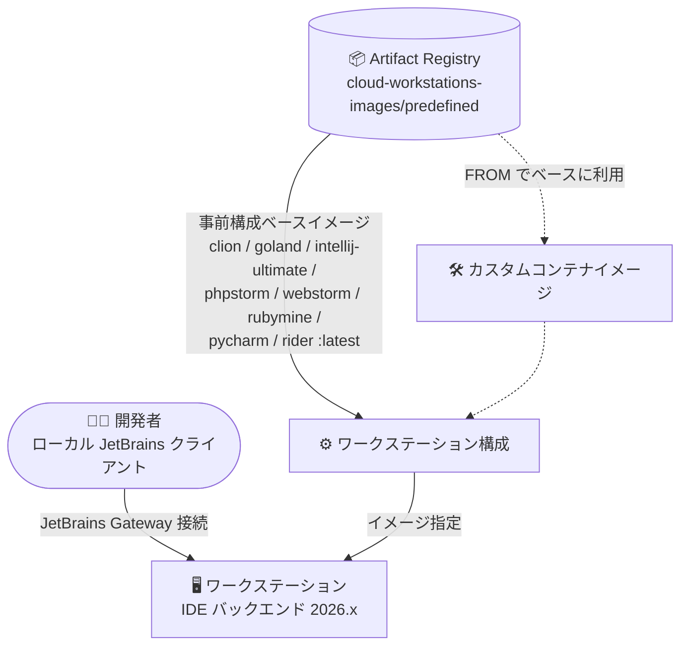

# Cloud Workstations: JetBrains 事前構成ベースイメージが 2026.x にアップデート

**リリース日**: 2026-08-03

**サービス**: Cloud Workstations

**機能**: JetBrains 事前構成ベースイメージの 2026.x バージョンへの更新

**ステータス**: Change (変更)

📊 [このアップデートのインフォグラフィックを見る](https://takech9203.github.io/google-cloud-news-summary/20260803-cloud-workstations-jetbrains-2026-images.html)

## 概要

Cloud Workstations が提供する JetBrains IDE の事前構成ベースイメージ (preconfigured base images) が、JetBrains の 2026.x リリースに更新されました。今回の更新対象は CLion、GoLand、IntelliJ IDEA Ultimate、PhpStorm、WebStorm、RubyMine、PyCharm、Rider の 8 種類の IDE イメージです。

Cloud Workstations の事前構成ベースイメージは、ワークステーション構成 (workstation configuration) で直接指定できるほか、Docker の `FROM` 命令でカスタムコンテナイメージのベースとしても利用できます。JetBrains 系イメージは JetBrains Gateway 経由でのみアクセスする形態で、ローカルの JetBrains クライアントからリモートのワークステーション上の IDE バックエンドに接続して開発を行います。

公式ドキュメントに記載のとおり、JetBrains IDE のイメージは JetBrains の最新安定版がリリースされた後、順次自動的に更新されます。`:latest` タグを利用している場合、ワークステーションの再起動時に新しいイメージが取得され、最新の IDE バージョンで開発できるようになります。

**アップデート前の課題**

- Cloud Workstations の JetBrains 事前構成ベースイメージは、以前のリリースノートでは各 IDE とも 2025.1.x 系のバージョン (例: CLion 2025.1.1、IntelliJ IDEA 2025.1.1、PyCharm 2025.1.1.1 など) を使用していた
- JetBrains の 2026.x 系で提供される最新の IDE 機能・改善を、事前構成イメージのままでは利用できなかった

**アップデート後の改善**

- 8 種類の JetBrains 事前構成ベースイメージが 2026.x 系に更新され、最新安定版の IDE をそのまま利用できるようになった
- `:latest` タグを利用しているワークステーション構成では、追加作業なしで新バージョンの IDE が適用される

今回更新された各 IDE のバージョンは以下のとおりです。

| IDE | 新バージョン |
|-----|-------------|
| CLion | 2026.1 |
| GoLand | 2026.2 |
| IntelliJ IDEA Ultimate | 2026.1 |
| PhpStorm | 2026.2 |
| WebStorm | 2026.1 |
| RubyMine | 2026.1 |
| PyCharm | 2026.1 |
| Rider | 2026.1 |

## アーキテクチャ図



事前構成ベースイメージは Artifact Registry (`us-central1-docker.pkg.dev/cloud-workstations-images/predefined/`) から提供され、ワークステーション構成で直接指定するか、カスタムイメージのベースとして利用します。JetBrains 系イメージには JetBrains Gateway 経由で接続します。

## サービスアップデートの詳細

### 主要機能

1. **8 種類の JetBrains IDE イメージが 2026.x に更新**
   - CLion 2026.1、GoLand 2026.2、IntelliJ IDEA Ultimate 2026.1、PhpStorm 2026.2、WebStorm 2026.1、RubyMine 2026.1、PyCharm 2026.1、Rider 2026.1
   - GoLand と PhpStorm は 2026.2、その他は 2026.1 が採用されている

2. **最新安定版への自動追従**
   - 公式ドキュメントによると、JetBrains IDE のイメージは JetBrains の最新安定版リリース後、まもなく自動的に更新される
   - `:latest` タグを使用する構成では、ワークステーション起動時に更新後のイメージが利用される

3. **カスタムイメージのベースとしても利用可能**
   - 事前構成ベースイメージは Docker の `FROM` 命令によるカスタムコンテナイメージ作成のベースとして利用可能
   - カスタムイメージを利用している場合は、リビルドにより 2026.x を取り込める

## 技術仕様

### 対象イメージ (Artifact Registry パス)

| IDE | イメージパス |
|-----|-------------|
| CLion | `us-central1-docker.pkg.dev/cloud-workstations-images/predefined/clion:latest` |
| GoLand | `us-central1-docker.pkg.dev/cloud-workstations-images/predefined/goland:latest` |
| IntelliJ IDEA Ultimate | `us-central1-docker.pkg.dev/cloud-workstations-images/predefined/intellij-ultimate:latest` |
| PhpStorm | `us-central1-docker.pkg.dev/cloud-workstations-images/predefined/phpstorm:latest` |
| WebStorm | `us-central1-docker.pkg.dev/cloud-workstations-images/predefined/webstorm:latest` |
| RubyMine | `us-central1-docker.pkg.dev/cloud-workstations-images/predefined/rubymine:latest` |
| PyCharm | `us-central1-docker.pkg.dev/cloud-workstations-images/predefined/pycharm:latest` |
| Rider | `us-central1-docker.pkg.dev/cloud-workstations-images/predefined/rider:latest` |

### 接続方式

- JetBrains 系イメージは **JetBrains Gateway 経由でのみアクセス可能**
- インストールおよび利用開始の手順は公式ドキュメント「[Develop code using local JetBrains IDEs](https://docs.cloud.google.com/workstations/docs/develop-code-using-local-jetbrains-ides)」を参照

### インストール済み IDE バージョンの確認

ベースイメージには、インストールされている IDE の名前とバージョン情報を一覧表示するスクリプトが同梱されています。

```bash
# ワークステーション内で実行
/google/scripts/preinstalled-ide-versions.sh
```

## メリット

### ビジネス面

- **開発環境の鮮度維持**: JetBrains の最新安定版 (2026.x) を、イメージのメンテナンス作業なしにチーム全体へ展開できる
- **運用負荷の軽減**: Google Cloud がイメージのビルド・更新を管理するため、IDE アップグレードのための独自イメージ管理が不要

### 技術面

- **最新 IDE 機能の利用**: 2026.x 系の各 JetBrains IDE の機能・改善をリモート開発環境で利用できる
- **カスタムイメージへの波及**: 事前構成イメージをベースにしたカスタムイメージも、リビルドするだけで 2026.x に追従できる

## デメリット・制約事項

### 考慮すべき点

- JetBrains 系イメージは JetBrains Gateway 経由でのみアクセス可能であり、ブラウザから直接 IDE を利用する形態ではない
- `:latest` タグを利用している場合、IDE バージョンは自動的に更新されるため、バージョン固定が必要なチームはカスタムイメージ運用などでの制御を検討する必要がある
- カスタムコンテナイメージを利用している場合は、ベースイメージの更新を取り込むためにリビルドが必要 (Cloud Build と Cloud Scheduler によるリビルド自動化のチュートリアルが公式に用意されている)

## ユースケース

### ユースケース 1: チーム標準の JetBrains リモート開発環境を最新化

**シナリオ**: 開発チームが Cloud Workstations の事前構成イメージ (例: IntelliJ IDEA Ultimate) を標準環境として利用している。

**実装例**:
```bash
# ワークステーション構成で事前構成イメージを指定 (latest タグ)
gcloud workstations configs update CONFIG_NAME \
  --cluster=CLUSTER_NAME \
  --region=REGION \
  --container-predefined-image=intellij-ultimate
```

**効果**: ワークステーションの再起動により IntelliJ IDEA Ultimate 2026.1 が利用可能になり、チーム全員が同一の最新環境で開発できる。

### ユースケース 2: カスタムイメージの定期リビルドで 2026.x に追従

**シナリオ**: PyCharm ベースイメージに社内ツールを追加したカスタムイメージを運用している。

**効果**: Cloud Build と Cloud Scheduler でリビルドを自動化しておけば、ベースイメージの 2026.x 更新を自動的に取り込み、IDE と社内ツールの両方を最新に保てる。

## 料金

このアップデート自体による料金変更はありません。Cloud Workstations の料金は管理料金、コンピュートリソース (VM、ディスク)、ネットワークなどに基づきます。なお、JetBrains IDE のライセンスはユーザー側で用意する必要があります。詳細は料金ページを参照してください。

- [Cloud Workstations 料金](https://cloud.google.com/workstations/pricing)

## 関連サービス・機能

- **JetBrains Gateway**: JetBrains 系事前構成イメージへの接続に必須のリモート開発クライアント
- **Artifact Registry**: 事前構成ベースイメージの配布元 (`us-central1-docker.pkg.dev/cloud-workstations-images/predefined/`)
- **Cloud Build / Cloud Scheduler**: ベースイメージ更新に合わせたカスタムイメージの自動リビルドに利用
- **Gemini Code Assist / Cloud Code**: 一部の JetBrains 事前構成イメージ (IntelliJ IDEA Ultimate、PyCharm、GoLand、WebStorm) には Cloud Code 拡張機能がプリインストールされている

## 参考リンク

- 📊 [インフォグラフィック](https://takech9203.github.io/google-cloud-news-summary/20260803-cloud-workstations-jetbrains-2026-images.html)
- [公式リリースノート](https://docs.cloud.google.com/release-notes#August_03_2026)
- [事前構成ベースイメージ一覧](https://docs.cloud.google.com/workstations/docs/preconfigured-base-images)
- [事前構成 IDE の概要](https://docs.cloud.google.com/workstations/docs/preconfigured-ides)
- [ローカル JetBrains IDE を使用した開発](https://docs.cloud.google.com/workstations/docs/develop-code-using-local-jetbrains-ides)
- [料金ページ](https://cloud.google.com/workstations/pricing)

## まとめ

Cloud Workstations の JetBrains 事前構成ベースイメージ 8 種類が 2026.x 系に更新され、最新安定版の JetBrains IDE をリモート開発環境でそのまま利用できるようになりました。`:latest` タグを利用中のチームはワークステーション再起動で自動的に適用され、カスタムイメージを運用しているチームはリビルドによる追従を推奨します。

---

**タグ**: Cloud Workstations, JetBrains, IDE, リモート開発, 開発者ツール, コンテナイメージ
