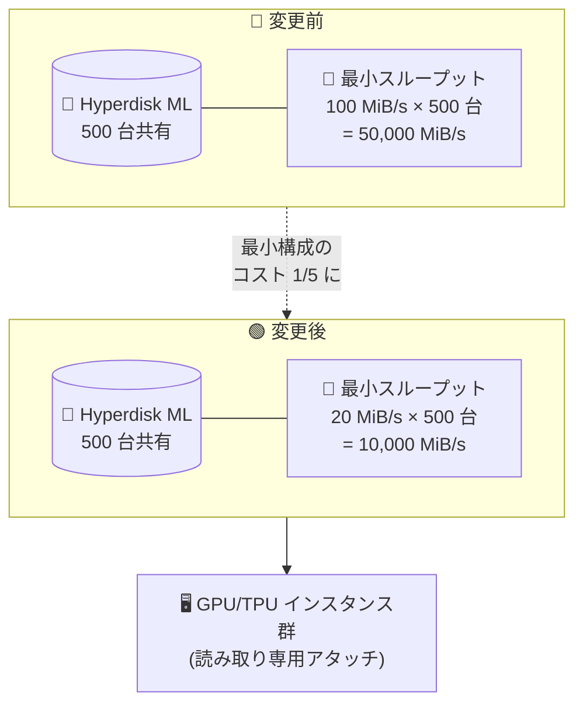

# Compute Engine: Hyperdisk ML 共有ボリュームのインスタンスあたり最小プロビジョニングスループットが 20 MiB/s に引き下げ

**リリース日**: 2026-08-03

**サービス**: Compute Engine

**機能**: Hyperdisk ML 共有ボリュームの最小プロビジョニングスループット引き下げ

**ステータス**: Changed (仕様変更)

📊 [このアップデートのインフォグラフィックを見る](https://takech9203.github.io/google-cloud-news-summary/20260803-compute-engine-hyperdisk-ml-throughput-reduction.html)

## 概要

Compute Engine の Hyperdisk ML において、21 台以上のインスタンスにアタッチする共有ボリュームに必要な、インスタンスあたりの最小プロビジョニングスループットが **100 MiB/s から 20 MiB/s へと 1/5 に引き下げ** られました。

Hyperdisk ML は、機械学習ワークロード向けに最適化された高スループットのブロックストレージで、1 つのボリュームを読み取り専用モードで最大数千台のインスタンスに同時アタッチできる点が特徴です。モデルの重みや学習データを複数の GPU/TPU インスタンスから共有して読み込むユースケースで広く使われています。

今回の変更により、多数のインスタンスでボリュームを共有する構成において、要求される最小スループット (= 課金対象のプロビジョニング量) が大幅に下がり、実際のワークロードに必要な性能に合わせた柔軟なサイジングが可能になりました。スループットに対して従量課金される Hyperdisk ML では、これは直接的なコスト削減につながります。

**アップデート前の課題**

- 21 台以上のインスタンスにボリュームをアタッチする場合、インスタンスあたり 100 MiB/s の最小スループットをプロビジョニングする必要があった
- 例えば 500 台のインスタンスに共有する場合、実際の読み取り負荷が低くても最低 50,000 MiB/s のプロビジョニングが必須だった
- Hyperdisk ML はプロビジョニングしたスループットに対して課金されるため、推論サービングなど各インスタンスの読み取りが少ないワークロードでは過剰なコストが発生していた

**アップデート後の改善**

- インスタンスあたりの最小プロビジョニングスループットが 20 MiB/s に引き下げられた (従来比 1/5)
- 500 台のインスタンスに共有する場合の最小プロビジョニングは 10,000 MiB/s となり、最小構成時のスループット課金を最大 80% 削減できる
- モデル配布や推論サービングなど、大規模ファンアウトかつ低スループットなワークロードで、実需要に即したプロビジョニングが可能になった

## アーキテクチャ図

21 台以上のインスタンスで共有する Hyperdisk ML ボリュームに要求される最小プロビジョニングスループットが、インスタンスあたり 100 MiB/s から 20 MiB/s に引き下げられ、最小構成時のプロビジョニング量 (= 課金対象) を大幅に削減できます。

## サービスアップデートの詳細

### 主要機能

1. **インスタンスあたり最小スループットの引き下げ**
   - 21 台以上のインスタンスにアタッチされた Hyperdisk ML ボリュームに対する最小プロビジョニングスループットが、インスタンスあたり 100 MiB/s から 20 MiB/s に変更
   - 例: 500 台のインスタンスにアタッチする場合、最低 10,000 MiB/s のプロビジョニングが必要 (従来は 50,000 MiB/s)

2. **共有ボリュームの仕組み (変更なしの前提)**
   - Hyperdisk ML は読み取り専用モードで 1 つのボリュームを複数インスタンスに共有可能
   - 同一データのディスクを複数作成するよりコスト効率が高く、ディスク共有自体に追加料金は不要
   - 読み取り専用モードでの複数アタッチはディスク性能に影響せず、各 VM はマシンシリーズの最大ディスク性能まで利用可能

3. **プロビジョニングスループットの共有モデル**
   - ボリュームのプロビジョニングスループットは、アタッチされた全インスタンスで共有される
   - 各インスタンスが利用できるスループットは、マシンタイプごとの上限が適用される

## 技術仕様

### Hyperdisk ML 共有ボリュームの主な仕様

| 項目 | 詳細 |
|------|------|
| 最小スループット (21 台以上で共有時) | **20 MiB/s / インスタンス** (従来: 100 MiB/s) |
| ボリューム自体の最小スループット | MAX(400, 0.12 × サイズ GiB) MiB/s |
| 最大スループット | 2 TiB/s (2,097,152 MiB/s) |
| サイズ | 4 GiB 〜 64 TiB |
| IOPS | スループット 1 MiB/s あたり 16 IOPS を自動付与 (直接指定不可) |
| 共有モード | 読み取り専用のみ (マルチライターモード非対応) |
| アタッチ速度 | 30 秒間隔ごとに最大 100 インスタンスまでアタッチ可能 |

### ボリュームサイズごとの最大アタッチ可能インスタンス数

| ボリュームサイズ | 最大インスタンス数 |
|------|------|
| 〜512 GiB | 2,500 |
| 513 GiB〜1.5 TiB | 1,000 |
| 1.501〜2 TiB | 600 |
| 2.001〜4 TiB | 300 |
| 4.001〜16 TiB | 128 |
| 16.001 TiB〜 | 30 |

## メリット

### ビジネス面

- **ストレージコストの削減**: 最小プロビジョニング要件が 1/5 になり、大規模共有構成での最小構成時のスループット課金を最大 80% 削減できる
- **スモールスタートの容易化**: 推論サービングなど読み取り負荷の低いワークロードでも、過剰なプロビジョニングなしに大規模なインスタンスファンアウトを構成できる

### 技術面

- **実需要に即したサイジング**: 各インスタンスの実際の読み取りスループット要件に近い値でプロビジョニングでき、柔軟なキャパシティ設計が可能
- **既存アーキテクチャの変更不要**: 共有の仕組みや読み取り専用モードの動作は従来通りで、プロビジョニング値の見直しのみで恩恵を受けられる

## デメリット・制約事項

### 制限事項

- 読み取り専用モードでのみ複数インスタンスに共有可能 (マルチライターモード非対応)
- 一度読み取り専用モードで共有すると、書き込みアクセスを再度有効化できない
- Hyperdisk ML ボリュームはゾーンリソースであり、他ゾーンへのレプリケーションは不可 (必要な場合は Hyperdisk Balanced High Availability を利用)
- ボリューム自体の最小スループット (MAX(400, 0.12 × サイズ GiB) MiB/s) は引き続き適用される

### 考慮すべき点

- プロビジョニングスループットは全アタッチ済みインスタンスで共有されるため、20 MiB/s/インスタンスの最小値で運用する場合、同時に高負荷な読み取りが集中するとインスタンスあたりの実効スループットが不足する可能性がある
- モデルロード時間など性能要件を確認したうえで、最小値ではなく実ワークロードに合わせた値を設定することが推奨される

## ユースケース

### ユースケース 1: 大規模推論クラスタへのモデル重み配布

**シナリオ**: 学習済みモデルの重みを格納した Hyperdisk ML ボリュームを、500 台の GPU 推論インスタンスに読み取り専用で共有する。各インスタンスは起動時にモデルをロードした後は読み取りがほとんど発生しない。

**効果**: 従来は最低 50,000 MiB/s のプロビジョニングが必要だったが、今回の変更で最低 10,000 MiB/s まで引き下げ可能。スループット課金ベースで月額約 6,000 ドルから約 1,200 ドルへ削減できる (us-central1 の単価で試算)。

### ユースケース 2: 学習データセットの中規模クラスタ共有

**シナリオ**: 100 台の学習インスタンスから共通データセットを読み込む構成。各インスタンスの必要スループットが 20〜50 MiB/s 程度と低い。

**効果**: 従来の最小 10,000 MiB/s (100 MiB/s × 100 台) から、実需要に合わせて 2,000〜5,000 MiB/s 程度までプロビジョニングを縮小でき、コストを最適化できる。

## 料金

Hyperdisk ML はプロビジョニングした容量とスループットに対して課金されます。インスタンスにアタッチされていない場合や、インスタンスが停止中でも、ボリュームを削除するまで課金が発生します。

us-central1 (アイオワ) の単価は以下の通りです。

| 課金項目 | 単価 |
|--------|-----------------|
| Hyperdisk ML プロビジョニング容量 | $0.000109589 / GiB / 時間 (約 $0.08 / GiB / 月) |
| Hyperdisk ML プロビジョニングスループット | $0.000164384 / MiB/s / 時間 (約 $0.12 / MiB/s / 月) |

### 最小プロビジョニング時のスループット課金の比較例 (500 台共有、us-central1、730 時間/月)

| 構成 | 最小スループット | 月額スループット課金 (概算) |
|--------|-----------------|-----------------|
| 変更前 (100 MiB/s × 500 台) | 50,000 MiB/s | 約 $6,000 |
| 変更後 (20 MiB/s × 500 台) | 10,000 MiB/s | 約 $1,200 |

最新の料金は [ディスク料金ページ](https://cloud.google.com/compute/disks-image-pricing#disk) を参照してください。

## 利用可能リージョン

Hyperdisk ML は、対応するマシンシリーズが提供されているリージョンで利用可能です。詳細は [Hyperdisk ML のドキュメント](https://docs.cloud.google.com/compute/docs/disks/hd-types/hyperdisk-ml) を参照してください。

## 関連サービス・機能

- **Hyperdisk Balanced High Availability**: Hyperdisk ML はゾーンリソースのため、同一リージョン内の別ゾーンへのデータレプリケーションが必要な場合に利用する
- **標準スナップショット**: Hyperdisk ML ボリュームのバックアップに利用可能。特定時点のデータを保護できる
- **GKE / Vertex AI**: 大規模な ML 学習・推論基盤として Hyperdisk ML と組み合わせて利用されることが多いサービス

## 参考リンク

- 📊 [インフォグラフィック](https://takech9203.github.io/google-cloud-news-summary/20260803-compute-engine-hyperdisk-ml-throughput-reduction.html)
- [公式リリースノート](https://docs.cloud.google.com/release-notes#August_03_2026)
- [Hyperdisk ML ドキュメント (Share a Hyperdisk ML volume between instances)](https://docs.cloud.google.com/compute/docs/disks/hd-types/hyperdisk-ml#hdml-ro)
- [Hyperdisk のディスク共有について (Read-only mode)](https://docs.cloud.google.com/compute/docs/disks/sharing-disks-between-vms#ro-about)
- [ディスク料金ページ](https://cloud.google.com/compute/disks-image-pricing#disk)

## まとめ

Hyperdisk ML 共有ボリュームのインスタンスあたり最小プロビジョニングスループットが 100 MiB/s から 20 MiB/s に引き下げられ、大規模なインスタンスファンアウト構成でのストレージコストを大幅に削減できるようになりました。21 台以上のインスタンスで Hyperdisk ML を共有している場合は、現在のプロビジョニングスループットが実際のワークロード要件に対して過剰でないかを見直し、必要に応じて引き下げによるコスト最適化を検討することを推奨します。

---

**タグ**: Compute Engine, Hyperdisk ML, ストレージ, スループット, コスト最適化, 機械学習
