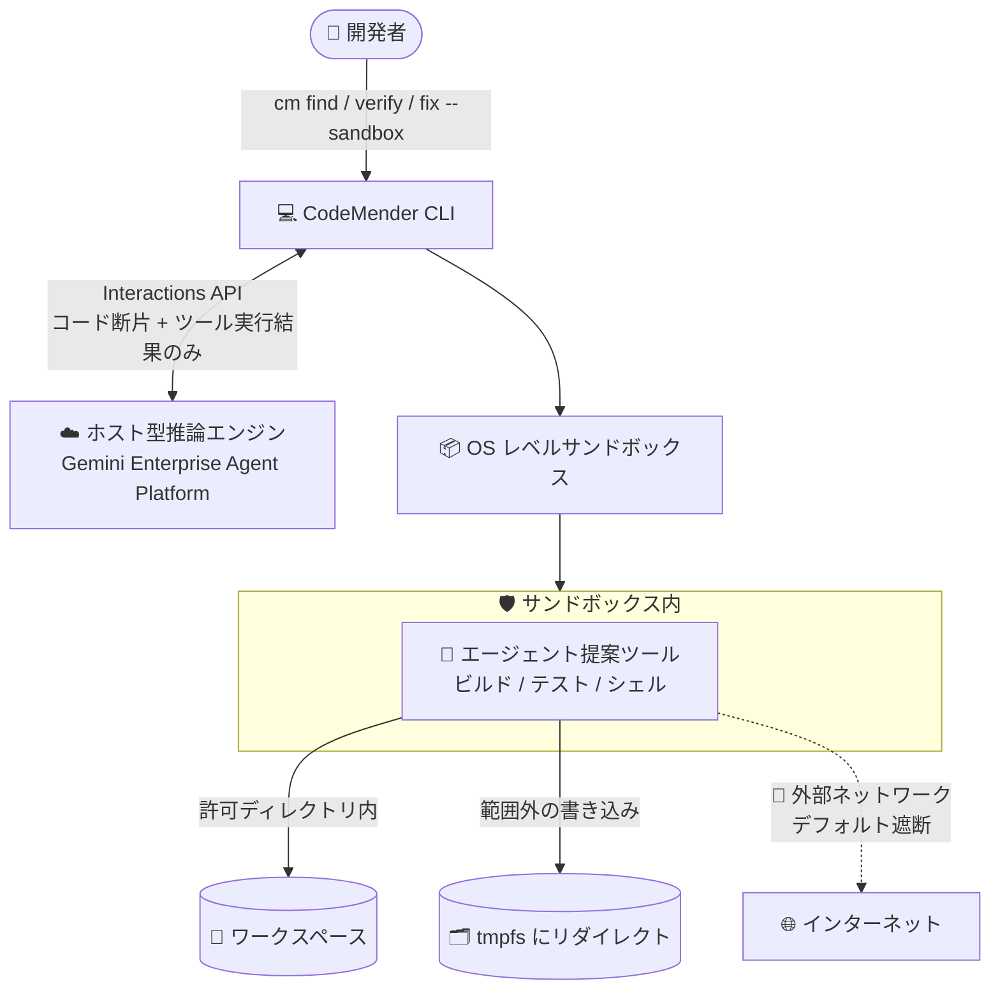

# Gemini Enterprise Agent Platform: CodeMender CLI のプロセスレベルサンドボックスと自動アップデート (Preview)

**リリース日**: 2026-08-03

**サービス**: Gemini Enterprise Agent Platform (CodeMender)

**機能**: CodeMender CLI のプロセスレベルサンドボックスと自動アップデートチェック

**ステータス**: Preview

📊 [このアップデートのインフォグラフィックを見る](https://takech9203.github.io/google-cloud-news-summary/20260803-gemini-enterprise-codemender-cli-sandboxing.html)

## 概要

Gemini Enterprise Agent Platform 上で動作する自律型 AI コードセキュリティエージェント **CodeMender** の CLI に、**プロセスレベルサンドボックス** と **自動アップデートチェック** が Preview として追加されました。

CodeMender は、コードベースの深刻なセキュリティ脆弱性をスキャン・検証・修正する AI エージェントです。推論エンジンは Google Cloud 上の Gemini Enterprise Agent Platform でホストされ、ローカルの `cm` CLI がファイル読み取り、ビルドチェック、PoC (概念実証) エクスプロイト検証などのツール実行を担う「ローカルファースト」の実行モデルを採用しています。今回のアップデートにより、エージェントが提案するすべてのツール (コードのコンパイル、テスト実行、シェルスクリプト実行など) を OS レベルのサンドボックス内で実行できるようになり、ワークステーションを意図しないファイル変更や予期しないツールの副作用から保護できます。

サンドボックスは依存関係の解決をスムーズに行えるようデフォルトでは無効ですが、`config.yaml` で永続的に有効化するか、新しい `--sandbox` フラグでコマンド単位で有効化できます。また、CLI がインタラクティブターミナルで実行されている場合、バックグラウンドで最大 24 時間に 1 回アップデートを自動チェックするようになり、`cm update` コマンドで即座にアップデートを強制適用することも可能です。

**アップデート前の課題**

- エージェントが提案するツール (ビルド、テスト、シェルスクリプト) はホストシステム上で直接実行され、意図しないファイル変更や予期しないツールの副作用からワークステーションを保護する組み込みの仕組みがなかった
- ホストを保護するには、コンテナや完全に分離された VM 内で CLI を実行する必要があり、コンテナランタイムの用意やリソースオーバーヘッドが発生していた
- CLI を最新版に保つには、Artifact Registry からバイナリを手動でダウンロードして差し替える必要があった

**アップデート後の改善**

- OS 標準機能 (Linux: カーネル名前空間 + seccomp フィルタ、macOS: sandbox-exec (Seatbelt)、Windows: AppContainer (Experimental)) を利用した軽量なプロセスレベルサンドボックスで、起動オーバーヘッドなしにツール実行を分離できるようになった
- 許可ディレクトリ外へのファイル書き込みはメモリ上の一時ファイルシステム (tmpfs) にリダイレクトされ、ホストシステムに影響しなくなった
- サンドボックス内からの外部ネットワークアクセスはデフォルトでブロックされ、エージェントやビルドツールによる予期しない外部接続やデータ送信を防止できるようになった
- 自動アップデートチェック (24 時間に最大 1 回) と `cm update` コマンドにより、CLI を常に最新版に保ちやすくなった

## アーキテクチャ図



CodeMender の推論はクラウド側で行われ、ローカル CLI がツール実行を担います。サンドボックスを有効にすると、ツール実行は許可ディレクトリ内に制限され、範囲外の書き込みは tmpfs へリダイレクト、外部ネットワークはデフォルトで遮断されます。

## サービスアップデートの詳細

### 主要機能

1. **プロセスレベルサンドボックス (OS レベル分離)**
   - エージェントが提案するすべてのツール (コンパイル、テスト、シェルスクリプト実行) を OS レベルのサンドボックス内で実行
   - **ファイルシステム分離**: エージェントは許可されたディレクトリ内のみ読み書き可能。範囲外への書き込みはメモリ上の一時ファイルシステム (tmpfs) にリダイレクトされ、ホストに影響しない
   - **ネットワーク分離**: サンドボックス内からの外部ネットワークアクセスはデフォルトでブロック (`permissive-closed`)
   - デフォルトは無効。`config.yaml` で永続的に、または `--sandbox` フラグで `cm find` / `cm verify` / `cm fix` の単一実行に対して有効化可能

2. **サンドボックスのバイパスと保護ファイル指定**
   - `--unrestricted` フラグで、単一実行に対してファイルシステムのパス境界と OS レベルのコンテナ分離 (ネットワーク分離を含む) をすべて無効化可能
   - `security.protected_files` で、ホスト上のファイルやディレクトリ (例: `~/.ssh/*`) をサンドボックス内に読み取り専用でマウントし、変更から保護可能 (`~` 展開とワイルドカード対応)

3. **自動アップデートチェック**
   - コマンド実行時にバックグラウンドで最大 24 時間に 1 回アップデートをチェック
   - インタラクティブターミナル (TTY) でのみチェックとプロンプト表示を実施。CI/CD パイプラインやスクリプトなどの非インタラクティブ環境ではスキップされ、stderr に 1 日最大 1 回警告を出力
   - 新バージョンがある場合は stderr にプロンプトを表示し、`y` を選ぶとバイナリを置き換えて終了 (コマンドの再実行が必要)
   - オフラインやリリースリポジトリに到達できない場合はサイレントに失敗し、コマンド実行を継続
   - `--yes` / `-y` フラグで自動チェックをバイパス可能

4. **手動アップデート (`cm update`)**
   - 24 時間スロットリングを無視して即座にアップデートをチェック・適用
   - プロンプトなしの非インタラクティブ動作で、スクリプトや構成管理からも安全に実行可能
   - システムディレクトリにインストールされている場合は `sudo cm update` を実行

## 技術仕様

### OS ごとのサンドボックス実装

| OS | 実装方式 | 備考 |
|------|------|------|
| Linux | カーネル名前空間 (`CLONE_NEWNS`、`CLONE_NEWUSER` など) + seccomp フィルタ | マウントポイントの分離とシステムコールの制限 |
| macOS | 組み込みの `sandbox-exec` (Seatbelt) | OS 標準機構を利用 |
| Windows | AppContainer 分離 + ACL (Experimental) | 管理者権限が必要な場合や一部構成と非互換の場合あり |

### 分離レベルの選択肢

| 方式 | 説明 | 利点 | 欠点 |
|------|------|------|------|
| 組み込みサンドボックス (OS レベル) | デフォルト無効。OS 標準機能で実行を分離 | 軽量、起動オーバーヘッドゼロ、ローカルツールへの直接アクセス。日常のローカル開発に推奨 | OS カーネル機能に依存し、完全な VM より分離が弱い。Windows は Experimental |
| コンテナ (Docker など) | コンテナ内でエージェントを実行 | 良好な分離、標準化された環境 | コンテナランタイムが必要、重くなりがち、ローカルマシン上のツールと直接連携不可 |
| 完全な VM | 専用 VM 内でエージェントを実行 | 最大のセキュリティ、完全な分離 | 高いリソースオーバーヘッド、起動が遅い、ローカルツールと直接連携不可 |

### config.yaml のサンドボックス設定

```yaml
sandbox:
  enabled: true            # デフォルト: false
  mounts:
    target_dir: "."        # サンドボックス内にマウントするワークスペース
  network:
    profile: "permissive-closed"  # デフォルト: 全アウトバウンド遮断
                                  # "permissive-open" で全アウトバウンド許可
security:
  protected_files:
    - "~/.ssh/*"           # 読み取り専用でマウントして保護
```

- `sandbox.network.profile` は `permissive-closed` (完全遮断、デフォルト) と `permissive-open` (全許可) の 2 種類。特定ドメインや URL パターンの粒度の細かい許可リストは現時点では未サポート

## 設定方法

### 前提条件

1. Google Cloud プロジェクトで Vertex AI API (`aiplatform.googleapis.com`) と Cloud Resource Manager API (`cloudresourcemanager.googleapis.com`) を有効化
2. ユーザーに Vertex AI User ロール (`roles/aiplatform.user`) を付与
3. CodeMender CLI を Artifact Registry からダウンロード・インストール (現在は限定された顧客向けの Public Preview。アクセスには営業チームへの問い合わせが必要)
4. `gcloud auth application-default login` で Application Default Credentials (ADC) を構成
5. コードベースのルートで `cm init` を実行してワークスペースを初期化

### 手順

#### ステップ 1: コマンド単位でサンドボックスを有効化

```bash
# 単一実行に対してサンドボックスを有効化
cm find TARGET --sandbox
cm verify TARGET --sandbox
cm fix TARGET --sandbox
```

`--sandbox` フラグで、そのコマンド実行中のみサンドボックスが有効になります。

#### ステップ 2: config.yaml で永続的に有効化

```yaml
sandbox:
  enabled: true
```

`config.yaml` に `sandbox.enabled: true` を設定すると、以降の実行で常にサンドボックスが有効になります。公式ドキュメントでは、ローカル開発では組み込みサンドボックスの有効化と `human_confirmation: true` の維持が強く推奨されており、これらの保護を無効化するのは分離された使い捨てのサンドボックス VM や CI/CD パイプライン内で実行する場合に限るべきとされています。

#### ステップ 3: ネットワーク依存のビルドへの対処

サンドボックスのネットワーク分離により、`npm install`、`pip install`、`go get` などビルド時に外部依存関係を取得する処理は失敗します。以下のいずれかで対処します。

```yaml
# オプション A: サンドボックスに外部ネットワークアクセスを許可
sandbox:
  network:
    profile: "permissive-open"
```

```bash
# オプション B: 単一実行でサンドボックス保護をすべてバイパス
cm fix TARGET --unrestricted
```

- オプション C: `cm` コマンド実行前にホスト側で依存関係をすべて事前インストールしておき、ビルドコマンドがネットワークアクセスを必要としないようにする

#### ステップ 4: CLI のアップデート

```bash
# 24 時間スロットリングを無視して即座にアップデートを確認・適用
cm update

# システムディレクトリにインストールされている場合
sudo cm update
```

## メリット

### ビジネス面

- **セキュリティリスクの低減**: AI エージェントによる自律的なコード修正を、ホストシステムへの意図しない影響を抑えながら実行でき、開発者ワークステーションの保護を強化できる
- **運用負荷の軽減**: 自動アップデートチェックと `cm update` により、CLI のバージョン管理の手間が減り、常に最新の修正・機能を利用できる

### 技術面

- **軽量な分離**: コンテナや VM と異なり、OS 標準機能を使うため起動オーバーヘッドがなく、ローカルワークスペースのツールに直接アクセスしながら細かい制御が可能
- **多層防御**: ファイルシステム分離 (tmpfs リダイレクト)、ネットワーク分離 (デフォルト遮断)、保護ファイルの読み取り専用マウント (`protected_files`) を組み合わせられる
- **CI/CD フレンドリーな更新機構**: `cm update` は非インタラクティブでプロンプトなしに動作するため、スクリプトや構成管理ツールから安全に利用できる

## デメリット・制約事項

### 制限事項

- Preview 機能であり、Pre-GA Offerings Terms が適用される (サポートが限定される可能性あり)
- CodeMender 自体が限定された顧客向けの Public Preview で、利用には営業チームへの問い合わせが必要
- サンドボックスは **デフォルトで無効**。保護を得るには明示的な有効化が必要
- OS レベルサンドボックスは完全に分離された VM より保護が弱い (OS カーネル機能に依存)
- Windows のサンドボックスは Experimental で、管理者権限が必要な場合や一部システム構成と非互換の場合がある
- ネットワークの許可リストは `permissive-closed` / `permissive-open` の 2 択のみで、特定ドメイン (例: npmjs.org のみ許可) の粒度の細かい制御は未サポート
- 自動アップデートチェックはインタラクティブターミナル (TTY) でのみ動作し、CI/CD などの非インタラクティブ環境ではスキップされる

### 考慮すべき点

- デフォルトのネットワーク分離 (`permissive-closed`) では、ビルドやテスト中の外部依存関係取得 (`npm install` など) が失敗するため、依存関係の事前取得・`permissive-open` への変更・`--unrestricted` のいずれかの対処が必要
- `--unrestricted` はファイルシステム境界と OS レベル分離 (ネットワーク分離含む) をすべて無効化するため、使用は慎重に判断する
- 自動アップデートでバイナリが置き換えられた場合、元のコマンドは実行されず再実行が必要

## ユースケース

### ユースケース 1: ローカル開発でのセキュアな脆弱性修正

**シナリオ**: 開発者がローカルワークステーションで CodeMender に脆弱性のスキャンと修正パッチの生成を任せたいが、エージェントが実行するビルドやテストが `~/.ssh` などの機密ファイルや作業ディレクトリ外のファイルに影響することを避けたい。

**実装例**:
```yaml
# config.yaml
sandbox:
  enabled: true
  mounts:
    target_dir: "."
security:
  protected_files:
    - "~/.ssh/*"
```

**効果**: エージェントのツール実行はワークスペース内に制限され、範囲外への書き込みは tmpfs に隔離される。SSH 鍵は読み取り専用でマウントされ変更から保護される。

### ユースケース 2: CI/CD パイプラインでの CLI バージョン管理

**シナリオ**: CI/CD パイプラインやスクリプトで CodeMender CLI を利用しており、常に最新バージョンで実行したいが、対話的なプロンプトは避けたい。

**実装例**:
```bash
# パイプラインの先頭で最新版を強制適用 (非インタラクティブ、プロンプトなし)
cm update
cm find ./src --yes
```

**効果**: `cm update` は 24 時間スロットリングを無視して即座に更新を適用し、TTY を必要としないためスクリプトから安全に実行できる。`--yes` で実行時の自動アップデートチェックもバイパスできる。

## 関連サービス・機能

- **Gemini Enterprise Agent Platform**: CodeMender のエージェント推論、脅威モデリング、オーケストレーションをホストするプラットフォーム。CLI は Interactions API 経由で通信する
- **Vertex AI API**: アクティブセッションのストリーミングと管理を担う (CLI 利用には `roles/aiplatform.user` が必要)
- **Artifact Registry**: CodeMender CLI バイナリの配布元。自動アップデート機構もここから最新版を取得する
- **Gemini モデル**: CodeMender の推論エンジンはデフォルトで Gemini 3.5 Flash を使用し、`--model` フラグで Gemini 3.1 Pro Preview などに切り替え可能

## 参考リンク

- 📊 [インフォグラフィック](https://takech9203.github.io/google-cloud-news-summary/20260803-gemini-enterprise-codemender-cli-sandboxing.html)
- [公式リリースノート](https://docs.cloud.google.com/release-notes#August_03_2026)
- [CodeMender CLI のインストールと構成 (ドキュメント)](https://docs.cloud.google.com/gemini-enterprise-agent-platform/codemender/set-up-environment)
- [Gemini Enterprise Agent Platform リリースノート](https://docs.cloud.google.com/gemini-enterprise-agent-platform/release-notes)

## まとめ

CodeMender CLI にプロセスレベルサンドボックスと自動アップデートが加わり、AI エージェントによる自律的なコード修正をワークステーション上でより安全に実行できるようになりました。サンドボックスはデフォルトで無効のため、ローカル開発で CodeMender を利用する場合は `config.yaml` の `sandbox.enabled: true` または `--sandbox` フラグによる有効化を強く推奨します。ネットワーク分離がビルド時の依存関係取得に影響する点に注意し、依存関係の事前取得やネットワークプロファイルの調整を検討してください。

---

**タグ**: #GeminiEnterpriseAgentPlatform #CodeMender #Security #Sandbox #CLI #Preview #AIAgent
