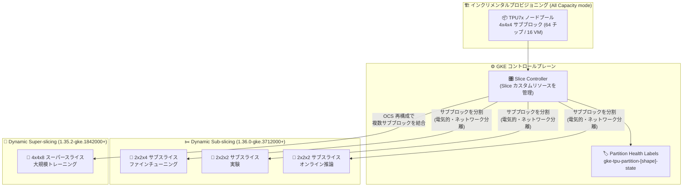

# Google Kubernetes Engine (GKE): TPU Subslicing (Dynamic Subslicing) が Ironwood (TPU7x) で一般提供開始

**リリース日**: 2026-08-03

**サービス**: Google Kubernetes Engine (GKE)

**機能**: TPU Subslicing (Dynamic Subslicing) for Ironwood (TPU7x)

**ステータス**: GA (一般提供)

📊 [このアップデートのインフォグラフィックを見る](https://takech9203.github.io/google-cloud-news-summary/20260803-gke-tpu-subslicing-ironwood-ga.html)

## 概要

GKE の TPU Subslicing (Dynamic Subslicing とも呼ばれる) が、Ironwood (TPU7x) で一般提供 (GA) となりました。この機能により、キューブ (4x4x4 サブブロック) や litepod 向けのノードプールをインクリメンタルにプロビジョニングし、それらをより小さなスライス (サブスライス) に分割して、小さなトポロジを必要とするワークロードを実行できます。

TPU7x (Ironwood) は Google Cloud の第 7 世代 TPU で、1 Pod あたり最大 9,216 チップ、チップあたり 192 GB HBM・BF16 で 2,307 TFLOPs という大規模 AI トレーニング・推論向けのアクセラレータです。従来の静的な TPU トポロジでは、ノードプール作成時に固定したトポロジとワークロードのトポロジが完全一致する必要があり、柔軟性に欠けていました。Dynamic Slicing は、TPU の物理プロビジョニングとワークロードのスライス割り当てを分離 (デカップリング) し、ワークロードのスケジューリング時に TPU ネットワークインターコネクト (ICI/OCS) を動的に再構成します。公式ドキュメントによれば、ワークロードの起動時間を最大 5 倍、障害からの復旧時間を最大 4.5 倍短縮できるとされています。

今回の GA では、4x4x4 より小さいトポロジ (2x2x1、2x2x2、2x2x4、2x4x4) を単一サブブロック内に分離する「Dynamic Sub-slicing」、複数のサブブロックを結合して 4x4x4 以上のトポロジを形成する「Dynamic Super-slicing」、そしてサブスライス形状ごとの状態を示す新しい「Partition Health Labels」が提供されます。TPU 利用効率の最大化を目指す ML エンジニアやプラットフォームエンジニアが主な対象です。

**アップデート前の課題**

- 静的な TPU トポロジでは、ノードプールが作成時に設定した特定のトポロジに固定され、ワークロードのトポロジがノードプールの TPU トポロジと完全に一致しなければスケジュールできなかった
- 異なるトポロジのワークロードを実行するたびに、TPU インフラストラクチャの再プロビジョニングが頻繁に必要だった
- 静的ノードプールでは、いずれかのノードに障害が発生するとノードプール全体が影響を受けた
- 4x4x4 サブブロック単位でしか利用できず、ファインチューニングや推論などの小規模ワークロードで 64 チップのキューブを占有すると利用効率が低下した

**アップデート後の改善**

- Dynamic Sub-slicing により、単一の 4x4x4 サブブロックを 2x2x1 / 2x2x2 / 2x2x4 / 2x4x4 などの複数の独立したサブスライスに分割し、ファインチューニング・実験・オンライン推論などの複数ワークロードを同一物理ノードプール上で同時実行できるようになった (GKE 1.36.0-gke.3712000 以降)
- Dynamic Super-slicing により、複数の 4x4x4 ノードプールをスケジューリング時に結合し、単一ハードウェアブロックを超える大規模スライス (例: 4x4x8、最大で積 9,216 チップまで) を形成できるようになった (GKE 1.35.2-gke.1842000 以降)
- サブスライス間には電気的・ネットワーク的な分離があり、ワークロード間の障害や性能影響を隔離できるようになった
- Partition Health Labels が `cloud.google.com/gke-tpu-partition-[shape]-state` 形式に更新され、小さいサブスライス形状ごとの状態を確認できるようになった。新たに `UNSET` と `INCOMPLETE` の状態が追加された
- インクリメンタルプロビジョニングにより、部分的に不健全なキューブでもプロビジョニングと利用を継続できるようになった

## アーキテクチャ図



事前プロビジョニングした 4x4x4 サブブロックのノードプールを、GKE の Slice Controller がワークロードスケジューリング時に動的に分割 (Sub-slicing) または結合 (Super-slicing) し、要求されたトポロジの TPU スライスを数秒で形成します。

## サービスアップデートの詳細

### 主要機能

1. **Dynamic Sub-slicing (4x4x4 より小さいトポロジ)**
   - 単一の事前プロビジョニング済み TPU ノードプールを、ワークロードレベルで複数の小さな独立ユニットに分割
   - サポートされるトポロジ: 2x2x1 (4 チップ)、2x2x2 (8 チップ)、2x2x4 (16 チップ)、2x4x4 (32 チップ)
   - 例: 1 つの 4x4x4 サブブロックを、1 つの 2x2x4 サブスライスと 2 つの 2x2x2 サブスライスに分割
   - サブスライス間は電気的・ネットワーク的に分離され、障害や性能影響を相互に隔離
   - GKE バージョン 1.36.0-gke.3712000 以降 (Rapid チャネル) でサポート

2. **Dynamic Super-slicing (4x4x4 以上のトポロジ)**
   - 物理的に分離された複数の事前プロビジョニング済み TPU ノードプールを、スケジューリング時に単一の仮想スライスとして結合
   - Slice Controller が Optical Circuit Switch (OCS) ネットワークファブリック内の物理再構成をオーケストレーションし、独立したハードウェアラック間で Inter-Chip Interconnect (ICI) ネットワークを拡張
   - ワークロードからは、結合されたサブブロックが単一のトーラス (3D torus) メッシュとして動作
   - GKE バージョン 1.35.2-gke.1842000 以降でサポート

3. **Partition Health Labels の更新**
   - パーティション状態ラベルが `cloud.google.com/gke-tpu-partition-[shape]-state` に更新され、`[shape]` にサブスライス形状 (2x2x1、2x2x2、2x2x4、2x4x4、4x4x4) を指定可能に
   - 新しい状態 `UNSET` (Slice Controller の初期化失敗により状態未定義) と `INCOMPLETE` (パーティション内の全ノードが未プロビジョニング) が追加
   - `DEGRADED` 状態は最上位の 4x4x4 トポロジのみに適用され、より小さいサブスライストポロジには適用されない

4. **インクリメンタルプロビジョニング**
   - フォールトトレラントなノードプールプロビジョニングモデル
   - 全 TPU キャパシティを Ironwood (TPU7x) VM の 16 ノードグループからなるノードプールに変換し、部分的に不健全なキューブでもプロビジョニングと利用を継続可能

## 技術仕様

### パーティション状態ラベルの値

| 状態 | 説明 |
|------|------|
| `HEALTHY` | パーティションは健全で完全に機能している |
| `DEGRADED` | インフラが劣化状態 (例: OCS リンク劣化)。スライス形成は可能だが性能低下の可能性あり。4x4x4 トポロジのみに適用 |
| `UNHEALTHY` | パーティションは不健全でスライスを形成できない |
| `UNSET` (新規) | GKE Slice Controller の初期化に失敗し、状態が未定義 |
| `INCOMPLETE` (新規) | パーティション内のすべてのノードがプロビジョニングされていない |

### サポートされるトポロジと要件

| 構成 | トポロジ | 必要 GKE バージョン |
|------|---------|---------------------|
| Dynamic Sub-slicing | 2x2x1、2x2x2、2x2x4、2x4x4 | 1.36.0-gke.3712000 以降 |
| Dynamic Super-slicing | 4x4x4 以上 (各次元は 4 の倍数、次元の積は 9,216 以下、最大 32 サブブロック) | 1.35.2-gke.1842000 以降 |

**Super-slicing のトポロジルール:**
- トポロジは `AxBxC` 形式の 3 次元文字列 (例: `4x8x8`)
- 次元は非減少順 (A <= B <= C)。例: `4x8x4` は無効で、`4x4x8` と指定する
- 各次元は 4 の倍数 (`4A x 4B x 4C`)
- 次元の積 (A×B×C) は 9,216 以下
- 最大 32 サブブロック (例: 8x16x16 = 32 サブブロック、12x12x12 = 27 サブブロック)

### ワークロードでのスライストポロジ指定例

Kueue + Topology Aware Scheduling (TAS) 使用時は、Pod アノテーションでスライストポロジを指定します。

```yaml
apiVersion: jobset.x-k8s.io/v1alpha2
kind: JobSet
metadata:
  name: sub-slice-workload
  labels:
    kueue.x-k8s.io/queue-name: lq
spec:
  replicatedJobs:
    - name: job-jax
      replicas: 1
      template:
        spec:
          parallelism: 4   # 2x2x4 = 16 チップ / VM あたり 4 チップ = 4 Pod
          completions: 4
          template:
            metadata:
              annotations:
                cloud.google.com/gke-tpu-slice-topology: 2x2x4
            spec:
              nodeSelector:
                cloud.google.com/gke-tpu-accelerator: tpu7x
              tolerations:
                - key: "google.com/tpu"
                  operator: "Equal"
                  value: "present"
                  effect: "NoSchedule"
              containers:
                - name: jax
                  image: python:latest
                  resources:
                    limits:
                      google.com/tpu: 4
              restartPolicy: Never
```

パーティション健全性の指定がない場合、Kueue Slice Controller の webhook が `cloud.google.com/gke-tpu-partition-4x4x4-state` に `HEALTHY` / `DEGRADED` を許可するデフォルトの nodeAffinity を自動注入します。

## 設定方法

### 前提条件

1. Rapid チャネルの Standard クラスタ (Sub-slicing は 1.36.0-gke.3712000 以降、Super-slicing は 1.35.2-gke.1842000 以降)
2. Ironwood (TPU7x) の使用 (マシンタイプ: `tpu7x-standard-4t`)
3. ノードイメージに Container-Optimized OS を使用
4. インクリメンタルプロビジョニングには All Capacity mode 予約が必要 (TPU Cluster Director により有効化)
5. リージョンに十分な TPU7x クォータ
6. マルチスライスワークロードを実行する場合は JobSet v0.10.1 以降をインストール
7. Sub-slicing 使用時は保留中のホストメンテナンスイベントを確認 (2026 年 9 月 18 日〜30 日に終了時刻を持つ保留イベントがあるノードでは、事前に手動でホストメンテナンスイベントをトリガーする必要あり)

### 手順

#### ステップ 1: ノードとパーティションの状態を確認

```bash
# ノードプールのノード一覧を取得
kubectl get nodes -l cloud.google.com/gke-nodepool=${NODE_POOL_NAME}

# パーティション ID ラベルを確認
kubectl describe node NODE_NAME | grep -E "cloud.google.com/gke-tpu-partition-.*-id"

# パーティション状態ラベルを確認
kubectl describe node NODE_NAME | grep -E "cloud.google.com/gke-tpu-partition-.*-state"
```

各ノードには、利用可能なすべてのトポロジ (2x2x1、2x2x2、2x2x4、2x4x4、4x4x4) のパーティション ID とパーティション状態ラベルが付与されます。

#### ステップ 2: スケジューラの選択とスライスの形成

```bash
# Kueue + TAS を使用する場合: JobSet マニフェストを適用
kubectl apply -f sub-slice-workload.yaml
```

スケジューラの選択肢は 2 つあります。

- **Kueue + Topology Aware Scheduling (TAS)**: Slice カスタムリソースを自動作成。マニフェスト適用後、Kueue が指定トポロジの動的スライス形成を試み、スライスがアクティブになるとワークロードを admit して Pod をスケジュール
- **カスタムスケジューラ**: Slice カスタムリソースを直接管理。複雑なスケジューリング要件や既存のスケジューリング基盤との統合に有用

スライス形成の進行状況や健全性は、Slice カスタムリソースの status フィールドで確認できます。

## メリット

### ビジネス面

- **TPU 利用効率の最大化**: 64 チップの 4x4x4 キューブを複数の小規模ワークロードで共有でき、高価な TPU キャパシティの遊休を削減
- **予約キャパシティの柔軟な活用**: All Capacity mode により予約キャパシティ全体へのフルアクセスとハードウェアトポロジ・健全性の完全な可視性を確保し、大規模トレーニングから小規模推論まで同一予約内で柔軟に運用可能
- **運用コストの削減**: ワークロードごとのノードプール再プロビジョニングが不要になり、インフラ管理の工数を削減

### 技術面

- **起動・復旧時間の短縮**: ワークロード起動時間を最大 5 倍、復旧時間を最大 4.5 倍短縮 (公式ドキュメントによる)
- **障害の分離**: サブスライス間の電気的・ネットワーク的分離により、あるワークロードの障害や性能影響が他のワークロードに波及しない
- **フォールトトレランス**: インクリメンタルプロビジョニングにより、部分的に不健全なキューブでも利用を継続可能。静的ノードプールのように 1 ノードの障害がプール全体に影響することがない
- **数秒でのトポロジ形成**: OCS/ICI の動的再構成により、要求された多次元トポロジをスケジューリング時に数秒で形成

## デメリット・制約事項

### 制限事項

- Ironwood (TPU7x) 専用の機能であり、以前の TPU 世代 (v5p、Trillium など) では利用不可
- Standard クラスタの Rapid チャネル限定 (Autopilot 非対応)
- Sub-slicing は GKE 1.36.0-gke.3712000 以降、Super-slicing は 1.35.2-gke.1842000 以降が必要
- All Capacity mode 予約 (TPU Cluster Director) が必須
- ノードイメージは Container-Optimized OS のみ
- `DEGRADED` 状態は 4x4x4 トポロジのみでサポートされ、小さいサブスライストポロジでは検出できない
- Super-slicing のトポロジは各次元が 4 の倍数、次元の積 9,216 以下、最大 32 サブブロックという制約がある
- TPU7x では JAX と PyTorch がサポートされ、TensorFlow は非サポート

### 考慮すべき点

- Sub-slicing の利用前に、保留中のホストメンテナンスイベント (2026 年 9 月 18 日〜30 日に終了時刻を持つもの) がある場合は手動でメンテナンスをトリガーする必要がある
- Kueue + TAS を使わない場合、Slice カスタムリソースのライフサイクル管理を自前のスケジューラで実装する必要がある
- `UNSET` や `INCOMPLETE` 状態のパーティションはスライス形成に使用できないため、監視 (Cloud Monitoring の `kubernetes.io/accelerator/partition/state` メトリクスなど) を組み込むことが望ましい

## ユースケース

### ユースケース 1: 単一キューブでのファインチューニング・実験・推論の同時実行

**シナリオ**: ML プラットフォームチームが 4x4x4 (64 チップ) の TPU7x キューブを 1 つ予約しているが、個々のワークロード (LLM のファインチューニング、ハイパーパラメータ実験、オンライン推論) はそれぞれ 8〜16 チップで十分なため、キューブ全体を 1 ワークロードで占有すると利用効率が低い。

**実装例**:
```yaml
# 4x4x4 サブブロックを 1 つの 2x2x4 と 2 つの 2x2x2 サブスライスに分割
# 各ワークロードの Pod アノテーションで指定
annotations:
  cloud.google.com/gke-tpu-slice-topology: 2x2x4  # ファインチューニング用
# ---
annotations:
  cloud.google.com/gke-tpu-slice-topology: 2x2x2  # 実験用 / 推論用
```

**効果**: 1 つの物理キューブ上で複数ワークロードを電気的・ネットワーク的に分離した状態で同時実行でき、TPU 予約キャパシティの利用率を大幅に向上。障害や性能影響もサブスライス間で隔離される。

### ユースケース 2: 大規模基盤モデルのトレーニング (Super-slicing)

**シナリオ**: 単一の物理ハードウェアブロック (4x4x4) の容量を超える基盤モデルのトレーニングを行いたい。従来は正確なトポロジのノードプールを事前に構築する必要があった。

**効果**: 複数の 4x4x4 ノードプールをスケジューリング時に OCS の動的再構成で結合し、4x4x8 や 8x8x8 などの大規模スライスを単一のトーラスメッシュとして形成。ワークロードの要件に応じてスライスを組み替えられるため、再プロビジョニングなしで大規模トレーニングと他のワークロードを切り替えられる。

### ユースケース 3: 部分的な障害発生時の継続運用

**シナリオ**: 静的ノードプールでは 1 ノードの障害でノードプール全体が影響を受け、トレーニングの復旧に時間がかかっていた。

**効果**: インクリメンタルプロビジョニングとパーティション健全性ラベルにより、不健全なパーティションを避けて健全なパーティションのみでスライスを形成。部分的に不健全なキューブでも残りのキャパシティを利用し続けられ、復旧時間を最大 4.5 倍短縮。

## 料金

Dynamic Slicing / Subslicing 自体の追加料金に関する記載は Release Notes にはありません。TPU7x (Ironwood) の利用には All Capacity mode 予約が必要であり、料金は Cloud TPU の料金体系に従います。詳細は以下の料金ページを参照してください。

- [Cloud TPU の料金](https://cloud.google.com/tpu/pricing)
- [GKE の料金](https://cloud.google.com/kubernetes-engine/pricing)

## 利用可能リージョン

リージョンごとの TPU7x の提供状況は公式ドキュメントを参照してください。利用にはリージョンの TPU7x クォータと All Capacity mode 予約が必要です。

- [Cloud TPU のリージョンとゾーン](https://docs.cloud.google.com/tpu/docs/regions-zones)

## 関連サービス・機能

- **Cloud TPU (TPU7x / Ironwood)**: 本機能の対象となる第 7 世代 TPU。チップあたり 192 GB HBM、BF16 で 2,307 TFLOPs、1 Pod あたり最大 9,216 チップ
- **TPU Cluster Director / All Capacity mode**: インクリメンタルプロビジョニングの前提となる予約モード。予約キャパシティへのフルアクセスとハードウェアトポロジ・健全性の完全な可視性を提供
- **Kueue + Topology Aware Scheduling (TAS)**: Slice カスタムリソースを自動作成し、動的スライスのスケジューリングを行う推奨スケジューラ構成
- **JobSet**: マルチスライスワークロードの実行に使用する Kubernetes API (v0.10.1 以降が必要)
- **Cloud Monitoring**: `kubernetes.io/accelerator/partition/state`、`accelerator/slice/formation_durations` などのメトリクスでパーティション状態やスライス形成時間を監視可能

## 参考リンク

- 📊 [インフォグラフィック](https://takech9203.github.io/google-cloud-news-summary/20260803-gke-tpu-subslicing-ironwood-ga.html)
- [公式リリースノート](https://docs.cloud.google.com/release-notes#August_03_2026)
- [About GKE dynamic slicing (公式ドキュメント)](https://docs.cloud.google.com/kubernetes-engine/docs/concepts/dynamic-slicing)
- [Schedule dynamic slices with Kueue and TAS](https://docs.cloud.google.com/kubernetes-engine/docs/how-to/use-gke-dynamic-slicing)
- [Use dynamic slicing with a custom scheduler](https://docs.cloud.google.com/kubernetes-engine/docs/how-to/create-dynamic-slices)
- [TPU7x (Ironwood) ドキュメント](https://docs.cloud.google.com/tpu/docs/tpu7x)
- [All Capacity mode overview](https://docs.cloud.google.com/tpu/docs/all-capacity-overview)
- [Cloud TPU の料金](https://cloud.google.com/tpu/pricing)

## まとめ

TPU Subslicing の GA により、Ironwood (TPU7x) の 4x4x4 キューブを動的に分割・結合し、小規模な推論・実験から大規模トレーニングまで同一の予約キャパシティで柔軟に運用できるようになりました。TPU の再プロビジョニングが不要になり、起動時間・復旧時間の短縮と障害分離が実現されるため、TPU7x を利用中または導入予定の組織は、Rapid チャネルの対応 GKE バージョンへの更新と Kueue + TAS によるスケジューリング構成の検討をおすすめします。

---

**タグ**: `GKE`, `Cloud TPU`, `TPU7x`, `Ironwood`, `Dynamic Slicing`, `Subslicing`, `AI/ML`, `GA`
