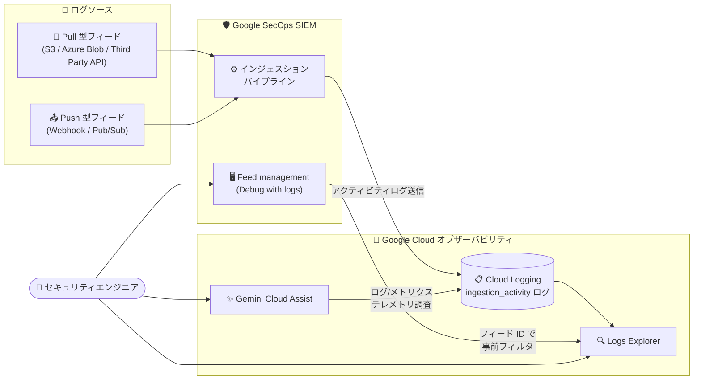

# Google SecOps SIEM: Cloud Logging によるフィードアクティビティ分析 (Public Preview)

**リリース日**: 2026-08-03

**サービス**: Google SecOps SIEM

**機能**: Cloud Logging によるインジェスションパイプライン・フィードのモニタリングとデバッグ (Spotlight Feature)

**ステータス**: Public Preview

📊 [このアップデートのインフォグラフィックを見る](https://takech9203.github.io/google-cloud-news-summary/20260803-google-secops-siem-feed-activity-cloud-logging.html)

## 概要

Google SecOps SIEM のインジェスション (データ取り込み) パイプラインとフィードを、Cloud Logging を使ってモニタリング・デバッグ・トラブルシューティングできる機能が Public Preview として公開されました。インジェスションおよびフィードアクティビティのログを Cloud Logging に送信し、Logs Explorer で表示・クエリすることで、ログの欠落・遅延・失敗といったログ配信の問題を診断し、インジェスション異常の解決にかかる時間を短縮できます。

この機能は Push 型・Pull 型の両方のインジェスションメカニズムに対する可視性を提供し、Gemini Cloud Assist を使って Google SecOps コンソールから直接ロギングとメトリクスのテレメトリを調査できます。さらに、Feed management ページの「Debug with logs」オプションを使うと、特定のフィード ID で事前フィルタリングされた状態で Logs Explorer を開くことができ、フィード単位のデバッグが数クリックで開始できます。

対象ユーザーは、Google SecOps SIEM を運用するセキュリティエンジニアや管理者です。SIEM の検知品質はログ取り込みの健全性に直結するため、インジェスションパイプラインの可観測性向上は SOC 運用全体の信頼性向上につながります。

**アップデート前の課題**

- フィードのログ配信で欠落・遅延・失敗が発生した際に、Cloud Logging の標準的なクエリ手段でインジェスションアクティビティを詳細に調査することができず、原因特定に時間がかかっていた
- Push 型・Pull 型のインジェスションメカニズムの内部動作 (転送バイト数、レコード数、HTTP ステータス、エラー詳細など) に対する統一的な可視性がなかった
- フィードのトラブルシューティングは Google SecOps 側の取り込みヘルス画面が中心で、Google Cloud の標準的なオブザーバビリティツール (Logs Explorer、Gemini Cloud Assist) と連携した調査ワークフローが利用できなかった

**アップデート後の改善**

- インジェスション・フィードアクティビティログが Cloud Logging に送信され、Logs Explorer で `log_id("chronicle.googleapis.com/ingestion_activity")` などのクエリにより表示・分析できるようになった
- 統一 JSON スキーマ (feed_id、collector_id、log_type、bytes_transferred、record_count、http_status_code、error_details など) により、成功・失敗の詳細を構造化データとして調査できるようになった
- Feed management ページの「Debug with logs」で、対象フィード ID で事前フィルタリングされた Logs Explorer をワンクリックで開けるようになった
- Gemini Cloud Assist に対して、Google SecOps コンソールからフィードのボリュームやエラーについて自然言語で質問できるようになった

## アーキテクチャ図



Push 型・Pull 型フィードのインジェスションアクティビティが Cloud Logging に送信され、Logs Explorer でのクエリ分析、Feed management からのワンクリックデバッグ、Gemini Cloud Assist による調査が可能になる構成です。

## サービスアップデートの詳細

### 主要機能

1. **インジェスション・フィードアクティビティログの Cloud Logging 送信**
   - Google SecOps SIEM のインジェスションパイプラインとフィードのアクティビティログを、Google SecOps インスタンスに関連付けられた Google Cloud プロジェクトの Cloud Logging に送信
   - 名前空間ラベル `chronicle-siem` と、ログ ID `chronicle.googleapis.com/ingestion_activity` で識別
   - Push 型・Pull 型の両インジェスションメカニズムをカバー

2. **Logs Explorer でのクエリ分析**
   - 期間、名前空間、ログ ID、インジェスションメカニズム、フィード ID、コレクター ID などでフィルタリング可能
   - 例: `labels.feed_id="FEED_ID"`、`labels.ingestion_mechanism="Third Party API"`
   - Storage Transfer Service (STS) を使う静的フィードは、別のリソースタイプ `storage_transfer_job` とログ ID `storagetransfer.googleapis.com/transfer_activity` でクエリ

3. **「Debug with logs」によるフィード単位デバッグ**
   - Feed management ページ (および View feed ページ) のアクションメニューから「Debug with logs」を選択すると、対象フィード ID で事前フィルタリングされた Logs Explorer が新しいタブで開く
   - 手動でクエリを組み立てることなく、問題のあるフィードの調査を即座に開始可能

4. **Gemini Cloud Assist との連携**
   - Feeds ページの「Ask Gemini Cloud Assist」からチャットペインを開き、フィードのボリュームやエラーについて自然言語で質問可能
   - ロギングとメトリクスのテレメトリを Google SecOps コンソールから直接調査できる

## 技術仕様

### 主要な識別子

| 項目 | 詳細 |
|------|------|
| 名前空間ラベル | `chronicle-siem` (Google SecOps エコシステムに関連するログ) |
| インジェスションログ ID | `chronicle.googleapis.com/ingestion_activity` |
| STS リソースタイプ | `storage_transfer_job` (静的フィード用) |
| STS ログ ID | `storagetransfer.googleapis.com/transfer_activity` |
| 必要な IAM ロール | `roles/logging.viewer` または `roles/logging.privateLogViewer` |

### インジェスションアクティビティログの主なフィールド

| フィールド | 型 | 説明 |
|-----------|-----|------|
| `request_start_time` | string | アクティビティ開始タイムスタンプ (RFC 3339) |
| `activity_duration` | string | アクティビティの合計所要時間 (例: "1.500s") |
| `feed_id` / `collector_id` | string | フィード / コレクターの一意識別子 |
| `log_type` | string | 取り込むログの形式 (例: `DUO`、`OFFICE_365`) |
| `http_status_code` | integer | API フェッチ操作の HTTP ステータスコード |
| `bytes_transferred` | integer | 転送に成功した raw バイト数 |
| `record_count` | integer | 処理・取得・パースされたログエントリ数 |
| `activity` | string | 実行中のタスク名 (例: `File Processing`、`File Transfer`) |
| `error_details` | object | 失敗時のエラー詳細 (`error_message`、`error_code`、`error_type`、`is_retriable`) |

### 失敗時のログペイロード例

```json
{
  "request_start_time": "2026-06-30T19:05:00Z",
  "activity_duration": "1.200s",
  "transfer_id": "transfer-12346",
  "feed_id": "feed-998877",
  "collector_id": "collector-abcd",
  "log_type": "WORKDAY_AUDIT",
  "request_urls": ["https://api.workday.com/ccx/v1/tenant/logs"],
  "http_status_code": 401,
  "bytes_transferred": 0,
  "record_count": 0,
  "activity": "File Transfer",
  "details": "Authorization failure during API request.",
  "error_details": {
    "error_message": "Invalid API token or credential expired.",
    "error_code": "401",
    "error_type": "AUTHORIZATION_ERROR",
    "is_retriable": true
  }
}
```

## 設定方法

### 前提条件

1. Google SecOps SIEM インスタンスが Google Cloud プロジェクトに関連付けられていること
2. ログを閲覧するユーザーに `roles/logging.viewer` または `roles/logging.privateLogViewer` の IAM ロールが付与されていること
3. Cloud Logging は課金対象サービスであるため、コストへの影響を理解しておくこと (無料枠あり)

### 手順

#### ステップ 1: Logs Explorer でフィードアクティビティログをクエリする

```text
# Google SecOps エコシステム全体のログを取得
labels.namespace="chronicle-siem"

# インジェスションアクティビティログストリームに絞り込み
log_id("chronicle.googleapis.com/ingestion_activity")

# 特定のフィードに絞り込み
labels.feed_id="FEED_ID"

# 特定のインジェスションメカニズムに絞り込み
labels.ingestion_mechanism="Third Party API"
```

Google Cloud コンソールで Logs Explorer を開き、Google SecOps インスタンスに関連付けられたプロジェクトを選択して上記のクエリを実行します。

#### ステップ 2: 「Debug with logs」でフィード単位のデバッグを開始する

```text
Google SecOps コンソール → SIEM Settings → Feeds (Feed management)
→ 対象フィードのアクションメニュー → 「Debug with logs」
```

対象フィード ID で事前フィルタリングされた Logs Explorer が新しいタブで開きます。View feed ページからも同じ操作が可能です。

#### ステップ 3: STS を使う静的フィードのログを確認する (該当する場合)

```text
resource.type="storage_transfer_job" AND log_id("storagetransfer.googleapis.com/transfer_activity")
```

Storage Transfer Service を使う静的フィードのログは `chronicle.googleapis.com/ingestion_activity` には表示されないため、STS 固有のリソースタイプとログ ID でクエリします。

## メリット

### ビジネス面

- **インシデント解決時間 (MTTR) の短縮**: ログの欠落・遅延・失敗の原因を構造化ログから迅速に特定でき、インジェスション異常の解決にかかる時間を短縮できる
- **SIEM の検知品質の担保**: ログ取り込みの健全性を継続的に可視化することで、ログ欠落による検知漏れ (可視性ギャップ) のリスクを低減できる
- **運用スキルの標準化**: Logs Explorer や Gemini Cloud Assist という Google Cloud 標準のツールで調査できるため、SecOps 固有ツールの習熟に依存しない運用が可能になる

### 技術面

- **統一スキーマによる構造化分析**: `error_details.is_retriable` などのフィールドで再試行可否まで判別でき、エラー分類に基づく対応の自動化・体系化がしやすい
- **Push/Pull 両方式の可視化**: Webhook などの Push 型と Third Party API などの Pull 型の両方のインジェスションメカニズムを同じログストリームで調査できる
- **AI 支援の調査**: Gemini Cloud Assist にフィードのボリュームやエラーについて自然言語で質問でき、クエリ作成の負担を軽減できる

## デメリット・制約事項

### 制限事項

- Public Preview のため、Pre-GA Offerings Terms (Google Security Operations Service Specific Terms) が適用され、サポートが限定的な場合や、GA までに互換性のない変更が入る可能性がある
- Storage Transfer Service (STS) を使う静的フィードのログは、`storage_transfer_job` リソースタイプと `storagetransfer.googleapis.com/transfer_activity` ログ ID を使用する必要があり、標準のインジェスションアクティビティクエリでは表示されない
- `feed_id` などの高カーディナリティフィールドはモニタリング対象リソースのリソースラベルではなくメタデータラベルとしてログに含まれるため、メタデータラベルを使った Gemini Cloud Assist の相関機能は継続評価中

### 考慮すべき点

- Cloud Logging は課金対象サービスであり、取り込みログ量に応じたコストが発生する (Google Cloud 無料プログラムの一部として無料枠あり)。フィード数やアクティビティ量が多い環境ではログ量の見積もりが必要
- ログ閲覧には Google Cloud プロジェクト側の IAM ロール付与が必要なため、SOC メンバーのアクセス権設計を Google SecOps 側の権限と合わせて見直す必要がある

## ユースケース

### ユースケース 1: 特定フィードのログ欠落調査

**シナリオ**: SOC アナリストが、Workday 監査ログのフィードから数時間ログが届いていないことに気づいた。原因が認証エラーなのか、ソース側の問題なのかを切り分けたい。

**実装例**:
```text
# Feed management ページで対象フィードの「Debug with logs」を選択、または
log_id("chronicle.googleapis.com/ingestion_activity") AND labels.feed_id="feed-998877"
```

**効果**: `http_status_code: 401` と `error_details.error_type: "AUTHORIZATION_ERROR"` から API トークンの期限切れが即座に判明し、認証情報の更新で復旧できる。`is_retriable: true` により再試行で回復可能なことも確認できる。

### ユースケース 2: Gemini Cloud Assist によるインジェスション異常のトリアージ

**シナリオ**: セキュリティエンジニアが、複数フィードにまたがる取り込みボリュームの急減を調査したい。個々のフィードのクエリを手動で組み立てる時間がない。

**効果**: Feeds ページから「Ask Gemini Cloud Assist」を開き、フィードのボリュームやエラーについて自然言語で質問することで、ロギング・メトリクステレメトリに基づく調査を Google SecOps コンソールから直接開始でき、トリアージ時間を短縮できる。

## 料金

この機能自体の追加料金は発表されていませんが、Cloud Logging は課金対象サービスであり、送信されるインジェスション・フィードアクティビティログの取り込み量に応じたコストが発生します。Google Cloud 無料プログラムの一部として無料枠が利用できます。

詳細は [Google Cloud Observability の料金ページ](https://cloud.google.com/stackdriver/pricing) を参照してください。

## 利用可能リージョン

公式ドキュメントにリージョン固有の記載はありません。最新情報は [公式ドキュメント](https://docs.cloud.google.com/chronicle/docs/ingestion/analyze-feed-activity-with-cloud-logging) を参照してください。

## 関連サービス・機能

- **Cloud Logging / Logs Explorer**: 本機能の中核。インジェスション・フィードアクティビティログの保存・表示・クエリ基盤
- **Gemini Cloud Assist**: Google SecOps コンソールからロギング・メトリクステレメトリを自然言語で調査する AI アシスタント
- **Storage Transfer Service (STS)**: 静的フィードのデータ転送に使用され、専用のリソースタイプ・ログ ID でアクティビティログが記録される
- **Google SecOps Feed management**: フィードの設定・管理画面。「Debug with logs」と「Ask Gemini Cloud Assist」の入り口
- **IAM (Identity and Access Management)**: ログ閲覧に必要な `roles/logging.viewer` / `roles/logging.privateLogViewer` の権限管理

## 参考リンク

- 📊 [インフォグラフィック](https://takech9203.github.io/google-cloud-news-summary/20260803-google-secops-siem-feed-activity-cloud-logging.html)
- [公式リリースノート](https://docs.cloud.google.com/release-notes#August_03_2026)
- [ドキュメント: Analyze feed activity with Cloud Logging](https://docs.cloud.google.com/chronicle/docs/ingestion/analyze-feed-activity-with-cloud-logging)
- [ドキュメント: Manage data feeds](https://docs.cloud.google.com/chronicle/docs/administration/feed-management)
- [ドキュメント: Gemini in Google SecOps overview](https://docs.cloud.google.com/chronicle/docs/secops/gemini-secops)
- [料金ページ (Google Cloud Observability)](https://cloud.google.com/stackdriver/pricing)

## まとめ

Google SecOps SIEM のインジェスションパイプラインが Cloud Logging という Google Cloud 標準のオブザーバビリティ基盤で可視化され、ログ配信問題の診断と解決が大幅に効率化されます。SIEM の検知品質はログ取り込みの健全性に直結するため、Google SecOps を運用しているチームは Preview 段階から「Debug with logs」と Logs Explorer クエリを試し、フィード監視の運用手順への組み込みを検討することを推奨します。

---

**タグ**: Google SecOps, SIEM, Cloud Logging, Logs Explorer, Gemini Cloud Assist, インジェスション, フィード管理, セキュリティ運用, Public Preview
