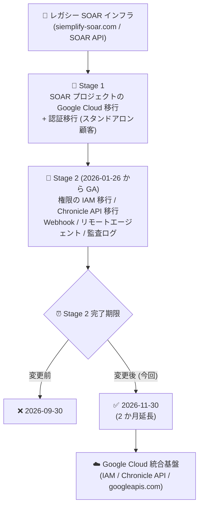

# Google SecOps / Google SecOps SOAR: SOAR 移行 Stage 2 の完了期限が 2026 年 11 月 30 日に延長

**リリース日**: 2026-08-03

**サービス**: Google SecOps / Google SecOps SOAR

**機能**: SOAR の Google Cloud 移行 Stage 2 の期限延長

**ステータス**: Announcement (発表)

📊 [このアップデートのインフォグラフィックを見る](https://takech9203.github.io/google-cloud-news-summary/20260803-google-secops-soar-migration-deadline-extension.html)

## 概要

Google SecOps および Google SecOps SOAR において、SOAR インフラストラクチャの Google Cloud 移行における Stage 2 の完了期限が、従来の 2026 年 9 月 30 日から **2026 年 11 月 30 日** に 2 か月延長されました。本アナウンスは「Google SecOps」と「Google SecOps SOAR」の両方のリリースノートに掲載されています。

SOAR の Google Cloud 移行は、インフラのモダナイズと Google Cloud サービスとの統合強化を目的としたもので、信頼性・セキュリティ・コンプライアンスの向上、よりきめ細かなアクセス制御に加え、Model Context Protocol (MCP) 統合による Agentic AI 機能へのアクセスや、IAM・Cloud Monitoring・Cloud Audit Logs といったサービスの活用を可能にします。移行は Stage 1 (Google 所有 SOAR プロジェクトの Google Cloud 移行、スタンドアロン顧客の認証移行) と Stage 2 (権限の IAM 移行、API・Webhook・リモートエージェント・監査ログの移行) の 2 段階で実施されます。

Stage 2 は 2026 年 1 月 26 日からすべての顧客に一般提供されており、SOAR 権限グループの IAM への移行、レガシー SOAR API から Chronicle API への移行、Webhook の URL 更新、リモートエージェントの認証基盤移行など、顧客側の作業を伴う項目が多く含まれます。今回の期限延長により、これらの作業に取り組む顧客に追加の猶予期間が与えられました。

**アップデート前の課題**

- Stage 2 の完了期限は 2026 年 9 月 30 日に設定されており、レガシー SOAR API・API キー、siemplify-soar.com ドメインの Webhook、既存リモートエージェントはその時点で機能停止する予定だった
- Stage 2 には API 呼び出しスクリプトやインテグレーションの書き換え、Webhook URL のクライアント側更新、リモートエージェントのメジャーバージョンアップなど、顧客側の対応作業が多く、期限までの完了が難しいケースがあった

**アップデート後の改善**

- Stage 2 の完了期限が 2026 年 11 月 30 日まで 2 か月延長された
- レガシー SOAR API と API キー、レガシー siemplify-soar.com ドメインの Webhook、既存リモートエージェントは 2026 年 11 月 30 日まで引き続き利用可能となり、移行作業の計画に余裕が生まれた

## アーキテクチャ図



SOAR の Google Cloud 移行は Stage 1 と Stage 2 の 2 段階で実施され、今回の発表で Stage 2 の完了期限が 2026 年 9 月 30 日から 11 月 30 日に延長されました。

## サービスアップデートの詳細

### 主要な変更点

1. **Stage 2 完了期限の延長**
   - 完了期限が 2026 年 9 月 30 日から 2026 年 11 月 30 日に変更された
   - Google SecOps (統合プラットフォーム) と Google SecOps SOAR (スタンドアロン) の両方の顧客に適用される

2. **Stage 2 に含まれる移行項目 (顧客側の作業が中心)**
   - SOAR 権限グループ・権限の Google Cloud IAM への移行 (Google Cloud 上の移行スクリプトのワンクリック実行、または Terraform で実施。Cloud Identity 顧客はユーザーに、Workforce Identity Federation 顧客は IdP グループにカスタムロールを割り当て)
   - SOAR API から統合 Chronicle API (SOAR v1 ベータエンドポイント) への移行 (既存スクリプト・インテグレーションの更新が必要)
   - Webhook の移行 (レガシー siemplify-soar.com ドメインから googleapis.com ドメインへの URL 更新。認証は従来どおり API キーを使用)
   - リモートエージェントの認証基盤移行 (API キーの代わりにサービスアカウントを作成し、エージェントのメジャーバージョンアップを実施。ホストの移行・置き換えは不要)
   - SOAR 監査ログの移行 (権限の IAM 移行完了後、SOAR ログが Google Cloud で利用可能になる)

3. **新期限 (2026 年 11 月 30 日) に紐づく事項**
   - レガシー SOAR API と API キーは 2026 年 11 月 30 日まで利用可能で、それ以降は機能しなくなる
   - レガシー siemplify-soar.com ドメインの Webhook は 2026 年 11 月 30 日まで機能する
   - 既存のリモートエージェントは 2026 年 11 月 30 日まで利用可能で、それ以降は機能しなくなる
   - SOAR Settings > Organization > Permissions ページはレガシー API との後方互換性のため 2026 年 11 月 30 日まで利用可能 (変更は行わないこと)
   - Group Mapping ページの Permission Group 列は 2026 年 11 月 30 日までに顧客への影響なく自動的に削除される

## 技術仕様

### 移行スケジュールの概要

| 項目 | 詳細 |
|------|------|
| Stage 1 | Google 所有 SOAR プロジェクトの Google Cloud 移行 (Google が実施)、SOAR 認証の Google Cloud 移行 (スタンドアロン顧客のみ) |
| Stage 2 の一般提供開始 | 2026 年 1 月 26 日 (全顧客対象) |
| Stage 2 完了期限 (変更前) | 2026 年 9 月 30 日 |
| Stage 2 完了期限 (変更後) | **2026 年 11 月 30 日** |
| 前提条件 | Stage 2 の開始前に Stage 1 を完了している必要がある |

### 移行完了の確認方法

SOAR Settings > License Management ページで移行の完了状態を確認できます。

| ステージ | 確認方法 |
|----------|----------|
| Stage 1 完了 | システムバージョン番号の後に「Google.com」と表示される |
| Stage 2 (権限の IAM 移行) 完了 | システムバージョン番号の後に「Google.com」と「CloudIAM Enabled」の両方が表示される |

### Webhook URL の移行例

```text
# 変更前 (レガシードメイン、2026-11-30 まで動作)
https://xxxx.siemplify-soar.com/api/external/v1/webhooks/{webhook_id}?api_key=xxxx

# 変更後 (Chronicle API)
https://us-chronicle.googleapis.com/v1alpha/projects/{project_id}/locations/{location}/instances/{instance_id}/webhooks/{webhook_id}?api_key=xxxx
```

Webhook の認証方式は変更されず、Webhook リンクと同時に作成された API キーを引き続き使用します。

## メリット

### ビジネス面

- **移行計画の柔軟性向上**: 2 か月の追加猶予により、スクリプト改修やテストを含む移行作業を計画的に進められる
- **業務影響の低減**: 期限切れによるレガシー SOAR API・Webhook・リモートエージェントの突然の機能停止リスクを回避しやすくなる

### 技術面

- **段階的な移行が可能**: 権限の IAM 移行、API 移行、Webhook 更新、リモートエージェント移行を優先度に応じて順次実施できる
- **移行完了後の統合メリット**: IAM によるきめ細かなアクセス制御、Cloud Monitoring・Cloud Audit Logs との統合、MCP 統合による Agentic AI 機能へのアクセスが得られる

## デメリット・制約事項

### 制限事項

- 期限は延長されたが移行自体は必須であり、2026 年 11 月 30 日以降はレガシー SOAR API・API キー、siemplify-soar.com ドメインの Webhook、既存リモートエージェントは機能しなくなる
- Stage 2 を開始するには Stage 1 の完了が前提となる (移行スクリプトが表示されない場合は Stage 1 が未完了の可能性があるため、Google の担当者に連絡する)

### 考慮すべき点

- 権限の IAM 移行後も SOAR Settings > Organization > Permissions ページは後方互換性のために表示されるが、変更を加えてはならない (権限はすべて IAM で管理される)
- Group Mapping ページの Permission Group 列の割り当ては削除しないこと (2026 年 11 月 30 日までに自動削除される)
- SOAR API を利用するスクリプトやインテグレーションは、Chronicle API の SOAR v1 ベータエンドポイントへの書き換えが必要
- 移行後はライセンスタイプが IAM で割り当てられた権限によって決定され、ランディングページ設定は Permissions ページからアバターの User Preferences メニューに移動する

## 関連サービス・機能

- **Identity and Access Management (IAM)**: Stage 2 で SOAR の権限グループがカスタムロールとして IAM に移行され、アクセス制御が IAM に一元化される
- **Chronicle API**: レガシー SOAR API の移行先となる統合 API。Webhook も googleapis.com ドメインの Chronicle API 形式に更新する
- **Cloud Identity / Workforce Identity Federation**: 移行後のユーザー認証・ロール割り当ての基盤 (Google 管理アカウントまたはサードパーティ IdP 連携)
- **Cloud Monitoring / Cloud Audit Logs**: 移行によって統合が強化される運用・監査基盤。SOAR 監査ログは権限の IAM 移行完了後に Google Cloud で利用可能になる

## 参考リンク

- 📊 [インフォグラフィック](https://takech9203.github.io/google-cloud-news-summary/20260803-google-secops-soar-migration-deadline-extension.html)
- [公式リリースノート](https://docs.cloud.google.com/release-notes#August_03_2026)
- [SOAR migration overview (SOAR 移行ガイド)](https://docs.cloud.google.com/chronicle/docs/soar/admin-tasks/advanced/migrate-to-gcp)
- [Migrate SOAR permissions to Google Cloud IAM](https://docs.cloud.google.com/chronicle/docs/soar/admin-tasks/advanced/migrate-soar-permissions-iam)
- [Migrate endpoints to Chronicle API](https://docs.cloud.google.com/chronicle/docs/soar/admin-tasks/advanced/api-migration-guide)
- [Migrate Remote Agents to Google Cloud](https://docs.cloud.google.com/chronicle/docs/soar/working-with-remote-agents/migrate-remote-agent-to-google)
- [SOAR migration pre-validation guide](https://docs.cloud.google.com/chronicle/docs/soar/admin-tasks/advanced/soar-pre-validation)
- [SOAR migration FAQ](https://docs.cloud.google.com/chronicle/docs/soar/admin-tasks/advanced/migrate-soar-faq)

## まとめ

SOAR の Google Cloud 移行 Stage 2 の完了期限が 2026 年 11 月 30 日に 2 か月延長され、権限の IAM 移行や API・Webhook・リモートエージェントの移行作業に猶予が生まれました。ただし新期限以降はレガシー SOAR API・Webhook ドメイン・既存リモートエージェントが機能しなくなるため、Stage 1 の完了確認のうえ、移行スクリプトの実行と各インテグレーションの Chronicle API への更新を計画的に進めることを推奨します。

---

**タグ**: Google SecOps, Google SecOps SOAR, Chronicle, 移行, IAM, Chronicle API, セキュリティ運用, SOAR
