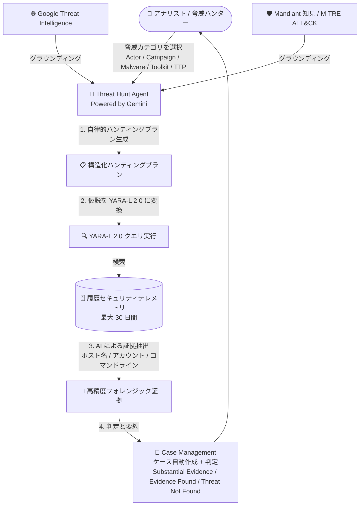

# Google SecOps: Threat Hunt Agent (Public Preview) / SOAR 移行 Stage 2 期限延長

**リリース日**: 2026-08-03

**サービス**: Google SecOps

**機能**: Threat Hunt Agent (Public Preview)、SOAR 移行 Stage 2 期限延長

**ステータス**: Public Preview (Threat Hunt Agent) / Announcement (SOAR 移行期限延長)

📊 [このアップデートのインフォグラフィックを見る](https://takech9203.github.io/google-cloud-news-summary/20260803-google-secops-threat-hunt-agent.html)

## 概要

Google SecOps に自律型 AI 脅威ハンティング機能「**Threat Hunt Agent**」が Public Preview として登場しました。本機能は Google SecOps Enterprise Plus のお客様向けに提供され、Gemini を基盤とし、Google Threat Intelligence (GTI)、Mandiant の最前線の知見、MITRE ATT&CK フレームワークにグラウンディングされています。過去の (履歴) セキュリティテレメトリ全体に対するプロアクティブな脅威ハンティングを自律的に自動化し、脅威アクター・キャンペーン・マルウェアファミリー・ソフトウェアツールキット・MITRE ATT&CK テクニックを対象とした構造化ハンティングプランの生成から、YARA-L 2.0 クエリへの変換・実行、証拠抽出、判定 (Determination)、Case Management へのケース自動作成までをエンドツーエンドで実行します。

対象ユーザーは、SOC アナリストや脅威ハンターです。従来、シニアアナリストが多くの時間を費やしていた脅威リサーチ、クエリ構築、ノイズフィルタリングといった作業を自動化することで、仮説検証にかかる時間を短縮し、高度な分析業務へ注力できるようにします。

あわせて、**SOAR の Google Cloud への移行 (Stage 2) の完了期限が 2026 年 9 月 30 日から 2026 年 11 月 30 日に延長**されたことが発表されました。Stage 2 には SOAR 権限グループの Google Cloud IAM への移行、SOAR API の Chronicle API への移行、Webhook・リモートエージェント・監査ログの移行が含まれます。

**アップデート前の課題**

- 脅威ハンティングでは、脅威アクターや TTP に関するリサーチ、仮説の立案、検索クエリ (YARA-L 2.0) の作成、実行結果からのノイズ除去をすべて手動で行う必要があり、シニアアナリストの時間を大量に消費していた
- 特定の脅威アクターやマルウェアファミリーに関する最新の脅威インテリジェンスを検索条件に落とし込むには、高度な専門知識と YARA-L 2.0 の習熟が必要だった
- 大量のテレメトリから本当に意味のあるフォレンジック証拠 (ホスト名、ユーザーアカウント、コマンドライン) を選別する作業が属人的だった
- SOAR 移行 Stage 2 (IAM・API・Webhook・リモートエージェント・監査ログの移行) の期限が 2026 年 9 月 30 日に設定されており、スクリプトや連携の改修が間に合わないおそれがあった

**アップデート後の改善**

- 脅威カテゴリ (Actor / Campaign / Malware / Software Toolkit / TTP) を選択するだけで、エージェントが構造化ハンティングプランを自動生成し、バックグラウンドで自律実行するようになった
- 調査仮説が YARA-L 2.0 クエリへ自動変換・実行され、クエリ作成の専門知識がなくても過去テレメトリの網羅的なハンティングが可能になった
- AI がバックグラウンドノイズを除去し、高精度なフォレンジック証拠のみを抽出。判定 (Substantial Evidence / Evidence Found / Threat Not Found) 付きのケースが Case Management に自動作成されるようになった
- SOAR 移行 Stage 2 の完了期限が 2026 年 11 月 30 日まで 2 か月延長され、API・Webhook・リモートエージェントの移行作業に余裕が生まれた

## アーキテクチャ図



Threat Hunt Agent は、GTI・Mandiant・MITRE ATT&CK にグラウンディングされた Gemini がハンティングプラン生成 → YARA-L 2.0 クエリ実行 → 証拠抽出 → 判定・ケース作成までを自律的に実行するフローです。

## サービスアップデートの詳細

### 主要機能 (Threat Hunt Agent)

1. **自律的ハンティングプランニング (Autonomous hunt planning)**
   - 特定の脅威アクター (例: APT28、UNC2452)、キャンペーン、マルウェアファミリー (例: FAKEUPDATES)、ソフトウェアツールキット (例: PowerShell、Certutil などの LOLBins)、MITRE ATT&CK テクニック (例: T1003.001) に合わせた構造化ハンティングプランを生成
   - GTI、Mandiant の最前線知見、MITRE ATT&CK フレームワークにグラウンディング

2. **自動ケース作成と判定 (Automated case creation and determinations)**
   - 発見事項を要約に統合し、判定 (Verdict) を付与: **Substantial Evidence** (強力で説得力の高い証拠を検出) / **Evidence Found** (仮説を裏付ける兆候・挙動を検出) / **Threat Not Found** (脅威の挙動は未検出)
   - Case Management に「Threat Hunt for [Subject Name]」というプレフィックス付きの専用ケースを自動作成 (Threat Hunt タグ付き)

3. **クエリの自動変換・実行 (Automated query translation and execution)**
   - 調査仮説を YARA-L 2.0 検索クエリに変換し、履歴セキュリティテレメトリに対して実行
   - Hunt Steps タイムラインで、エージェントが発行した Atomic questions や生成された YL2 クエリ、イベント数を検証可能

4. **AI 駆動の証拠抽出 (AI-driven evidence extraction)**
   - 日常的なバックグラウンドノイズをフィルタリングし、高精度なフォレンジック証拠 (ホスト名、ユーザーアカウント、コマンドライン) を分離
   - 結果サマリーには観測されたホスト名、アカウント、プロセスコマンドライン、タイムスタンプ、挙動コンテキストが含まれる

### SOAR 移行 Stage 2 期限延長

- Stage 2 の完了期限が **2026 年 9 月 30 日 → 2026 年 11 月 30 日** に延長
- Stage 2 に含まれる移行項目:
  - SOAR 権限グループ・権限の Google Cloud IAM への移行 (移行スクリプトまたは Terraform で実行)
  - SOAR API の新しい統合 Chronicle API (SOAR v1 beta エンドポイント) への移行 (既存スクリプト・インテグレーションの更新が必要)
  - Webhook の移行 (`siemplify-soar.com` ドメインから `googleapis.com` ドメインへの URL 更新)
  - リモートエージェントの移行 (API キーからサービスアカウント認証へ)
  - SOAR 監査ログの移行
- レガシー SOAR API・API キー、旧 Webhook ドメイン、既存リモートエージェントは 2026 年 11 月 30 日まで利用可能で、それ以降は機能しなくなる
- Stage 2 の開始には Stage 1 (Google 所有 SOAR プロジェクトの Google Cloud 移行) の完了が前提

## 技術仕様

### Threat Hunt Agent の仕様

| 項目 | 詳細 |
|------|------|
| 提供ステータス | Public Preview (Pre-GA Offerings Terms が適用) |
| 対象ライセンス | Google SecOps **Enterprise Plus** のみ (Emerging Threats 連携が GTI を多用するため) |
| 基盤モデル | Gemini |
| グラウンディング | Google Threat Intelligence (GTI)、Mandiant 最前線知見、MITRE ATT&CK |
| ハント対象カテゴリ | Actor / Campaign / Malware / Software Toolkit / TTP (MITRE テクニック) |
| ハント対象期間 | デフォルト過去 7 日間、最大 30 日間の履歴テレメトリ |
| クエリ言語 | YARA-L 2.0 (YL2) |
| 判定 (Determination) | Substantial Evidence / Evidence Found / Threat Not Found |
| 実行時間の目安 | 通常 60〜90 分 (対象期間とテレメトリ量に依存) |
| Preview 中のクォータ | 同時実行 2 ハント、1 日あたり最大 5 ハント (グローバルキャパシティにより調整の可能性あり) |
| ケースステータス | Threat Hunt Running / Completed / Queued / Failed |

### ハントの起動エントリポイント

| エントリポイント | 操作 |
|------|------|
| Emerging Threats ウィンドウ | [Detection] > [Emerging Threats] > [New Threat Hunt] |
| Google Threat Intelligence ポップアウト | Threats Feed / Campaign Detail ページの [Run Threat Hunt] |
| 脅威アソシエーション詳細 | 脅威インテリジェンスドロワー内の [Run Threat Hunt] |
| MITRE ATT&CK マトリクス | テクニックドロワーの [Run Hunt] |

## 設定方法

### 前提条件

1. **Enterprise Plus ライセンス**: Public Preview 期間中、Threat Hunt Agent は Enterprise Plus のお客様のみ利用可能
2. **新しい Case Management エクスペリエンスの有効化**: 新 Case Management エクスペリエンス (Public Preview) の有効化が必須
3. **権限**: Google SecOps プラットフォーム (特に Case Management) への適切なアクセス権
4. **環境確認**: マルチテナント / セグメント化環境の場合、対象環境へのアクセス権があること

### 手順

#### ステップ 1: 脅威ハントの開始

1. ナビゲーションメニューから **[Detection] > [Emerging Threats]** に移動し、**[New Threat Hunt]** をクリック
2. Agentic Threat Hunt ダイアログで以下を設定:
   - **What would you like to hunt for?**: 脅威カテゴリ (Actor / Campaign / Malware / Software Toolkit / TTP) を選択し、具体的な脅威名・エイリアス・MITRE ID を指定
   - **Select your hunt window**: 分析する履歴テレメトリの期間を設定 (デフォルト 7 日、最大 30 日)
   - **Case environment**: 必要に応じて対象環境を選択
3. **[Begin Hunt]** をクリックして調査を開始

エージェントはバックグラウンドで自律実行され、Case Management に「Threat Hunt for [Subject Name]」ケースが自動作成されます。

#### ステップ 2: ハント結果のレビュー

1. **[Cases]** キューで Threat Hunt タグでフィルタリング、またはハントタイトルで検索
2. ケースを開き、**Agentic Threat Hunt ウィジェット**でサマリーを確認
3. **Determination** ボタンで判定 (Substantial Evidence / Evidence Found / Threat Not Found) を確認
4. **[View Hunt Detail]** で Hunt Steps タイムラインを開き、Atomic questions、生成された YL2 クエリ、イベント数、ステップごとの証拠を検証
5. サムアップ / サムダウンでフィードバックを送信し、エージェントの精度改善に貢献

#### ステップ 3 (SOAR 移行): Stage 2 移行の計画

```text
1. Stage 1 の完了確認: [SOAR Settings] > [License Management] で
   システムバージョン番号の後に "Google.com" と表示されることを確認
2. 権限移行: 移行スクリプト (ワンクリック) または Terraform で
   SOAR 権限グループを IAM カスタムロールへ移行
3. API 移行: スクリプト・インテグレーションを Chronicle API の
   SOAR v1 beta エンドポイントへ更新
4. Webhook 移行: siemplify-soar.com → googleapis.com へ URL 更新
5. リモートエージェント移行: サービスアカウント認証へ切り替え、
   メジャーバージョンアップグレードを実施
6. 完了確認: License Management に "CloudIAM Enabled" が表示されること
   (期限: 2026 年 11 月 30 日)
```

## メリット

### ビジネス面

- **ハンティング工数の大幅削減**: 脅威リサーチ、クエリ構築、ノイズフィルタリングという手動作業を自動化し、シニアアナリストが高度な分析へ注力できる
- **プロアクティブ防御への転換**: Emerging Threats や GTI の脅威レポートからワンクリックでハントを起動でき、新たな脅威情報への初動を高速化
- **判断の標準化**: 3 段階の判定 (Substantial Evidence / Evidence Found / Threat Not Found) により、ハント結果の解釈が属人化しにくくなる
- **SOAR 移行の猶予**: Stage 2 期限が 2 か月延長され、API・Webhook 改修などの計画的な移行が可能に

### 技術面

- **フロントラインインテリジェンスへのグラウンディング**: GTI、Mandiant の知見、MITRE ATT&CK に基づいた実戦的なハントプランを自動生成
- **YARA-L 2.0 の専門知識が不要**: 仮説からクエリへの変換をエージェントが担い、クエリの中身も Hunt Steps タイムラインで監査可能 (透明性の確保)
- **Case Management とのネイティブ統合**: ハント結果が自動的にケース化され、既存のケース運用フローにそのまま組み込める
- **証拠の高精度化**: ノイズを除去したホスト名・アカウント・コマンドラインレベルのフォレンジック証拠を提示

## デメリット・制約事項

### 制限事項

- Public Preview のため Pre-GA Offerings Terms が適用され、サポートが限定的で後方互換性のない変更が入る可能性がある
- Preview 期間中は **Enterprise Plus ライセンス限定** (Enterprise / Standard では利用不可)
- **新しい Case Management エクスペリエンス (Public Preview) の有効化が必須**
- ハント対象期間は最大 30 日間の履歴テレメトリに限定
- Preview 中のクォータ: 同時 2 ハント、1 日 5 ハントまで (グローバルキャパシティにより変動の可能性)
- ハントの実行には通常 60〜90 分かかる (リアルタイム検知の代替ではない)

### 考慮すべき点

- AI による判定はフィードバックによる改善途上であり、Substantial Evidence 判定でも最終判断は人間のアナリストによるレビューが前提
- 冗長な重複ハントの多重起動は避ける必要がある (AI キャパシティの観点でキューイングされる)
- SOAR 移行 Stage 2 は期限が延長されたものの、レガシー SOAR API・API キー・旧 Webhook ドメイン・既存リモートエージェントは 2026 年 11 月 30 日で機能停止するため、早期の移行着手が推奨される

## ユースケース

### ユースケース 1: 新たな脅威アクターのキャンペーン報告を受けた即時ハント

**シナリオ**: GTI の Threats Feed で自社業界を標的とする脅威アクター (例: UNC2452) の新キャンペーンが報告された。自社環境が過去に侵害されていないかを迅速に確認したい。

**実装例**:
```text
1. Threats Feed の該当アクタープロファイルで [Run Threat Hunt] をクリック
2. ハント期間を過去 30 日間に設定して [Begin Hunt]
3. 60〜90 分後、Case Management の "Threat Hunt for UNC2452" ケースで
   判定と証拠 (ホスト名・アカウント・コマンドライン) を確認
```

**効果**: 従来は数日かかっていたアクター調査・クエリ作成・ログ分析を数時間以内に完了し、侵害有無の初期判定を高速化。

### ユースケース 2: MITRE ATT&CK テクニックベースの定期的な仮説検証ハント

**シナリオ**: SOC チームが認証情報ダンプ (T1003.001 - LSASS Memory) や LOLBins 悪用 (Certutil、vssadmin) など、検知ルールをすり抜けやすい TTP を定期的にハンティングしたい。

**効果**: MITRE ATT&CK マトリクスからワンクリックでハントを起動でき、YARA-L 2.0 の専門家でなくても網羅的な TTP ベースのハンティングを運用に組み込める。判定付きケースが残るため、ハンティング活動の証跡管理・監査対応にも有効。

### ユースケース 3: SOAR 移行 Stage 2 の計画的実行

**シナリオ**: SOAR API を利用したカスタムスクリプトと Webhook 連携を多数運用しており、Chronicle API への移行改修に時間が必要。

**効果**: 期限延長 (2026 年 11 月 30 日) により、権限の IAM 移行 → API 改修 → Webhook URL 更新 → リモートエージェントのサービスアカウント認証化を段階的に実施する計画を立てられる。

## 料金

Threat Hunt Agent は Google SecOps **Enterprise Plus** パッケージに含まれる機能として提供されます (Public Preview 期間中は追加料金の公式情報なし)。Google SecOps の料金はパッケージ (Standard / Enterprise / Enterprise Plus) ベースのサブスクリプションモデルです。詳細は料金ページを参照してください。

- [Google Security Operations の料金](https://cloud.google.com/security/products/security-operations#pricing)

SOAR 移行については、SOAR が Google Cloud プロジェクトにバインドされてもインフラコストへの影響はなく、プロジェクト内に新たなリソースが実行されることもないため追加費用は発生しません (公式 FAQ より)。

## 利用可能リージョン

公式リリースノートおよびドキュメントにリージョン固有の記載はありません。Google SecOps Enterprise Plus が利用可能な環境で提供されます。マルチテナント / セグメント化環境では対象環境へのアクセス権が必要です。

## 関連サービス・機能

- **Google Threat Intelligence (GTI)**: Threat Hunt Agent のグラウンディング元。Threats Feed やキャンペーン詳細からハントを直接起動可能
- **Mandiant**: 最前線のインシデント対応から得られた知見がエージェントの分析ロジックに反映
- **Case Management (Google SecOps)**: ハント結果の自動ケース化先。新 Case Management エクスペリエンスの有効化が前提
- **Triage and Investigation Agent (TIN)**: アラートのトリアージ・調査を自動化する姉妹エージェント。Threat Hunt Agent (プロアクティブ) と TIN (リアクティブ) で Agentic SOC を構成
- **Detection Engineering Agent**: 検知ルールの作成・テストを自動化するエージェント。ハントで見つかった脅威の恒久検知化に活用
- **YARA-L 2.0**: Google SecOps の検索クエリ言語。エージェントが仮説から自動生成
- **Google Cloud IAM / Cloud Audit Logs / Cloud Monitoring**: SOAR 移行 Stage 2 の移行先となる Google Cloud ネイティブサービス
- **Chronicle API**: レガシー SOAR API の移行先となる統合 API

## 参考リンク

- 📊 [インフォグラフィック](https://takech9203.github.io/google-cloud-news-summary/20260803-google-secops-threat-hunt-agent.html)
- [公式リリースノート (2026 年 8 月 3 日)](https://docs.cloud.google.com/release-notes#August_03_2026)
- [Threat Hunt Agent ドキュメント](https://docs.cloud.google.com/chronicle/docs/detection/threat-hunt-agent)
- [SOAR 移行ガイド (SOAR migration overview)](https://docs.cloud.google.com/chronicle/docs/soar/admin-tasks/advanced/migrate-to-gcp)
- [SOAR 移行 FAQ](https://docs.cloud.google.com/chronicle/docs/soar/admin-tasks/advanced/migrate-soar-faq)
- [Agentic defense with Google Security Operations](https://cloud.google.com/solutions/security/agentic-soc)
- [Google Security Operations の料金](https://cloud.google.com/security/products/security-operations#pricing)

## まとめ

Threat Hunt Agent の Public Preview 提供により、Google SecOps は「アラート対応の自動化 (TIN)」に続いて「プロアクティブな脅威ハンティングの自律化」を実現し、Agentic SOC 構想を大きく前進させました。Enterprise Plus をご利用のお客様は、新 Case Management エクスペリエンスを有効化のうえ、Emerging Threats からのハント起動を試すことを推奨します。あわせて、SOAR 移行 Stage 2 の期限は 2026 年 11 月 30 日に延長されましたが、API・Webhook・リモートエージェントの移行は改修規模が大きくなりがちなため、早期の計画策定と着手をおすすめします。

---

**タグ**: #GoogleSecOps #ThreatHuntAgent #Gemini #AgenticAI #ThreatHunting #GTI #Mandiant #MITREATTACK #YARAL #SOAR #PublicPreview #SecurityOperations
