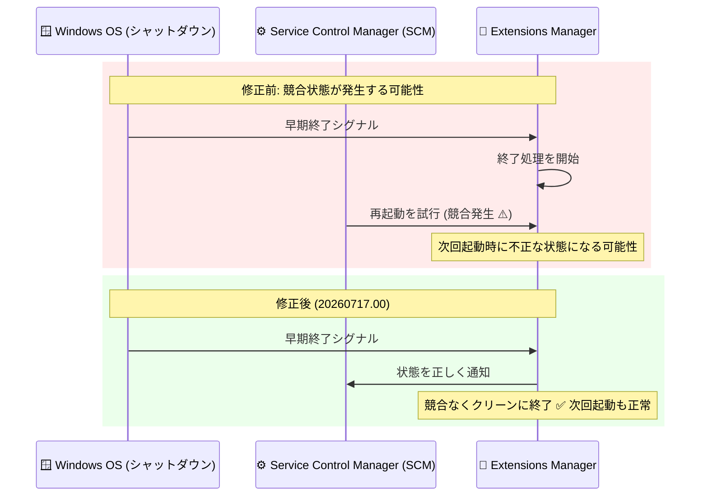

# Guest Environment (Compute Engine): Windows 向けゲストエージェント 20260717.00 - シャットダウン時の競合状態を修正

**リリース日**: 2026-08-03

**サービス**: Guest Environment (Compute Engine)

**機能**: Windows 向けゲストエージェント バージョン 20260717.00 (バグ修正)

**ステータス**: Fixed

📊 [このアップデートのインフォグラフィックを見る](https://takech9203.github.io/google-cloud-news-summary/20260803-guest-environment-windows-agent-20260717.html)

## 概要

Compute Engine の Guest Environment において、Windows 専用のゲストエージェント バージョン 20260717.00 がリリースされました。このバージョンは、Windows シャットダウン時に extensions manager (拡張機能マネージャー) で発生していた競合状態 (race condition) を修正するものです。

修正された問題は、extensions manager が早期終了シグナルを受信した後に、Windows の Service Control Manager (SCM) が extensions manager を再起動しようとした場合に発生していました。この競合状態により、次回起動時に不正な状態 (incorrect state) になる可能性がありました。

ゲストエージェントは Compute Engine インスタンスが Google Cloud 上で動作するために必要な中核コンポーネントであり、アカウント管理、OS Login 統合、ネットワークインターフェース管理などを担います。Windows インスタンス上で Ops Agent などの拡張機能 (オプションプラグイン) を VM Extension Manager 経由で運用しているユーザーにとって、安定性向上につながる重要な修正です。

**アップデート前の課題**

- Windows のシャットダウン処理中に extensions manager が早期終了シグナルを受信した際、SCM がサービスの再起動を試みることで競合状態が発生する可能性があった
- この競合状態により、次回のインスタンス起動時に extensions manager が不正な状態になる可能性があった

**アップデート後の改善**

- シャットダウン時の SCM による再起動処理と早期終了シグナルの競合状態が解消された
- 次回起動時に extensions manager が正しい状態で動作するようになり、拡張機能 (プラグイン) 管理の信頼性が向上した

## アーキテクチャ図



Windows シャットダウン時に、早期終了シグナルを受けた extensions manager を SCM が再起動しようとすることで発生していた競合状態と、バージョン 20260717.00 での修正後の挙動を示しています。

## サービスアップデートの詳細

### 主要な修正内容

1. **シャットダウン時の競合状態の修正**
   - Windows シャットダウン中に extensions manager が早期終了シグナルを受信した後、SCM が extensions manager の再起動を試みた場合に発生する競合状態を修正
   - この競合状態が原因で次回起動時に不正な状態になる問題を解消

2. **対象プラットフォーム**
   - 本バージョン (20260717.00) は Windows 専用のリリース
   - Linux 向けゲストエージェントには本修正は含まれない

### ゲストエージェントのアーキテクチャ (背景情報)

ゲストエージェントはバージョン 20250901.00 以降、モノリシック設計からプラグインベースのアーキテクチャに移行しています。主要コンポーネントは以下のとおりです。

| コンポーネント | 説明 |
|------|------|
| Guest agent manager | インスタンス上の中央プロセス。すべてのプラグインの起動・停止・監視を行う (Windows サービス名: `GCEAgentManager`) |
| Core plugin | ネットワーク設定、SSH アクセス、メタデータアクセスなど必須機能を担当。無効化不可 |
| Extensions (オプションプラグイン) | Ops Agent や Agent for SAP など、他の Google Cloud サービスと統合するプラグイン |
| VM Extension Manager | Google のバックエンドで動作するマネージドサービス。拡張機能のインストール・更新などライフサイクルを管理 |

## 技術仕様

### 対象パッケージとサービス

| 項目 | 詳細 |
|------|------|
| バージョン | 20260717.00 |
| 対象 OS | Windows のみ |
| Windows パッケージ名 | `google-compute-engine-windows` |
| 関連 Windows サービス | `GCEAgentManager` (guest agent manager)、`GCEWindowsCompatManager` (互換性マネージャー) |
| 修正タイプ | バグ修正 (競合状態の解消) |

## 設定方法

### ゲスト環境の更新

Windows インスタンスでゲストエージェントを最新バージョンに更新するには、管理者権限で GooGet パッケージマネージャーを使用します。

```powershell
# インストール済みパッケージの確認
googet installed

# ゲスト環境パッケージの更新
googet update
```

詳細な手順は [ゲスト環境の更新に関する公式ドキュメント](https://docs.cloud.google.com/compute/docs/images/install-guest-environment) を参照してください。

## メリット

### ビジネス面

- **運用の安定性向上**: シャットダウン・再起動を伴う運用 (パッチ適用、スケジュール停止など) において、エージェントが不正な状態になるリスクが低減される
- **トラブルシューティング工数の削減**: 再現条件が限定的で原因特定が難しい起動時の異常状態を未然に防止できる

### 技術面

- **プラグイン管理の信頼性向上**: extensions manager が次回起動時に正しい状態で動作するため、Ops Agent などの拡張機能のライフサイクル管理が安定する
- **SCM との連携の改善**: Windows のサービス管理機構 (SCM) とゲストエージェントの終了処理の整合性が確保された

## デメリット・制約事項

### 考慮すべき点

- 本修正は Windows 専用であり、Linux インスタンスには適用されない
- 修正を適用するには、ゲストエージェントをバージョン 20260717.00 以降に更新する必要がある

## ユースケース

### ユースケース 1: Windows Server インスタンスの定期メンテナンス

**シナリオ**: Windows Server インスタンスに対して、月次のパッチ適用に伴う再起動を定期的に実施している環境。Ops Agent などの拡張機能を VM Extension Manager 経由で管理している。

**効果**: シャットダウン時の競合状態が解消されたことで、再起動後に extensions manager が不正な状態になるリスクがなくなり、拡張機能 (監視エージェントなど) が確実に正常稼働する。

### ユースケース 2: スケジュールによるインスタンスの停止・起動運用

**シナリオ**: コスト最適化のため、開発環境の Windows インスタンスを夜間・休日に自動停止し、営業時間に自動起動している環境。

**効果**: 頻繁なシャットダウン・起動サイクルにおいても、extensions manager の状態が正しく維持され、起動のたびにエージェントの状態を確認・復旧する運用負荷が軽減される。

## 関連サービス・機能

- **Compute Engine**: ゲストエージェントは Compute Engine インスタンスが Google Cloud の機能 (メタデータ、OS Login など) を利用するための中核コンポーネント
- **VM Extension Manager**: 拡張機能 (オプションプラグイン) のインストール・更新・構成を管理するマネージドサービス。本修正の対象である extensions manager と連携する
- **Cloud Monitoring / Cloud Logging (Ops Agent)**: VM Extension Manager 経由でインストールされる代表的な拡張機能。extensions manager の安定性向上の恩恵を受ける
- **VM Manager (OS Config)**: パッチ適用や OS ポリシー管理を行うサービス。再起動を伴うパッチ運用時に本修正が有効

## 参考リンク

- 📊 [インフォグラフィック](https://takech9203.github.io/google-cloud-news-summary/20260803-guest-environment-windows-agent-20260717.html)
- [公式リリースノート](https://docs.cloud.google.com/release-notes#August_03_2026)
- [ゲストエージェントについて](https://docs.cloud.google.com/compute/docs/images/guest-agent)
- [ゲスト環境の概要](https://docs.cloud.google.com/compute/docs/images/guest-environment)
- [ゲストエージェントの機能](https://docs.cloud.google.com/compute/docs/images/guest-agent-functions)
- [guest-agent GitHub リポジトリ](https://github.com/GoogleCloudPlatform/guest-agent)

## まとめ

Windows 向けゲストエージェント 20260717.00 は、シャットダウン時に SCM と extensions manager の間で発生していた競合状態を修正し、次回起動時の状態の整合性を確保するバグ修正リリースです。Windows インスタンスで拡張機能 (Ops Agent など) を運用している場合や、再起動を伴う定期メンテナンスを行っている環境では、GooGet によるゲスト環境の更新を推奨します。

---

**タグ**: `Compute Engine`, `Guest Environment`, `Guest Agent`, `Windows`, `バグ修正`, `Extensions Manager`, `VM Extension Manager`
