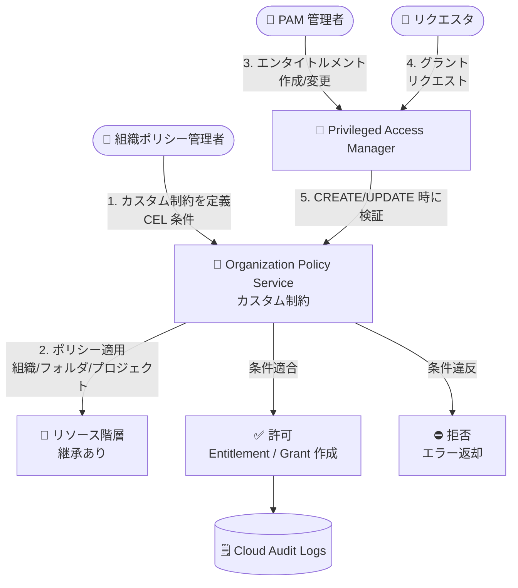

# Identity and Access Management (IAM): Privileged Access Manager (PAM) がカスタム組織ポリシー制約に対応 (Preview)

**リリース日**: 2026-08-03

**サービス**: Identity and Access Management (IAM) / Privileged Access Manager (PAM)

**機能**: Privileged Access Manager 向けカスタム組織ポリシー制約

**ステータス**: Preview

📊 [このアップデートのインフォグラフィックを見る](https://takech9203.github.io/google-cloud-news-summary/20260803-iam-pam-custom-org-policy-constraints.html)

## 概要

Organization Policy Service のカスタム制約 (custom constraints) が Privileged Access Manager (PAM) で利用可能になりました。PAM は、選択したプリンシパルに対してジャストインタイムの一時的な権限昇格を提供するサービスであり、エンタイトルメント (entitlement: 昇格可能な権限の定義) とグラント (grant: 実際の権限付与リクエスト) という 2 つのリソースで構成されます。今回のアップデートにより、これらのリソースの作成・変更方法を組織ポリシーで細かく制御できるようになります。

組織ポリシー管理者は、CEL (Common Expression Language) で記述した条件を使って、たとえば「エンタイトルメントの最大リクエスト期間は 2 時間未満に制限する」「承認者に承認理由の入力を必須とする」「グラントのリクエスト期間を 1 時間以内に制限する」といったガードレールを、組織・フォルダ・プロジェクトの各レベルで一元的に適用できます。ポリシーはリソース階層の子孫に継承されるため、組織全体で一貫した特権アクセス管理の統制を実現できます。

本機能は Preview として提供されており、セキュリティガバナンスを重視する大規模組織の管理者、コンプライアンス要件を持つ企業のセキュリティチームが主な対象ユーザーです。

**アップデート前の課題**

- PAM のエンタイトルメント作成・変更の内容 (最大付与期間、承認ワークフロー設定など) を組織レベルで強制するネイティブな仕組みがなく、各エンタイトルメント管理者の設定運用に依存していた
- 過度に長い付与期間のエンタイトルメントや、承認理由を必須としないエンタイトルメントが作成されても、組織ポリシーとして自動的にブロックする手段がなかった
- 設定基準の遵守状況を担保するには、監査ログの事後確認やレビューといった手動プロセスが必要だった

**アップデート後の改善**

- カスタム制約により、エンタイトルメントとグラントの作成 (CREATE)・更新 (UPDATE) 操作を条件に基づいて自動的に許可 (ALLOW) / 拒否 (DENY) できるようになった
- 最大リクエスト期間、承認者の理由必須化、通知先メールアドレスなどのフィールドを CEL 条件で検証し、組織標準に合致しない設定を作成時点でブロックできるようになった
- 組織・フォルダ・プロジェクト単位でポリシーを適用し、リソース階層の継承により組織全体へ一貫したガードレールを展開できるようになった
- ドライラン モードや Policy Simulator により、本番適用前にポリシーの影響をテストできる

## アーキテクチャ図



PAM のエンタイトルメント / グラントの作成・変更操作は、組織ポリシー管理者が定義したカスタム制約により検証され、条件に違反する操作は自動的に拒否されます。

## サービスアップデートの詳細

### 主要機能

1. **エンタイトルメントに対するカスタム制約**
   - `privilegedaccessmanager.googleapis.com/Entitlement` リソースを対象に CREATE / UPDATE 操作を制御
   - 最大リクエスト期間 (`resource.maxRequestDuration`)、承認ワークフロー設定 (必要承認数、承認者理由の必須化)、通知先メールアドレス (管理者・リクエスタ・承認者)、特権アクセス設定 (対象リソース、ロールバインディングのロールと条件式) などのフィールドを検証可能

2. **グラントに対するカスタム制約**
   - `privilegedaccessmanager.googleapis.com/Grant` リソースを対象に制御
   - リクエスト期間 (`resource.requestedDuration`)、理由 (`resource.justification.unstructuredJustification`)、追加通知先 (`resource.additionalEmailRecipients`) などのフィールドを検証可能

3. **CEL による柔軟な条件定義**
   - 最大 1,000 文字の CEL 条件式でフィールド値を評価し、ALLOW / DENY のアクションを指定
   - 例: `resource.maxRequestDuration < duration('7200s')` (最大リクエスト期間を 2 時間未満に制限)

4. **階層継承とドライラン**
   - 組織・フォルダ・プロジェクトの各レベルで適用でき、デフォルトで子孫リソースに継承
   - ドライラン モードや Policy Simulator で本番適用前に影響をテスト可能

## 技術仕様

### 対象リソースと主なフィールド

| リソースタイプ | 主なフィールド |
|------|------|
| `privilegedaccessmanager.googleapis.com/Entitlement` | `resource.maxRequestDuration`、`resource.name`、承認ワークフロー設定 (必要承認数、承認者理由の必須化、承認者通知先)、管理者/リクエスタ通知先、特権アクセス設定 (リソース、リソースタイプ、ロールバインディングのロール・条件式) |
| `privilegedaccessmanager.googleapis.com/Grant` | `resource.requestedDuration`、`resource.justification.unstructuredJustification`、`resource.additionalEmailRecipients`、`resource.name` |

### 制約定義の仕様

| 項目 | 詳細 |
|------|------|
| 条件言語 | CEL (Common Expression Language)、最大 1,000 文字 |
| 対象メソッド | CREATE、または CREATE と UPDATE |
| アクション | ALLOW / DENY |
| 制約数の上限 | リソースタイプあたり最大 20 個 (目安) |
| ポリシー反映時間 | 最大 15 分程度 |
| 適用レベル | 組織 / フォルダ / プロジェクト (子孫に継承) |

### カスタム制約の定義例

```yaml
name: organizations/ORG_ID/customConstraints/custom.allowEntitlementWithMaxRequestDurationLessThan2h
resourceTypes:
- privilegedaccessmanager.googleapis.com/Entitlement
methodTypes:
- CREATE
- UPDATE
condition: "resource.maxRequestDuration < duration('7200s')"
actionType: ALLOW
displayName: Restrict maximum PAM request duration
description: Entitlements must have a maximum request duration of less than two hours.
```

## 設定方法

### 前提条件

1. 組織 ID を確認しておく
2. 組織リソースに対する Organization Policy Administrator (`roles/orgpolicy.policyAdmin`) ロールが必要
3. エンタイトルメントの作成・管理には Privileged Access Manager Admin (`roles/privilegedaccessmanager.admin`) ロールが必要

### 手順

#### ステップ 1: カスタム制約の YAML を作成して登録

```bash
# constraint-pam-max-duration.yaml を作成後、制約を登録
gcloud org-policies set-custom-constraint constraint-pam-max-duration.yaml

# 制約の登録を確認
gcloud org-policies list-custom-constraints --organization=ORGANIZATION_ID
```

CEL 条件で PAM リソースのフィールドを検証するカスタム制約を組織に登録します。

#### ステップ 2: 組織ポリシーを作成して適用

```yaml
# policy-pam-max-duration.yaml
name: organizations/ORGANIZATION_ID/policies/custom.allowEntitlementWithMaxRequestDurationLessThan2h
spec:
  rules:
  - enforce: true
```

```bash
# ドライランで影響を確認してから本番適用
gcloud org-policies set-policy policy-pam-max-duration.yaml

# 適用状況を確認
gcloud org-policies list --organization=ORGANIZATION_ID
```

ポリシーの反映には最大 15 分程度かかります。ドライラン モード (`dryRunSpec`) や Policy Simulator で事前検証することが推奨されます。

## メリット

### ビジネス面

- **ガバナンスの強化**: 特権アクセスの付与条件 (期間、承認要件) を組織標準として強制でき、コンプライアンス要件 (最小権限、職務分掌) への対応が容易になる
- **運用負荷の削減**: 事後の監査・レビューに頼らず、非準拠なエンタイトルメント / グラントを作成時点で自動的にブロックできる

### 技術面

- **宣言的なガードレール**: CEL 条件による柔軟なフィールドレベル検証を YAML で宣言的に管理でき、IaC との親和性が高い
- **階層継承による一貫性**: 組織レベルで一度定義すれば、フォルダ・プロジェクトの子孫リソースに自動的に適用される
- **安全な導入**: ドライラン モードと Policy Simulator により、既存ワークフローへの影響を事前に検証できる

## デメリット・制約事項

### 制限事項

- Preview 段階のため、Pre-GA Offerings Terms が適用され、サポートが限定される可能性がある
- ポリシー変更は遡及適用されない (既存のエンタイトルメント / グラントには影響せず、更新時に初めて検証される)
- リソースタイプあたりのカスタム制約数は最大 20 個が目安
- CEL 条件式は最大 1,000 文字

### 考慮すべき点

- ポリシーの反映に最大 15 分程度かかるため、適用直後の動作確認には時間差を考慮する必要がある
- DENY 条件の設計を誤ると、正当なエンタイトルメント作成・グラントリクエストまでブロックされるため、ドライランでの事前検証が重要
- 組織ポリシー管理者と PAM 管理者の役割分担 (職務分掌) を明確にした運用設計が求められる

## ユースケース

### ユースケース 1: 特権アクセス期間の組織標準の強制

**シナリオ**: 金融機関などの規制業種で、本番環境への一時的な特権アクセスは最長 1 時間までという社内規程がある。各プロジェクトの PAM 管理者が誤って長時間のエンタイトルメントを作成することを防ぎたい。

**実装例**:
```yaml
name: organizations/ORG_ID/customConstraints/custom.limitGrantDuration1h
resourceTypes:
- privilegedaccessmanager.googleapis.com/Grant
methodTypes:
- CREATE
condition: "resource.requestedDuration <= duration('3600s')"
actionType: ALLOW
displayName: Limit grant requests to 1 hour
description: Grant requests must not exceed one hour.
```

**効果**: 1 時間を超えるグラントリクエストは作成時点で自動的に拒否され、規程違反を仕組みで防止できる。

### ユースケース 2: 承認プロセスの厳格化

**シナリオ**: センシティブなデータへのアクセス承認において、承認者が理由を記録せずに承認することを防ぎ、監査証跡を確実に残したい。

**効果**: エンタイトルメントの承認ワークフロー設定で承認者理由の必須化 (`requireApproverJustification == true`) を検証するカスタム制約により、理由入力を必須としないエンタイトルメントの作成をブロックできる。Cloud Audit Logs と組み合わせて、誰が・なぜ承認したかの証跡を確実に確保できる。

## 料金

Organization Policy Service のカスタム制約の利用自体に追加料金は発生しません。Privileged Access Manager の利用条件・提供状況の詳細は公式ドキュメントを参照してください。なお、PAM の一部の Preview 機能 (多段階・複数者承認など) は Security Command Center の Enterprise / Premium ティアが必要です。

## 利用可能リージョン

組織ポリシーはグローバルなリソース管理機能であり、リージョン固有の制限は Release Notes に記載されていません。詳細は公式ドキュメントを参照してください。

## 関連サービス・機能

- **Organization Policy Service**: カスタム制約の定義・適用基盤。マネージド制約と組み合わせて組織全体のガードレールを構成する
- **IAM Conditions**: PAM のエンタイトルメントに設定する条件式。カスタム制約でロールバインディングの条件式自体を検証することも可能
- **Cloud Audit Logs**: PAM のエンタイトルメント作成やグラントのリクエスト・承認イベントを記録し、事後監査を支援する
- **Policy Simulator / ドライラン モード**: 組織ポリシーの本番適用前に影響をシミュレーションする
- **Security Command Center**: PAM の多段階・複数者承認やスコープカスタマイズなどの拡張機能 (Preview) は Enterprise / Premium ティアで利用可能

## 参考リンク

- 📊 [インフォグラフィック](https://takech9203.github.io/google-cloud-news-summary/20260803-iam-pam-custom-org-policy-constraints.html)
- [公式リリースノート](https://docs.cloud.google.com/release-notes#August_03_2026)
- [Use custom organization policies for Privileged Access Manager](https://docs.cloud.google.com/iam/docs/pam-custom-constraints)
- [Privileged Access Manager overview](https://docs.cloud.google.com/iam/docs/pam-overview)
- [Custom organization policies](https://docs.cloud.google.com/organization-policy/overview#custom-organization-policies)

## まとめ

PAM がカスタム組織ポリシー制約に対応したことで、特権アクセスの付与期間や承認要件といった重要な設定を、組織全体のガードレールとして宣言的かつ自動的に強制できるようになりました。Preview 段階ではありますが、特権アクセス管理の統制強化を検討している組織は、ドライラン モードを活用してまずは非本番環境で制約設計の検証を始めることを推奨します。

---

**タグ**: IAM, Privileged Access Manager, PAM, Organization Policy, カスタム制約, セキュリティ, ガバナンス, Preview
