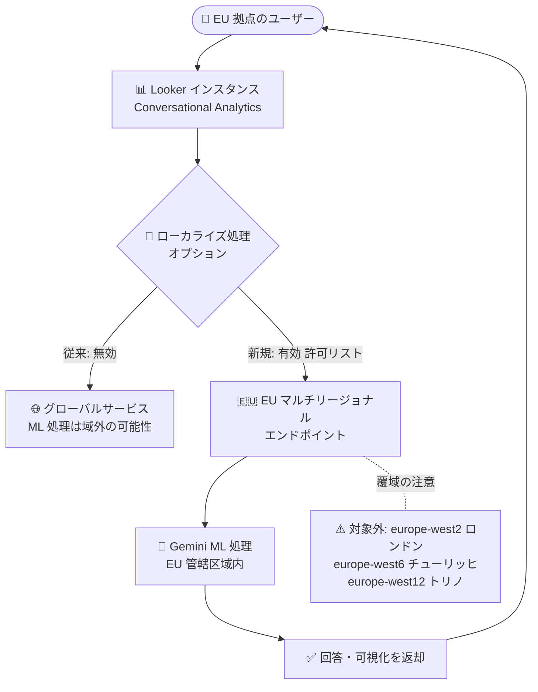

# Looker: Conversational Analytics の EU ローカライズ処理オプション

**リリース日**: 2026-08-03

**サービス**: Looker

**機能**: Conversational Analytics の EU 域内ローカライズ処理オプション

**ステータス**: 提供開始 (許可リスト経由)

📊 [このアップデートのインフォグラフィックを見る](https://takech9203.github.io/google-cloud-news-summary/20260803-looker-conversational-analytics-eu-processing.html)

## 概要

Looker の Conversational Analytics に、欧州連合 (EU) 拠点の顧客向けの「ローカライズ処理オプション」が提供開始されました。このオプションを有効にすると、Conversational Analytics のトラフィックが EU マルチリージョナルエンドポイント経由でルーティングされ、EU 顧客データの処理 (ML 処理を含む) が EU 管轄区域内で完結するようになります。

Conversational Analytics は、Gemini for Google Cloud を活用して自然言語でデータに質問できる Looker の「chat-with-your-data」機能です。LookML セマンティックレイヤーを信頼できる情報源 (source of truth) として利用することで、ガバナンスの効いたセルフサービス BI を実現します。今回のアップデートは、GDPR などのデータ保護規制への対応が求められる EU 圏の企業 (金融、医療、公共など規制産業を含む) にとって、生成 AI 機能の採用ハードルを下げる重要な一歩です。

本オプションは許可リスト (allowlist) 経由で提供されます。利用を希望する場合は「Looker ML Processing EU Request form」から Looker Conversational Analytics EU ML processing allowlist への登録を申請します。キャパシティには制限があり、登録は「as-available」ベースで許可され、サービススループットに影響する可能性がある点に注意が必要です。

**アップデート前の課題**

Conversational Analytics のデータ処理は従来、グローバルサービスとして提供されていました。

- 保存データ (data-at-rest) は Looker インスタンス内の単一リージョンに閉じたデータレジデンシー (DRZ) サポートがあったものの、転送中データと機械学習 (ML) 処理はグローバルサービスで処理されていた
- EU 域内でのデータ処理を要件とする組織 (GDPR 対応、業界規制、社内ポリシーなど) は、Conversational Analytics の採用にコンプライアンス上の懸念があった

**アップデート後の改善**

- Conversational Analytics のトラフィックを EU マルチリージョナルエンドポイント経由でルーティングし、EU 顧客データの処理を EU 域内で完結できるようになった
- ローカライズ処理は、Conversational Analytics in Looker のすべての機能 (ダッシュボードデータエージェントを除く) と、すべての Looker API の Conversational Analytics エンドポイントに適用される
- 保存データのレジデンシーに加えて ML 処理の管轄区域も EU 内に限定できるため、規制産業でも生成 AI による自然言語データ分析を検討しやすくなった

## アーキテクチャ図

ローカライズ処理オプションを有効にすると、Conversational Analytics のトラフィックが EU マルチリージョナルエンドポイントにルーティングされ、Gemini による ML 処理が EU 管轄区域内で実行されます。EU マルチリージョンの覆域は EU 加盟国に厳密に限定され、ロンドン・チューリッヒ・トリノの各リージョンは対象外です。

## サービスアップデートの詳細

### 主要機能

1. **EU マルチリージョナルエンドポイント経由のルーティング**
   - Conversational Analytics のトラフィックを EU マルチリージョナルエンドポイント経由で処理
   - EU 顧客データが EU 域内で処理されることを保証

2. **適用範囲**
   - Conversational Analytics in Looker のすべての機能に適用 (ダッシュボードデータエージェントは除く)
   - Looker API のすべての Conversational Analytics エンドポイントに適用
   - スタンドアロンの Conversational Analytics API には適用されない (Conversational Analytics API 側には別途 `geminidataanalytics.eu.rep.googleapis.com` などのリージョナル/マルチリージョナルエンドポイントによるデータレジデンシー機構が存在)

3. **許可リストによる提供**
   - 「Looker ML Processing EU Request form」から EU ML processing allowlist への登録を申請
   - キャパシティに制限があり、登録は機能的な「as-available」ベースで許可される
   - 登録完了時に確認メールが届く

## 技術仕様

### ローカライズ処理オプションの仕様

| 項目 | 詳細 |
|------|------|
| 対象顧客 | EU 拠点の顧客 |
| ルーティング先 | EU マルチリージョナルエンドポイント |
| 処理の保証範囲 | EU 顧客データの EU 管轄区域内での処理 |
| 適用対象 | Conversational Analytics in Looker の全機能 (ダッシュボードデータエージェント除く)、Looker API の Conversational Analytics エンドポイント |
| 適用外 | Conversational Analytics API (スタンドアロン API) |
| 提供方式 | 許可リスト (Looker ML Processing EU Request form から申請) |
| 覆域の除外リージョン | europe-west2 (ロンドン、英国)、europe-west6 (チューリッヒ、スイス) は EU マルチリージョンの覆域外 |
| 未サポートリージョン | europe-west12 (トリノ、イタリア) は現時点で未サポート |

### Conversational Analytics のコンプライアンス特性 (参考)

| 項目 | 詳細 |
|------|------|
| データレジデンシー (保存データ) | 全 Looker 顧客が利用可能。Conversational Analytics 関連の保存データは Looker インスタンス内の単一リージョンに限定 |
| 転送中データ・ML 処理 | 従来はグローバルサービスで処理 (今回の EU オプションで EU 域内処理が選択可能に) |
| FedRAMP | Conversational Analytics は FedRAMP High / Moderate の認可境界には未包含 |

## 設定方法

### 前提条件

1. EU 拠点の顧客であること
2. Looker インスタンスで Gemini in Looker / Conversational Analytics が利用可能であること

### 手順

#### ステップ 1: 許可リストへの登録申請

[Looker ML Processing EU Request form](https://forms.gle/FDcSztt78fpf1fR27) に必要事項を記入して、Looker Conversational Analytics EU ML processing allowlist への登録を申請します。

#### ステップ 2: 登録確認

登録が完了すると確認メールが届きます。キャパシティに限りがあるため、登録は「as-available」ベースで許可されます。

## メリット

### ビジネス面

- **コンプライアンス対応**: EU 顧客データの処理を EU 管轄区域内に限定でき、GDPR などのデータ保護要件や社内データガバナンスポリシーへの適合を支援
- **生成 AI 採用の促進**: データ処理場所を理由に Conversational Analytics の採用を見送っていた EU 圏の規制産業でも、自然言語によるセルフサービス BI の導入を検討可能に

### 技術面

- **設定変更が最小限**: 許可リストへの登録のみでトラフィックが EU マルチリージョナルエンドポイントにルーティングされ、アプリケーション側の大きな改修は不要
- **広い適用範囲**: Looker UI 上の Conversational Analytics 機能に加え、Looker API の Conversational Analytics エンドポイントもカバー

## デメリット・制約事項

### 制限事項

- ダッシュボードデータエージェント (dashboard data agents) はローカライズ処理の対象外
- スタンドアロンの Conversational Analytics API には適用されない
- EU マルチリージョンの覆域は EU 加盟国に厳密に限定され、europe-west2 (ロンドン、英国) と europe-west6 (チューリッヒ、スイス) は含まれない
- europe-west12 (トリノ、イタリア) リージョンは現時点で未サポート

### 考慮すべき点

- キャパシティに制限があり、許可リストへの登録は「as-available」ベース。サービススループットに影響する可能性がある
- 英国・スイスにデータレジデンシー要件を持つ組織は、EU マルチリージョンでは要件を満たせないため注意が必要

## ユースケース

### ユースケース 1: EU 規制産業でのセルフサービス BI 導入

**シナリオ**: EU 域内の金融機関が、GDPR および社内データガバナンスポリシーにより顧客データの EU 域外処理を禁止している。ビジネスユーザーが SQL を書かずにデータへ自然言語で質問できる環境を整備したい。

**効果**: 許可リストに登録することで、Conversational Analytics の ML 処理を含むデータ処理が EU 管轄区域内で完結し、コンプライアンス要件を維持しながら自然言語データ分析を全社展開できる。

### ユースケース 2: Looker API 経由の組み込み分析での EU 域内処理

**シナリオ**: EU 顧客向け SaaS を提供する企業が、Looker API の Conversational Analytics エンドポイントを利用して自社アプリケーションに対話型分析を組み込んでいる。顧客との契約上、データ処理場所を EU 域内に限定する必要がある。

**効果**: ローカライズ処理は Looker API のすべての Conversational Analytics エンドポイントに適用されるため、組み込みシナリオでも EU 域内処理の要件を満たせる。

## 料金

Gemini in Looker 機能の料金は Looker の料金ページを参照してください。

- [Looker 料金ページ](https://cloud.google.com/looker/pricing)

## 利用可能リージョン

- EU マルチリージョナルエンドポイント経由で提供 (覆域は EU 加盟国に厳密に限定)
- 対象外: europe-west2 (ロンドン、英国)、europe-west6 (チューリッヒ、スイス)
- 未サポート: europe-west12 (トリノ、イタリア)

## 関連サービス・機能

- **Gemini for Google Cloud**: Conversational Analytics の自然言語理解と回答生成を担う基盤。今回のオプションで ML 処理の管轄区域を EU 内に限定可能
- **Conversational Analytics API**: BigQuery や Looker をデータソースとするスタンドアロン API。今回の Looker 向けオプションの適用外だが、API 側には `eu` マルチリージョナルエンドポイント (`geminidataanalytics.eu.rep.googleapis.com`) による独自のデータレジデンシーサポートがある
- **LookML (セマンティックレイヤー)**: Conversational Analytics が回答の正確性・一貫性を担保するために利用する Looker のセマンティックモデル
- **Assured Workloads**: Looker (Google Cloud core) インスタンスのコンプライアンス管理。コントロールパッケージの提供に応じて Gemini in Looker 機能が順次追加される

## 参考リンク

- 📊 [インフォグラフィック](https://takech9203.github.io/google-cloud-news-summary/20260803-looker-conversational-analytics-eu-processing.html)
- [公式リリースノート](https://docs.cloud.google.com/release-notes#August_03_2026)
- [Conversational Analytics in Looker overview (EU コンプライアンス)](https://docs.cloud.google.com/looker/docs/conversational-analytics-overview#eu-ca-compliance)
- [Conversational Analytics API のデータレジデンシー](https://docs.cloud.google.com/gemini/data-agents/conversational-analytics-api/data-residency)
- [Looker ML Processing EU Request form](https://forms.gle/FDcSztt78fpf1fR27)
- [料金ページ](https://cloud.google.com/looker/pricing)

## まとめ

Looker の Conversational Analytics に EU 域内でのローカライズ処理オプションが加わり、これまでグローバルサービスで処理されていた ML 処理を EU 管轄区域内に限定できるようになりました。GDPR などのデータ保護要件を持つ EU 圏の組織は、許可リストへの登録を申請することで、コンプライアンスを維持しながら自然言語によるセルフサービス BI を導入できます。キャパシティ制限や英国・スイス・トリノリージョンの対象外といった制約を確認のうえ、早めの申請を検討してください。

---

**タグ**: #Looker #ConversationalAnalytics #Gemini #EU #DataResidency #GDPR #Compliance #BI
