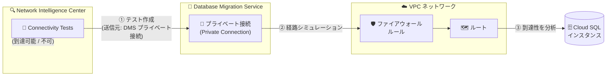

# Network Intelligence Center: Connectivity Tests が Database Migration Service プライベート接続から Cloud SQL インスタンスへのテストをサポート

**リリース日**: 2026-08-03

**サービス**: Network Intelligence Center

**機能**: Connectivity Tests - Database Migration Service プライベート接続から Cloud SQL インスタンスへの接続テスト

**ステータス**: Feature

📊 [このアップデートのインフォグラフィックを見る](https://takech9203.github.io/google-cloud-news-summary/20260803-network-intelligence-center-dms-connectivity-tests.html)

## 概要

Network Intelligence Center の Connectivity Tests に、Database Migration Service (DMS) のプライベート接続を送信元、Cloud SQL インスタンスを宛先とする接続テストのサポートが追加されました。これにより、データベース移行時のネットワーク経路を、移行ジョブを実行する前に検証できるようになります。

Connectivity Tests は、ネットワークエンドポイント間の接続性を診断するツールで、VPC ネットワーク、Cloud VPN トンネル、VLAN アタッチメントなどを通過するパケットの想定転送経路をシミュレーションして構成を分析します。今回のアップデートで、DMS のプライベート接続 (private connection) という Google 管理リソースを送信元エンドポイントとして直接指定できるようになりました。

データベース移行プロジェクトでは、DMS と移行元/移行先データベース間のネットワーク接続の問題が移行失敗の主要な原因の 1 つです。このアップデートは、DMS を利用してオンプレミスや他クラウドから Cloud SQL へ移行するデータベース管理者やクラウドアーキテクトにとって、トラブルシューティングの時間を大幅に短縮する価値があります。

**アップデート前の課題**

- Connectivity Tests では DMS プライベート接続を送信元エンドポイントとして指定できず、DMS から Cloud SQL インスタンスへのネットワーク経路を直接検証できなかった
- DMS のプライベート接続構成 (VPC ピアリング) では推移的ピアリングがサポートされないなどネットワーク要件が複雑で、移行ジョブの実行時に初めて接続エラーが発覚することがあった
- 接続問題の切り分けには、ファイアウォールルール、ルート、VPC ピアリング構成などを手動で個別に確認する必要があった

**アップデート後の改善**

- DMS プライベート接続を送信元、Cloud SQL インスタンスを宛先とした接続テストを Google Cloud コンソール、gcloud CLI、API から作成できるようになった
- 移行ジョブの実行前にネットワーク構成の問題 (ファイアウォール、ルーティングなど) を特定でき、移行の失敗リスクを低減できる
- 宛先 Cloud SQL インスタンスの IP アドレス (エンドポイント) とポートを指定した詳細なテストが可能になった

## アーキテクチャ図



Connectivity Tests が DMS プライベート接続から Cloud SQL インスタンスまでの想定転送経路をシミュレーションし、ファイアウォールやルーティングの構成問題を移行前に特定します。

## サービスアップデートの詳細

### 主要機能

1. **DMS プライベート接続を送信元とした接続テスト**
   - 送信元エンドポイントとして Database Migration Service のプライベート接続を選択可能
   - プライベート接続が属するプロジェクトを指定し、テスト対象の接続を選択する

2. **Cloud SQL インスタンスを宛先とした詳細なテスト指定**
   - 宛先として Cloud SQL インスタンスとそのエンドポイント (IP アドレス) を選択可能
   - TCP / UDP プロトコル選択時は宛先ポートも指定可能 (デフォルトプロトコルは TCP)

3. **コンソール、gcloud、API の 3 つのインターフェースに対応**
   - Google Cloud コンソールの Connectivity Tests ページから GUI で作成
   - `gcloud network-management connectivity-tests create` コマンドの `--source-dms-private-connection` フラグ
   - Network Management API の `dmsPrivateConnection` 送信元フィールド

## 技術仕様

### テストのパラメータ

| 項目 | 詳細 |
|------|------|
| 送信元エンドポイント | DMS プライベート接続の URI (例: `projects/my-project/locations/us-central1/privateConnections/my-private-connection`) |
| 宛先エンドポイント | Cloud SQL インスタンスの URI (例: `projects/my-project/instances/my-cloud-sql-instance`) |
| 宛先 IP アドレス | テスト対象の Cloud SQL インスタンスの IP アドレス |
| 宛先ポート | TCP / UDP テスト時に指定 (例: PostgreSQL は 5432、MySQL は 3306) |
| プロトコル | Connectivity Tests がサポートするプロトコル (デフォルト: TCP) |

### API リクエスト例

```json
POST https://networkmanagement.googleapis.com/v1/projects/PROJECT_ID/locations/global/connectivityTests?testId=TEST_ID
{
  "source": {
    "dmsPrivateConnection": "projects/my-project/locations/us-central1/privateConnections/my-private-connection"
  },
  "destination": {
    "ipAddress": "10.0.0.5",
    "port": 5432,
    "cloudSqlInstance": "projects/my-project/instances/my-cloud-sql-instance"
  },
  "protocol": "TCP"
}
```

## 設定方法

### 前提条件

1. Database Migration Service でプライベート接続 (private connectivity configuration) が作成済みであること
2. 宛先の Cloud SQL インスタンスが存在すること
3. Connectivity Tests を実行するための IAM 権限 (Network Management 関連ロール) があること

### 手順

#### ステップ 1: gcloud で接続テストを作成

```bash
gcloud network-management connectivity-tests create dms-to-cloudsql-test \
  --source-dms-private-connection=projects/my-project/locations/us-central1/privateConnections/my-private-connection \
  --destination-cloud-sql-instance=projects/my-project/instances/my-cloud-sql-instance \
  --destination-ip-address=10.0.0.5 \
  --destination-port=5432 \
  --protocol=TCP
```

送信元に DMS プライベート接続の URI、宛先に Cloud SQL インスタンスの URI と IP アドレス、ポートを指定します。

#### ステップ 2: テスト結果の確認

```bash
gcloud network-management connectivity-tests describe dms-to-cloudsql-test
```

テスト完了後、到達可能性の結果 (Reachable / Unreachable) と、経路上で分析されたファイアウォールルールやルートなどのトレース詳細を確認できます。

コンソールの場合は、「Connectivity Tests」ページで「接続テストを作成」をクリックし、送信元エンドポイントに「Database Migration Service private connection」、宛先エンドポイントに「Cloud SQL instance」を選択します。

## メリット

### ビジネス面

- **移行プロジェクトのリスク低減**: 移行ジョブ実行前にネットワーク経路を検証できるため、移行作業当日の予期しない接続エラーによるスケジュール遅延を防止できる
- **トラブルシューティング時間の短縮**: 接続問題の原因 (ファイアウォール、ルートなど) が自動で特定されるため、ネットワークチームとデータベースチーム間の調査往復を削減できる

### 技術面

- **構成分析による問題の可視化**: パケットの想定転送経路をステップごとにトレースし、どの構成 (ファイアウォールルール、ルート、ピアリング) でパケットがドロップされるかを特定できる
- **Google 管理リソース間のテスト対応**: DMS プライベート接続と Cloud SQL という双方 Google 管理のリソース間の経路を、ユーザー側 VPC の構成を含めて分析できる

## デメリット・制約事項

### 考慮すべき点

- テスト対象は DMS の「プライベート接続」であり、パブリック IP 許可リストやフォワード SSH トンネルなど他の DMS 接続方式のテストには適用されない
- Connectivity Tests の構成分析はシミュレーションベースであり、実際のデータベース認証 (ユーザー名/パスワード) やデータベースレイヤーの問題は検出できない
- プロジェクト内に構成の問題が検出された場合、Google 管理ネットワーク側の分析の前に解析が停止する

## ユースケース

### ユースケース 1: Oracle から Cloud SQL for PostgreSQL への移行前検証

**シナリオ**: オンプレミスの Oracle データベースを DMS で Cloud SQL for PostgreSQL に移行する。DMS プライベート接続 (VPC ピアリング) を構成したが、移行ジョブを実行する前にネットワーク経路が正しいことを確認したい。

**実装例**:
```bash
gcloud network-management connectivity-tests create pre-migration-check \
  --source-dms-private-connection=projects/migration-proj/locations/asia-northeast1/privateConnections/oracle-pg-conn \
  --destination-cloud-sql-instance=projects/migration-proj/instances/pg-destination \
  --destination-ip-address=10.10.0.3 \
  --destination-port=5432 \
  --protocol=TCP
```

**効果**: 移行ジョブ実行前にファイアウォールやルーティングの構成不備を発見でき、移行当日の失敗を回避できる。

### ユースケース 2: 移行ジョブの接続エラーのトラブルシューティング

**シナリオ**: DMS の移行ジョブが接続エラーで失敗した。VPC ピアリング、ファイアウォールルール、ルートのどこに問題があるのか切り分けたい。

**効果**: Connectivity Tests のトレース結果から、パケットがドロップされる箇所 (例: 特定の deny ファイアウォールルール) が特定され、手動での構成確認作業が不要になる。

## 料金

Connectivity Tests を含む Network Intelligence Center の料金は、公式の料金ページを参照してください。

- [Network Intelligence Center の料金](https://cloud.google.com/network-intelligence-center/pricing)

## 関連サービス・機能

- **Database Migration Service (DMS)**: 今回のテスト送信元となるサービス。プライベート接続 (VPC ピアリングベースの private connectivity configuration) を使用してソース/宛先データベースに私設 IP で接続する
- **Cloud SQL**: テストの宛先となるマネージドデータベースサービス。MySQL、PostgreSQL、SQL Server に対応
- **Private Service Connect / VPC ピアリング**: DMS と Cloud SQL 間のプライベート接続を実現するネットワーク基盤。Connectivity Tests はこれらの構成を分析対象に含む
- **Network Analyzer**: Network Intelligence Center の別モジュールで、ネットワーク構成の問題を継続的・自動的に検出する (Connectivity Tests はオンデマンドの診断)

## 参考リンク

- 📊 [インフォグラフィック](https://takech9203.github.io/google-cloud-news-summary/20260803-network-intelligence-center-dms-connectivity-tests.html)
- [公式リリースノート](https://docs.cloud.google.com/release-notes#August_03_2026)
- [ドキュメント: Test from a Database Migration Service private connection to a Cloud SQL instance](https://docs.cloud.google.com/network-intelligence-center/docs/connectivity-tests/how-to/running-connectivity-tests)
- [Connectivity Tests の概要](https://docs.cloud.google.com/network-intelligence-center/docs/connectivity-tests/concepts/overview)
- [Database Migration Service: プライベート接続構成の作成](https://docs.cloud.google.com/database-migration/docs/oracle-to-postgresql/create-private-connectivity-configuration)
- [料金ページ](https://cloud.google.com/network-intelligence-center/pricing)

## まとめ

DMS を使ったデータベース移行における最大の落とし穴の 1 つであるネットワーク接続問題を、移行前に体系的に検証できるようになる実用性の高いアップデートです。DMS のプライベート接続を利用した移行を計画・運用しているチームは、移行ジョブ実行前のチェックリストに Connectivity Tests によるテストを追加することを推奨します。

---

**タグ**: #NetworkIntelligenceCenter #ConnectivityTests #DatabaseMigrationService #CloudSQL #ネットワーク診断 #データベース移行
